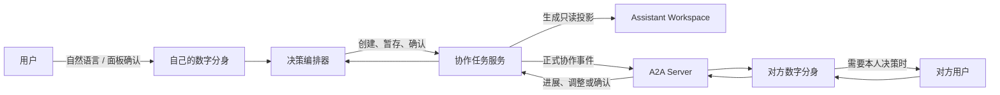
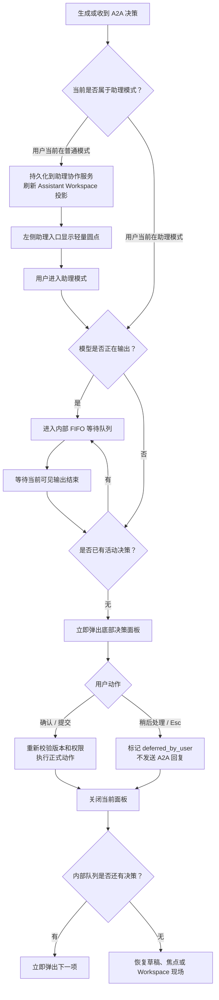
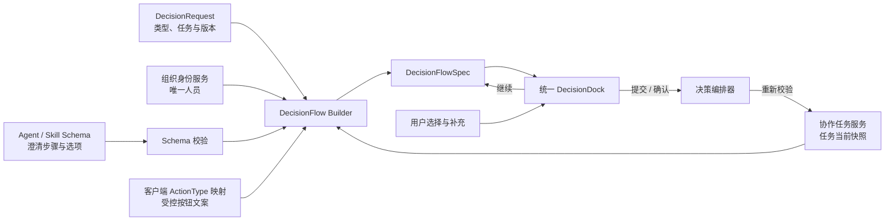
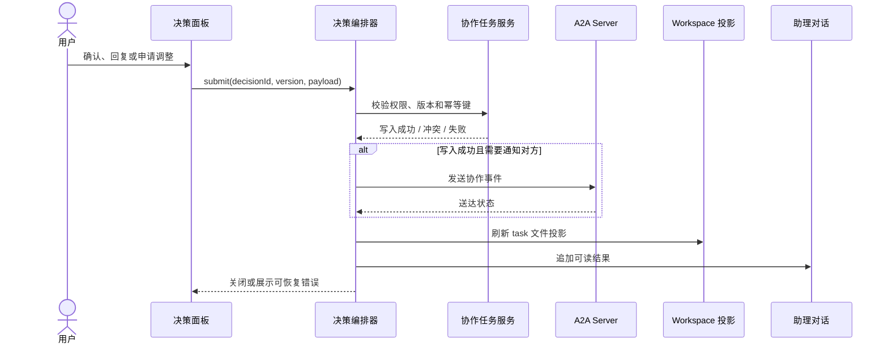
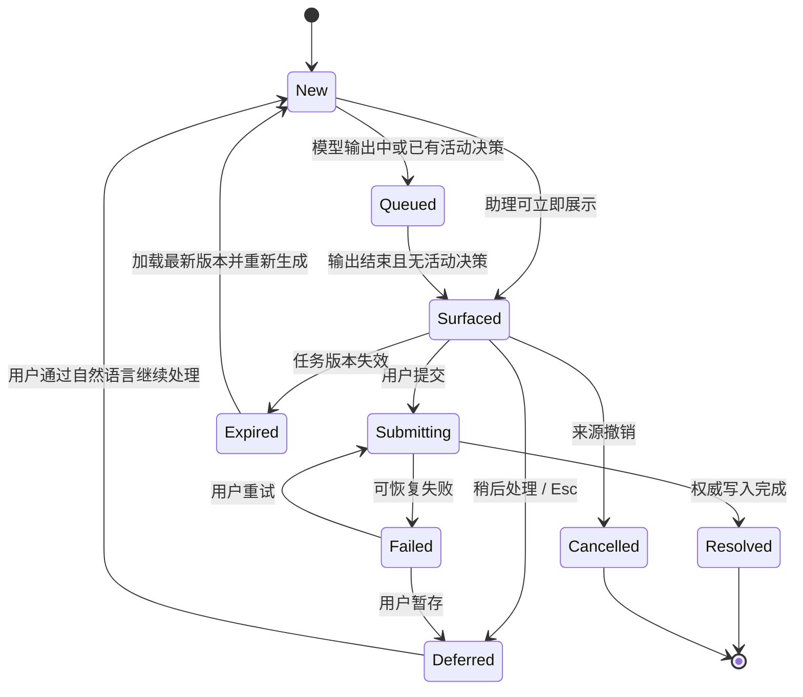

# PRD：A2A 用户决策与确认机制

> 文档版本：V1.2
>
> 文档状态：产品开发基线
>
> 更新日期：2026-07-24
>
> 适用范围：COMAC AI 助理模式
>
> 关联文档：《PRD-助理A2A任务派发与催办》《PRD-双模式会话与统一Workspace》《PRD-Workspace工作台交互规范》

## 1. 文档目的

本文定义个人数字分身收到或准备发出 A2A 正式协作动作时，如何请求用户补充信息、确认内容或授权执行。

本文重点解决：

- 用户正在对话、输入草稿或查看 Workspace 时，决策面板何时出现；
- 模型正在输出时，A2A 决策如何等待；
- 多个决策同时到达时如何顺序处理；
- 点击关闭后如何暂存，并通过自然语言恢复；
- 派任务、发起催办、收到任务、收到催办四类决策如何呈现；
- 决策面板、助理对话、Workspace 和权威任务服务如何分工；
- 普通任务模式与助理模式如何隔离。

本文是“用户决策交互”的直接开发依据。任务对象、A2A 协议、权限、催办频控和业务写入规则仍以《PRD-助理A2A任务派发与催办》为准。

## 2. 产品结论

### 2.1 决策面板不是消息卡片

A2A 决策不以内联消息卡或居中 Modal 展示，而是使用依附当前工作现场的轻量决策 Dock。

决策面板是一个高优先级交互层：

- 只要聊天区可见，决策 Dock 占用输入器原位置并向上展开，与输入器左右边缘对齐；
- 宽屏聊天与 Workspace 并列时，仍以聊天输入器为锚点，不得移动到 Workspace 右下角；
- 中窄屏由 Workspace 独占主区域时，决策 Dock 固定在整个主区域底部；
- 不使用全屏模糊或半透明遮罩；
- 要求用户处理、确认或明确暂存；
- 不关闭当前对话或 Workspace；
- 输入器暂时被决策 Dock 覆盖，但草稿、选区和输入状态完整保留；
- 不改变 Workspace 标签、目录、文件选择和滚动位置；
- 点击“稍后处理”或按 `Esc` 只表示暂存，不表示拒绝。

### 2.2 只在助理模式处理 A2A

- 普通任务 Session 不接收、不展示、不处理 A2A 决策；
- 普通任务 Workspace 不出现 `collaboration/`；
- 所有 A2A 对象归属于唯一助理固定长 Session；
- 用户处于普通模式时，后台事件写入助理协作服务和 Assistant Workspace 投影；
- 左侧“助理”入口显示轻量圆点；
- 用户进入助理模式后才展示决策面板；
- Demo 一期可以不实现左侧圆点，但正式产品必须实现。

### 2.3 打断规则

除模型正在输出外，决策面板到达后立即打断当前操作：

| 当前状态 | 产品行为 |
| --- | --- |
| 助理空闲 | 立即弹出。 |
| 用户正在输入且已有草稿 | 决策 Dock 覆盖输入器并向上展开；保留草稿、选区和输入框状态。 |
| 用户正在浏览聊天历史 | 立即弹出；保留滚动位置。 |
| 用户正在查看 Workspace | 立即固定在 Workspace 底部；不退出 Workspace，不显示全屏遮罩。 |
| 用户正在查看 Workspace 文件目录 | 立即弹出；不关闭目录。 |
| 输出物浮层或启动器打开 | 关闭临时浮层后弹出决策面板。 |
| 模型正在输出 | 决策进入内部等待队列；当前可见输出结束后立即弹出。 |
| 已有决策面板显示 | 新决策进入内部等待队列，不替换当前面板。 |

“模型输出结束”指当前前台文本流结束或进入明确等待状态，不要求后台异步任务全部完成。

## 3. 设计原则

1. **用户只与自己的数字分身交互**：不把用户直接拉入多人 Agent 群聊。
2. **外部正式动作必须确认**：创建任务、催办、进展写回和影响他人的承诺必须经过用户。
3. **高优先级但可暂存**：面板强制曝光，用户可用“稍后处理”或 `Esc` 暂存。
4. **不建设第二套待办中心**：不提供常驻待办面板、页签或显式决策队列。
5. **一次只处理一件事**：界面只展示一个决策，内部按到达顺序等待。
6. **Workspace 保存上下文**：暂存决策进入任务文件，用户可通过自然语言再次处理。
7. **权威状态不在前端**：决策面板和文件都是服务端任务状态的交互与投影。
8. **不破坏用户现场**：草稿、滚动、文件标签、目录和选择必须可恢复。

## 4. 角色与系统边界

| 主体 | 责任 |
| --- | --- |
| 用户 | 补充信息、选择执行人、确认、申请调整、回复进展或暂存。 |
| 用户数字分身 | 解析意图、生成决策、持有前台输出门控、调用任务服务和反馈结果。 |
| 对方数字分身 | 接收任务或催办事件，在对方助理侧生成必要决策。 |
| 决策编排器 | 管理前台输出门控、活动决策、内部 FIFO 队列和恢复。 |
| 协作任务服务 | 保存任务、决策状态、版本和事件，是协作对象权威来源。 |
| A2A Server | 身份校验、路由、幂等、顺序和送达。 |
| Workspace 服务 | 生成 `Assistant/collaboration/tasks/` 文件投影。 |
| 组织身份服务 | 提供唯一人员、部门、岗位和有效状态。 |



## 5. 决策类型

一期支持四类决策。

| 类型 | 方向 | 触发 | 用户主要动作 |
| --- | --- | --- | --- |
| `dispatch_confirm` | 发出 | 用户要求派任务，字段已基本齐全 | 选择唯一执行人、核对任务、确认派发 |
| `reminder_confirm` | 发出 | 用户要求催办已有任务 | 核对原任务和催办内容、确认发送 |
| `task_receipt` | 收到 | 对方数字分身派发任务且需要本人处理 | 确认收到、申请调整、补充说明、确实无权时拒绝 |
| `progress_reply` | 收到 | 对方针对已有任务催问进展 | 选择进展状态、补充说明、确认回复 |

以下事件不生成决策面板：

- 已送达；
- 已读；
- 对方已经开始；
- 任务完成；
- 文件投影已更新；
- 普通状态同步；
- 无需用户授权的查询结果；
- 自动化运行记录；
- 不影响外部的助理内部推理。

## 6. 触发与编排流程

### 6.1 总流程



### 6.2 输出门控

决策编排器必须知道前台模型是否处于输出状态。

建议前台状态：

```text
idle
streaming
waiting_tool
waiting_user
completed
failed
```

门控规则：

- `streaming`：不弹决策；
- `waiting_tool`：如果仍有可见增量输出预期则等待，否则允许弹出；
- `waiting_user`、`completed`、`failed`：允许弹出；
- 输出异常中断也视为当前可见输出结束；
- 决策不得插入到一段模型文本中间；
- 决策弹出后，新的模型主动输出不得覆盖面板。

### 6.3 多决策

界面不提供上一项、下一项、页码或队列数量。

内部规则：

- 同时只允许一个 `active_decision`；
- 其他决策进入 FIFO；
- 当前活动决策不被新决策替换；
- 当前决策完成或关闭后，下一项立即弹出；
- 同一 `decision_id` 按幂等键去重；
- 同一任务、同类型、同版本的重复决策合并；
- 一期不做人工排序、优先级插队或批量处理；
- 如果业务安全策略要求撤销旧决策，应将旧决策标为失效，而不是覆盖 UI 内容。

## 7. 决策面板通用交互

### 7.1 位置

- 聊天态占用输入器原位置并向上展开，与输入器等宽；
- 原输入器暂时不可见、不可发送，但组件不得卸载或清空草稿；
- 对话区增加足够的底部留白，面板不得遮挡最后一条可见消息；
- 宽屏聊天与 Workspace 并列时，决策 Dock 始终锚定聊天区输入器位置；
- 中窄屏 Workspace 独占主区域时，决策 Dock 固定在整个主区域底部；
- 不关闭 Workspace；
- 不触发路由切换；
- 在响应式布局切换时，同一决策实例迁移位置，内部选择不得重置；
- 宽屏限制最大宽度并与当前工作区域对齐；
- 中小窗口可接近全宽；
- 移动端覆盖输入器位置，内容过长时面板内部滚动。

### 7.2 层级

决策面板高于：

- 输入器；
- Workspace 内容；
- 文件目录；
- 输出物浮层；
- 启动器。

面板出现时：

- 关闭输出物浮层和启动器；
- 不使用全屏遮罩、背景模糊或居中弹窗；
- 用户仍可阅读和滚动对话或 Workspace，但不能发起新的模型请求；
- 不销毁底层组件；
- 不强制滚动对话或 Workspace；
- 不把 Workspace 当前文件作为默认任务，除非决策本身明确引用该任务。

### 7.3 通用结构

所有用户确认、外部授权和连续澄清必须使用同一个 `DecisionDock` 容器。业务场景只提供配置和数据，不得分别开发“催办卡片”“派任务弹窗”“澄清问题卡片”等独立外壳。

固定结构从上到下为：

1. 顶部语境：决策类型或工作流性质；
2. 当前问题：一个明确、可直接作答的标题；
3. 必要说明：为什么询问、确认后的影响；
4. 内容控件：单选、人员单选、字段核对或补充输入；
5. 步骤区：仅当同一工作流包含多个步骤时显示返回按钮和 `当前步骤/总步骤`；
6. 固定底栏：左侧“稍后处理 `Esc`”，右侧次操作和唯一主操作。

不包含：

- “查看详情”按钮；
- 上一项、下一项；
- 表示“待处理事项数量”的 `1/4` 页码；
- 常驻待办入口；
- 普通模式跳转；
- 右上角 `X`；
- 与当前决策无关的完整任务时间线。

由于不提供“查看详情”，面板必须直接展示足以做出当前决定的信息。超出面板承载范围时，用户应关闭并通过助理自然语言追问。

#### 7.3.1 配置驱动组件

前端只实现一个容器和三类内容控件：

| 组件 | 责任 | 不负责 |
| --- | --- | --- |
| `DecisionDock` | 位置、统一头部、步骤、固定底栏、键盘行为、提交与暂存 | 判断当前是催办还是派任务 |
| `SingleSelect` | 单选、推荐项、自定义补充、可选说明 | 自动翻页、直接执行外部动作 |
| `PersonSelect` | 唯一人员选择、推荐列表、按组织信息搜索 | 仅凭姓名解析身份 |
| `ReviewFields` | 展示提交前需要核对的结构化字段 | 修改权威业务数据 |

场景通过 `DecisionFlowSpec` 描述，不允许展示组件内部按 `decision_type` 硬编码不同布局。建议最小结构：

```text
DecisionFlowSpec
├── flow_id
├── purpose: clarify | authorize | respond
├── context_label
├── steps[]
│   ├── step_id
│   ├── title
│   ├── description
│   ├── control: single_select | person_select | review
│   ├── required
│   └── default_value
├── final_action_type
└── secondary_action_type?
```

`purpose` 决定审计语义，不决定另一套视觉：

- `clarify`：补齐模型继续工作的必要信息，不执行外部动作；
- `authorize`：确认后创建任务、发催办等，会影响外部主体；
- `respond`：确认后向已有任务写回或回复对方。

#### 7.3.2 选择、推进和按钮文案

点击选项只改变当前步骤的选中状态，不自动切换步骤、不自动提交。这样用户可以检查和修改选择，也避免开发误把单选控件实现成业务动作按钮。

| 所处位置 | 主按钮 | 点击结果 |
| --- | --- | --- |
| 多步流程的非最后一步 | `继续` | 校验当前步骤并进入下一步 |
| 纯澄清流程的最后一步 | `提交` | 提交全部回答，助理继续生成方案；不执行外部动作 |
| 派任务最终确认 | `确认派发` | 创建权威任务并发送 A2A 事件 |
| 发起催办最终确认 | `确认发送` | 对原任务发送催办事件 |
| 收到催办并回复 | `确认回复` | 写回原任务并回复对方数字分身 |
| 收到任务 | `确认收到` | 写入确认状态，不等于任务完成 |

补充规则：

- 每一步都有可见主按钮，不允许仅靠点击选项隐式前进；
- 必填项未完成时主按钮禁用；
- 返回上一步保留已经填写的回答；
- `申请调整`等次操作只在确有业务语义的最终步骤出现；
- “继续”和“提交”由工作流位置决定；“确认派发”等外部动作文案由受控 `action_type` 映射，禁止模型自由生成；
- 所有场景均保留“稍后处理 `Esc`”，不得用 `X`、`取消`或`忽略`表达同一动作。

#### 7.3.3 字段来源

开发不得从自然语言文案中反向解析卡片字段。每个显示字段必须来自结构化来源：

| 界面字段 | 权威或生成来源 | 规则 |
| --- | --- | --- |
| 决策类型、任务 ID、任务版本、对方身份 | `DecisionRequest` / 协作任务服务 | 服务端结构化下发 |
| 任务标题、要求、截止时间、优先级、状态、来源系统 | `c_project_bound` 读取 C 项目管理平台映射快照；`assistant_local` 读取协作任务服务 | 提交前按任务版本重新校验 |
| 候选人 ID、姓名、部门、岗位、有效状态 | 组织身份服务 | Agent 只能排序推荐，不能创造人员身份 |
| 澄清问题与有限选项 | Agent/Skill 输出的受约束工作流 Schema | 必须通过类型和数量校验后展示 |
| 当前步骤和总步骤 | 决策编排器中的当前工作流 | 只表示单个流程，不表示待办数量 |
| 用户选择、补充说明 | 当前用户输入 | 随提交负载发送并进入审计 |
| 主按钮文案和动作 | 客户端受控 `action_type` 映射 | 禁止直接采用模型自由文本 |
| 核对页中的“正式动作”说明 | 决策编排器根据动作类型和目标系统生成 | 必须与真实提交接口一致 |
| 催办频控提示 | 催办策略服务 | 不得由前端 Mock 推断为正式结论 |



### 7.4 稍后处理

点击“稍后处理”或按 `Esc`：

1. 不执行正式动作；
2. 不回复对方数字分身；
3. 决策状态更新为 `deferred_by_user`；
4. 记录用户、时间、任务版本和客户端；
5. 更新 Workspace 任务文件；
6. 当前面板收起；
7. 如果内部队列还有决策，立即展示下一项；
8. 没有下一项时恢复原现场。

暂存后的事项不定时反复弹出。用户可以通过自然语言重新定位：

- “回复刚才王工催的那条。”
- “把我暂时没处理的任务列出来。”
- “继续处理发动机风险评审。”

助理重新加载任务最新版本后生成新的决策实例。

### 7.5 草稿和焦点恢复

如果弹出前用户正在输入：

- 保存输入文本；
- 保存光标或选区；
- 保存输入框滚动位置；
- 关闭面板且无下一项时恢复；
- 正式执行结果不得覆盖草稿；
- 决策存在期间输入器被覆盖但状态继续保留；
- 页面刷新后的草稿恢复按客户端原有草稿策略处理。

### 7.6 单个工作流的连续澄清

同一视觉容器可复用于模型完成当前请求前的结构化澄清，但必须与 A2A 外部授权区分：

- 连续澄清用于补齐范围、时间、偏好和执行方式，不代表授权外部动作；
- `1/3` 等步骤计数只表示当前工作流内部的问题进度，不表示 A2A 待处理队列数量；
- 用户可返回上一个问题，已完成回答应保留；
- 每个问题展示有限推荐选项，并允许“其他补充”；
- 点击选项只选中，用户点击“继续”后才进入下一问；
- 最后一问主操作统一为“提交”，提交后由助理继续生成方案；
- 回答最后一个问题后，助理先生成可读方案摘要；
- 如果方案随后需要派任务、催办或写回业务系统，必须再生成独立的 A2A 最终确认；
- 澄清问题与 A2A 决策不得混在同一状态或审计语义中。

## 8. 四类面板

### 8.1 派任务确认

一期只允许一个主执行人。

步骤一：选择执行人

- 默认展示三名助理推荐人员；
- 默认不展示组织搜索框；
- 用户点击“选择其他成员”后，再展开按姓名、工号、部门、岗位搜索；
- 同名人员必须显示组织信息；
- 展示数字分身是否可达；
- 无权限或离职人员不可选；
- 不允许模型仅凭姓名猜测唯一身份。

步骤二：核对并确认

- 执行人；
- 任务标题；
- 任务要求和交付标准；
- 截止时间；
- 优先级；
- 权威来源；
- 记录模式：写入 C 项目管理平台并同步 collaboration，或仅写入助理协作域；
- 将写入的业务系统；
- 将通知的数字分身；
- 权限或风险提示。

主操作：`确认派发`。

用户确认后才允许创建权威任务和发送 A2A 事件。

### 8.2 发起催办确认

展示：

- 原任务标题和 ID；
- 唯一执行人；
- 当前状态；
- 最近进展；
- 截止时间；
- 上次催办时间；
- 本次催办内容；
- 频控提示。

主操作：`确认发送`。

催办必须引用原任务，不创建新任务，不改变原任务状态。

### 8.3 收到任务

展示：

- 派发人；
- 派发人组织；
- 任务标题；
- 要求和交付标准；
- 截止时间；
- 优先级；
- 业务来源；
- 必要附件摘要。

操作：

- `确认收到`；
- `申请调整`；
- `补充说明`；
- 无权处理时 `拒绝`。

“确认收到”不等于任务完成。正式任务是否允许拒绝，由权威业务规则决定。

### 8.4 收到催办

展示：

- 催办人；
- 原任务；
- 为什么需要用户回复。

面板不单独展示“截止时间 / 最近进展”等摘要信息块，以免不同来源任务字段不一致导致布局和语义失真。必要上下文应融入问题描述，完整信息保留在 Workspace 任务文件。

用户选择：

- 已开始，预计按期完成；
- 存在风险，需要协调；
- 尚未开始；
- 已完成，准备提交结果；
- 自定义补充。

主操作：`确认回复`。

回复前重新读取任务版本，避免基于旧状态写回。

## 9. Workspace 联动

### 9.1 文件结构

```text
Assistant/
└── collaboration/
    ├── index.md
    └── tasks/
        └── {task_id}.json
```

普通任务 Workspace 不出现该目录。

### 9.2 分工

| 区域 | 责任 |
| --- | --- |
| 决策面板 | 当前选择、补充和正式授权。 |
| 助理对话 | 用户意图、自然语言查询和执行结果。 |
| Workspace 任务文件 | 完整任务、事件、C 平台映射、当前决策状态和可追溯上下文。 |
| 协作任务服务 | 始终保存 A2A 对象、映射、版本和事件；在 `assistant_local` 模式下同时承担任务事实源。 |
| C 项目管理平台 | 在 `c_project_bound` 模式下保存业务任务、进展和状态。 |

任务派发和催办必须使用同一个 `collaboration_task_id` 串联 C 项目管理平台对象与 Workspace 文件投影。完整的模式判定、异常分流和 Mermaid 图见《PRD-助理A2A任务派发与催办》3.3 节。

模型只能提出候选记录模式，不能把“无权限”“必填字段不足”或“平台临时不可用”直接解释为“只写 collaboration”。只有经服务端规则判定确实不属于 C 项目管理平台承载范围时，才允许使用 `assistant_local`。

### 9.3 投影更新



### 9.4 决策状态投影

任务文件至少增加：

- `decision_state`
- `decision_type`
- `decision_id`
- `decision_version`
- `received_at`
- `surfaced_at`
- `deferred_at`
- `resolved_at`
- `resolved_action`
- `latest_user_input`

建议状态：

```text
new
queued
surfaced
deferred_by_user
submitting
resolved
expired
cancelled
failed
```

删除或关闭任务文件预览不得删除决策或权威任务。

## 10. 左侧助理圆点

### 10.1 触发

当用户处于普通模式，助理收到尚未展示过的新 A2A 决策时，左侧“助理”入口显示一个轻量圆点。

### 10.2 语义

圆点表示“助理收到新事项”，不表示待办总量：

- 不显示数字；
- 不展示红色强告警计数；
- 不因普通任务数量变化出现；
- 不表示所有未完成任务；
- 不承担长期待办提醒。

### 10.3 清除

- 用户进入助理但模型正在输出：保留；
- 对应决策面板真正展示：清除该事项的新提示；
- 多个事项尚未展示完：仍保留；
- 用户选择“稍后处理”或按 `Esc`：该事项已展示，圆点不再次亮起；
- 决策仍未处理的状态由 Workspace 文件保存。

Demo 一期不要求实现圆点。

## 11. 决策状态机



## 12. 数据模型

### 12.1 DecisionRequest

至少包含：

```text
decision_id
decision_type
task_id
task_version
source_event_id
source_session_id
owner_user_id
counterparty_user_id
status
payload
created_at
expires_at
surfaced_at
deferred_at
resolved_at
idempotency_key
trace_id
```

### 12.2 ClientDecisionState

客户端仅保存当前交互所需状态：

```text
activeDecision
queuedDecisionIds
modelOutputState
draftSnapshot
surfaceContext
activeFlowSpec
activeStepId
stepAnswers
submitting
recoverableError
```

服务端是决策状态唯一事实源。客户端刷新后必须重新查询，不依赖内存队列恢复正式状态。

## 13. 接口能力建议

接口命名仅表达能力：

- `GET /assistant/decisions?status=new,queued,deferred`；
- `POST /assistant/decisions/{id}/surface`；
- `POST /assistant/decisions/{id}/defer`；
- `POST /assistant/decisions/{id}/submit`；
- `POST /assistant/decisions/{id}/resume`；
- `GET /assistant/decisions/{id}`；
- `GET /collaboration-tasks/{task_id}`；
- `GET /workspace/assistant/collaboration/tasks/{task_id}`。

写接口必须支持：

- 用户身份；
- 决策版本；
- 任务版本；
- 幂等键；
- Trace ID；
- 审计 ID；
- 明确的冲突和过期错误码。

## 14. 并发、幂等与过期

- 同一决策重复投递只入队一次；
- 同一任务的新版本决策可以使旧版本失效；
- 活动面板不得被后台静默替换内容；
- 任务变化时，阻止旧面板提交并提示重新生成；
- 多端同时处理时，首个成功提交生效，其他端显示已处理；
- 点击确认后禁用重复提交；
- 网络超时不能直接假定失败，应按幂等键查询结果；
- 暂存操作失败时不得关闭面板并假装已保存；
- 来源任务撤销后，面板显示失效并关闭；
- 内部 FIFO 只决定客户端展示顺序，不决定业务优先级。

## 15. 异常处理

| 场景 | 产品处理 |
| --- | --- |
| 决策到达时模型输出失败 | 将失败视为输出结束，弹出决策。 |
| 面板弹出前任务已处理 | 不展示或展示短暂“已处理”后关闭。 |
| 面板打开后版本变化 | 禁止提交，加载最新版本后重新生成。 |
| “稍后处理”暂存失败 | 保留面板，提示重试。 |
| 正式写入失败 | 面板保留，展示失败位置和重试。 |
| 写入成功但 A2A 发送失败 | 不回滚业务写入，说明通知重试中。 |
| A2A 成功但 Workspace 刷新失败 | 操作保持成功，文件显示刷新中。 |
| 对方数字分身不可达 | 不声称已送达，进入重试或组织兜底。 |
| 人员无效或离职 | 禁止派发，要求重新选择。 |
| 用户没有权限 | 禁用主操作并说明权限来源。 |
| 多个决策连续到达 | 当前不变，其余 FIFO；完成或暂存后逐个弹出。 |
| 用户刷新页面 | 从服务端恢复最新决策和任务状态。 |

## 16. 权限、安全与审计

- 数字分身不得突破所属用户权限；
- 人员选择使用唯一身份，不使用自由文本姓名作为路由；
- 接收方只获得完成任务所需的最小上下文；
- 面板不得泄露发送方完整 Workspace、记忆或系统提示；
- 关闭、暂存、提交、冲突和失败均进入审计；
- 审计记录原始用户指令、模型草稿、最终确认内容、版本和结果；
- 敏感字段按组织策略脱敏；
- 浏览器刷新、客户端崩溃或多端处理不得导致重复正式动作。

## 17. 响应式与可访问性

### 17.1 宽屏

- 面板占用输入器位置并向上展开；
- 聊天与 Workspace 并列时仍锚定聊天区，不移动到 Workspace 右下角；
- 聊天和 Workspace 状态保持；
- 面板宽度限制在适合决策阅读的范围；
- 不显示遮罩和背景模糊。

### 17.2 中等窗口

- Workspace 独占主区域时，面板固定在整个主区域底部；
- 面板接近主区域全宽；
- 内容区可内部滚动；
- 主操作始终可见；
- Workspace 仍保持原标签和文件。

### 17.3 移动端

- 保持输入器上方的 Dock 关系；
- 支持安全区；
- 软键盘出现时仍可提交；
- 选人结果和任务摘要不横向滚动；
- 面板关闭后恢复原草稿和输入焦点。

### 17.4 可访问性

- 使用 `dialog`、`region` 或等价可访问语义；
- 弹出后焦点进入面板；
- 普通输入器在决策结束前保持不可发送；
- `Esc` 与“稍后处理”等价，均表示暂存；
- 关闭后焦点返回原控件；
- 主操作、危险操作和暂存不只依赖颜色区分；
- 提交中和错误状态向辅助技术播报。

## 18. 埋点建议

- 决策生成量；
- 决策实际展示量；
- 从生成到展示的等待时间；
- 因模型输出产生的等待时间；
- 确认率；
- 暂存率；
- 恢复处理率；
- 平均处理时长；
- 版本冲突率；
- 重复投递去重率；
- 正式写入成功率；
- A2A 送达成功率；
- Workspace 投影刷新失败率。

不以“暂存率低”作为强迫用户立即处理的目标。

## 19. 正式验收用例

### 19.1 打断

- 用户无操作时决策立即弹出；
- 用户有未发送草稿时立即弹出；
- 关闭后草稿、选区和输入焦点恢复；
- Workspace 打开时决策直接覆盖出现；
- 关闭后 Workspace 标签、目录、文件和滚动位置保持；
- 模型正在输出时不插入面板；
- 输出结束后决策立即出现。

### 19.2 多决策

- 当前面板不会被新事项替换；
- 新事项进入内部 FIFO；
- 不显示上一项、下一项、页码或数量；
- 当前确认后下一项立即出现；
- 当前选择“稍后处理”或按 `Esc` 后，下一项立即出现；
- 重复事件不生成重复面板。

### 19.3 暂存

- “稍后处理”和 `Esc` 不等于拒绝；
- 暂存不发送 A2A 回复；
- Workspace 文件显示 `deferred_by_user`；
- 暂存后不自动周期性重弹；
- 用户可通过自然语言恢复；
- 恢复时使用任务最新版本。

### 19.4 派任务

- 一期只允许一个主执行人；
- 支持搜索和组织信息消歧；
- 无效或无权限人员不可选；
- 用户确认前不创建任务；
- 确认后分别展示业务写入、A2A 送达和文件投影结果。

### 19.5 催办

- 发起催办引用原任务；
- 收到催办可以选择进展并补充；
- 已完成任务不可催办；
- 催办不自动改变任务状态；
- 回复前校验最新版本。

### 19.6 模式隔离

- 普通任务中不出现 A2A 面板；
- 普通任务 Workspace 不出现 `collaboration/`；
- 普通模式收到新事项时只在助理入口显示圆点；
- 进入助理后展示决策；
- 圆点表示新事项，不表示未完成总数；
- 已展示后圆点清除，暂存后不重新亮起。

### 19.7 统一组件

- 四类 A2A 决策与连续澄清使用同一个 `DecisionDock` 外壳；
- 同类控件在不同剧本中的间距、选中态、返回、暂存和底栏位置一致；
- 点击选项只选中，不自动前进或提交；
- 多步流程非最后一步显示“继续”，最后一步按动作类型显示“提交”或明确的“确认……”；
- 所有可见字段均可追溯到结构化数据源；
- 未知 `action_type` 不得使用模型文本临时生成按钮，应阻止展示并记录 Schema 错误；
- `1/3` 只在单个多步流程中出现，单步决策和 A2A 等待队列不显示页码。

## 20. Demo 实现范围

Demo 使用前端 Mock，不连接组织、任务、A2A、Workspace 或模型服务。

Demo 实现：

- 助理主会话顶部不展示“今日关注”等固定业务摘要条；
- 不展示“Demo 剧本”、快捷触发按钮或其他仅用于演示的入口；
- 所有演示路径均通过助理输入器中的自然语言触发；

1. 派任务剧本：
   - 用户输入“把发动机风险评审材料整理派出去，周四下班前完成”；
   - 输入器上方的决策 Dock 默认展示三名推荐人；
   - 点击“选择其他成员”后才展开组织搜索；
   - 核对任务信息；
   - 确认后生成任务文件和对话结果。

2. 模型输出期间收到催办剧本：
   - 用户输入“帮我总结一下今天的协作进展”；
   - 助理模拟持续输出，同时后台收到 A2A 催办；
   - A2A 决策在输出期间进入等待；
   - 输出结束后面板弹出；
   - 用户回复进展或选择“稍后处理”暂存；
   - Workspace 任务文件同步状态和事件。

3. 连续澄清剧本：
   - 用户输入“帮我组织一次发动机风险专项评审，并把准备工作安排下去”；
   - 助理连续询问评审范围、评审时间和材料准备方式；
   - 面板展示当前工作流步骤，例如 `1/3`，允许返回和其他补充；
   - 点击选项仅更新选中态，点击“继续”才进入下一问；
   - 最后一问点击“提交”后才生成方案摘要；
   - 完成后只生成方案摘要，不直接派发任务；
   - 如果用户继续要求安排负责人，再进入独立的 A2A 派发确认。

Demo 额外保留已有催办前确认入口，用于验证同一决策组件可承载发出型决策。

Demo 不实现：

- 普通模式左侧助理圆点；
- 真实多端并发；
- 服务端持久化队列；
- 真实组织搜索；
- 真实模型流；
- 真实 A2A 路由；
- 真实权限、幂等和版本冲突。

Demo 验收只验证交互方向，不代表正式能力完成。
