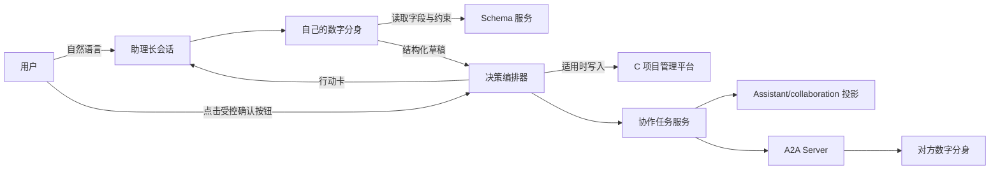
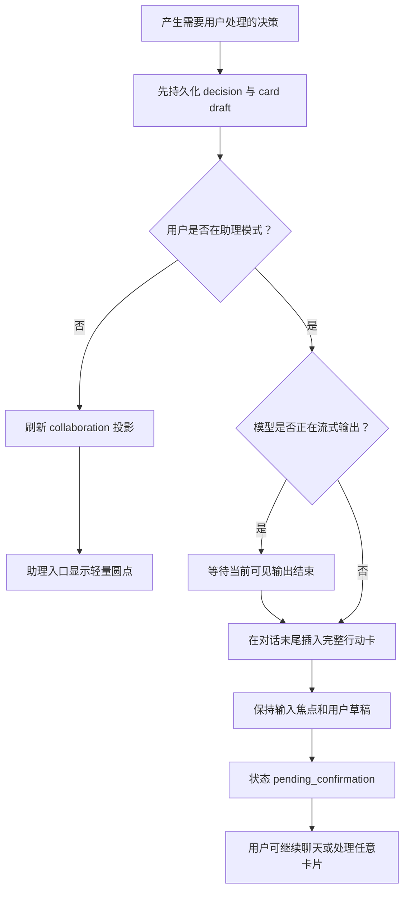
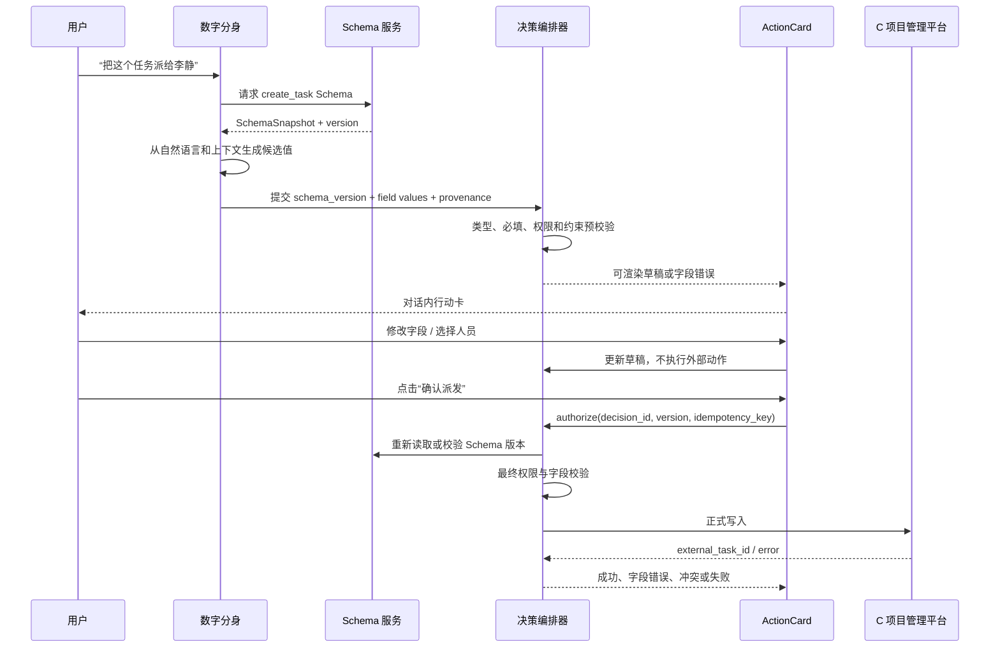
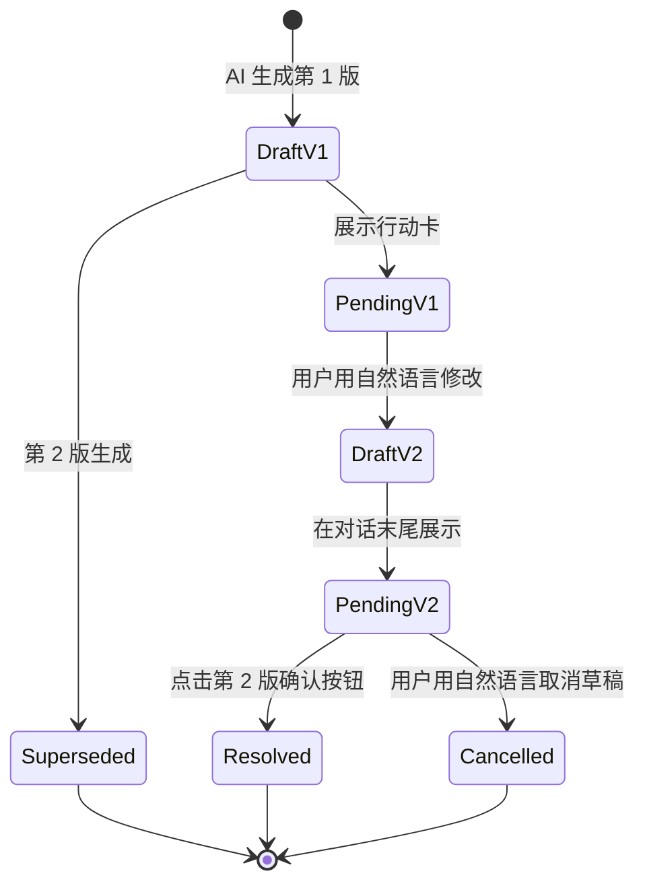
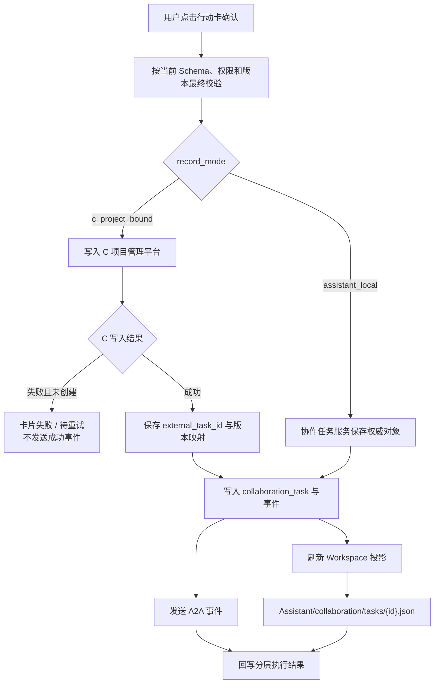
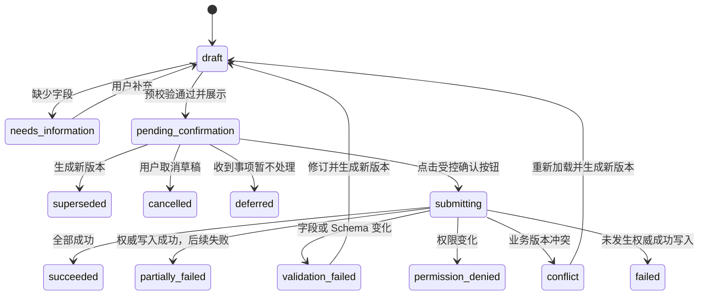

# PRD：A2A 对话内行动卡与用户确认机制

> 文档版本：V2.0
>
> 文档状态：产品开发基线
>
> 更新日期：2026-07-27
>
> 适用范围：COMAC AI 助理模式
>
> 关联文档：《PRD-助理A2A任务派发与催办》《PRD-双模式会话与统一Workspace》《PRD-Workspace工作台交互规范》

## 1. 文档目的

本文定义个人数字分身准备发出或收到需要本人处理的 A2A 动作时，如何在助理长会话中生成结构化行动卡、补齐动态业务字段、允许用户继续对话，并在获得明确授权后执行正式写入。

本文直接回答以下开发问题：

- A2A 卡片为什么出现在对话中，而不是底部 Dock、Modal 或独立待办面板；
- 用户不处理当前卡片时能否继续聊天；
- 自然语言“下发吧”与点击“确认派发”的权限语义是否相同；
- C 项目管理平台字段由后台动态配置时，AI、前端和服务端分别做什么；
- 用户用自然语言修改草稿后，旧卡和新卡如何共存；
- 多条待确认事项同时到达时如何展示；
- 模型正在输出、用户正在输入或查看 Workspace 时如何插入卡片；
- C 项目管理平台、协作任务服务和 `Assistant/collaboration/` 如何保持对应；
- 提交成功、部分失败、版本冲突和平台不可用时如何反馈。

任务对象、A2A 协议、权限、催办频控和业务写入规则以《PRD-助理A2A任务派发与催办》为准。

## 2. 产品结论

### 2.1 使用对话内行动卡

A2A 决策采用嵌入助理消息流的结构化行动卡。

行动卡：

- 与产生它的助理说明一起进入对话时间线；
- 可以包含选择器、输入项、业务字段摘要、校验提示和明确操作按钮；
- 不覆盖输入器，不使用全屏遮罩，不抢占 Workspace；
- 用户可以暂不处理并继续聊天；
- 处理后留在原位置并转为只读结果态，形成可追溯记录；
- 同一业务动作被修改时生成新版本，旧版本标记为“已被替代”；
- 不是第二套任务管理系统，长期检索仍通过自然语言与 Workspace 完成。

### 2.2 点击按钮是唯一正式授权

以下行为不构成正式授权：

- 模型根据用户意图生成了一张卡；
- 用户浏览、展开或修改卡片字段；
- 用户在聊天中说“下发吧”“确认”“就这样”“回复他”；
- AI 判断用户大概率想执行；
- 卡片已经具备所有必填字段。

只有用户点击当前有效卡片中的受控主按钮，例如“确认派发”“确认发送”“确认回复”，才生成正式授权事件。

自然语言可以：

- 新建草稿；
- 补充或修改草稿；
- 查询草稿状态；
- 取消草稿；
- 请求重新生成卡片；
- 定位待确认事项。

自然语言不能直接替代正式授权按钮。

### 2.3 对话非阻塞

本节适用于任务派发、催办和普通行动卡。A2A 多人协作中的 Ask User 属于顺序执行控制：需要某位真人确认时，当前轮次必须挂起，后续分身不得越过；具体规则以《PRD-助理A2A群聊》为准。

待确认卡片存在时：

- 输入器保持可用；
- 用户可以继续讨论当前任务，也可以发起无关话题；
- 其他待确认卡片可以继续进入消息流；
- 不要求用户先处理最早的一张；
- 不提供全局“上一条 / 下一条”强制队列；
- 未点击确认的卡片始终保持草稿或待确认状态，不得产生外部副作用。

唯一需要等待的情况是“当前模型仍在流式输出”：新行动卡必须等当前可见输出结束后再作为完整消息插入，不能插在一段模型文本中间。

### 2.4 只在助理模式处理 A2A

- 普通任务 Session 不接收、不展示、不处理 A2A 行动卡；
- 普通任务 Workspace 不出现 `collaboration/`；
- 所有 A2A 对象归属于唯一助理固定长 Session；
- 用户处于普通任务模式时，后台事件先进入助理协作服务并刷新 Assistant Workspace 投影；
- 只有当前用户存在未处理的 Ask User 时，“助理”入口显示无数字红点；普通新消息、分身回复和轮次完成不点亮；
- 用户回到助理模式后，从对话时间线或自然语言入口处理；
- Demo 可以不实现左侧圆点，正式产品必须实现。

## 3. 设计原则

1. **用户只与自己的数字分身交互**：不把用户直接拉入多人 Agent 群聊。
2. **先形成草稿，再明确授权**：草稿生成和正式执行是两个独立阶段。
3. **继续聊天不等于默认同意**：未处理卡片不阻塞对话，也不自动执行。
4. **按钮由客户端动作映射控制**：模型不能自由生成具有执行能力的按钮。
5. **业务字段由服务端 Schema 决定**：AI 不得猜测必填性、枚举和校验规则。
6. **旧卡不可静默改写**：任何影响执行内容的修改都生成新版本。
7. **Workspace 保存可追溯投影**：行动卡不是唯一入口，文件也不是唯一事实源。
8. **权威状态不在前端**：前端只展示服务端返回的草稿、校验和执行状态。
9. **多事项可以共存**：不同业务对象的待确认卡可同时存在。
10. **失败必须分层说明**：业务写入、A2A 送达和 Workspace 投影是三个不同结果。

## 4. 系统边界

| 主体 | 责任 |
| --- | --- |
| 用户 | 提出意图、补充信息、修改草稿、点击按钮授权、查看结果。 |
| 用户数字分身 | 理解自然语言，调用 Schema 与业务查询，生成结构化草稿，解释结果。 |
| 对方数字分身 | 接收任务或催办事件，在对方助理侧生成必要的行动卡。 |
| 决策编排器 | 管理卡片版本、状态、幂等、提交门控和与消息的关联。 |
| Schema 服务 | 返回当前业务动作的字段、必填性、控件、约束、权限和版本。 |
| C 项目管理平台 | 在适用场景中保存业务权威任务、进展和状态。 |
| 协作任务服务 | 保存 A2A 协作对象、事件、参与人、映射和卡片状态。 |
| A2A Server | 身份校验、路由、幂等、顺序和送达。 |
| Workspace 服务 | 生成 `Assistant/collaboration/` 可追溯文件投影。 |
| 组织身份服务 | 提供唯一人员、部门、岗位、有效状态和可选范围。 |



## 5. 决策类型

一期支持五类 A2A 卡片和一类非 A2A 澄清卡。

| 类型 | 方向 | 是否正式外部动作 | 主按钮 |
| --- | --- | --- | --- |
| `dispatch_confirm` | 发出 | 是 | 确认派发 |
| `reminder_confirm` | 发出 | 是 | 确认发送 |
| `reminder_receipt` | 收到 | 否 | 卡片内小型发送按钮；仅发送补充回复 |
| `task_receipt`（`c_project_bound`） | 收到 | 否 | 无；任务被动接收，仅允许补充回复 |
| `task_receipt`（`assistant_local`） | 收到 | 是 | 确认收到；本期 Demo 暂保留 |
| `progress_reply` | 收到 | 是 | 确认回复 |
| `workflow_clarification` | 内部 | 否 | 中间步骤“继续”，末步“提交” |

以下事件只生成普通消息或轻提示，不生成行动卡：

- 已送达、已读；
- 对方已经开始；
- 文件投影已更新；
- 无需授权的查询结果；
- 自动化运行记录；
- 不影响外部的内部推理；
- 纯状态通知。

## 6. 对话插入规则

### 6.1 不同前台状态

| 当前状态 | 产品行为 |
| --- | --- |
| 助理空闲 | 在对话末尾插入完整行动卡。 |
| 用户正在输入且已有草稿 | 插入卡片但不抢焦点、不清空草稿；输入器继续可用。 |
| 用户正在浏览聊天底部 | 插入卡片并保持在可见范围。 |
| 用户正在浏览较早消息 | 不强制跳到底部；显示“有新的待确认事项”轻提示。 |
| 用户正在查看 Workspace | 不关闭 Workspace；写入对话并点亮助理入口或待确认提示。 |
| 输出物浮层或文件启动器打开 | 不强制关闭；事件正常持久化。 |
| 模型正在流式输出 | 等当前可见输出结束后，再插入完整卡片。 |
| 已有其他待确认卡 | 新卡按时间进入对话，不覆盖旧卡。 |

“模型输出结束”指当前可见文本流完成、失败或进入明确等待用户的状态，不要求后台所有工具任务结束。

### 6.2 插入流程



### 6.3 多事项

不同 `decision_id`：

- 可以同时处于 `pending_confirmation`；
- 各自独立处理；
- 不提供全局页码、前后切换或强制 FIFO；
- 对话时间顺序只代表到达顺序，不代表业务优先级；
- 自然语言“我有哪些待确认”可返回简洁索引。

同一业务对象和动作：

- 同一版本的重复事件按幂等键合并；
- 新内容生成新 `decision_version`；
- 旧卡转为 `superseded`；
- 旧卡按钮立即失效；
- 新卡必须出现在当前对话末尾，不能静默改写历史卡片。

## 7. 行动卡通用交互

### 7.1 卡片结构

统一 `ActionCard` 至少包含：

1. 直接表达业务动作的标题或问题；
2. 必要且面向用户的说明；
3. 结构化字段或选项；
4. 字段级错误和全局风险提示；
5. 次操作；
6. 唯一主操作；
7. 状态结果。

`decision_version`、`draft_revision`、Schema ID、Schema 版本、记录模式和执行链路属于后台编排与审计字段，不作为常规卡片文案展示。只有 `c_project_bound` 任务需要展示轻量业务标记“C项目管理任务”，帮助用户理解该任务受 C 项目管理平台约束；`assistant_local` 不展示“A2A 原生”“仅 A2A”等技术标记。

### 7.2 统一外壳

所有场景复用同一个 `ActionCard` 容器。业务场景提供配置和数据，不得分别开发互不一致的“派任务卡”“催办卡”“回复卡”和“澄清卡”外壳。

“统一”指外壳、字段渲染器、内部版本、状态和按钮规则统一，不要求所有业务动作展示相同字段。派任务中的负责人选择必须与其他字段处于同一张卡，不得先展示独立选人面板再跳转到任务信息面板。

| 层 | 责任 |
| --- | --- |
| `ActionCard` | 统一视觉、业务标记、状态、可访问性和操作区；不暴露技术元数据。 |
| `DecisionFlowSpec` | 步骤、控件、字段、文案和最终动作映射。 |
| `SchemaSnapshot` | 业务字段、必填性、枚举、约束和版本。 |
| `DecisionOrchestrator` | 状态、版本、提交、幂等和执行结果。 |

### 7.3 按钮规则

- 非末步澄清：主按钮统一为“继续”；
- 澄清末步：主按钮为“提交”；
- 正式外部动作：使用具体且不可误解的“确认派发 / 确认发送 / 确认回复”；
- 出站行动卡不提供“取消草稿”按钮；用户可以继续聊天，或通过自然语言取消、修改草稿；
- 需要用户决策的收到事项暂不处理：使用“暂不处理”；C 项目任务接收卡不提供该操作；
- 不使用全局 `Esc` 直接取消卡片，避免用户在输入器中按键时误操作历史卡；
- 不依赖右上角 `X` 隐藏卡片；用户可以直接继续聊天；
- 主按钮在必填字段未通过校验时禁用，并展示原因。

### 7.4 卡片完成后的显示

| 状态 | 历史卡显示 |
| --- | --- |
| `resolved` | 收起为“业务标题 + 结果状态”的只读摘要；本期派发动作执行后统一显示“已完成”，仅表示派发动作完成，不表示底层业务任务已经完成。其他动作显示对应业务结果。 |
| `superseded` | 收起并标记“已由新草稿替代”，不展示版本号。 |
| `cancelled` | 收起并标记“草稿已取消”。 |
| `deferred` | 收起并标记“已暂不处理”。 |
| `failed` | 保留错误摘要和允许的重试入口。 |
| `expired` | 收起并说明失效原因；需要重新生成。 |

## 8. 动态字段 Schema

### 8.1 为什么不能让 AI 自己决定字段

C 项目管理平台的字段、必填性、枚举和权限由后台配置，可能因项目、任务类型、组织或时间变化。AI 只能填写候选值，不能成为字段规则的事实源。

错误实现包括：

- 在 Prompt 中长期硬编码“截止时间必填”；
- 前端写死所有 C 平台字段；
- 让模型根据字段中文名猜控件；
- 模型遗漏字段时直接提交；
- Schema 改版后仍使用旧卡静默写入；
- 用户无权限时通过 `collaboration/` 绕过治理。

### 8.2 SchemaSnapshot

生成卡片前，数字分身必须按动作、项目、任务类型和当前用户请求服务端 Schema。

建议结构：

```json
{
  "schema_id": "c-project.task.create",
  "schema_version": "v2026.07.3",
  "action": "create_task",
  "project_id": "C919-XXX",
  "fields": [
    {
      "key": "title",
      "label": "任务名称",
      "type": "string",
      "required": true,
      "editable": true,
      "constraints": { "min_length": 2, "max_length": 120 }
    },
    {
      "key": "assignee_id",
      "label": "负责人",
      "type": "organization_user",
      "required": true,
      "multiple": false
    },
    {
      "key": "due_at",
      "label": "截止时间",
      "type": "datetime",
      "required": true
    },
    {
      "key": "category",
      "label": "下发分类",
      "type": "enum",
      "required": false,
      "options_source": "c-project.task-category"
    }
  ]
}
```

正式 Schema 还应支持：

- `visible` 与条件显隐；
- `readonly` 与字段权限；
- `default_value`；
- `enum_options` 或 `options_source`；
- `depends_on`；
- `validation_message`；
- `sensitive` 与脱敏策略；
- `attachment_policy`；
- `record_mode_policy`；
- `expires_at`。

### 8.3 AI、前端和服务端分工



职责边界：

| 层 | 可以做 | 不可以做 |
| --- | --- | --- |
| AI | 提取候选值、解释字段、建议默认值、生成补充问题 | 决定字段是否必填、编造枚举、绕过校验、直接执行 |
| 前端 | 根据安全控件白名单渲染、收集用户输入、展示错误 | 从文案反向解析字段、信任本地校验作为最终结果 |
| 决策编排器 | 保存草稿、版本、来源和授权，调用最终校验 | 用旧版本 Schema 静默提交 |
| Schema/业务服务 | 决定规则、权限、合法值和最终校验 | 依赖模型自由文本作为执行指令 |

### 8.4 字段来源

每个字段必须记录来源：

```text
user_utterance
conversation_context
workspace_reference
task_service
organization_service
schema_default
model_inference
user_edited
```

模型推断值必须可见；敏感或高风险字段不得仅凭模型推断直接提交。

### 8.5 Schema 变化

用户点击确认时，如果 Schema 版本已变化：

1. 服务端拒绝旧版本提交；
2. 返回变化字段和新 `schema_version`；
3. 原卡状态转为 `expired` 或 `superseded`；
4. 生成新版本卡片；
5. 保留仍然合法的用户输入；
6. 对新增必填字段重新请求用户补充；
7. 不得自动替用户确认新版。

## 9. 草稿、自然语言修改与版本

### 9.1 草稿是服务端对象

每张卡对应一个服务端 `decision_draft`：

```text
decision_id
business_object_id
decision_type
decision_version
draft_revision
schema_id
schema_version
status
field_values
field_provenance
created_at
updated_at
superseded_by
authorization_id
```

`decision_version` 与 `draft_revision` 都是服务端并发、幂等和审计字段。前端不在常规卡片上展示版本号；发生替代时只向用户说明“已由新草稿替代”，具体版本关系保留在后台和 Workspace 审计信息中。

- 用户直接在当前卡片输入框中修改字段：更新 `draft_revision`，卡片仍停留在原位置；
- 用户通过后续自然语言修改草稿、Schema 发生变化或系统需要重新解释意图：生成新的 `decision_version` 和新卡片；
- 确认请求必须同时携带当前 `decision_version` 与 `draft_revision`，防止提交过期字段。

### 9.2 修改规则

用户看到第 1 版派发卡后说：

> 下发，让她今天推进。

系统必须：

1. 判断这句话是在修改当前派发草稿，而不是正式授权；
2. 生成第 2 版草稿；
3. 修改截止时间或任务要求等可识别字段；
4. 在对话末尾追加第 2 版卡；
5. 将第 1 版标记为 `superseded`；
6. 第 1 版按钮失效；
7. 仍要求用户点击第 2 版“确认派发”。



### 9.3 相关与无关对话

决策编排器必须区分：

- **修改当前草稿**：如“改成明天下午”“负责人换成李静”；
- **询问草稿**：如“这个任务还缺什么”；
- **口头要求执行**：如“确认下发”；只提示点击卡片按钮；
- **无关新话题**：如“总结今天的材料”；正常回答，原卡保持待确认；
- **新建另一个任务**：生成新的 `decision_id`，不覆盖当前草稿。

置信度不足时必须追问，不能误改已有卡。

## 10. 授权与提交

### 10.1 授权事件

用户点击主按钮后，客户端发送结构化授权：

```json
{
  "decision_id": "decision-123",
  "decision_version": 2,
  "draft_revision": 4,
  "schema_version": "v2026.07.3",
  "action_id": "dispatch.confirm",
  "idempotency_key": "decision-123:v2:dispatch.confirm",
  "client_snapshot_hash": "sha256:...",
  "confirmed_at": "2026-07-27T10:30:00+08:00"
}
```

服务端必须重新检查：

- 当前用户身份和会话；
- 卡片仍为最新有效版本；
- Schema 仍有效；
- 必填字段；
- 枚举、时间和组织成员合法性；
- 用户对目标项目和动作的权限；
- 原任务最新版本；
- 幂等键；
- 风险和频控策略。

### 10.2 提交期间

- 卡片状态转为 `submitting`；
- 主按钮不可重复点击；
- 用户仍可以继续聊天；
- 刷新页面后能恢复提交状态；
- 超时不能直接显示成功；
- 同一幂等键重复请求返回同一执行结果。

### 10.3 执行结果

| 状态 | 含义 |
| --- | --- |
| `succeeded` | 权威写入、协作记录和必要事件全部成功。 |
| `partially_failed` | 权威写入成功，但 A2A 送达或投影刷新失败。 |
| `validation_failed` | 字段或 Schema 校验失败，需要修订卡片。 |
| `permission_denied` | 用户无权执行。 |
| `conflict` | 业务对象版本冲突，需要重新加载。 |
| `failed` | 未发生权威成功写入的执行失败。 |

结果消息必须拆分说明：

- C 项目管理平台是否写入；
- 协作任务服务是否保存；
- 对方数字分身是否送达；
- Workspace 投影是否刷新；
- 是否正在重试；
- 用户下一步能做什么。

## 11. C 项目管理平台与 collaboration 联动

### 11.1 两种记录模式

| 模式 | C 项目管理平台 | 协作任务服务 | Workspace |
| --- | --- | --- | --- |
| `c_project_bound` | 保存业务权威任务 | 保存 A2A 事件与稳定映射 | 展示 C 引用和 A2A 状态 |
| `assistant_local` | 不创建对象 | 保存协作权威对象 | 展示本地协作投影 |

任务派发使用上述两种记录模式；催办不是新任务，也不属于一次 C 平台任务写入。无论原任务属于哪种记录模式，催办动作本身只追加并发送 A2A 催办事件，不创建或修改 C 项目管理平台任务。

“无法写入 C 平台”必须区分原因：

- **业务不适用、项目未绑定或平台能力明确不承载**：服务端可判定为 `assistant_local`；
- **缺少必填字段**：继续补充，不得自动降级；
- **用户无权限**：阻止执行，不得绕过治理；
- **C 平台暂时故障**：进入 `pending_sync` 或失败重试，不得伪装成本地成功；
- **Schema 无法读取**：不能生成可确认的 C 平台卡，允许在产品策略明确时生成标注清楚的 `assistant_local` 草稿。

### 11.2 对应关系



任务投影至少包含：

```text
collaboration_task_id
decision_id
decision_version
record_mode
authority_system
external_project_id
external_task_id
external_task_version
schema_id
schema_version
sync_status
sync_reason
last_synced_at
```

映射必须依赖稳定 ID 和版本，不得依赖任务标题、人员姓名或自然语言描述。

## 12. 状态机

建议完整状态：

```text
draft
needs_information
pending_confirmation
superseded
submitting
succeeded
partially_failed
validation_failed
permission_denied
conflict
failed
deferred
cancelled
expired
```



## 13. Workspace 联动

### 13.1 目录

```text
Workspace/
└── Assistant/
    └── collaboration/
        ├── index.md
        └── tasks/
            └── {collaboration-task-id}.json
```

### 13.2 行为

- 行动卡创建时保存草稿状态并刷新必要投影；
- 卡片修改时记录新版本和 `superseded_by`；
- 点击确认后写入授权、执行和分层结果；
- 用户关闭 Workspace、关闭标签或离开助理不影响草稿；
- 用户可说“我有哪些待确认”“把刚才那个任务改成明天”“继续处理王工的催办”；
- Workspace 文件用于检索、查看和恢复，不直接提供绕过确认的执行按钮；
- 删除本地预览或关闭标签不删除权威任务。

### 13.3 发送方与接收方

- 发送方确认派发后，系统先完成权威记录，再通过 A2A 向接收方数字分身送达；
- 接收方只在自己的助理长会话中看到收到任务行动卡；
- 接收卡复用统一外壳，字段默认只读；
- `c_project_bound` 展示“C项目管理任务”标记，`assistant_local` 不展示技术范围标记；
- 本期 `c_project_bound` 任务对接收方采用被动接收：送达即视为接收，不提供“暂不处理”“确认收到”或“申请调整”；
- C 项目任务接收卡底部只提供“补充回复”输入行和发送按钮；补充回复生成 A2A 消息与历史事件，但不改变任务状态；
- 拒绝、申请调整和显式收悉能力列入后期范围，届时需重新定义权限、状态和对 C 项目管理平台的写回规则；
- 接收方不处理卡片时仍可继续聊天；
- 接收方 Workspace 生成自己的任务投影，不共享发送方完整记忆。

## 14. 通知与轻提示

正式产品需要：

- 用户不在助理模式时，左侧“助理”入口显示轻量圆点；
- 用户在助理且位于历史消息时，显示“有新的待确认事项”；
- 圆点表达“有未看见的新事项”，不是未完成任务总数；
- 卡片真正进入可见区域后可清除新提示；
- 未确认卡仍可通过自然语言查询，不依赖圆点长期提醒；
- 一期不建设独立通知中心。

## 15. 异常处理

| 异常 | 产品行为 |
| --- | --- |
| Schema 获取失败 | 不猜测字段；说明暂时无法生成 C 平台确认卡。 |
| 新增必填字段 | 旧卡失效，生成新版本并请求补充。 |
| 人员已离职或无效 | 禁止提交，要求重新选择。 |
| 用户权限变化 | 返回权限错误，不降级绕过。 |
| 任务版本冲突 | 加载最新数据，生成新版本卡。 |
| C 平台超时 | 保持提交中或待重试，不宣告成功。 |
| C 成功但 A2A 失败 | 标记 `partially_failed`，保留 C 任务并重试通知。 |
| A2A 成功但投影失败 | 不回滚业务动作，重试 Workspace 投影。 |
| 重复点击 | 通过幂等键返回同一结果。 |
| 旧卡按钮被点击 | 返回“该版本已失效”，定位到最新卡。 |
| 多端同时确认 | 服务端只接受第一个有效授权，其他端同步结果。 |

## 16. 审计与安全

至少记录：

- 用户原始意图；
- 模型提取的候选值；
- 每个字段的来源；
- Schema ID 与版本；
- 每次草稿版本与差异；
- 行动卡展示时间；
- 用户字段修改；
- 点击的受控动作；
- 授权用户、客户端和时间；
- 最终校验结果；
- C 平台请求与响应引用；
- A2A 幂等键和送达结果；
- Workspace 投影版本；
- 失败、重试、撤销和冲突。

安全要求：

- 模型输出的普通文本不能携带可执行权限；
- 前端按钮只能绑定服务端允许的 `action_id`；
- 服务端不信任客户端传回的按钮文案或字段标签；
- 敏感字段按 Schema 脱敏；
- 行动卡不得展示用户无权读取的数据；
- A2A 只共享完成任务所需的最小上下文。

## 17. 接口建议

### 17.1 获取 Schema

```text
GET /decision-schemas/{action}
  ?project_id=
  &task_type=
  &user_id=
```

### 17.2 创建草稿

```text
POST /decision-drafts
```

### 17.3 更新草稿

```text
PATCH /decision-drafts/{decision_id}
If-Match: {decision_version}:{draft_revision}
```

卡片内字段编辑成功后返回新的 `draft_revision`；自然语言修订或 Schema 变化返回新的 `decision_version` 并生成新卡，不得静默覆盖历史卡片。

### 17.4 正式授权

```text
POST /decision-drafts/{decision_id}/authorize
Idempotency-Key: {decision_id}:{version}:{action_id}
```

### 17.5 查询待确认

```text
GET /decision-drafts?mode=assistant&status=pending_confirmation
```

## 18. 埋点

建议事件：

```text
action_card_created
action_card_rendered
action_card_visible
action_card_field_edited
action_card_validation_failed
action_card_superseded
action_card_cancelled
action_card_deferred
action_card_authorized
action_card_submit_succeeded
action_card_submit_partially_failed
action_card_submit_failed
action_card_latest_located
```

核心指标：

- 卡片生成成功率；
- Schema 获取失败率；
- 首次字段完整率；
- 自然语言修订率；
- 平均版本数；
- 确认转化率；
- 从展示到确认的时间；
- 继续聊天后最终处理率；
- 旧卡误点击率；
- C 平台写入成功率；
- A2A 送达成功率；
- 投影刷新延迟；
- 重复提交拦截率。

## 19. 验收标准

### 19.1 非阻塞

- 待确认卡存在时输入器可继续发送；
- 继续聊天不会自动确认、取消或隐藏卡片；
- 用户输入草稿不会被新卡清空；
- Workspace 不因行动卡到达而被强制关闭。

### 19.2 明确授权

- 只有点击当前有效卡的受控主按钮才执行；
- 聊天中说“确认下发”不得执行；
- 旧版本卡按钮不可用；
- 重复点击不会产生重复任务。

### 19.3 动态 Schema

- 前端根据 Schema 渲染字段，不硬编码 C 平台必填性；
- 字段缺失时服务端返回字段级错误；
- Schema 变化时生成新版本；
- AI 不得生成未注册动作按钮；
- 组织人员字段通过组织服务校验。

### 19.4 版本

- 自然语言修改生成第 N+1 版；
- 被替代卡在界面仅显示“已由新草稿替代”，不暴露版本号；
- 新卡出现在对话末尾；
- 版本差异、字段来源和操作均可审计。

### 19.5 多事项

- 多个不同事项可以同时待确认；
- 任意一张可独立处理；
- 不强制 FIFO；
- 同一幂等事件不重复生成卡；
- 用户能通过自然语言查询待确认事项。

### 19.6 系统联动

- `c_project_bound` 保存稳定 C 平台映射；
- `assistant_local` 不伪造 C 平台对象；
- C 平台运行时失败不得静默降级；
- C 写入、A2A 送达和 Workspace 投影分别反馈；
- 普通任务模式不出现 A2A 卡片或 `collaboration/`。

## 20. 当前 Demo 范围

当前 Demo 实现：

- 行动卡嵌入助理消息流，不再使用底部 Dock；
- 卡片存在时可继续聊天；
- 所有场景复用统一 `AssistantDecisionPanel`；
- 派任务、催办、进展回复和三步方案澄清由自然语言触发；
- 派任务使用一张完整行动卡，负责人不再单独占用第一步；
- 派任务卡固定展示名称、负责人、计划开始时间、计划完成时间和预估工时五个字段；
- C 项目任务与 A2A 本地协作任务复用同一组件，仅改变提交策略；前者显示“C项目管理任务”，后者不显示技术标记；
- Demo 仍在数据层保存 Mock Schema 版本，但卡片不展示 Schema、版本、记录模式或执行链路；正式产品字段由后台动态配置；
- 派任务卡可直接编辑 Mock 字段；Demo 不实现服务端 `draft_revision`；
- 催办卡只展示且允许编辑任务名称、催办对象、催办内容三个字段，不展示执行范围或系统链路文案；
- 发起方确认发送催办后，接收方长会话生成轻量 `reminder_receipt` 卡；卡片只展示催办标题、“补充回复”输入框和小型发送按钮；
- 接收方发送补充回复只产生 A2A 回复消息和历史事件，不自动修改原任务进度或状态；
- 顶部提供 Demo 专用的发起方/接收方视角切换；
- 接收方长会话内置 C 项目收到任务卡；该卡被动接收，不显示暂不处理、确认收到或申请调整；
- 接收方卡片底部只保留“补充回复”和发送按钮；发送回复不会改变任务状态；
- 发起方确认派发后，新任务会同步进入接收方视角；
- 用户说“下发，让她今天推进”会生成第 2 版；
- 第 1 版标记为已替代且不可操作；
- 用户只说“确认下发”时不会执行，并提示点击卡片；
- 点击受控确认按钮后才模拟正式写入、A2A 送达和 Workspace 更新；
- 模型正在输出时，收到的催办会等输出结束后进入对话；
- Demo 使用固定 Mock 数据和关键词，不连接真实 Schema、C 平台、组织、权限、A2A 或 Workspace 服务。

Demo 不代表：

- 前端可以硬编码正式字段；
- 字符串关键词就是正式意图识别方案；
- 浏览器内状态就是权威状态；
- 模型可以绕过服务端校验；
- `collaboration/*.json` 是事实源。

## 21. 待确认事项

1. 收到任务后是否允许正式“拒绝”，以及强组织指令的例外；
2. C 平台 Schema 接口的字段类型白名单和条件显隐能力；
3. C 平台运行时故障的最长自动重试窗口；
4. `assistant_local` 的适用范围和组织治理规则；
5. 待确认卡的长期过期时间；
6. 多端确认的实时同步机制；
7. 跨组织 A2A 的身份互信和字段脱敏策略；
8. 普通任务输出物作为 A2A 附件时的授权与生命周期。
