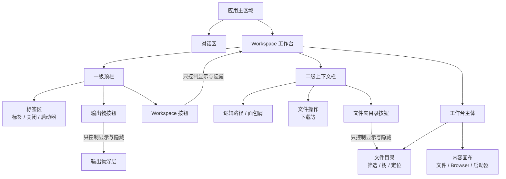
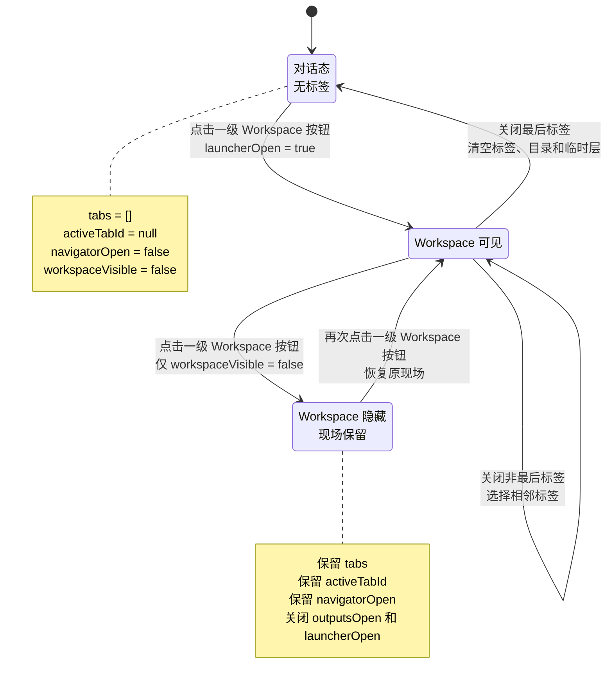
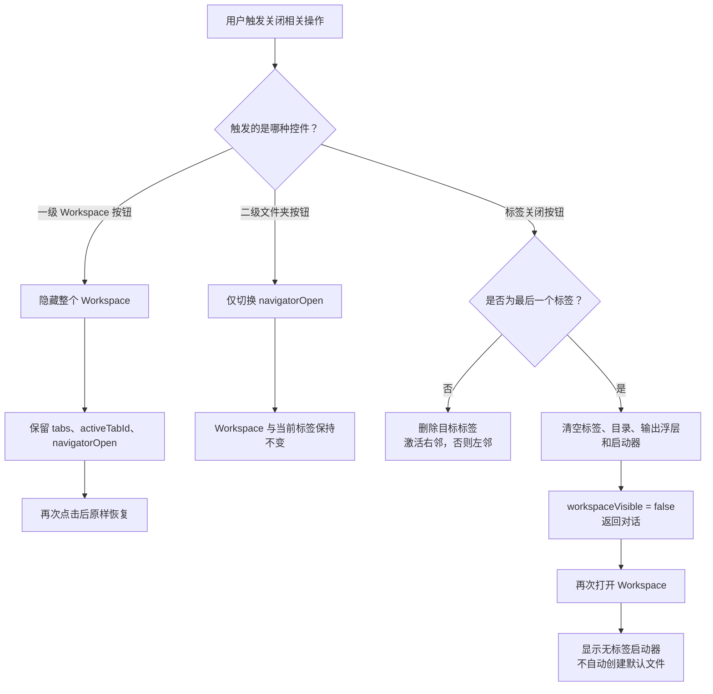
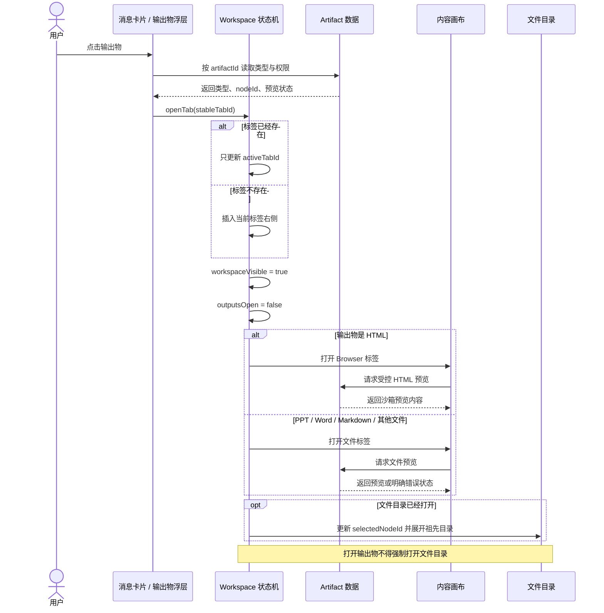

# PRD：Workspace 工作台交互规范

> 文档版本：V1.2
>
> 文档状态：产品开发基线
>
> 更新日期：2026-07-23
>
> 适用端：COMAC AI 桌面 Web / 桌面客户端内嵌 Web
>
> 关联文档：《PRD-双模式会话与统一Workspace》《PRD-右侧工作区与输出物预览》

## 1. 文档目的

本文定义 COMAC AI Workspace 的工作台外壳、顶部标签、输出物浮层、右侧文件导航、受控 HTML Browser、状态联动和响应式规则。

本规范以 Codex 的渐进式工作台交互为参考，但不复制其开发者专属能力。COMAC AI 一期只保留业务用户实际需要的文件、输出物和 Browser，不提供终端、底部面板、侧边任务和任意网址访问。

本文是 Workspace 交互的直接开发依据。如果其他文档中的“单一文件面板”“内部关闭按钮”或“无标签预览”描述与本文冲突，以本文为准。

## 2. 已确认的一期边界

### 2.1 一期包含

- 普通任务与助理共用一个 Workspace 工作台组件；
- 顶部工作视图标签；
- `+` 工作台启动器；
- 输出物按钮及轻量输出物浮层；
- 一级 Workspace 按钮、二级文件夹按钮及文件导航侧栏；
- 文件筛选、目录展开、文件定位；
- HTML Browser 工作视图；
- PPT、Word、Markdown、JSON、文本只读预览；
- 标签去重、关闭、相邻切换、最后标签关闭后自动退出；
- 桌面宽屏、中等窗口和移动端响应式；
- Hover、Tooltip、Focus、禁用态、过渡动画和键盘基本操作。

### 2.2 一期不包含

- 用户输入网址或访问任意外部网站；
- “来源”分区；
- 终端；
- 底部面板；
- Codex 侧边任务；
- 在线编辑和保存文件；
- 文件创建、移动、重命名、删除；
- 拖拽标签排序；
- 多人协同编辑；
- 将 A2A 待办重新设计成常驻管理侧栏。

## 3. 产品判断

### 3.1 Workspace 不等于文件树

Workspace 是承载文件、Browser 和后续工作视图的工作台。文件树只是一个可开关的导航侧栏。

上一版把文件树、文件头和预览绑定成一个固定右侧面板，存在以下问题：

- 用户打开 Workspace 后首先看到目录，而不是当前工作；
- HTML 被降级成普通文件预览，无法表达“运行结果”；
- 打开和关闭按钮位于不同位置，产生操作跳变；
- 一个布尔开关无法表达标签、输出物浮层和导航侧栏的独立状态；
- 普通任务和助理虽然外观相同，但仍缺少真正统一的工作流。

### 3.2 渐进式展开

产品按用户意图逐步展开：

1. 默认停留在对话；
2. 输出物生成后，在消息卡片和“输出物”浮层出现；
3. 点击输出物后才打开工作台和对应标签；
4. 用户需要理解目录时才打开右侧文件导航；
5. HTML 默认进入 Browser，只有需要查看内容结构时才打开源文件标签。

### 3.3 同一位置、单一语义

一级顶栏的输出物按钮和 Workspace 按钮固定在右上角。Workspace 按钮无论当前状态如何，都只负责显示或隐藏整个工作台。

文件目录属于 Workspace 内的二级能力，由二级上下文栏右侧的文件夹按钮单独控制。一级 Workspace 按钮不得在工作台打开后变成目录开关；文件夹按钮也不得关闭整个工作台。

Workspace 和文件目录都在各自的同一个按钮上完成打开与关闭，不在文件目录内部再放重复的 `X`。

## 4. 总体布局

```text
┌──────────────────────────────────────────────────────────────────┐
│ [标签 A] [标签 B] [+]                        [输出物] [Workspace]│ 一级导航
├──────────────────────────────────────────────────────────────────┤
│ / 路径 / 当前文件                      [文件操作] [文件夹目录] │ 二级上下文
├────────────────────────────────────────────┬─────────────────────┤
│                                            │ 筛选文件…           │
│             当前标签内容画布               │ 当前根目录          │
│      文件预览 / HTML Browser / 启动器       │ 文件树              │
│                                            │                     │
└────────────────────────────────────────────┴─────────────────────┘
```

输出物浮层从“输出物”按钮附近展开，覆盖在工作台或对话内容上，不成为常驻第三栏。

### 4.1 组件层级与控制权

下图用于约束组件边界。开发实现时，一级 Workspace 按钮和二级文件夹按钮不得复用同一个事件处理函数。



开发约束：

- `WorkspaceButton` 不得修改 `tabs`、`activeTabId` 或 `navigatorOpen`；
- `FolderButton` 不得修改 `workspaceVisible`、`tabs` 或 `activeTabId`；
- `OutputButton` 不得自动创建标签或强制打开 Workspace；
- 标签、Browser、文件预览和启动器统一渲染在 `Canvas`；
- `Navigator` 只负责定位和选择，不拥有工作台生命周期。

## 5. 顶部工作台 Chrome

### 5.1 标签区

顶部左侧依次展示：

- 已打开的工作视图标签；
- `+` 按钮。

每个标签包含：

- 类型图标；
- 标题；
- 关闭按钮；
- 激活态；
- 标题截断与完整标题 Tooltip。

标签关闭按钮只在 Hover、Focus 或当前激活时增强显示，减少视觉噪声。

### 5.2 一级顶栏按钮区

一期只显示两个按钮：

1. 输出物；
2. Workspace 工作台。

不保留 Codex 的底部面板按钮，因此两个按钮之间不预留无意义空位。

按钮规则：

- 在对话态和工作台态保持相同的右上角位置和语义；
- 具有 Hover、Pressed、Focus-visible 和 Tooltip；
- 打开时展示激活态；
- Workspace 打开时再次点击，只隐藏整个工作台，不修改标签和文件目录状态；
- 不通过更换到面板内部的 `X` 完成关闭；
- 图标位置不得因侧栏开关发生横向跳动。

### 5.3 二级上下文栏

一级顶栏下方固定展示一行上下文工具栏：

- 左侧展示当前文件逻辑路径或面包屑；
- 右侧展示当前文件操作，例如下载；
- 最右侧固定展示文件夹目录按钮；
- 文件夹按钮只切换文件目录，不关闭 Workspace、不关闭标签、不改变当前文件；
- 无标签时路径显示 `/`，仍允许用户打开目录；
- 不再额外展示一整行重复的“文件名 + 类型图标”，文件名已经存在于标签和路径中。

## 6. 工作视图标签

### 6.1 标签类型

| 类型 | 标识 | 用途 |
| --- | --- | --- |
| 文件标签 | `file:{node_id}` | 预览文件内容、元数据和下载操作。 |
| Browser 标签 | `browser:{artifact_id}` | 运行用户自己生成的 HTML。 |

一期不创建“任务管理标签”。A2A 任务详情继续以 Assistant 目录下的 JSON 文件投影打开，因此仍属于文件标签。

### 6.2 打开规则

- 点击 PPT、Word、Markdown、JSON、文本输出物：打开文件标签；
- 点击 HTML 输出物卡片或输出物浮层：打开 Browser 标签；
- 从文件导航点击 HTML：打开源文件标签；
- Browser 内点击“查看源文件”：打开对应 HTML 源文件标签；
- 点击普通文件：打开文件标签；
- 相同标签 ID 已存在时只聚焦，不重复创建；
- 新标签默认插入当前激活标签右侧；无激活标签时放在末尾；
- 打开标签后 Workspace 自动进入工作台态。

### 6.3 关闭规则

关闭非激活标签：

- 当前标签保持不变；
- 内容画布不闪烁；
- 右侧导航选择不强制变化。

关闭激活标签：

1. 优先激活原标签右侧相邻标签；
2. 若右侧没有，则激活左侧相邻标签；
3. 若没有其他标签，则退出 Workspace 工作台。

关闭最后一个标签时必须原子执行：

- `tabs = []`；
- `activeTabId = null`；
- 右侧文件导航关闭；
- 输出物浮层关闭；
- 启动器关闭；
- 工作台退出；
- 对话恢复完整可用宽度和原滚动位置。

关闭最后一个标签与隐藏 Workspace 是两种不同动作：

- 点击一级 Workspace 按钮隐藏：标签、激活标签和文件目录开关状态保留；
- 点击标签 `X` 关闭最后标签：标签真正清空，文件目录状态一并清空；
- 隐藏后重新打开：恢复原来的标签、激活标签和文件目录状态；
- 清空后重新打开：进入无标签启动器，不自动创建 `context.md` 或 `MEMORY.md` 标签。

### 6.4 标签过多

- 标签区横向滚动；
- 顶部按钮区固定，不随标签滚动；
- 单个标签设最大宽度；
- 激活标签应自动滚动到可见范围；
- 一期不做标签下拉总览和拖拽排序。

## 7. `+` 工作台启动器

### 7.1 打开方式

用户点击标签区的 `+`，在内容画布上打开启动器。启动器不是新标签，不计入标签数量。

### 7.2 一期入口

启动器包含：

- 打开文件；
- 浏览器；
- 推荐输出物。

“打开文件”：

- 关闭启动器；
- 打开右侧文件导航；
- 焦点进入文件筛选框。

“浏览器”：

- 不展示网址输入框；
- 若存在已生成 HTML，展示 HTML 列表或直接打开最近生成的 HTML；
- 若不存在 HTML，展示“生成 HTML 后可在这里打开”的禁用说明；
- 不创建空白 Browser 标签。

推荐输出物：

- 最多展示最近 6 个；
- 点击后遵循输出物打开规则；
- 不展示“来源”。

### 7.3 关闭方式

- 再次点击 `+`；
- 按 `Esc`；
- 打开文件或 Browser；
- 关闭最后一个标签；
- 切换普通任务或模式。

## 8. 输出物按钮与浮层

### 8.1 内容范围

普通任务：只展示当前 Session 的 `outputs/`。

助理：只展示 Assistant 的 `outputs/`，按日期分组；一期 Demo 可使用固定日期分组。

不展示：

- 附件；
- 网页来源；
- 知识库来源；
- A2A 协作任务；
- 其他普通任务的生成物。

### 8.2 浮层结构

- 标题“输出”；
- 输出物数量；
- 文件类型图标；
- 文件名；
- 类型、大小或更新时间；
- 当前已打开标识；
- 空状态。

### 8.3 打开与关闭

- 点击输出物按钮切换浮层；
- 浮层不强制打开 Workspace；
- 从对话态打开浮层后，选择输出物才进入 Workspace；
- 点击输出物后默认关闭浮层，避免遮挡刚打开的内容；
- 点击浮层外、按 `Esc`、切换模式或关闭最后标签时关闭；
- 打开右侧文件导航不强制关闭输出物浮层，但中小窗口下二者互斥。

### 8.4 空状态

当前范围没有输出物时：

- 按钮仍可用；
- 浮层展示“当前任务还没有输出物”；
- 提示用户可在对话中生成 HTML、PPT、Word 或 Markdown；
- 不自动跳转目录，不创建空标签。

## 9. 右侧文件导航

### 9.1 开关规则

- 仅点击二级上下文栏的文件夹按钮打开或关闭；
- 侧栏内部不放关闭按钮；
- 工作台隐藏时不展示文件夹按钮，必须先通过一级 Workspace 按钮恢复工作台；
- 打开 Workspace 且没有标签时，默认展示启动器，不自动创建默认文件标签；
- 用户点击启动器“打开文件”后打开文件目录，但仍不代替用户选择文件；
- 关闭侧栏不关闭标签，不退出 Workspace；
- 通过一级按钮隐藏 Workspace 时保留侧栏开关状态；
- 关闭最后标签时侧栏自动关闭并清空状态。

### 9.2 内容

- 文件筛选框；
- 当前逻辑根路径；
- 可展开文件树；
- 选中文件高亮；
- 无权限节点不展示；
- 长文件名截断；
- 内部滚动；
- 文件类型图标。

普通任务根：当前 Session 目录。

助理根：`/Workspace/Assistant/`。

### 9.3 文件筛选

- 只筛选当前已加载根目录；
- 按文件名不区分大小写包含匹配；
- 搜索期间展示命中文件及必要祖先目录；
- 清空后恢复原展开状态；
- `Esc` 在输入框非空时先清空，不直接关闭整个 Workspace。

### 9.4 自动定位

从聊天卡片、输出物浮层或 Browser“查看源文件”打开文件时：

- 更新选中文件；
- 展开祖先目录；
- 文件导航已经打开时滚动到该节点；
- 文件导航关闭时记录选择，下次打开可见；
- 不因自动定位强制打开导航。

## 10. HTML Browser

### 10.1 访问范围

一期 Browser 只允许打开当前用户自己生成且仍有权限访问的 HTML Artifact。

禁止：

- 用户输入网址；
- 修改地址栏；
- 打开任意外部 URL；
- HTML 通过脚本访问宿主权限；
- 将 Browser 作为通用互联网浏览器。

### 10.2 Browser Chrome

Browser 标签内容顶部包含：

- 后退；
- 前进；
- 只读地址；
- 刷新；
- 查看源文件；
- 可选全屏。

地址格式建议：

```text
comac://workspace/{session_id}/outputs/index.html
```

Demo 不使用真实 `file://` 路径，避免误导用户认为网页直接读取本地磁盘。

### 10.3 控件状态

- 单一页面无历史时，后退和前进为禁用态；
- 刷新重新挂载受控预览；
- 查看源文件打开或聚焦 `file:{node_id}`；
- 下载位于统一文件操作区，不重复放置多个下载按钮；
- HTML 失效时保留标签，展示失效原因。

### 10.4 Demo 与正式实现

Demo：使用受控 `iframe srcDoc` 或等价前端容器展示固定 HTML 内容。

正式产品：

- 使用隔离域和沙箱；
- 校验 Artifact 权限和版本；
- 限制网络、存储、剪贴板和宿主 API；
- 记录敏感访问和下载审计；
- 预览 URL 使用短期授权，不暴露永久地址。

## 11. 文件内容画布

### 11.1 文件标签

文件标签内容包含：

- 一级标签中的文件名和类型图标；
- 二级上下文栏中的逻辑路径、大小和更新时间；
- 下载操作；
- 文件预览。

### 11.2 文件类型

- PPT：缩略图 + 当前页；
- Word：只读分页预览；
- Markdown：渲染阅读视图；
- JSON：格式化或业务可读投影；
- HTML 源文件：只读代码/文本；
- 不可预览文件：说明原因并按权限提供下载。

### 11.3 状态

必须覆盖：

- 加载中；
- 转换中；
- 预览成功；
- 预览失败；
- 无权限；
- 已过期；
- 离线；
- 文件版本更新。

Demo 至少展示成功态，并为失败、无权限和转换中预留组件结构。

## 12. 双模式规则

| 维度 | 普通任务 | 助理 |
| --- | --- | --- |
| 工作台外壳 | 相同 | 相同 |
| 一级顶栏按钮 | 输出物、Workspace | 输出物、Workspace |
| 二级目录按钮 | 文件夹 | 文件夹 |
| 无标签时 | 启动器 | 启动器 |
| 根目录 | 当前 Session | `Assistant/` |
| 输出物范围 | 当前 Session `outputs/` | Assistant `outputs/` |
| A2A 文件 | 无默认展示 | `collaboration/tasks/` 投影 |
| HTML Browser | 当前任务生成 HTML | 助理生成 HTML |

切换普通任务、助理或自动化时：

- 关闭输出物浮层和启动器；
- 普通任务标签状态按 Session 隔离；
- 不把上一普通任务标签带入下一普通任务；
- Assistant 保留自己的独立标签状态；
- Demo 可在切换模式时重置，正式产品建议按 Session 保存最近状态。

## 13. 状态模型

客户端核心状态：

| 状态 | 类型 | 含义 |
| --- | --- | --- |
| `workspaceVisible` | `boolean` | 整个 Workspace 工作台是否可见。隐藏不等于销毁标签。 |
| `tabs` | `WorkspaceTab[]` | 已打开工作视图。 |
| `activeTabId` | `string/null` | 当前激活标签。 |
| `navigatorOpen` | `boolean` | 右侧文件导航是否打开。 |
| `outputsOpen` | `boolean` | 输出物浮层是否打开。 |
| `launcherOpen` | `boolean` | `+` 启动器是否打开。 |
| `selectedNodeId` | `string/null` | 文件导航当前选中节点。 |
| `expandedNodeIds` | `Set<string>` | 文件树展开节点。 |
| `filterQuery` | `string` | 文件筛选条件。 |
| `workbenchWidth` | `number` | 宽屏下工作台宽度。 |

`workspaceVisible` 与 `tabs` 必须分离，因为以下状态均为合法状态：

```text
workspaceVisible = false, tabs.length > 0   // 用户暂时隐藏，稍后原样恢复
workspaceVisible = true,  tabs.length = 0   // 无标签启动器
workspaceVisible = true,  tabs.length > 0   // 正常工作台
workspaceVisible = false, tabs.length = 0   // 纯对话或最后标签已关闭
```

不得再通过 `tabs.length > 0` 推导 Workspace 是否可见。关闭最后标签是唯一会同时清空标签并自动隐藏 Workspace 的标签操作。

### 13.1 Workspace 核心状态机

下图只描述 Workspace 生命周期。输出物浮层和启动器是临时层，不替代 Workspace 主状态。



### 13.2 隐藏、恢复与关闭最后标签



## 14. 事件与状态联动

| 事件 | 标签 | 输出浮层 | 文件目录 | Workspace |
| --- | --- | --- | --- | --- |
| 点击聊天 PPT 卡片 | 打开/聚焦文件标签 | 关闭 | 保持 | 打开 |
| 点击聊天 HTML 卡片 | 打开/聚焦 Browser | 关闭 | 保持 | 打开 |
| 对话态点击输出按钮 | 不变 | 切换 | 关闭或保持关闭 | 不强制打开 |
| 选择输出物 | 打开/聚焦对应标签 | 关闭 | 保持 | 打开 |
| 点击一级 Workspace 按钮（隐藏态、有标签） | 保留 | 关闭 | 保留开关状态 | 恢复 |
| 点击一级 Workspace 按钮（隐藏态、无标签） | 不创建 | 关闭 | 恢复隐藏前状态；若因清空标签退出则为关闭 | 打开启动器 |
| 点击一级 Workspace 按钮（显示态） | 保留 | 关闭 | 保留开关状态 | 隐藏 |
| 点击二级文件夹按钮 | 不变 | 宽屏保持、中屏关闭 | 切换 | 保持显示 |
| 点击 `+` | 不变 | 关闭 | 保持 | 保持 |
| 关闭非最后标签 | 删除目标标签 | 保持 | 保持 | 保持 |
| 关闭最后标签 | 清空 | 关闭 | 关闭 | 关闭 |
| 新建任务 | 清空 | 关闭 | 关闭 | 关闭 |
| 切换模式 | 按模式恢复或重置 | 关闭 | 按模式恢复 | 按模式恢复 |
| 按 `Esc` | 不变 | 优先关闭 | 不直接关闭 | 保持 |

`Esc` 优先级：启动器 → 输出物浮层 → 文件筛选清空 → 不处理。不得通过一次 `Esc` 直接关闭最后标签或退出工作台。

### 14.1 输出物打开时序

该时序同时适用于消息卡片和输出物浮层。普通任务与助理只改变输出物查询范围，不改变打开流程。



## 15. 尺寸与响应式

### 15.1 宽屏

- 对话与工作台并排；
- 工作台可拖拽宽度；
- 内容画布与文件导航并排；
- 输出物浮层覆盖内容，不重新计算主布局；
- 顶部按钮固定在工作台右上角。

### 15.2 中等窗口

- 工作台打开后可独占主工作区；
- 对话隐藏但状态保留；
- 输出物浮层与文件导航互斥；
- 文件导航采用固定可用宽度；
- 关闭最后标签后返回原对话。

### 15.3 移动端

- 对话与工作台单页切换；
- 标签栏横向滚动；
- 文件导航以全宽覆盖层或单页显示；
- 输出物浮层全宽靠顶部展开；
- Browser 工具栏压缩非核心文字，但保留返回状态和只读地址摘要；
- 不出现页面级横向滚动。

## 16. 动效与高级交互细节

- 工作台进入：轻微淡入和横向位移，时长 160–220ms；
- 文件导航：从右侧滑入，不缩放内容；
- 输出物浮层：缩放 0.98 到 1 + 淡入；
- 标签激活：只变化背景和边框，不导致宽度跳变；
- 按钮激活：保持图标位置，只改变背景、描边或颜色；
- 内容切换：短淡入，不使用大幅滑动；
- 尊重 `prefers-reduced-motion`；
- 拖拽工作台宽度期间关闭文本选择和过渡；
- 面板开关不改变对话输入草稿、滚动位置和消息状态。
- 一级 Workspace 按钮与二级文件夹按钮使用不同图标、不同层级和不同 Tooltip，避免语义混淆；
- 隐藏再恢复 Workspace 时不播放“新建标签”动效，用户应感知为原工作现场返回。

## 17. 键盘与可访问性

- 所有按钮提供明确 `aria-label` 和 Tooltip；
- 标签区使用可理解的标签列表语义；
- 关闭标签后焦点移动到新激活标签；
- 右侧栏打开后，用户主动选择“打开文件”时焦点进入筛选框；
- 输出物浮层打开时可用键盘遍历，关闭后焦点返回输出物按钮；
- `Esc` 按既定优先级关闭临时层；
- 选中态不只依赖颜色；
- Focus-visible 明确但不在鼠标点击时产生过强视觉噪声；
- 图标点击区域不小于 36×36 px。

## 18. Demo 实现要求

Demo 必须真实实现而非只画静态界面：

- 标签数组和激活标签状态；
- 相同对象去重打开；
- 关闭标签后的相邻选择；
- 关闭最后标签自动退出工作台和关闭右侧栏；
- 一级顶栏固定为输出物和 Workspace 两个按钮；
- 二级上下文栏固定提供独立文件夹按钮；
- 隐藏 Workspace 后保留标签、激活标签和文件目录状态；
- 无标签时打开 Workspace 进入启动器，不自动创建默认文件；
- 输出物浮层空态和有内容态；
- 右侧文件筛选；
- HTML Browser 与源文件双视图；
- Browser 地址只读；
- 不渲染来源、终端、底部面板和侧边任务；
- 普通任务和助理复用同一个工作台组件；
- 1440、1280 和 390 宽度下可演示。

## 19. 验收用例

### 19.1 普通任务 HTML

1. 输入“生成HTML”；
2. 消息出现 `index.html` 卡片；
3. 输出物按钮显示可用状态；
4. 点击卡片打开 Browser 标签；
5. Browser 地址不可编辑；
6. 点击“查看源文件”打开 `index.html` 文件标签；
7. 再次点击 HTML 卡片只聚焦已有 Browser；
8. 关闭源文件标签后 Browser 保持；
9. 关闭 Browser 最后标签后工作台和右侧栏自动关闭。

### 19.2 输出物浮层

1. 尚无输出时打开，展示空状态；
2. 生成 PPT、Word、Markdown 后列表正确；
3. 点击 PPT 打开文件标签并关闭浮层；
4. 重复点击同一输出物不重复创建标签；
5. 点击浮层外或按 `Esc` 正确关闭；
6. 不出现“来源”分区。

### 19.3 右侧文件导航

1. 对话态点击一级 Workspace 按钮，打开启动器但不自动创建 `context.md`；
2. 点击启动器“打开文件”，文件目录打开；
3. 二级文件夹按钮再次点击只关闭文件目录，Workspace 和启动器保持；
4. 一级 Workspace 按钮始终只隐藏或恢复整个工作台；
5. 隐藏前目录打开，则恢复后目录仍打开；隐藏前目录关闭，则恢复后仍关闭；
6. 侧栏内部没有第二个关闭按钮；
7. 筛选 `html` 只展示匹配文件和必要祖先；
8. 点击 HTML 文件打开源文件标签；
9. 关闭最后标签时导航自动关闭；再次打开 Workspace 回到启动器。

### 19.4 助理模式

1. 使用同样的双层导航、标签、按钮、输出浮层和文件目录；
2. 默认根目录为 Assistant；
3. 默认文件为 `MEMORY.md`；
4. 点击协作任务结果打开对应 JSON 文件标签；
5. 助理输出物浮层不混入 A2A 任务和普通任务输出物；
6. 不出现独立协作事项右侧管理面板。

### 19.5 响应式

1. 1440 宽度下对话和工作台并排可用；
2. 1280 宽度下工作台独占主区，关闭最后标签返回对话；
3. 390 宽度下标签、输出浮层、导航和 Browser 均可操作；
4. 所有尺寸无页面级横向滚动；
5. 顶部两个按钮在开关前后位置稳定。

## 20. 正式产品后续项

- Workspace 和 Artifact 服务接入；
- HTML 隔离域和安全沙箱；
- Session 级标签状态持久化；
- 文件权限、版本、过期和审计；
- 服务端预览转换；
- 大目录懒加载和虚拟滚动；
- 更完整快捷键体系；
- 标签恢复、最近关闭标签和跨设备状态同步。
