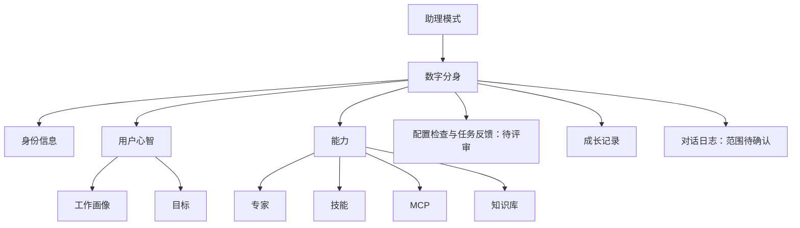
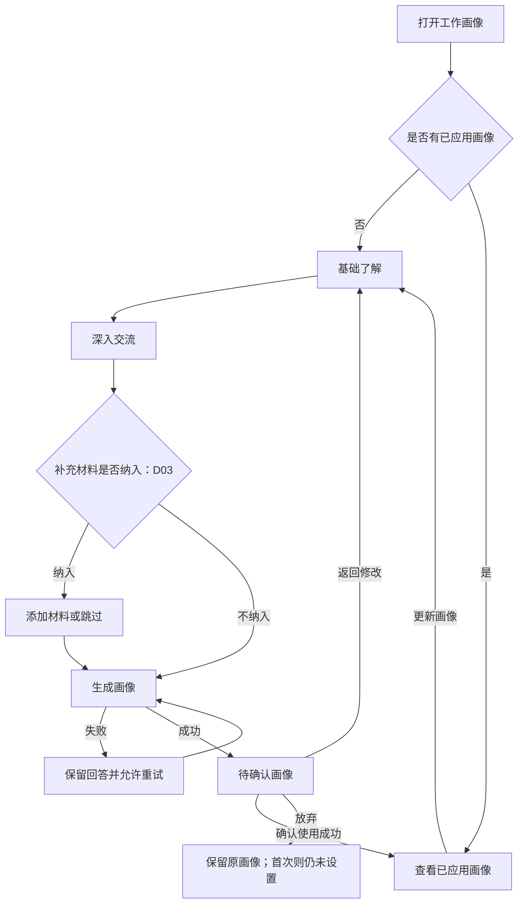
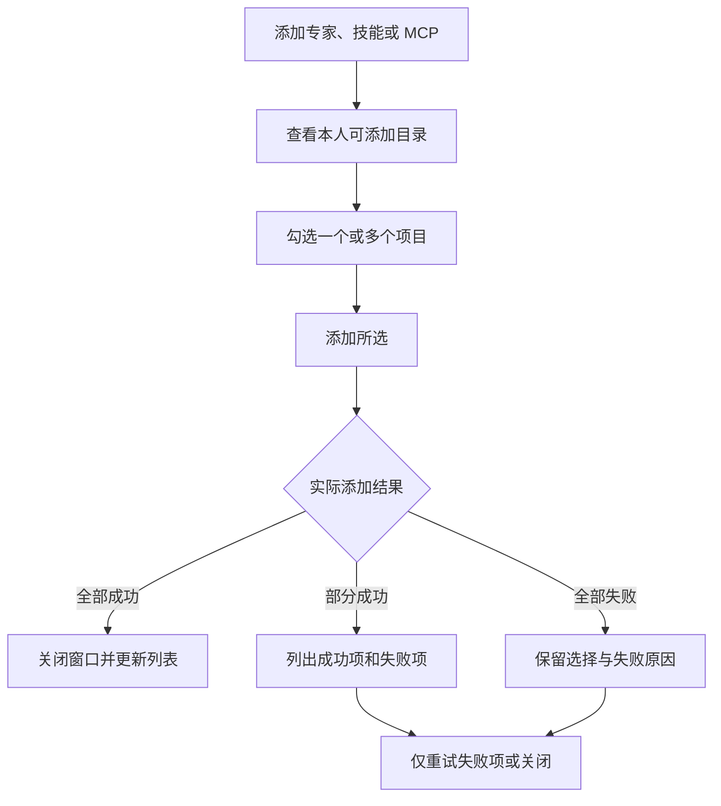
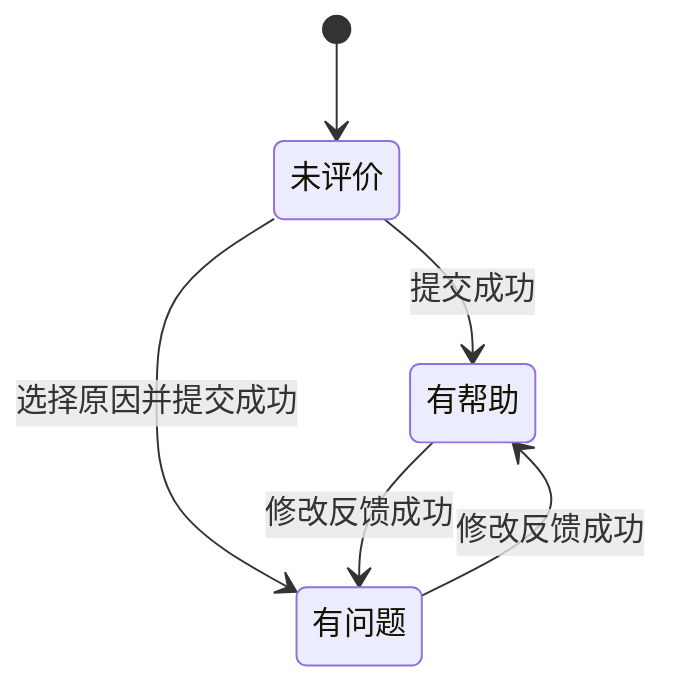

# 个人数字分身配置 PRD｜2026 年 9 月版

| 文档属性 | 内容 |
| --- | --- |
| 版本 | V0.2 |
| 日期 | 2026-09-17 |
| 状态 | 完整产品评审稿；含待决策项，尚非全量开发定稿 |
| 适用范围 | 九月个人数字分身配置；以现有桌面原型为参照，移动端另行确认 |
| 编写原则 | 描述用户目的、页面内容、交互、业务规则及验收，不约定技术实现 |
| 本轮明确决策 | 先编写个人数字分身 PRD；不包含组织后台和岗位智能体；不确定事项留待讨论 |
| 与原型关系 | 本文盘点原型并提出正式产品规则，已补充双账号及新用户空态演示；其他差异见第 13 章 |

## 1. 阅读与评审约定

### 1.1 四种依据标记

- **已确认**：本轮用户明确决定的范围和工作方式。
- **沿用**：当前原型或既有方案已有依据，本稿整理为产品规则；仍需本次版本评审。
- **建议**：为了补齐真实使用流程提出的新规则，不伪装成已确认结论。
- **待决策 Dxx**：缺少业务依据或有多个合理方向。结论明确写“待定”，开发不得自行选择、复制演示数据或以默认值替代。每项注明影响边界。

除“已确认”范围外，本稿均为待评审需求。表格中的规则足以表达本稿方案，但不代表用户已逐条批准。Dxx 的备选建议仅供讨论，不视为承诺。

### 1.2 文案与数据来源分类

| 标记 | 含义 | 使用要求 |
| --- | --- | --- |
| 固定 | 产品确定的标题、标签、引导语、按钮 | 按本文显示，不随用户身份或生成结果任意改写 |
| 业务值 | 姓名、本人输入、资源名称、真实记录等 | 来自对应业务内容；缺失时用明确空态，不使用样例补齐 |
| 计算值 | 数量、比例、日期范围等 | 必须按本文口径计算；数据未获取不显示 0 |
| 状态文案 | 保存中、已应用、已停用等 | 仅由明确事件和条件触发；点击按钮不等于操作成功 |
| 生成内容 | 工作画像归纳等 | 基于本人提供的信息生成；不得新增未经本人提供的身份、职责或事实 |

本稿中带 `{ }` 的内容表示业务值占位，界面不显示大括号。示例、默认值、实际已保存内容必须区分。不能因为示例出现在输入框内就视为用户已填写。

## 2. 产品目标与版本边界

### 2.1 用户目标

用户能明确告诉自己的数字分身“我是谁、怎样工作、当前关注什么”，选择允许分身使用的能力与资料，并查看配置变化及使用反馈。

成功标准：用户能判断哪些内容已经生效、哪些仍是草稿；知道能力是否可用及原因；能停用不再需要的能力与知识；所有身份、统计和记录均有真实依据。

### 2.2 范围清单

| 功能 | 本稿处理 | 依据与边界 |
| --- | --- | --- |
| 个人身份展示 | 纳入，身份来源待 D01 | 沿用身份信息；不新增组织维护页面 |
| 工作画像 | 纳入 | 沿用问答、生成、确认应用、更新流程 |
| 目标 | 纳入 | 沿用个人内容编辑；结构化目标管理待 D04 |
| 专家、技能、MCP | 纳入个人选择及启停方案，目录和授权待 D05 | 不依赖用户添加岗位智能体 |
| 个人知识清单 | 纳入 | 新增、查看、编辑、导入、下载、启停、删除 |
| 企业知识连接 | 待 D08 | 未明确来源前，不预置“企业授权资源” |
| 知识地图 | 待 D09 | 现有图谱为独立演示，不能作为正式关系依据 |
| 分身评测 | 待 D10；本稿提供配置检查替代建议 | 原有岗位准备度及评分不能直接沿用 |
| 成长记录 | 纳入 | 记录真实配置变化；不宣称能力必然提升 |
| 对话日志与反馈 | 方案纳入，记录范围待 D11 | 仅本人记录；移除岗位治理依赖 |
| 岗位智能体及其能力继承 | 明确不包含 | 本轮用户确认；连带移除岗位挂载评分、岗位版本和岗位优化提示 |
| 组织后台、流程定义、系统智能 | 明确不包含 | 本轮用户确认 |
| A2A 任务看板和协作业务 | 本文不展开 | 属于 A2A PRD，不在个人配置重复设置入口 |
| 独立岗位说明、能力地图、工作规则卡片 | 本稿不恢复旧入口 | 当前用户心智实际仅“工作画像、目标”；确认边界放在工作画像内 |

### 2.3 基本产品原则

1. 每位用户维护自己的一个个人数字分身。本页不能替其他人修改配置。
2. 页面中的“岗位”若保留，仅表示本人身份信息，不表示存在“岗位智能体”。
3. 首次使用不得默认套用总经理画像、经营目标、预置知识和历史成长事件。
4. 画像、目标、能力和知识分别管理；停用一种能力不删除其他配置。
5. 配置建议是偏好，不能替代实际业务权限。用户写“无需确认”不能取消 A2A 等业务已规定的确认要求。
6. **建议的生效口径**：保存成功后的新一轮助理处理参考新配置；已经产生的回复和成果不追溯重写。能力被停用、失效或撤销访问后，不再发起新的使用动作；已经完成的内容保留。进行中的外部动作如何中止由对应业务另行规定。
7. 私人配置不会因为分身参与 A2A 就自动公开给其他参与人；可发送哪些内容由 A2A 的确认规则约束。

## 3. 信息架构与页面进入

### 3.1 导航规则

| 元素 | 文案/内容 | 类型与来源 | 交互/状态 |
| --- | --- | --- | --- |
| 助理侧栏入口 | 数字分身 | 固定，沿用 | 点击打开本页；当前入口高亮 |
| 入口副文案 | 身份、画像与能力配置 | 固定，建议修正 | 替换“身份、能力与 A2A 任务”，避免承诺本页包含 A2A 看板 |
| 页面标题 | `{姓名}的数字分身` | 业务值，身份信息 | 姓名未获取时显示“我的数字分身” |
| 用户心智 | 工作画像、目标 | 固定，沿用 | 点击相应卡片打开对应详情或编辑流程 |
| 卡片编号 | 01、02 | 固定，沿用 | 仅代表排列顺序，不是完成度或优先级 |
| 能力卡片 | 专家、技能、MCP、知识库 | 固定，沿用 | 打开能力窗口并定位对应分类 |
| 能力窗口页签 | 同上述四类 | 固定 | 切换分类；存在未保存内容时先执行离开确认 |
| 图标、箭头、选中颜色 | 视觉辅助 | 固定/交互状态 | 无独立业务含义；状态不能仅用颜色表达 |
| 后台管理入口 | 本版本不展示 | 已确认范围的连带调整 | 本文不定义后台功能 |

返回助理再进入本页时重新展示已保存内容；弹窗默认关闭。能力搜索与筛选在当前窗口内保留，关闭后再打开恢复默认。成长日期在当前页面内保留，重新进入默认当天所在周。此处为本稿建议的统一规则。

## 4. 通用交互沿用公司规范

加载、错误提示、保存、关闭、未保存离开确认等基础交互沿用公司产品规范，本文不重复定义通用状态表、基础保存流程图和统一提示文案。各模块仅补充影响业务结果的特殊规则，例如画像确认前不生效、更新取消后保留旧画像、能力是否可用的判断依据。

涉及本模块的空白状态、数据来源与业务限制仍在对应章节明确；公司规范未提供给本文，不推测其具体内容。

## 5. 身份信息

### 5.1 内容和来源

| 元素 | 类型 | 正式规则 |
| --- | --- | --- |
| 姓名 | 业务值 | 来自当前登录用户的身份信息，不能由画像生成或以演示姓名代替 |
| 头像 | 业务值/计算值 | 有真实头像则展示；无头像使用姓名首字；姓名缺失显示通用人物图标 |
| 岗位 | 业务值，D01 | 来源待定；缺失显示“岗位信息未提供”，不影响填写画像 |
| 身份信息按钮 | 固定 | 打开只读窗口，展示“姓名”“岗位”；本页暂不提供修改身份入口 |
| 身份同步状态 | 状态文案，D01 | 仅当身份来源具备可验证的同步结果才展示；否则不显示此标签 |
| 姓名/岗位更新时间 | 不在当前展示范围 | 如新增需另行定义来源，不默认增加 |

**D01 待定**：姓名和岗位分别从何处取得；是否确有“同步”过程；信息错误时用户如何纠正。建议沿用已有账号身份；无同步产品流程则移除“身份已同步”。不能仅凭登录成功推导岗位已经同步。

## 6. 用户心智——工作画像

### 6.1 功能定义

通过基础问题和工作习惯收集信息，形成用户可检查的画像。只有本人“确认使用”后才成为当前画像。更新期间旧画像继续有效。

入口固定标题“工作画像”，副文案“让助理了解你的工作方式”。首次打开进入基础了解，不展示预先“已应用”的画像；已有画像打开结果页。

### 6.2 完整流程

### 6.3 字段、文案和校验

| 项目 | 固定文案/选项 | 内容来源与规则 |
| --- | --- | --- |
| 引导标识 | 让助理更懂我 | 固定，无状态含义 |
| 初建标题 | 建立你的工作画像 | 无已应用画像且处于编辑步骤时 |
| 更新标题 | 更新你的工作画像 | 已有画像且进入更新步骤时 |
| 结果标题 | 我的工作画像 | 生成结果或已应用详情时 |
| 第一步 | 基础了解／回答两个选择题 | 固定；共 2 题，不由生成内容改变数量 |
| 范围题 | 你的工作影响范围更接近哪一类？ | 单选必填；不预选 |
| 范围选项 | 公司级、部门级、项目级、模块级、任务级、支持级 | 沿用原型；不根据岗位自动选择。分类合理性见 D02 |
| 对象题 | 你日常主要关注的对象是什么？ | 必选 1—3 项；首次不预选 |
| 对象选项 | 人员、项目、任务、产品、技术／系统、数据、流程／制度 | 固定，沿用 |
| 对象计数 | 多选，最多选 3 个 · 已选 {n}/3 | 计算值；选满时其他项不可选，已选项仍可取消 |
| 判断习惯问题 | 公司级/部门级：“在{范围}工作中，当目标与资源发生冲突时，你通常怎么判断优先级？”；其他：“围绕{对象}开展工作时，信息不完整你通常会怎么推进？” | 固定模板，沿用；对象按选项排列顺序展示，以“、”连接 |
| 判断习惯回答 | 我的判断习惯 | 本人输入；必填；建议 1—2000 字，去除首尾空白后校验 |
| 沟通问题 | 你希望助理怎样表达和汇报？ | 固定 |
| 沟通偏好 | 结论先行，突出关键数据、异常事项和需要决策的问题／先完整说明背景，再给出判断／简洁直接，只保留关键结论和行动项 | 本人单选；首次显示“请选择”，不默认替用户选择；其他表达需求待 D02 |
| 确认边界问题 | 哪些情况下，助理必须先向你确认？ | 固定；说明改为“用于补充你的确认偏好，不替代业务规定的确认要求。” |
| 确认边界回答 | 需要确认的情况 | 本人输入；建议 1—2000 字，可填写“无额外要求”；不得留空后假定自动授权 |
| 数量限制提示 | 最多输入 2000 字 | 建议固定限制；超限禁止下一步，保留内容并提示 |

范围选项的固定说明沿用：公司级“关注公司战略、经营目标、重大决策”；部门级“关注部门目标、资源配置、团队协同”；项目级“关注项目计划、进度、风险、交付”；模块级“关注某个业务、系统、流程或专业模块”；任务级“关注具体任务执行、问题处理和结果交付”；支持级“为他人或组织提供专业支持、流程支持或服务保障”。

### 6.4 补充材料：D03 待决策

正式上传范围、支持类型、大小/数量上限、用途与保留方式均待定。本稿不把知识库导入规则自动套用到画像材料。

- 如不纳入九月，移除整个材料步骤及材料计数，深入交流后直接生成；步骤编号同步调整。
- 如纳入，必须明确真实文件的添加、移除、处理失败、重试及跳过规则；未完成处理的材料不能宣称已参与生成。
- 原型的“项目复盘摘要、汇报材料样例、个人工作说明”是示例名称，不能默认显示为本人已上传文件。
- 材料用于画像不等于加入个人知识库；是否可复用必须另行明确。
- **定案前该步骤不可按演示上传交付。**

### 6.5 画像结果各项依据

| 固定结果标题 | 内容类型 | 可用依据与缺失处理 |
| --- | --- | --- |
| 我的工作定位 | 生成内容 | 本人选定范围、本人补充描述；不可把“公司级”推断为“公司总经理” |
| 我经常处理的工作 | 生成内容 | 本人关注对象及明确描述；仅选“项目”不能推断具体项目职责 |
| 我关注的重点 | 生成内容 | 本人明确的关注内容；范围选项说明只可归纳为宽泛方向 |
| 我的沟通与表达偏好 | 本人选择/生成归纳 | 必须保留所选偏好的实际含义 |
| 我的判断习惯 | 生成归纳 | 仅归纳本人回答，不扩充未经提供的决策权限 |
| 助理需要向我确认的情况 | 生成归纳 | 保留本人确认要求，不宣称覆盖产品强制规则 |

无足够信息的部分显示“尚未提供相关信息”，不能填充通用总经理模板。不能用固定时间等待结束冒充生成成功。

结果提供“结构化预览”“文档预览”两个固定页签，两者展示同一份内容；切换不修改数据。结果页不展示步骤条。原型暂只允许“返回修改”调整回答；是否允许直接改结果见 D02。

### 6.6 状态和按钮

| 状态 | 标签/说明 | 可用按钮与结果 |
| --- | --- | --- |
| 未设置 | 首次进入问答；不得显示已应用 | “关闭”；满足本步必填后“下一步”可用 |
| 问答中 | “第 {n} 步”；步骤标题按已确定流程排列 | “下一步”“上一步”；回退保留回答；改前题不自动清空后题 |
| 生成中 | “正在整理你的工作方式”；不显示虚假百分比 | 禁止重复生成；离开时提示本次草稿不会应用 |
| 生成失败 | “画像生成失败，你的回答已保留” | “重新生成”“返回修改” |
| 待确认 | “待确认”；“请检查以下内容，确认后应用到你的助理。” | “返回修改”“确认使用”；关闭按未保存处理 |
| 应用中 | “正在应用…” | 不能重复提交；失败回到待确认 |
| 已应用 | “已应用”；“当前使用的工作画像” | “更新画像”“关闭” |
| 更新草稿中 | “新画像确认使用后才会替换当前画像，取消更新不影响原有内容。” | “取消更新”触发放弃确认；确认放弃后保留旧画像 |

应用成功提示：“工作画像已应用。助理会在回答、提醒和建议中参考这些内容。”仅真实保存成功后出现。更新没有造成内容变化时不新增成长事件。

## 7. 用户心智——目标

### 7.1 本稿建议的最小定义

沿用“个人目标说明”文档，不把它扩展成任务管理。用户描述目标、判断口径和验收标准，助理参考已保存内容。是否改为结构化多目标、含周期和完成状态，留 D04。

| 元素 | 类型/来源 | 规则 |
| --- | --- | --- |
| 入口“目标” | 固定 | 副文案“目标、口径与验收标准” |
| 初始内容 | 本人已保存内容 | 未填写显示“尚未设置目标”；按钮“设置目标” |
| 编辑区 | 本人输入 | 支持标题、段落、列表；示例仅作提示：“描述你当前的工作目标、判断口径和验收标准” |
| 长度 | 建议校验 | 1—10000 字；空白不算有效内容；不得靠最少字数证明目标质量 |
| 编辑 | 固定按钮 | 进入草稿；原内容继续有效 |
| 保存 | 状态按钮 | 合法内容才可提交；成功提示“目标已保存”，不得提示“工作画像已保存” |
| 取消编辑 | 固定按钮 | 有修改时询问放弃；无修改直接回到阅读态 |
| 清空目标 | 建议新增按钮 | 已有目标时展示；确认：“清空目标？清空后，助理不再参考这份目标说明。”；成功回空态并记录事件 |
| 目标状态 | 状态文案 | 仅“未设置/已设置/编辑中/保存中/保存失败”；不展示完成率、逾期或已完成 |

尚未提供的目标不默认采用“年度经营目标、重点项目交付、跨部门协同”等演示正文。

## 8. 能力——专家、技能与 MCP

### 8.1 定义与目录依赖

- 专家：针对特定专业方向提供协助的能力。
- 技能：可用于特定工作任务的方法或操作能力。
- MCP：连接业务系统与工具的入口；显示名称是否改为“系统连接”待 D06。

本页只允许从可提供给本人的目录中选择，不在个人页创建或编辑共享能力定义。**D05 必须确认九月目录由谁提供、有哪些资源、哪些用户可用，以及是否需要额外授权。**没有组织后台不意味着这些信息可以虚构，也不要求为此新增后台页面。

### 8.2 字段与计数

| 元素 | 类型/来源 | 展示规则 |
| --- | --- | --- |
| 首页“{n} 项可用” | 计算值 | 仅统计本人已添加、主动启用、资源有效且有权使用的项目；MCP 还需连接正常。不是目录总量 |
| 窗口“{a} 项能力 · {b} 项可用” | 计算值 | a 为已添加总量，含停用/失效；b 为上述可用量；不随筛选改变 |
| 名称与说明 | 业务值，能力目录 | 不由模型即兴命名；说明缺失显示“暂无说明” |
| 专家副文案 | 固定 | 专业方向与协作专家 |
| 技能副文案 | 固定 | 专项工作方法与技能 |
| MCP 副文案 | 固定 | 业务系统与工具连接 |
| “{n} 个工具” | 业务值/计算值 | 当前用户有权使用的工具数量；未知显示“工具数量暂不可用”，不显示 0 |
| 搜索框 | 固定与本人输入 | “搜索{类别}”；按名称和说明匹配，忽略首尾空格及英文大小写 |
| 状态筛选 | 固定 | 建议“全部状态/可用/已停用/不可用”；MCP 的“已停用”显示为“未连接” |
| 行排序 | 业务规则建议 | 按添加时间倒序；状态变化不改变顺序 |

### 8.3 状态规则

状态判断优先级：资源失效 > 无访问权限 > 用户已停用/断开 > MCP 连接异常 > 正常可用。处理中显示当前操作过程，失败恢复原状态并说明失败。

| 条件 | 专家/技能文案 | MCP 文案 | 操作与后果 |
| --- | --- | --- | --- |
| 资源已撤回或失效 | 已失效 | 已失效 | 不可启用/连接，不计可用；保留行以便用户理解变化 |
| 无访问权限 | 无访问权限 | 无访问权限 | 不可启用/连接，不计可用；授权入口待 D05，不能出现无去向的申请按钮 |
| 本人已停用 | 已停用 | 未连接 | “启用”/“连接”；成功后才计入可用 |
| 用户希望使用，但连接失败 | 不适用 | 连接失败 | “重试连接”“断开”；失败不计入可用 |
| 正常可用 | 已启用 | 已连接 | “停用”/“断开”；成功后减少可用数量 |
| 操作中 | 启用中…/停用中… | 连接中…/断开中… | 禁止同一行重复操作，不影响其他行 |

“已连接”必须有真实连接成功依据，不能将“已添加”或勾选开关直接解释为连接成功。用户停用与系统故障不能共用一个含混的“未启用”状态。

失效或撤权恢复后，建议保持停用/未连接，待本人主动恢复，避免无提示重新启用；此规则纳入 D05 评审。

### 8.4 添加流程

- 目录排除已添加项，不允许重复添加同一能力；候选名称和说明来自目录。
- 勾选数量为 0 时“添加所选（0）”不可用。取消不改变已有配置。
- 添加期间可用范围变化，按实际结果显示，不显示“全部成功”。
- 建议专家/技能添加成功后自动启用；MCP 添加成功先为“未连接”，本人点击连接后再使用。该差异需 D05/D06 确认。
- 成功提示：“已添加 {n} 项{类别}”；部分成功：“已添加 {s} 项，{f} 项未添加”，每个失败项显示原因。
- 无已添加资源：“尚未添加{类别}”；有条件无匹配：“没有符合条件的{类别}”；目录无候选：“暂无可添加的{类别}”。不能将目录为空都说成“全部已添加”。
- 当前原型没有能力移除入口。本稿沿用仅启停；是否允许从个人列表移除见 D07，不自行加删除操作。

## 9. 知识库

### 9.1 清单与个人知识

入口“知识库”；首页说明建议“本人知识资源”，副文案“个人资料与可用知识”。窗口副文案：仅个人资料时“管理供分身参考的个人资料”；若 D08 确认企业资源，再改为“本人可访问的知识资源与个人资料”。

| 元素 | 类型/来源 | 规则 |
| --- | --- | --- |
| 知识名称 | 本人输入/导入文件名 | 必填，建议 1—100 字；允许同名，不自动覆盖已有内容 |
| 正文 | 本人输入/导入内容 | 必填，建议手工编辑上限 10000 字；导入规则见下 |
| 访问说明 | 状态/业务值 | 本人资料“仅本人”；只有来源和权限真实成立才显示“企业授权资源” |
| 更新时间 | 业务值 | 创建、导入、名称或正文修改成功的时间；启停不改变正文更新时间 |
| 状态 | 状态文案 | 已启用、已停用；涉及不可读取或权限失效时显示“暂不可用”并说明原因 |
| 搜索 | 本人输入 | “搜索知识名称或内容”；匹配名称和正文，规则同能力搜索 |
| 列表排序 | 建议 | 按更新时间倒序，同时间按名称排序 |
| 查看 | 固定 | 打开正文；有权查看但停用的资料仍可阅读 |
| 下载 | 固定 | 下载当前内容；失败提示“下载失败，请重试”，不改变状态 |
| 编辑/删除 | 固定 | 仅本人资料提供；企业资源仅查看及个人启停，不修改原资源 |
| 启用/停用 | 状态按钮 | 成功后影响后续参考，不删除知识内容和已有成果 |

### 9.2 新增、编辑、导入、删除

1. **新增个人知识**：打开“新增个人知识”，空名称、空正文；满足校验后保存。建议新增成功默认启用，保存提示“个人知识已保存”。
2. **编辑**：打开已有内容；保存成功后更新内容与时间；内容无变化不产生事件。未保存离开遵守第 4 章。
3. **导入资料**：沿用单次单文件 `.md`、`.txt`，建议大小不超过 1 MB；恰好 1 MB 允许。空文件、空白内容、不支持格式、内容无法读取均失败，不新增记录。
4. 导入的名称默认为去掉扩展名后的文件名；超出名称限制时进入确认编辑，不能静默截断。同名文件新建独立资料，导入前提示“存在同名知识，本次将新增一份”。不覆盖原资料。
5. 建议文件读取成功后进入预览确认，按钮“确认导入”；成功才出现“个人资料已导入”。导入正文超过手工编辑上限但满足文件限制时允许查看和下载；是否扩大编辑限制留 D08，定案前不提供会截断正文的编辑操作。
6. 导入后资料可被分身参考的就绪机制见 D08；处理未完成不能显示“已启用”且计为可用。若存在处理阶段，需“处理中/处理失败/已停用或已启用”完整规则，不能直接沿用本地读文件成功。
7. **删除**：标题“删除个人知识”；说明“删除后，分身将不再参考这份资料。已生成的历史内容不会因此删除。”；按钮“取消”“确认删除”。成功提示“个人知识已删除”；列表、计数和详情同步更新。
8. 查看与下载不产生配置变更；新增、导入、实际修改、启停和删除产生一条相应成长事件。

### 9.3 知识地图：D09 待决策

当前“知识清单”与“知识地图”不是同一份知识的两种视图。图中“解决方案经理岗位知识”、关系边、权限和场景均为独立示例，“查看知识详情”也没有形成完整去向。因此不能直接纳入正式需求。

建议九月只保留知识清单；正式结论待定。如保留地图，必须补齐以下来源：

| 图谱元素 | 必须明确的依据 | 未明确前处理 |
| --- | --- | --- |
| 中心节点 | 本人知识集合的名称和范围 | 不显示岗位继承中心 |
| 节点名称/分类 | 对应真实资料及分类依据 | 不生成演示节点 |
| 关系与关系文案 | 谁确认了“遵循/引用/复用”等关系 | 不凭资料并存推断关系 |
| 访问范围 | 本人实际权限 | 不默认“全员可读” |
| 可用场景 | 资源说明或经确认的归纳 | 无依据时不显示 |
| 关联知识数量 | 当前可见真实节点数量 | 未加载不能显示固定数量 |
| 查看知识详情 | 对应真实知识详情 | 无对应详情则不显示按钮 |

分类筛选、图/列表切换、选中节点及详情跟随规则，需在数据关系确定后补充定稿。

## 10. 分身评测：原方案问题与替代草案

### 10.1 原方案不能直接沿用

- “岗位准备度”含岗位智能体挂载、版本和优化建议，与本版范围冲突。
- 按画像字数、目标段落数量、启用 8 项技能或 6 个连接加分，缺少业务效能依据；会诱导无必要配置。
- “配置越多越好”不适用于不同工作需求。未接系统不代表个人分身不合格。
- 原型评分说明与实际计分口径不一致；“目标总字数不少于 600 字”也不能证明目标可衡量。
- 个人知识数量必须来自知识清单，不能以已添加能力数量冒充。
- 无评价不能显示 0% 好评；无证据不能显示“问题根因”或“已生成优化建议”。

### 10.2 D10 建议方案：配置检查与任务反馈

**正式模块名称、是否纳入九月、是否保留打分：待定。**建议本版改名“配置检查与任务反馈”，不显示总分、雷达图、专家目标线和排名。

若采用建议方案，规则如下：

| 检查项 | 依据 | 展示内容与判断 |
| --- | --- | --- |
| 工作画像 | 本人已应用画像 | “已设置”或“未设置”；草稿不算已设置 |
| 目标 | 本人已保存非空目标 | “已设置”或“未设置”；不判断目标优劣 |
| 专家/技能 | 实际可用能力 | “{n} 项可用”；0 显示“尚无可用{类别}”，不标不合格 |
| 系统连接 | 正常可用连接 | “{n} 项可用”；另列连接异常及原因 |
| 个人知识 | 就绪且启用资料 | “{n} 项可用”；不将历史任务数量算知识数量 |
| 待处理问题 | 确实无法使用的配置 | 列资源名、问题说明、处理入口；未配置可选项不算异常 |

“查看配置”跳转到对应配置窗口；“重新检查”仅重新展示真实当前情况，不生成虚假评测分数。

### 10.3 任务反馈统计草案（依赖 D11）

| 指标/元素 | 明确口径 |
| --- | --- |
| 运行记录 | 属于本人的记录总数，统计范围与日志一致，不随局部日志筛选改变 |
| 已评价记录 | 最新反馈为“有帮助”或“有问题”的不同记录数 |
| 有帮助比例 | 有帮助记录数 ÷ 已评价记录数 × 100%，四舍五入为整数；未评价不进分母 |
| 未评价情况 | 已评价记录数为 0 时显示“—”，说明“暂无评价”，不能显示 0% |
| 待改进反馈 | 最新反馈为“有问题”的记录数，不等同于执行失败数 |
| 固定说明 | “统计依据为本人评价，不代表客观能力评分。未评价的记录不计入比例。” |
| 问题分类 | 用户选择的反馈原因；不标“根因”，除非另有核实依据 |

历史检查记录与下载是否纳入仍属 D10。若保留：每次主动检查保存当时内容和统计，历史结果不随后续配置或评价变化；需明确保留期限与下载格式后才交付。旧报告的岗位快照、JSON 下载和 50 条保留上限不自动沿用。

## 11. 成长记录

### 11.1 定义

当前“成长曲线”实际上是配置变更日历和记录列表。**建议改名“成长记录”**，副文案“按时间查看画像、目标、能力与知识的变化”。不画无来源分数曲线，不把每次操作解释为能力提升。

### 11.2 每条记录的内容

| 字段 | 类型/来源 | 规则 |
| --- | --- | --- |
| 事件标题 | 固定模板+业务值 | 由实际成功动作产生，见下表 |
| 类型 | 固定分类 | 工作画像、目标、专家、技能、MCP、知识库；不出现本版未有的岗位继承 |
| 时间 | 业务值 | 操作成功时间，不使用编辑开始时间 |
| 摘要/详情 | 业务值 | 显示修改对象和动作；内容变更建议显示本次变更前后内容；首次显示新内容、删除显示删除前摘要 |
| 来源 | 业务值 | 实际发生入口，如“工作画像”“知识库”；不得固定写“企业制度库” |
| 操作人 | 业务值 | 本人操作显示真实姓名；只有真实系统事件才可显示“系统” |
| 事件数量 | 计算值 | 当前日期周期内实际记录总数，不受单条选择影响 |

| 成功动作 | 标题模板 |
| --- | --- |
| 首次应用/修改画像 | 设置工作画像／更新工作画像 |
| 首次保存/修改/清空目标 | 设置目标／更新目标／清空目标 |
| 添加/启用/停用能力 | 添加{类别}“{名称}”／启用{类别}“{名称}”／停用{类别}“{名称}” |
| MCP 连接/断开 | 连接“{名称}”／断开“{名称}” |
| 新增/导入/编辑知识 | 新增个人知识“{名称}”／导入个人知识“{名称}”／更新个人知识“{名称}” |
| 启停/删除知识 | 启用知识“{名称}”／停用知识“{名称}”／删除个人知识“{名称}” |

一次成功操作对一个对象产生一条事件；批量添加按对象分别产生；默认随添加而启用不再重复记“启用”事件。查看、搜索、下载、失败、取消和重复保存相同内容不记成长事件。反馈是否形成事件待 D10/D11，默认不加入本配置变更列表。

### 11.3 日期和交互

- 默认本周，周一至周日；“日/周/月”固定页签，仅改变时间范围。
- 日期选择器决定锚点日期；左右箭头分别移动一个日、自然周或自然月。跨月移动保留日号，目标月份无该日则取月末。
- 周标题显示完整周范围，如“2026-09-14—2026-09-20”；月标题“2026-09”；日标题“2026-09-17”。不以单日标题代表整周。
- 周/月点击日期进入该日；月日历覆盖完整月份，按需展示 4—6 行，不固定 35 格造成月底缺失。
- 日视图按时间顺序排列；周视图按周一至周日，每天按时间顺序；下方记录列表统一最新在前。
- 月格最多显示 3 个事件标记；超过显示“+{剩余数量}”；点击查看该日全部记录。相邻月日期可点击进入实际日期。
- 点击事件打开详情，关闭后保留原周期及选中事件。类型颜色仅辅助识别，必须同时有类型名称。
- 全无记录：“暂无成长记录，保存配置后会在这里记录变化”；指定周期无记录：“所选周期暂无成长事件”。
- 不沿用原型把所有类型前统一加“新增”的写法，更新和停用必须显示真实动作。
- 历史记录保留期限、删除知识后详情保留多少正文待 D13；确定前不能承诺永久保留或彻底删除所有历史。

## 12. 对话日志与反馈

### 12.1 记录范围：D11 待决策

当前原型的日志来自岗位运行示例，不能直接代表助理全部真实对话。必须确认：一条记录是一轮问答、一次工作任务，还是整个会话；是否包含普通任务、我的助理、A2A 私人对话及正式协作。未确定前，不用“完整对话”承诺全部内容。

建议九月仅收录本人助理中的一次工作请求及其处理结果；本稿暂以“一次工作请求”为以下规则的评审假设，不作为已确认事实。A2A 记录在其业务页面查看。

### 12.2 清单与详情

| 元素 | 类型/来源 | 本稿方案 |
| --- | --- | --- |
| 模块名 | 固定 | 对话日志；最终名称随 D11 记录单位确认 |
| 副文案 | 固定建议 | “查看分身处理记录并反馈结果”；删除总经理专用场景描述 |
| 总数/评价/比例 | 计算值 | 按第 10.3 节；无评价显示“暂无评价” |
| 任务标题 | 业务值 | 实际请求的标题；没有标题用“未命名工作请求”，不得编造完成结果 |
| 来源与记录编号 | 业务值 | 来源标明实际业务；编号用于定位记录，不以编号推断业务类型 |
| 参与岗位 | 移除 | 九月无岗位智能体 |
| 时间 | 业务值 | 请求发起时间；详情可分别展示结束时间 |
| 执行状态 | 状态文案 | 与记录本身同步：处理中、已完成、未完成；具体状态映射须随 D11 定案 |
| 反馈状态 | 状态文案 | 未评价、有帮助、有问题；与执行状态独立展示 |
| 查看详情 | 固定 | 展示当前记录范围内的用户请求、分身回复、实际成果与反馈 |
| 实际使用能力 | 业务值 | 仅在能确认实际使用时显示名称；不能列全部已启用能力冒充实际使用 |
| 工作成果 | 业务值 | 真实生成物才提供“查看工作成果”“下载成果”；无成果显示“本次未生成文件成果” |
| 导出 | 固定，D12 | 导出当前筛选结果；格式、内容范围及数量限制待定；定案前不提供无定义导出 |
| 准备工作任务 | 移除 | 依赖岗位方法的演示功能，不属于本配置页 |

搜索“搜索任务或记录编号”，按标题和编号匹配；不暗中以未说明的其他人的对话内容匹配。评价筛选“全部评价/有帮助/有问题/未评价”。时间范围含起止日期全天，开始不得晚于结束；无效时提示“开始日期不能晚于结束日期”，不执行查询。清空筛选恢复全部本人记录。默认按发起时间倒序；数量较多时建议每页 20 条，显示当前页及总数，翻页保留条件。

### 12.3 反馈规则（建议）

- 仅已结束且存在可评价内容的记录可反馈；处理中不提供反馈按钮。
- “有帮助”点击提交；成功高亮并提示“已记录反馈”。
- “有问题”先选择原因再提交；原因不预选。建议枚举“理解有误/内容不准确/信息不完整/表达不合适/未完成要求/其他”，需 D11 评审。
- 选择原因不等于提交；失败保留旧反馈和新选择。
- 同一记录只计一条当前评价，修改成功后替换旧评价；重复提交相同评价不增加样本。
- “有问题”改为“有帮助”后，当前统计不再保留旧问题分类；历史检查快照若保留则不重写。
- 固定说明：“可以修改本次反馈。”不保留“重复问题会纳入岗位优化处理”、建议处理状态或“根因已修复”等无流程依据的承诺。
- 是否允许撤回为“未评价”、评价备注以及反馈删除待 D11；当前草案不提供撤回入口。

## 13. 当前原型差异与文案处置台账

下表覆盖当前个人配置可见模块及其关联内容。普通状态和字段的完整正式规则以第 3—12 章为准。除本轮明确要求的双账号与新用户演示外，其他差异待评审后修改原型。

| 编号 | 原型元素或内容 | 问题/来源 | 本稿处置 |
| --- | --- | --- | --- |
| P01 | `{姓名}的数字分身`、姓名首字图标 | 来自身份 | 保留，补缺失规则，见第 5 章 |
| P02 | 公司总经理 | 固定演示岗位 | 改真实岗位；D01 |
| P03 | 身份已同步 | 恒定成功标签 | 无同步依据则移除；D01 |
| P04 | 用户心智的 01/02、工作画像、目标及副文案 | 产品静态文案 | 保留；编号不表示完成度 |
| P05 | 岗位智能体全部卡片、添加、启停、详情 | 超出本版 | 整模块移除，不保留空壳 |
| P06 | 首次默认已有总经理画像、目标和已应用状态 | 演示内容 | 改空态；不能作为用户实际输入 |
| P07 | 六级范围、七类对象、最多三项 | 原型固定选项 | 本稿沿用；范围分类与自定义补充待 D02 |
| P08 | 演示问答，可修改回答 | 演示说明 | 正式版删除“演示”；保留实际问答规则 |
| P09 | “选择更符合你习惯的表达方式”及三项偏好 | 固定引导 | 保留；首次不预选 |
| P10 | “这个回答会帮助助理理解你的判断顺序” | 固定解释 | 保留，不能宣称理解已成功 |
| P11 | “这个回答会成为助理执行任务时的工作边界” | 易被理解为覆盖强制规则 | 改第 6.3 节确认偏好说明 |
| P12 | 三份演示材料、默认勾选两份、不上传说明 | Mock 输入 | D03；不作为本人实际材料 |
| P13 | 2 道基础题、3 项工作习惯、{n} 份材料 | 固定数量+计算值 | 前两项来自确定问卷结构；材料步骤去除则去掉材料统计 |
| P14 | 生成中、待确认、已应用、更新画像及结果双视图 | 业务状态 | 按第 6.6 节；失败和放弃不能显示已应用 |
| P15 | 目标保存提示“已保存个人工作画像” | 文案对象错误 | 改“目标已保存” |
| P16 | 专家/技能/MCP 的数量、资源名称、说明、工具数 | 目录及本人状态 | 按第 8 章，不计岗位继承 |
| P17 | 已失效、暂不可用、已连接、已启用、已停用 | 状态含混 | 区分无权限、主动停用、连接失败；不得仅凭开关显示已连接 |
| P18 | 添加所选（n）、所有可用资源均已添加 | 选择数/空态 | 补部分失败及目录确实为空的情况 |
| P19 | 知识清单中的四份总经理资料 | 演示资料 | 新用户不预置；已有真实资料按权限展示 |
| P20 | 新增时标题“编辑个人知识” | 操作与名称不符 | 改为“新增个人知识” |
| P21 | 企业授权资源、仅本人、更新时间 | 业务身份/权限/时间 | 真实来源；D08；不是可任意固定的标签 |
| P22 | 导入资料、1 MB 限制、下载 | 已有交互 | 按第 9 章，补预览、失败、同名和就绪规则 |
| P23 | 知识地图、岗位知识图谱、KNOWLEDGE MAP、关系图谱/文本清单 | 独立示例 | D09；如取消地图则整组移除 |
| P24 | 制度/案例/模板/个人经验/业务数据分类；节点和关系文案；共 n 项 | 静态示例与推导数 | D09；节点必须关联实际知识 |
| P25 | 访问范围、可用场景、查看知识详情 | 真实权限/用途/去向缺失 | D09，不保留空按钮 |
| P26 | 分身评测、岗位准备度、六类准备项、READINESS、24 项、100 分、雷达图 | 岗位及无效评分依赖 | D10；不直接重用原评分 |
| P27 | 当前配置/完整配置、已达标/待补齐、查看待补齐项 | 来源依赖评测标准 | D10 确定前不显示分数和达标承诺 |
| P28 | 任务表现、FEEDBACK、运行数、评价数、比例、已启用能力数 | 混合统计 | 第 10.3 节；运行数依赖 D11，能力计数不作为表现评分 |
| P29 | 评测记录、重新评测、报告、检查依据、下载报告、快照 | 未形成有效标准与导出规格 | D10，历史不可读当前数据冒充当时依据 |
| P30 | 失败模式排行、问题根因、问题归属、建议状态、修复后下线 | 后台治理演示 | 移除；如展示分类，仅用用户实际反馈原因 |
| P31 | 成长曲线、岗位逐步补齐 | 不对应真实曲线且含岗位 | 建议“成长记录”及第 11 章说明 |
| P32 | 8 条固定成长事件、系统管理员/系统同步来源 | 演示历史 | 正式删除；仅真实事件生成 |
| P33 | 日/周/月、左右切换、日期、彩色点、+n、条数 | 交互/计算 | 第 11.3 节；补完整月份与正确排序 |
| P34 | 所有记录统一“新增{类型}” | 动作失真 | 使用真实动作标题 |
| P35 | 对话日志、项目推进/经营分析/决策支持 | 总经理专用描述 | 改通用描述；D11 |
| P36 | 参与岗位、岗位版本、准备工作任务、生成执行预案 | 岗位依赖 | 移除 |
| P37 | 好评率 0%、完整对话、全部问题归因 | 无评价误导/范围不清 | 无评价“—”；对话范围及用户反馈分类按 D11 |
| P38 | 导出、下载成果 | 数据出口范围不清 | 仅真实成果；导出格式和范围 D12 |
| P39 | 反馈进入岗位优化、反馈处理状态 | 本版本无处理流程 | 移除承诺，保留提交成功状态 |
| P40 | 侧栏“身份、能力与 A2A 任务”、后台管理 | 与版本范围冲突 | 修正副文案、去后台入口；A2A 独立入口由其 PRD 定义 |

## 14. 待决策清单

“建议”栏不是已批准答案；“结论”需讨论后填写。涉及未定事项的界面在开发前必须定案，或明确本版不包含，不能让开发自行补足。

| 编号 | 需要决策的问题 | 本稿建议 | 结论 | 影响 |
| --- | --- | --- | --- | --- |
| D01 | 姓名/岗位来源、同步含义、纠错入口 | 用已有账号信息，无真实同步则去标签 | 待定 | 身份展示 |
| D02 | 问卷是否固定；“支持级”与层级混用；是否允许自定义偏好及直接编辑生成结果 | 九月固定问题；允许补充本人描述；分类需校正 | 待定 | 画像输入及结果准确性 |
| D03 | 九月是否支持画像材料；格式、大小、数量、保留和知识复用 | 先做纯问答，材料后续 | 待定 | 材料步骤及生成依据 |
| D04 | 目标是说明文档还是带周期状态的多目标管理 | 先用说明文档 | 待定 | 目标字段及状态 |
| D05 | 无后台时能力目录由谁提供、内容清单与权限；添加是否即启用；撤权恢复规则 | 使用现有可供本人使用的目录，不新增审批页面 | 待定 | 能力模块能否上线 |
| D06 | MCP 用户名称、连接/授权需要用户做什么、如何知道连通 | 如面向普通用户可用“系统连接”；状态必须真实 | 待定 | 连接全流程，未定不能交付连接按钮 |
| D07 | 是否允许移除个人能力，或仅停用 | 先沿用启停 | 待定 | 能力列表操作 |
| D08 | 企业知识来源；导入后就绪；大文件编辑限制；启用是否自动 | 九月优先个人资料；需确认何时可供分身参考 | 待定 | 知识可用性与导入完成定义 |
| D09 | 知识地图是否纳入及关系来源 | 九月暂不含 | 待定 | 整个图谱页面 |
| D10 | 是否保留评测；标准、检查项、历史、报告格式 | 配置检查+本人反馈，先不评分、不排名 | 待定 | 整个评测模块 |
| D11 | 日志记录单位、范围、执行状态、反馈分类及能否撤回 | 先限本人助理工作请求，移除岗位预案和治理 | 待定 | 日志及所有任务反馈指标 |
| D12 | 日志导出格式、内容范围、最大数量 | 明确后再开放，不沿用演示格式 | 待定 | 导出按钮 |
| D13 | 日志/成长/画像材料保留期限，删除后的历史内容处理 | 明确用户能看到什么、保留多久，再确定下载与删除说明 | 待定 | 历史查看、删除承诺 |
| D14 | 未保存草稿是否跨刷新恢复 | 首版页面内保护，跨刷新恢复后续 | 待定 | 草稿退出行为 |

优先顺序：D05/D06（能力来源与连接）、D02/D03（画像流程）、D10（评测去留）、D08/D09（知识范围）、D11（日志范围）。其他项可随对应模块评审，不必阻塞整篇文档讨论。

## 15. 产品验收清单

本清单对应本稿方案。标记 Dxx 的用例待该项结论明确后补最终期望，不得以“演示正常”替代验收。

| 编号 | 场景 | 预期 |
| --- | --- | --- |
| AC01 | 新用户首次进入 | 不出现虚构岗位、默认已应用画像、总经理目标、预置知识、成长事件或评价 |
| AC02 | 查看页面及相关弹窗 | 不存在岗位智能体、岗位挂载、岗位优化及后台入口；身份岗位字段不受此禁用影响 |
| AC03 | 身份缺失或加载失败 | 显示准确空态/错误，不显示同步成功；来源按 D01 |
| AC04 | 基础问题未填、对象选满 3 个 | 未满足条件不能下一步；选满后仍能取消选中项 |
| AC05 | 首次生成画像 | 只使用本人输入和已确定材料，不臆造职位、项目职责或权限 |
| AC06 | 更新画像后取消 | 旧画像继续生效，无新成长事件 |
| AC07 | 生成成功未确认或确认失败 | 仍是待确认草稿，不显示已应用 |
| AC08 | 两种画像预览 | 内容一致；切换不修改画像 |
| AC09 | 修改目标并保存 | 成功显示“目标已保存”；失败保留草稿与原内容 |
| AC10 | 无变化保存/放弃修改 | 不新增成长事件，不改变原保存时间 |
| AC11 | 能力启停 | 状态和首页计数一致，失效/无权限项目不计可用 |
| AC12 | MCP 仅添加或连接失败 | 不显示已连接、不计可用；连接流程按 D06 |
| AC13 | 批量添加部分失败 | 准确列成功与失败，重试不重复添加成功项 |
| AC14 | 搜索及空清单 | 区分无数据、无匹配、加载失败，不统一显示零结果 |
| AC15 | 知识空名称、空正文、格式错误、超过文件大小 | 阻止保存/导入，提示具体原因，无新增记录 |
| AC16 | 知识同名导入 | 不覆盖旧资料；就绪状态依 D08 |
| AC17 | 停用/删除知识 | 新使用不再参考；历史成果不被悄然删除；删除失败保留资料 |
| AC18 | 无知识地图来源 | 不出现演示关系和权限；范围按 D09 |
| AC19 | 无评测标准 | 不显示虚构分数、雷达图及达标结论；按 D10 |
| AC20 | 无评价/修改评价 | 无评价为“—”；一条记录只计当前一条评价，分子分母同步 |
| AC21 | 查看历史报告 | 若 D10 纳入历史，显示当时结果，不混入实时问题分类或评价 |
| AC22 | 月份跨 6 行、月底切月、日周切换 | 日期完整，标题与筛选范围一致，不丢月底事件 |
| AC23 | 删除、停用、更新成长记录 | 显示真实动作，不统一“新增”；数量与详情一致 |
| AC24 | 日志选择无效时间范围 | 不执行无效筛选，提示开始不得晚于结束 |
| AC25 | 日志反馈失败 | 保留原评价；不声称已进入后台优化 |
| AC26 | 保存中重复点击或多位置修改 | 无重复新增/重复事件；冲突不静默覆盖 |
| AC27 | 普通关闭/切换入口/返回 | 未保存修改均有一致保护；跨刷新行为按 D14 |
| AC28 | 所有可见按钮、状态、数字和正文 | 可追溯到本文固定文案、本人输入、业务来源或计算规则；未知项对应明确 Dxx，无无去向按钮 |

## 16. 后续定稿与原型同步规则

每轮讨论按以下顺序更新：记录决策日期和结论 → 修改对应章节与文案/状态表 → 修改关联验收 → 经授权后调整原型 → 核对所有相关入口、空态和历史文案。

未讨论完成的模块保留 Dxx；本版明确不做的模块从正式页面移除，不显示假数据占位。新增可见内容必须同时写清其来源、空值、状态条件和点击去向。

### 参考依据

- `../PROJECT_CONTEXT.md`：版本范围与历史约定；本轮用户要求优先。
- `../src/digital-twin/DigitalTwinTrainingWorkspace.tsx`：主页、画像、目标、评测、成长记录现状。
- `../src/role-center/PersonalRoles.tsx`：岗位模块及个人专家、技能、MCP 配置现状。
- `../src/role-center/PersonalKnowledge.tsx`：知识清单现状。
- `../src/digital-twin/KnowledgeMap.tsx`：独立知识图谱示例。
- `../src/role-center/Governance.tsx`：个人日志、反馈及岗位治理依赖。
- `../src/assistant/AssistantModeSidebar.tsx`：数字分身入口与副文案。
- `岗位智能体前后台方案/PRD-个人数字分身与岗位智能体适配.md`：历史方案；岗位相关规则不适用于本版。

以上路径仅供文档维护定位，不属于对研发的技术方案要求。

### V0.2：新用户演示与文档精简（2026-09-17）

- 用户反馈：通用交互沿用公司规则，删除通用状态大表和基础保存/离开流程图；PRD 聚焦业务特有内容。
- 助理模式左下角增加“演示账号”：陈智超（已有分身）、林晓（新用户）。切换后进入对应数字分身页面。
- 该入口用于个人配置演示，不是正式登录/账号管理功能；不表示所有助理会话、A2A 和自动化示例均已实现账号隔离。
- 林晓初始无已应用画像、无目标、无已添加能力、无个人知识、无成长和日志记录；展示建立工作画像引导。不带岗位智能体、预置知识地图及演示评测分数。
- 两人画像、目标、个人能力、知识和成长记录分开保存；再次切换、刷新后保留各自已保存内容。新账号不是每次切换自动清空。
- 陈智超继续保留当前已有分身演示，历史岗位和评测方案的整体调整另行评审。
