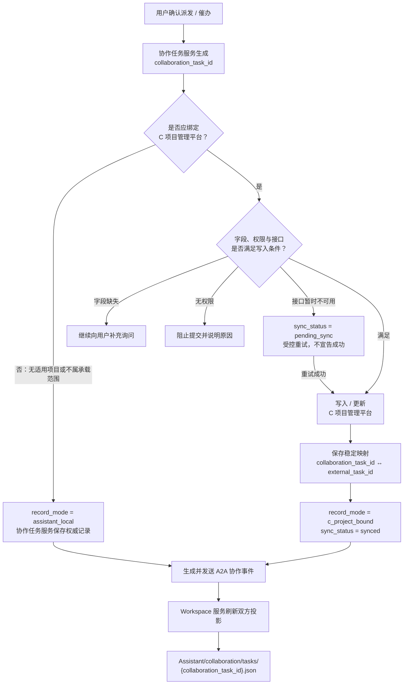

# PRD：助理模式 A2A 任务派发、催办与查询

> 文档版本：V1.3
> 文档状态：产品开发基线
> 更新日期：2026-07-27
> 适用范围：COMAC AI“助理”模式
> 上位信息架构：《PRD-双模式会话与统一Workspace》
> 用户决策子规范：《PRD-A2A用户决策与确认机制》
> 关联材料：《ComacAI 多数字分身框架设计》《飞机型号项目风险逐级上报产品方案》

## 1. 文档目的与口径

本文定义个人数字分身之间以任务为核心的 A2A 协作能力，覆盖查询、派发、催办、进展回复、状态同步、任务文件投影、自动催办和异常处理。

本文描述正式产品规则。当前前端 Demo 使用固定 Mock 数据、关键词剧本和浏览器内状态，仅用于演示，不代表正式产品：

- 使用字符串匹配理解用户意图；
- 把协作任务只保存在前端或文件中；
- 直接由客户端判断权限和最终状态；
- 通过静态 JSON 文件替代权威任务服务；
- 已经连接真实组织系统、业务平台、A2A Server 或模型服务。

## 2. 背景

COMAC AI 有两个模式：

- 普通任务模式：用户可以不断创建独立 Session；
- 助理模式：用户与自己的个人数字分身保持唯一、固定的逻辑长 Session。

A2A 发生在助理模式中。用户只与自己的数字分身对话；自己的数字分身在用户权限和确认范围内，与其他用户的数字分身交换任务事件和进展。

一期只覆盖高确定性、可审计的四类能力：

1. 查询协作任务；
2. 派发任务；
3. 催办任务；
4. 回复任务进展。

一期不是开放式 Agent 群聊，也不在 COMAC AI 内新建一套项目、成员和任务主数据。

## 3. 产品判断

### 3.1 交互原则

1. 自然语言是主要入口；
2. 查询结果在对话中以简洁结构化列表呈现；
3. 不设置独立“待我处理 / 我发起的”常驻右侧面板；
4. 点击任务结果后，在统一 Workspace 打开对应任务文件；
5. 正式外部动作使用对话内结构化行动卡，只有点击当前有效卡片的受控确认按钮才获得正式授权；
6. Workspace 用于查看文件和任务投影，不承担第二套任务管理系统；
7. 行动卡存在时用户仍可继续聊天，自然语言可以修改草稿但不能替代确认按钮；
8. 紧急待办可通过对话内摘要、通知或首页提醒触达，但不以常驻任务面板为前提。

行动卡的插入时机、模型输出门控、动态 Schema、版本替代、明确授权和 Workspace 联动，以《PRD-A2A用户决策与确认机制》为准；如本文旧描述与其冲突，以该子规范为准。

### 3.2 数据原则

1. 权威业务平台或协作任务服务是任务事实源；
2. A2A 协议负责跨数字分身传递请求、确认、进展和结果；
3. `Assistant/collaboration/` 是可读投影，不是唯一任务存储；
4. 业务状态更新与消息送达是两个不同结果；
5. 同一业务任务在不同用户侧不得复制成彼此独立的任务对象；
6. 所有任务版本变化必须可追踪、可重放和可审计。

### 3.3 C 项目管理平台与 collaboration 对应关系

任务派发和催办都必须在助理协作域中形成唯一的 `collaboration_task_id`，并生成 `Assistant/collaboration/tasks/{collaboration_task_id}.json` 文件投影。

根据任务是否适合且能够写入“C 项目管理平台”，协作任务分为两种记录模式：

| 记录模式 | C 项目管理平台 | 协作任务服务 | Workspace `collaboration/` |
| --- | --- | --- | --- |
| `c_project_bound` | 保存业务权威任务、进展和状态 | 保存 A2A 参与人、事件、版本以及与 C 平台对象的映射 | 展示同时包含 C 平台引用和 A2A 状态的文件投影 |
| `assistant_local` | 不创建对应对象 | 保存该协作任务的权威对象、进展和事件 | 展示仅由助理协作域管理的文件投影 |

这里所说的“写入 collaboration 文件夹”，正式实现上不是模型直接修改本地 JSON 文件，而是：

1. 模型生成结构化协作草稿；
2. 用户确认；
3. 协作任务服务完成权威写入；
4. Workspace 服务据此生成或刷新 `collaboration/` 文件投影。

这样可以避免文件被并发修改、删除或篡改后反向污染正式任务。

#### 3.3.1 写入模式判定

模型可以根据用户语言和上下文提出 `candidate_record_mode`，但不能独自决定最终是否可写。服务端必须综合判断：

- 是否关联有效的 C 项目或业务对象；
- 当前任务类型是否属于 C 项目管理平台承载范围；
- C 平台必填字段是否完整；
- 当前用户是否具备创建、催办或更新权限；
- C 平台接口是否真实可用。

| 判定结果 | 产品处理 |
| --- | --- |
| 不属于 C 平台承载范围，或没有可绑定的 C 项目对象 | 使用 `assistant_local`，确认后仅写协作任务服务并生成文件投影 |
| 属于 C 平台范围且字段、权限、接口均满足 | 使用 `c_project_bound`，写入 C 平台并保存稳定映射 |
| 应写 C 平台但缺少必填字段 | 继续向用户补充询问，不得静默降级为本地任务 |
| 应写 C 平台但用户无权限 | 阻止提交并解释权限来源，不得用 `assistant_local` 绕过业务治理 |
| C 平台暂时不可用 | 保留 `pending_sync` 状态并受控重试，不得伪装成已经成功的本地任务 |

催办必须沿用原任务的记录模式和映射：

- `c_project_bound` 任务的催办，引用原 `external_task_id`，不得在 C 平台创建第二条相似任务；
- `assistant_local` 任务的催办，只追加到原协作任务事件流；
- 无法定位原任务或映射冲突时，要求用户选择或等待修复，不按标题新建任务。



#### 3.3.2 映射字段

每个任务文件投影至少包含：

```text
collaboration_task_id
record_mode: c_project_bound | assistant_local
authority_system: c_project | collaboration_service
external_system: c_project | null
external_project_id: string | null
external_task_id: string | null
external_task_version: string | null
sync_status: not_applicable | pending_sync | synced | retrying | failed | conflict
sync_reason
last_synced_at
```

对应关系必须依赖 ID 和版本，不得依赖任务标题、人员姓名或自然语言描述。

## 4. 术语

| 术语 | 定义 |
| --- | --- |
| 发起用户 | 通过自己的个人助理派发或催办任务的用户。 |
| 接收用户 | 被指派处理任务或被催办的用户。 |
| 发起方数字分身 | 代表发起用户解析意图、查询权限、生成确认和发送 A2A 事件的 Agent。 |
| 接收方数字分身 | 接收任务事件、在接收用户侧解释任务并回传进展的 Agent。 |
| 协作任务 | A2A 中传递的任务引用和协作状态，不一定等同于 COMAC AI 普通任务 Session。 |
| 权威任务 | 由业务任务系统或正式协作任务服务管理的唯一任务对象。 |
| 任务文件投影 | `Assistant/collaboration/tasks/{task-id}.json` 中供查看和 Agent 检索的只读视图。 |
| 操作确认 | 用户对将要执行的外部正式动作进行最终确认。 |
| 送达 | A2A 事件已被接收方服务确认接收；不等于接收用户已阅读。 |
| 已读 | 接收用户或其客户端已确认查看；不等于开始处理。 |

## 5. 用户角色与权限主体

| 主体 | 责任 |
| --- | --- |
| 用户 | 提出自然语言意图，对正式动作确认，处理或查看任务。 |
| 个人数字分身 | 在用户权限内解析、查询、生成草稿、调用服务和反馈结果。 |
| 组织身份服务 | 提供唯一用户、部门、岗位、在职状态和组织关系。 |
| 业务任务系统 | 在有权威来源的场景下保存正式业务任务。 |
| 协作任务服务 | 统一保存 A2A 协作对象、状态、版本和参与人。 |
| A2A Server | 负责能力发现、身份校验、消息路由、幂等和送达确认。 |
| 自动化服务 | 根据用户确认的规则执行定时检查和受控催办。 |
| Workspace 服务 | 生成并展示任务文件投影，不决定任务最终状态。 |

数字分身不是独立权限主体，不得突破所属用户权限。

## 6. 信息架构

### 6.1 助理主界面

助理模式包含：

1. 左侧全局导航和历史普通任务；
2. 中间个人助理长 Session；
3. 右侧统一 Workspace；
4. 对话内任务查询列表、结果消息和结构化行动卡。行动卡属于消息时间线，不覆盖输入器，也不固定到 Workspace 底部。

不包含：

- 独立协作事项侧栏；
- 常驻“待我处理 / 我发起的”双页签；
- COMAC AI 自建项目成员管理；
- 通过多个助理短 Session 分类 A2A 任务。

### 6.2 Workspace 路径

```text
Assistant/
└── collaboration/
    ├── index.md
    └── tasks/
        └── {collaboration-task-id}.json
```

用户点击对话中的任务结果时，打开对应任务文件。任务文件可以采用结构化可读预览，不要求直接展示原始 JSON 文本。

## 7. 用户故事

1. 作为用户，我希望直接问“我还有哪些待办”，而不是进入任务管理面板。
2. 作为用户，我希望任务查询结果足够简洁，并能点击查看完整来源和进展。
3. 作为用户，我希望通过一句话派发任务，但在真正发送前核对执行人、截止时间和要求。
4. 作为用户，我希望催办已有任务，不重新创建任务。
5. 作为用户，我希望直接告诉助理进展，由助理在确认后写回权威系统。
6. 作为用户，我希望任务文件能在 Workspace 中被查看，但不会因为删除本地文件而误删正式任务。
7. 作为用户，我希望知道业务写入是否成功、对方数字分身是否收到，而不是只看到一个模糊的“完成”。
8. 作为管理者，我希望所有跨数字分身正式动作有完整审计记录。

## 8. 意图与槽位

### 8.1 查询任务

示例：

- “我有哪些待办？”
- “今天到期的任务有哪些？”
- “我交给张三的事情怎么样了？”
- “把还没回复的任务列出来。”

解析字段：

- 方向：待我处理 / 我发起 / 全部；
- 时间范围；
- 状态；
- 人员；
- 关键词；
- 业务来源；
- 排序方式。

查询不属于外部写操作，不需要操作确认，但必须经过权限校验。

### 8.2 派发任务

最小必填字段：

- 执行人唯一身份；
- 任务标题；
- 任务要求或交付标准；
- 截止时间，或明确“无固定截止时间”；
- 关联的 C 项目业务对象，或明确的助理本地协作类型；
- 发起人身份。

可选字段：

- 优先级；
- 关联业务对象；
- 附件；
- 允许转派；
- 可见范围；
- 提醒策略。

### 8.3 催办任务

最小必填字段：

- 已存在的 `task_id`；
- 催办对象；
- 催办内容；
- 本次催办发起人。

催办必须引用原任务，不得以相似标题创建新任务。

### 8.4 回复进展

最小必填字段：

- 已存在的 `task_id`；
- 进展内容；
- 提交用户；
- 目标状态或保持原状态；
- 需要回传的附件或输出物引用。

## 9. 对话查询流程

### 9.1 基本流程

1. 用户在助理长 Session 提问；
2. 助理解析查询条件；
3. 使用用户权限查询协作任务服务；
4. 将结果按紧急程度、截止时间和更新时间排序；
5. 在对话中返回简洁列表；
6. 每项至少展示标题、方向、对方、截止时间和状态；
7. 点击某项后打开 Workspace 中对应任务文件；
8. 不自动打开独立任务管理页面。

### 9.2 默认查询规则

“我有哪些待办”默认等于：

- 方向：待我处理；
- 状态：未完成；
- 排序：逾期优先，其次截止时间升序，再按更新时间倒序；
- 数量：首屏最多 10 项；
- 超过 10 项时说明总量并提供继续查看或收窄条件。

“所有任务”必须同时说明待我处理和我发起，避免用户误解范围。

### 9.3 查询结果为空

- 明确说明查询条件；
- 不使用“你没有任何任务”这种扩大结论；
- 提供调整时间、状态或来源的建议；
- 如果某些来源不可用，应说明数据未完全加载。

## 10. 派发流程

### 10.1 解析与补充

1. 用户输入自然语言派发指令；
2. 助理识别人员、任务、交付要求、截止时间和来源；
3. 同名人员必须结合组织、部门、岗位等信息消歧；
4. 关键字段缺失时逐项追问；
5. 如果用户引用已有业务任务，先加载最新版本；
6. 不允许模型自行虚构项目、权限或业务任务 ID。

### 10.2 派发行动卡

生成行动卡前，助理必须根据当前项目、任务类型和用户权限获取 C 项目管理平台的 `SchemaSnapshot`。字段是否必填、可编辑、可见以及枚举范围以服务端 Schema 为准，不能由模型或前端硬编码。

负责人选择必须作为 Schema 表单中的普通字段，与名称、时间和其他业务字段同时展示在同一张行动卡中。不得先弹“选人面板”，再切换到第二张字段确认面板。需要人员消歧时，在负责人字段内展开组织搜索，不改变卡片外壳。

提交前行动卡至少展示：

- 执行人及组织信息；
- Schema 要求的所有可见必填字段；
- AI 已补全但需要用户核对的字段；
- 标题、任务要求、截止时间、优先级等当前 Schema 包含的业务字段；
- 附件；
- 权限或风险提示。

卡片不得把后台编排字段直接展示给用户，包括 Schema ID/版本、草稿版本、记录模式、执行目标、数据落点和通知链路。`c_project_bound` 仅展示“C项目管理任务”这一项业务标记；`assistant_local` 不展示“A2A 原生协作”“仅 A2A”等技术标记。完整元数据仍随 `decision_draft` 保存并进入审计。

当前 Demo 为控制复杂度固定展示以下五个字段，不代表正式产品字段上限：

- 名称；
- 负责人；
- 计划开始时间；
- 计划完成时间；
- 预估工时。

用户可选择：

- 确认派发；
- 在卡片中修改字段；
- 用自然语言修改草稿并生成新版本；
- 用自然语言取消草稿；卡片内不提供“取消草稿”按钮；
- 暂不处理并继续聊天。

未确认前不得创建正式任务，也不得向接收方发送成功事件。

用户在聊天中说“确认下发”“下发吧”不等于正式授权。只有点击当前有效版本卡片中的“确认派发”才进入执行流程。

自然语言修改草稿时，旧卡必须标记为 `superseded`，新卡在对话末尾展示，不得静默修改历史卡片。

### 10.3 执行顺序

1. 用户点击当前有效行动卡的受控确认按钮；
2. 服务端根据 `decision_id + decision_version + schema_version` 重新校验字段、身份和权限；
3. 创建 `collaboration_task_id` 并确定 `record_mode`；
4. 如果是 `c_project_bound`，创建或更新 C 项目管理平台任务并保存 `external_task_id` 映射；
5. 如果是 `assistant_local`，由协作任务服务保存权威任务，不调用 C 项目管理平台；
6. 生成 A2A 事件；
7. 等待接收方服务送达确认；
8. 更新发起方对话结果；
9. 刷新双方任务文件投影。

如果任务应写入 C 项目管理平台但写入失败，不发送“任务已正式创建”的成功 A2A 事件。只有经规则判定为 `assistant_local` 的任务，才允许不写 C 平台而继续派发。

### 10.4 结果反馈

结果应拆分展示：

- 任务是否创建或更新成功；
- 对方数字分身是否已送达；
- 是否已读；
- 任务文件投影是否已更新；
- 如果失败，失败发生在哪一步以及是否正在重试。

本期对话历史中的派发摘要状态统一显示“已完成”，其对象是“派发动作”，不得据此把底层业务任务更新为已完成。

### 10.5 接收方处理

任务完成权威写入并经 A2A Server 送达后，接收方数字分身必须在接收用户自己的助理长会话中生成“收到任务”行动卡。

接收方行动卡：

- 复用统一 `ActionCard` 外壳；
- 展示任务名称、负责人、计划开始时间、计划完成时间和预估工时等必要字段；
- `c_project_bound` 显示“C项目管理任务”标记；
- `assistant_local` 不显示技术范围标记；
- 本期 `c_project_bound` 任务送达后由接收方被动接收，不显示“暂不处理”“确认收到”或“申请调整”；
- C 项目任务卡最后一行只提供轻量“补充回复”输入框和发送按钮；该操作只发送 A2A 补充消息并追加历史事件，不改变任务状态；
- C 项目任务不进入 `pending_confirmation`，也不计入“待本人确认”数量；
- 拒绝、申请调整和显式收悉属于后期能力，启用前必须明确业务权限、状态机和 C 项目管理平台写回规则；
- 接收方使用自己的身份与权限读取关联业务数据。

正式产品不需要“切换接收方”按钮；每个用户只看到自己的助理。前端 Demo 为了在同一套原型中验证双边链路，允许在顶部切换发起方与接收方视角。

## 11. 催办流程

### 11.1 定位原任务

1. 用户说“催一下张三”；
2. 助理结合当前对话、最近选择和任务索引匹配原任务；
3. 唯一匹配时进入确认；
4. 多个匹配时展示候选，不自动选择；
5. 无匹配时要求补充，不创建新任务。

### 11.2 催办行动卡

行动卡展示：

- 任务名称，可编辑；
- 催办对象，可编辑，并使用组织人员选择控件；
- 催办内容，可编辑；
- 必要的频控或权限提示。

催办卡不展示“A2A”“不写入 C”“执行目标”等系统实现文案。是否写入外部系统属于服务端执行策略；本功能规则仍要求催办动作只追加 A2A 催办事件，不创建或修改 C 项目管理任务。

### 11.3 业务规则

- 已完成、已取消或无权限任务不可催办；
- 催办不会自动把任务改为处理中或已完成；
- 催办事件追加到原任务事件流；
- 无论原任务是否绑定 C 项目管理平台，催办动作本身都不创建、修改或写回 C 平台任务，只记录并发送 A2A 催办事件；
- 同一用户对同一任务的最小催办间隔由组织策略配置；
- 频繁催办应提示并阻止或升级确认；
- 接收方应看到任务上下文、催办原因和原始截止时间；
- 催办只共享必要上下文，不共享发起方完整记忆或 Workspace。

### 11.4 接收方催办卡

发起方点击“确认发送”且 A2A 催办事件送达后，接收方助理长会话必须生成一张轻量催办卡：

- 卡片只展示标题，格式为“{发起人}催办：{任务名称}”；
- 标题下方只保留“补充回复”输入框和小型发送按钮；
- 不展示任务字段、状态选项、暂不处理、确认收到、申请调整或独立主操作区；
- 发送回复只追加 A2A 回复消息和协作历史事件，不自动改变原任务进度、完成状态或 C 项目管理平台数据；
- 卡片不是 `pending_confirmation`，也不计入待确认事项数量；
- 未回复时用户仍可继续聊天，催办事件保留在协作历史和 Workspace 投影中。

## 12. 回复进展流程

1. 用户通过任务查询结果、当前文件或自然语言定位任务；
2. 用户说明进展；
3. 助理识别进展内容、目标状态、附件和风险；
4. 正式写回前在对话中生成行动卡；用户可以继续聊天，但只有点击“确认回复”才正式写回；
5. 服务端检查任务最新版本和用户权限；
6. 根据原任务 `record_mode` 写回 C 项目管理平台或协作任务服务；
7. 生成进展事件并通知发起方数字分身；
8. 更新双方文件投影；
9. 对话说明业务写入与通知结果。

用户说“我在处理了”默认只建议更新为处理中，不得自动标记完成。

## 13. 自动催办

### 13.1 创建

用户可以说：

- “每天上午九点帮我检查这个任务，没完成就催一下。”
- “明天下午还没回复就提醒张三。”

创建前确认：

- 绑定任务；
- 检查频率；
- 催办条件；
- 催办对象；
- 停止条件；
- 频控；
- 失败通知方式。

### 13.2 去重

同一用户、同一任务、同一催办对象和等价规则只允许一个有效自动化规则。重复创建时定位到已有规则。

### 13.3 执行

每次执行必须：

1. 加载任务最新状态；
2. 检查规则是否有效；
3. 检查任务是否已经完成、取消或无权限；
4. 检查频控；
5. 满足条件才发送催办；
6. 写入运行记录；
7. 达到停止条件时自动停用规则。

## 14. 任务对象模型

### 14.1 CollaborationTask

至少包含：

- `task_id`
- `business_task_ref`
- `source_system`
- `title`
- `description`
- `deliverable_criteria`
- `assigner_user_id`
- `assignee_user_id`
- `direction_by_viewer`
- `priority`
- `status`
- `due_at`
- `created_at`
- `updated_at`
- `version`
- `permission_policy_id`
- `latest_progress`
- `artifact_refs`
- `source_session_ref`

### 14.2 TaskEvent

至少包含：

- `event_id`
- `task_id`
- `event_type`
- `actor_user_id`
- `actor_agent_id`
- `previous_version`
- `new_version`
- `payload`
- `created_at`
- `idempotency_key`
- `delivery_status`

事件类型建议：

- `task_created`
- `task_delivered`
- `task_read`
- `task_accepted`
- `task_started`
- `progress_updated`
- `reminder_sent`
- `task_completed`
- `task_cancelled`
- `task_reassigned`
- `delivery_failed`

### 14.3 任务文件投影

任务文件至少包含：

- 任务 ID；
- 当前版本；
- 权威来源；
- 标题和要求；
- 发起人、执行人；
- 状态、优先级和截止时间；
- 最近进展；
- 事件摘要；
- 更新时间；
- 是否可能过期；
- 原对象访问引用。

投影不得包含接收方无权限查看的发送方记忆、系统提示或其他任务文件。

## 15. 状态机

建议正式任务状态：

```text
draft
  └── confirmed
        ├── created
        │     ├── delivered
        │     │     ├── read
        │     │     │     ├── accepted
        │     │     │     │     ├── in_progress
        │     │     │     │     │     ├── completed
        │     │     │     │     │     └── cancelled
        │     │     │     │     └── rejected（如业务允许）
        │     │     │     └── cancelled
        │     │     └── delivery_failed
        │     └── creation_failed
        └── cancelled
```

产品展示可以合并部分技术状态，但不得把以下概念混为一谈：

- 已创建与已送达；
- 已送达与已读；
- 已读与已开始；
- 催办已发送与任务已更新；
- 任务完成与输出物已同步。

## 16. A2A 消息要求

### 16.1 信封字段

至少包含：

- `message_id`
- `message_type`
- `sender_user_id`
- `sender_agent_id`
- `receiver_user_id`
- `receiver_agent_id`
- `task_id`
- `task_version`
- `occurred_at`
- `expires_at`
- `idempotency_key`
- `trace_id`
- `signature`
- `payload`

### 16.2 幂等与顺序

- 接收方按 `message_id` 或 `idempotency_key` 去重；
- 同一任务事件使用版本号或序列号处理乱序；
- 旧版本事件不得覆盖新状态；
- 重试不得生成第二个正式任务；
- 超过有效期的操作型消息不得直接执行，应重新查询状态。

### 16.3 身份与能力发现

- 必须通过组织身份映射到唯一用户和数字分身；
- 同名用户不能只靠姓名路由；
- A2A 能力发现必须声明支持的动作、版本和权限要求；
- 接收方不可用时进入待投递或组织配置的兜底渠道；
- 不允许发送方绕过接收方权限读取业务数据。

## 17. 团队待认领场景

当事项面向一个团队而不是唯一执行人时：

1. 权威系统创建一条团队待认领事项；
2. A2A 通知可以发送给多个成员数字分身；
3. 不为每个成员复制一个权威任务；
4. 首位认领者通过原子操作锁定执行人；
5. 其他成员同步看到已被认领；
6. 释放、超时和重新开放由业务规则决定；
7. 最终结果只能由当前有效执行人或有权限的管理者提交。

## 18. 权限、安全与审计

### 18.1 权限

- 用户只能向组织和业务规则允许的人员派发任务；
- 接收方读取业务数据时使用接收方权限；
- 发起方不得通过摘要、附件或任务投影绕过访问控制；
- 转岗、离职、项目退出或权限撤销应立即生效；
- 文件投影权限随权威任务权限变化。

### 18.2 必须确认的动作

- 创建和正式派发任务；
- 向他人发送催办；
- 写入正式进展；
- 完成、取消、撤回和转派任务；
- 创建、修改或恢复自动催办；
- 将助理记忆或普通任务文件作为附件共享给他人。

### 18.3 审计字段

至少记录：

- 操作用户与数字分身；
- 原始用户指令；
- 模型解析结果；
- 被用户确认的最终内容；
- 权限判断结果；
- 业务平台请求与响应标识；
- A2A 消息和任务版本；
- 目标用户；
- 执行时间；
- 重试次数；
- 最终结果和失败原因。

## 19. 异常处理

| 场景 | 产品处理 |
| --- | --- |
| 找不到人员 | 要求补充，不执行派发。 |
| 多个同名人员 | 展示部门、岗位等候选，用户选择。 |
| 找不到任务 | 展示可能候选，不自动创建新任务。 |
| 匹配多个任务 | 要求用户选择原任务。 |
| 无派发权限 | 禁止提交并说明权限来源。 |
| 任务版本已变化 | 加载最新内容，要求重新确认。 |
| 任务已完成 | 不允许催办，展示最新完成信息。 |
| 业务写入失败 | 不发送成功事件，展示失败并允许重试。 |
| 应写 C 平台但缺少必填字段 | 要求补充，不得自动降级为 `assistant_local`。 |
| 应写 C 平台但用户无权限 | 阻止提交，不得通过仅写 collaboration 绕过。 |
| C 平台临时不可用 | 标记 `pending_sync` 并重试，不宣告派发成功。 |
| 明确不适用于 C 平台 | 使用 `assistant_local`，由协作任务服务保存并生成文件投影。 |
| C 平台映射冲突 | 标记 `conflict`，停止写回和催办，要求人工确认原任务。 |
| 业务写入成功、A2A 失败 | 保留业务结果，标记通知失败并重试。 |
| A2A 送达但文件投影失败 | 任务保持成功，Workspace 显示刷新中。 |
| 对方数字分身不可用 | 进入待投递或兜底渠道，不声称已送达。 |
| 自动催办重复 | 定位已有规则，不创建第二条。 |
| 催办触发频控 | 说明最早可再次催办时间。 |
| 用户离线 | 服务端持久化事件，上线后加载最新状态。 |
| 删除本地任务投影 | 不删除权威任务，稍后可重新生成。 |

## 20. 接口能力建议

接口命名仅为能力说明，不限制最终协议：

- `POST /assistant/task-search`：授权查询协作任务；
- `POST /collaboration-tasks/drafts`：生成派发草稿；
- `POST /collaboration-tasks/{id}/confirm`：确认并正式提交；
- `POST /collaboration-tasks/{id}/reminders/drafts`：生成催办草稿；
- `POST /collaboration-tasks/{id}/reminders/confirm`：确认发送催办；
- `POST /collaboration-tasks/{id}/progress/drafts`：生成进展写回草稿；
- `POST /collaboration-tasks/{id}/progress/confirm`：确认写回进展；
- `GET /collaboration-tasks/{id}`：读取最新任务；
- `GET /collaboration-tasks/{id}/events`：读取事件记录；
- `GET /workspace/assistant/collaboration`：读取任务文件投影目录；
- `POST /automation/reminder-rules`：创建自动催办规则。

所有写接口应支持：

- 幂等键；
- 对象版本；
- 操作确认令牌；
- Trace ID；
- 明确错误码；
- 审计关联 ID。

## 21. 正式验收用例

### 21.1 查询

- 输入“我有哪些待办”后返回待我处理且未完成的任务；
- 结果在对话内展示，不打开独立协作面板；
- 每项展示标题、对方、截止时间和状态；
- 点击任务在统一 Workspace 打开对应文件；
- 多页结果可以继续加载或收窄；
- 部分数据源不可用时明确提示结果不完整。

### 21.2 派发

- 缺少执行人或截止时间时进行追问；
- 同名人员需要消歧；
- 派发行动卡完整展示当前 Schema 要求的用户可见字段和正式动作，Schema/草稿版本仅在后台校验与审计中保存；
- 未确认不得创建任务；
- 确认后分别反馈业务写入与 A2A 送达结果；
- `c_project_bound` 只显示“C项目管理任务”业务标记；`assistant_local` 不展示技术模式；
- `c_project_bound` 文件投影中的 `external_task_id` 能唯一定位 C 项目管理平台任务；
- `assistant_local` 文件投影的 C 平台映射字段为空且 `sync_status=not_applicable`；
- 平台权限失败和临时故障不会被静默降级为 `assistant_local`；
- 重试不重复创建任务；
- 双方 Workspace 最终指向同一任务对象版本。

### 21.3 催办

- 催办引用原任务；
- 多个候选时不自动选择；
- 已完成任务不可催办；
- 频控生效；
- 催办不改变任务业务状态；
- 催办事件进入原任务事件流；
- 接收方只获得必要任务上下文。

### 21.4 进展回复

- 可通过当前任务文件或自然语言定位任务；
- 写回前展示确认；
- 版本冲突时重新确认；
- 写回成功后通知发起方；
- 文件投影更新失败不回滚已成功的权威业务状态；
- “开始处理”与“完成任务”不能混淆。

### 21.5 Workspace

- 助理右侧只有统一 Workspace；
- `Assistant/collaboration/index.md` 可显示任务摘要；
- `tasks/{id}.json` 可打开可读预览；
- 删除或关闭文件预览不删除任务；
- 中等窗口下 Workspace 可独占主区域并返回对话；
- 关闭 Workspace 保留对话和输入草稿。

### 21.6 自动催办

- 创建前确认规则和停止条件；
- 等价规则不重复创建；
- 每次运行重新查询任务状态；
- 任务完成后自动停止；
- 自动化模块能查看规则和运行记录。

## 22. 当前 Demo 实现说明

当前前端 Demo：

- 以固定页面模拟唯一助理长 Session；
- 使用 4 条固定协作任务；
- 使用关键词触发任务查询、派发、催办、回复和自动催办；
- 在对话中展示简洁任务查询结果；需要用户处理的正式动作使用消息流内的结构化行动卡；
- 不展示固定“今日关注”、Demo 剧本按钮或其他专用演示入口，所有剧本均通过自然语言触发；
- 派任务使用单张完整行动卡，负责人和其他字段在同一面板中，不再先选人再进入第二步；
- 派发卡固定演示名称、负责人、计划开始时间、计划完成时间和预估工时五个字段；
- 派发卡支持 `c_project_bound` 与 `assistant_local` 两种记录模式并复用同一组件；前者只显示“C项目管理任务”，后者不显示技术标记；
- Demo 数据层保留 Mock Schema 版本，但用户界面不展示 Schema、草稿版本、记录模式或执行链路；正式产品仍由服务端动态返回完整字段和规则；
- 催办卡只展示且允许编辑任务名称、催办对象和催办内容三个字段；
- 发起方确认催办后，接收方视角新增轻量催办卡；卡片只有标题、“补充回复”输入框和小型发送按钮；
- 接收方补充回复会同步回发起方对话，但不会自动修改任务进度或状态；
- 助理顶部提供 Demo 专用视角切换按钮，可查看发起方和接收方各自的长会话；
- 接收方视角展示“收到任务”行动卡；C 项目任务送达即被动接收，不提供暂不处理、确认收到或申请调整；
- C 项目任务接收卡最后一行只提供“补充回复”输入框和小型发送按钮；发送回复不改变任务状态；
- 收到催办剧本模拟模型流式输出，A2A 行动卡等待输出结束后进入消息流；
- 行动卡不覆盖输入器，不使用全屏遮罩或背景模糊；待确认时用户仍可继续聊天；
- 用户用自然语言修改派发草稿时生成新版本，旧卡标记为已替代；
- 用户只说“确认下发”不会执行，必须点击当前有效卡片中的受控确认按钮；
- 增加连续澄清剧本，用 `1/3` 等步骤补齐评审范围、时间和准备方式；完成澄清只生成方案，不直接授权外部动作；
- 出站卡不显示“取消草稿”按钮；需要用户决策的收到事项使用“暂不处理”，C 项目任务接收卡不显示该操作；不使用全局 `Esc` 取消历史行动卡；
- 点击查询结果打开统一 Assistant Workspace 的任务文件；
- 任务文件、`MEMORY.md`、每日记忆和输出物均为静态 Mock；
- 创建的自动催办写入现有自动化 Demo 的浏览器本地状态；
- 不连接组织、权限、业务平台、Workspace、Memory、A2A 或模型服务；
- 不实现真实任务版本、幂等、事件路由和服务端审计；
- 不代表正式产品将任务 JSON 文件作为事实源。

Demo 验收只用于确认以下产品方向：

- 取消独立协作侧栏后是否更轻；
- 对话内查询是否足以完成高频任务定位；
- 统一 Workspace 是否能承载记忆、输出物和任务文件；
- 对话内行动卡是否既足够明确又不阻塞继续聊天；
- 动态 Schema、版本替代和按钮授权语义是否容易被开发和用户理解；
- 模型输出门控和 Workspace 联动是否符合用户预期。

## 23. 后续决策点

已确认：

- 首批对接的业务任务系统为“C 项目管理平台”；
- 适用 C 平台的任务采用 `c_project_bound`，不适用且允许助理本地协作的任务采用 `assistant_local`；
- 两种模式都生成 `Assistant/collaboration/` 文件投影，但文件本身不是事实源。

仍待确认：

1. 接收人是否可以拒绝及拒绝后的状态；
2. 强组织指令与普通协作请求是否拆分；
3. 催办频控默认值和组织策略；
4. 团队待认领事项的超时释放规则；
5. A2A 投影文件是否允许用户直接编辑；
6. 助理任务查询结果是否需要通知中心兜底；
7. A2A 跨部门、跨组织和外部合作方的身份互信方案；
8. 普通任务 Session 输出物作为 A2A 附件时的授权和生命周期。
