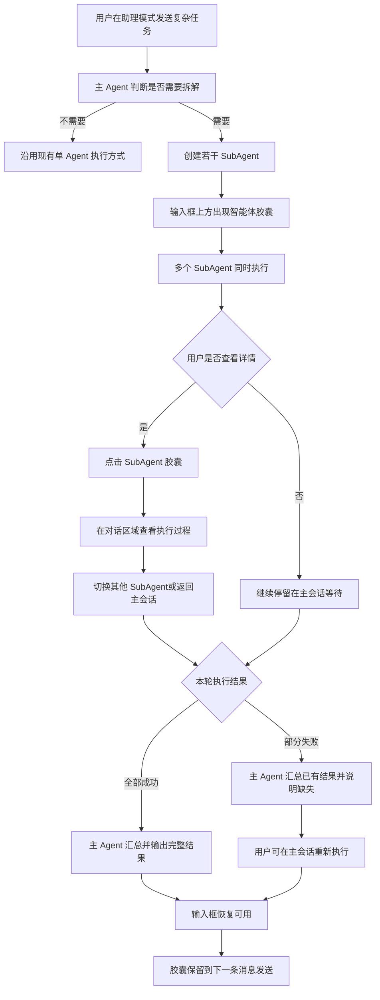

# 助理模式 SubAgent 协同执行过程 PRD

## 1. 文档信息

| 项目 | 内容 |
|---|---|
| 产品 | COMAC AI |
| 功能 | 助理模式 SubAgent 协同执行过程 |
| 版本 | V1.1 |
| 日期 | 2026-08-20 |
| 状态 | 产品与交互评审稿 |

## 2. 需求背景

用户在助理模式中提交复杂任务后，主 Agent 可能会把任务拆成多个部分，并创建若干 SubAgent 同时执行。

在当前体验中，用户只能看到主 Agent 正在处理，无法知道：

- 系统是否真的开始工作；
- 当前有几个 SubAgent 在执行；
- 每个 SubAgent 分别负责什么；
- 哪些已经完成、哪些还在运行；
- 如果长时间没有结果，具体卡在了哪里；
- 某个 SubAgent 失败后，本轮任务还能否继续完成。

因此，需要在主会话中增加一套轻量、可下钻的 SubAgent 过程交互，让用户在等待期间能够感知执行进展，并在需要时查看单个 SubAgent 的工作过程。

## 3. 产品目标

### 3.1 用户目标

- 明确知道主 Agent 已经创建 SubAgent 并开始执行。
- 快速了解本轮任务被拆成了哪些部分。
- 随时查看任一 SubAgent 当前正在做什么。
- 在任务失败或部分失败时，知道失败对象和原因。
- 不需要理解智能体调度、工具调用等技术概念。

### 3.2 产品目标

- 降低复杂任务等待期间的不确定感。
- 让多智能体协同过程对用户可感知，但不过度打扰主会话。
- 保持用户只与主 Agent 对话的统一心智。
- 复用现有主 Agent 的执行过程展示方式，降低学习成本。

## 4. 产品定位

SubAgent 是主 Agent 为完成当前任务临时创建的子执行单元，不是用户主动选择的专家，也不是一个独立的聊天对象。

用户仍然只是在助理长 Session 中与主 Agent 对话。SubAgent 只在当前任务需要拆分时出现，任务完成后短暂保留，下一轮对话开始时消失。

本功能的产品定位可以概括为：

> 在不改变主会话使用方式的前提下，让用户看见并理解 SubAgent 的协同执行过程。

## 5. 本期范围

### 5.1 本期包含

- 主 Agent 自动创建若干 SubAgent。
- 在输入框上方展示主 Agent 和 SubAgent 胶囊。
- 展示每个 SubAgent 的名称、分工和运行状态。
- 点击 SubAgent 查看其执行过程。
- 在详情中直接切换其他 SubAgent。
- 当前任务执行期间禁止用户发送新消息。
- 展示成功、部分失败和失败状态。
- 失败后从主会话重新执行整轮任务。
- 任务结束后保留本轮胶囊，直到用户开始下一轮对话。

### 5.2 本期不包含

- 用户手动创建或选择 SubAgent。
- 用户与 SubAgent 直接对话。
- 用户调整 SubAgent 的任务分工。
- 单独重试或取消某一个 SubAgent。
- 展示百分比进度、预计剩余时间或 token 消耗。
- 将 SubAgent 保存成长期专家。
- 将 SubAgent 状态发送到消息提醒中心。
- 在历史对话中长期回放 SubAgent 执行过程。

## 6. 用户使用流程

## 7. 页面与交互结构

### 7.1 主会话

主会话仍然是用户完成任务的唯一入口，原有消息流、输入框和输出结果位置保持不变。

当本轮任务创建 SubAgent 后，在输入框上方新增“智能体胶囊栏”。

胶囊栏出现后，主会话承担三个作用：

1. 告诉用户主 Agent 已经完成任务拆分。
2. 持续展示各 SubAgent 的运行状态。
3. 在全部执行结束后，由主 Agent 给出最终汇总。

### 7.2 智能体胶囊栏

胶囊栏包括一个主 Agent 胶囊和本轮创建的全部 SubAgent 胶囊。

主 Agent 固定排在最左侧，SubAgent 按创建顺序从左到右排列。

每个胶囊展示：

- 头像或角色标识；
- Agent 名称；
- 一句话分工；
- 当前状态图标。

胶囊不展示运行耗时、百分比进度、预计完成时间、token 消耗、工具调用次数和内部任务编号。

当胶囊数量超出当前宽度时，胶囊栏支持横向滚动，不压缩到无法识别的尺寸。

### 7.3 SubAgent 执行详情

用户点击某个 SubAgent 胶囊后，在当前助理的对话区域内打开执行详情。

详情层：

- 覆盖对话内容和输入区域；
- 不覆盖整个应用窗口；
- 不影响左侧主导航；
- 不创建新页面或新会话；
- 不展示新的输入框。

进入详情后，胶囊栏继续保留。用户可以直接点击其他 SubAgent 胶囊切换查看，不需要先返回主会话。

返回主会话有两种方式：

- 点击主 Agent 胶囊；
- 点击详情底部“返回主会话继续对话”。

返回后，主会话保持进入详情前的阅读位置。

## 8. 功能需求

### 8.1 SubAgent 创建反馈

当主 Agent 决定拆分任务时，应在主会话中先给出简洁说明，例如：

> 这个任务包含数据、问题和方案三个部分，我已并行启动 3 个子智能体。

随后出现胶囊栏。如果本轮任务不需要 SubAgent，则不出现胶囊栏，继续沿用现有主 Agent 交互。

### 8.2 SubAgent 名称与分工

SubAgent 名称应帮助用户理解“谁在做什么”，而不是暴露内部技术名称。

推荐命名方式：

- 数据分析员——提取关键指标；
- 问题洞察员——归纳问题与原因；
- 方案策划员——形成改进建议。

不推荐直接展示 Agent-01、worker-3、tool-agent、模型名称或服务名称。

### 8.3 胶囊状态

胶囊只使用三种用户可理解的状态：

| 状态 | 用户理解 | 视觉表现 |
|---|---|---|
| 运行中 | 该 SubAgent 正在处理任务 | 蓝色旋转状态图标 |
| 已完成 | 已经返回可用结果 | 绿色完成图标 |
| 失败 | 未能返回有效结果 | 红色失败图标 |

状态不能只依赖颜色，同时需要图标或文字辅助识别。状态变化后胶囊保持原有位置，不重新排序，避免用户点击目标发生移动。

### 8.4 执行过程展示

SubAgent 详情沿用普通模型输出的阅读方式，以连续文字展示当前正在做什么，不设计时间线、节点、步骤卡或单独的产出卡。

文字随着执行过程逐段出现，例如：

> 我先梳理本次任务需要关注的核心指标。

> 正在读取客户支援数据，并对重复记录进行合并。

> 数据已经整理完成。平均首次响应时长较上期缩短 18%，高频积压主要集中在航材与远程诊断环节。

展示规则：

- 运行中可以持续追加新的文字段落；
- 已经输出的文字不反复改写或闪动；
- 完成后直接在最后一段给出该 SubAgent 的结论；
- 失败时直接用自然语言说明执行到哪里以及为什么没有继续；
- 不展示时间线、步骤编号、进度比例、技术标签和复杂日志；
- 不直接展示模型完整思考内容、内部提示词或原始工具参数。

如果 SubAgent 生成了文件、报告或其他大型输出物，文字中自然说明“已生成相关文件”，具体文件继续使用现有 Workspace 查看方式。

### 8.5 主 Agent 胶囊

主 Agent 胶囊用于表达“当前仍由主 Agent 统筹本轮任务”。

- 用户位于主会话时，主 Agent 胶囊为选中状态。
- 用户正在查看某个 SubAgent 时，对应 SubAgent 胶囊为选中状态。
- 点击主 Agent 胶囊返回主会话。
- 全部 SubAgent 结束并完成汇总后，主 Agent 胶囊显示完成。
- 存在 SubAgent 失败时，主 Agent 胶囊显示失败态，主会话结果标记为“部分完成”或“执行失败”。

### 8.6 运行期间输入阻塞

只要本轮任务仍在执行，主会话输入框就不能发送新消息。

阻塞期间：

- 输入框不可编辑；
- 附件、技能、模型切换和发送按钮不可用；
- 输入区域显示“正在等待子智能体完成”；
- 同时提示“点击上方子智能体，可查看实时执行过程”。

当主 Agent 完成最终汇总或确认本轮失败后，输入框恢复可用。

### 8.7 全部成功

所有 SubAgent 成功后：

1. 每个 SubAgent 胶囊变为完成态。
2. 主 Agent 汇总所有返回结果。
3. 主 Agent 胶囊变为完成态。
4. 主 Agent像普通模型回复一样，直接输出自然语言结论。
5. 输入框恢复可用。
6. 胶囊继续保留，用户仍可查看各 SubAgent 的过程和产出。

主会话不额外展示“全部完成”绿卡、成功数量卡或其他系统化总结组件。完成信息通过胶囊状态和主 Agent 的正常回复表达。

### 8.8 部分失败

当部分 SubAgent 失败时：

1. 失败 SubAgent 胶囊变为失败态。
2. 已完成的 SubAgent 保持完成态。
3. 其他仍在运行的 SubAgent 继续执行，不被中断。
4. 主 Agent 等待其余 SubAgent 结束后，使用已有结果完成部分汇总。
5. 主 Agent 用自然语言说明已经获得的结论以及缺失的部分。
6. 不额外展示“部分完成”状态卡。
7. 输入框恢复可用。
8. 用户可以查看失败 SubAgent 的失败步骤和原因。

### 8.9 重新执行

重新执行入口只放在主会话的失败汇总中，不放在 SubAgent 详情里。

点击“重新执行”后：

- 重新执行本轮完整任务；
- 不是只重试失败的 SubAgent；
- 原“重新执行”按钮立即失效，避免重复点击；
- 胶囊栏切换为新一轮运行状态；
- 输入框再次进入阻塞态。

重新执行属于当前任务的延续，不视为用户开始了一条新的对话主题。

### 8.10 胶囊消失时机

本轮执行结束后，胶囊不会立刻消失。胶囊保留到用户成功发送下一条消息，以便用户在阅读主 Agent 汇总时仍可回看每个 SubAgent。

以下行为不会清理胶囊：

- 用户只是在输入框中输入草稿；
- 用户打开或关闭 SubAgent 详情；
- 用户切换不同 SubAgent；
- 用户点击失败结果的“重新执行”。

用户成功发送下一条普通消息后，上一轮胶囊和详情入口清理，主会话历史结果仍然保留。

## 9. 页面状态

| 页面状态 | 页面表现 |
|---|---|
| 未创建 SubAgent | 不显示胶囊栏，沿用现有助理界面 |
| 运行中 | 显示胶囊栏，输入框阻塞，可查看执行详情 |
| 全部完成 | 主 Agent 正常输出结论，输入框恢复，胶囊继续保留 |
| 部分完成 | 主 Agent 自然说明已有结果和缺失内容，并提供重新执行入口 |
| 全部失败 | 明确说明未获得可用结果，提供重新执行 |

## 10. 产品边界与异常场景

| 边界场景 | 产品规则 |
|---|---|
| 主 Agent 没有创建 SubAgent | 不显示胶囊栏，完全沿用现有主 Agent 体验 |
| 只创建 1 个 SubAgent | 仍显示主 Agent 和该 SubAgent 两个胶囊，不因数量少而换另一套交互 |
| 创建多个 SubAgent | 按实际创建顺序展示，不限定必须为 3 个 |
| 执行中又创建新的 SubAgent | 新胶囊追加在现有胶囊末尾，不改变已有胶囊顺序 |
| SubAgent 数量超出一行 | 胶囊栏横向滚动，不换行、不缩成难以识别的尺寸 |
| 某个 SubAgent 提前完成 | 只更新该胶囊状态，继续等待其他 SubAgent，不提前输出主 Agent 最终结论 |
| 某个 SubAgent 创建失败 | 未创建成功的对象不展示空胶囊；主 Agent自然说明拆分未完全成功 |
| 某个 SubAgent 没有产生有效内容 | 按失败处理，用自然语言说明未获得有效结果 |
| SubAgent 输出内容很长 | 详情区域内部滚动，胶囊栏和返回入口保持可用 |
| 用户查看详情时 SubAgent 完成 | 文字继续输出到最终结论，状态同步更新，但不自动返回主会话 |
| 用户查看详情时 SubAgent 失败 | 在当前文字末尾说明失败原因，不自动弹出新的错误窗口 |
| 用户查看已完成的 SubAgent | 展示其已经输出的完整文字，不重新播放生成动画 |
| 用户在执行期间尝试输入 | 输入框及相关操作保持禁用，不保存新的发送动作 |
| 用户离开助理模式 | 执行是否继续沿用主 Agent 现有规则；返回时恢复本轮最新状态 |
| 用户在任务结束后只输入草稿 | 不清理胶囊，只有消息真正发送后才视为下一轮开始 |
| 用户发送下一条普通消息 | 清理上一轮胶囊和详情入口，主会话中的文字结果继续保留 |
| 用户点击重新执行 | 视为当前任务延续，替换为新一轮胶囊状态，不清理当前任务上下文 |
| 主 Agent 汇总失败 | 保留各 SubAgent 已有文字结果，主 Agent自然说明汇总失败并提供整轮重新执行 |
| 全部 SubAgent 失败 | 主 Agent自然说明本轮没有获得可用结果，并提供整轮重新执行 |
| 用户停止主 Agent | 沿用现有停止执行规则，不为 SubAgent 新增独立停止逻辑 |

本期不处理 SubAgent 间的依赖关系、排队顺序和用户手动调度。无论后台实际采用并行还是串行方式，用户侧只展示已经创建的 SubAgent 及其当前文字输出。

## 11. 关键交互文案

| 场景 | 建议文案 |
|---|---|
| 创建 SubAgent | 这个任务包含多个部分，我已并行启动 3 个子智能体。 |
| 输入阻塞 | 正在等待子智能体完成 |
| 查看提示 | 点击上方子智能体，可查看实时执行过程 |
| SubAgent 开始处理 | 我先梳理本次任务需要关注的内容。 |
| 全部成功 | 综合来看，客户支援效率整体有所改善，但航材保障仍是主要瓶颈。 |
| 部分失败 | 数据分析已经完成，但改进建议暂未生成。下面先给出目前可以确认的结论。 |
| 返回主会话 | 返回主会话继续对话 |
| 重新执行 | 重新执行 |

具体数量、角色和任务描述必须根据当前任务动态生成，不能固定写死。

## 12. 验收标准

### 12.1 胶囊栏

- [ ] 只有实际创建 SubAgent 后才出现。
- [ ] 主 Agent 固定在最左侧。
- [ ] SubAgent 数量和顺序与本轮实际创建结果一致。
- [ ] 胶囊包含头像、名称、分工和状态。
- [ ] 状态变化不导致胶囊重新排序。
- [ ] 数量较多时可以横向滚动。

### 12.2 执行详情

- [ ] 点击 SubAgent 胶囊后，详情只覆盖助理对话区域。
- [ ] 详情中不出现输入框。
- [ ] 详情使用连续文字展示执行过程和最终结论。
- [ ] 详情中不出现时间线、步骤卡、进度比例或单独产出卡。
- [ ] 可以直接切换查看其他 SubAgent。
- [ ] 点击主 Agent 胶囊或底部返回按钮可以返回主会话。
- [ ] 返回后主会话阅读位置保持不变。

### 12.3 输入阻塞

- [ ] 本轮运行期间不能输入或发送新消息。
- [ ] 附件、技能和模型选择等相关操作同步禁用。
- [ ] 输入区域明确说明正在等待 SubAgent。
- [ ] 本轮结束后输入框自动恢复。

### 12.4 完成与清理

- [ ] 全部成功时主 Agent 直接输出自然语言结论，不出现“全部完成”绿卡。
- [ ] 部分失败时主 Agent用自然语言说明已有结果和缺失内容，不出现状态总结卡。
- [ ] 失败详情通过连续文字说明停止位置和原因。
- [ ] 重新执行入口只出现在主会话。
- [ ] 点击重新执行后重新运行整轮任务。
- [ ] 本轮结束后胶囊继续保留。
- [ ] 只有成功发送下一条普通消息后才清理上一轮胶囊。

## 13. Demo 演示说明

当前 Demo 用于验证产品交互，不代表正式任务识别和调度方式。

### 13.1 成功剧本

在助理模式输入：

> 用子智能体分析客户支援

演示内容：主 Agent 创建 3 个 SubAgent，三个 SubAgent 并行执行；用户可点击胶囊查看逐段出现的文字过程；全部完成后主 Agent直接输出自然语言结论；胶囊保留到下一条消息发送。

### 13.2 失败剧本

在助理模式输入：

> 用子智能体分析客户支援，模拟失败

演示内容：数据分析员和问题洞察员完成，方案策划员因知识服务超时失败；主 Agent 输出部分结果；用户在主会话点击“重新执行”；整轮重新执行并成功完成。

Demo 中的固定角色、固定数量、关键词触发和时间变化均为演示需要，不属于正式产品规则。
