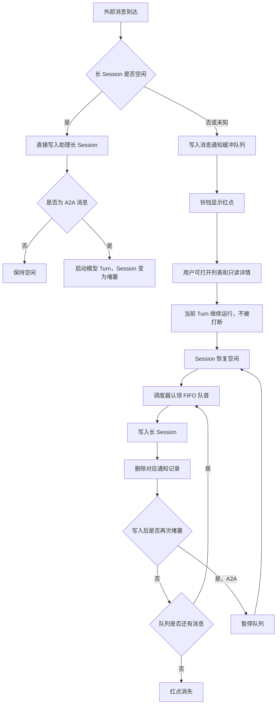
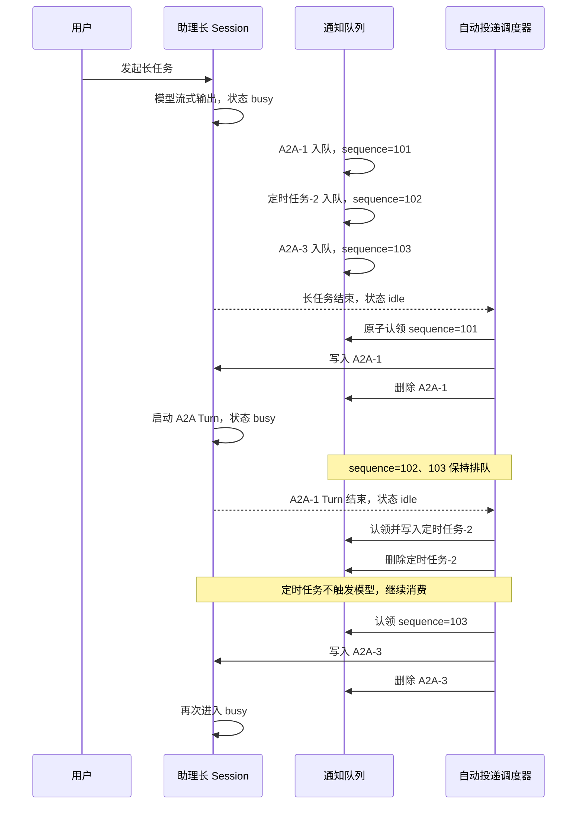
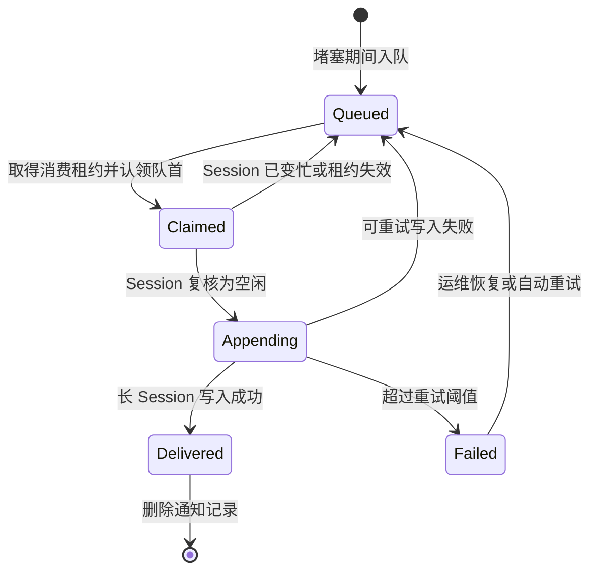

# 助理长 Session 消息通知中心 PRD

> 版本：V2.0
>
> 状态：开发可执行
>
> 适用端：PC、移动端
>
> 排序规则：仅按到达顺序 FIFO，不做优先级
>
> 核心定位：助理堵塞期间的临时消息缓冲队列

## 1. 需求摘要

助理模式只有一个长期运行的 Session。当模型生成、工具执行或 A2A 处理占用该 Session 时，新到达的 A2A 消息和定时任务结果不能立即写入会话。

本需求提供一个独立于长 Session 写入链路的消息通知中心：

1. 助理空闲时，消息直接进入长 Session，不在通知中心停留；
2. 助理堵塞时，消息可靠写入通知中心并按到达顺序排队；
3. 用户可以点击排队消息查看完整只读详情；
4. 助理恢复空闲后，调度器自动按 FIFO 将消息逐条写入长 Session；
5. 消息成功写入长 Session 后，立即从通知中心删除；
6. 如果写入的是 A2A 消息，助理再次进入堵塞状态，队列暂停，待下次空闲后继续；
7. 整个流程不存在用户手动“处理”操作。

通知中心不是待办中心，也不是历史消息中心。它只承载“当前尚未进入长 Session 的消息”。

## 2. 本次版本相对 V1 的变化

| 项目 | V1 | V2 |
|---|---|---|
| 消息进入长 Session | 用户点击“处理” | Session 空闲后系统自动投递 |
| 排队范围 | 所有异步消息均可保留 | 仅堵塞期间未能直接投递的消息 |
| 列表内容 | 类型、时间、标题、摘要、来源、状态、处理按钮 | 仅消息类型、消息标题 |
| 入口提示 | 数字未读角标 | 仅红点 |
| 详情页 | 只读结果 + 禁用输入框 | 只读结果，不展示任何输入区 |
| 投递后记录 | 保留已处理记录 | 从通知中心删除 |
| 队列消费 | 人工选择 | FIFO 自动消费 |

## 3. 产品目标

- 新消息不因长 Session 堵塞而丢失；
- 当前模型输出不被新消息强制打断；
- 助理恢复空闲后无需用户介入即可继续消费消息；
- 用户在等待期间可以查看完整消息，但不能在通知详情内发起对话；
- 桌面端和移动端遵循同一套队列、投递和删除规则；
- 规则足够确定，开发无需实现优先级判断或重要程度识别。

## 4. 非目标

- 不做人工“处理”“稍后处理”“批量处理”；
- 不做消息优先级、置顶、插队或紧急程度识别；
- 不做通知历史归档；
- 不展示未读数量；
- 不在通知详情页提供输入框、发送按钮或快捷回复；
- 不允许消息通知打断正在运行的模型 Turn；
- 不支持用户拖拽调整队列顺序；
- 本期不提供队列暂停、跳过和删除能力。

## 5. 名词定义

| 名词 | 定义 |
|---|---|
| 长 Session | 助理模式唯一、持续存在的主会话 |
| 空闲 | 当前没有模型生成、工具执行、A2A Turn 或会话写入事务 |
| 堵塞 | 长 Session 正在生成、执行工具、处理 A2A，或存在未完成的会话写入事务 |
| 缓冲消息 | 堵塞期间已经接收、尚未成功写入长 Session 的消息 |
| 队首 | 所有缓冲消息中最早到达、下一条应被投递的消息 |
| 自动投递 | 调度器在 Session 空闲时将队首消息写入长 Session |
| 阻塞型消息 | 写入后会触发新模型 Turn 的消息；本期 A2A 消息属于此类 |
| 非阻塞型消息 | 写入后只形成会话记录，不触发模型 Turn；本期定时任务结果属于此类 |
| 红点 | 通知中心存在至少一条缓冲消息时显示的布尔提示，不代表未读数 |

## 6. 核心业务规则

### 6.1 接收规则

收到消息时必须由服务端读取可信的 Session 状态：

- `idle`：直接写入长 Session；不得先创建通知记录；
- `busy`：创建缓冲消息；不得写入当前运行中的 Turn；
- `unknown`：为避免并发写入，按 `busy` 处理并创建缓冲消息。

### 6.2 FIFO 规则

- 队列按服务端接收序号 `sequence` 升序消费；
- `receivedAt` 仅用于展示和排查，不作为唯一排序依据；
- 同一用户、同一助理长 Session 使用一条逻辑队列；
- 不因消息类型、来源、是否查看过或业务重要程度改变顺序；
- 多端同时在线时仍只能有一个调度器持有消费租约。

### 6.3 自动消费规则

Session 从堵塞恢复为空闲后，调度器开始消费队首：

1. 原子认领队首消息；
2. 再次校验 Session 为空闲；
3. 将消息写入长 Session；
4. 确认会话写入成功；
5. 删除对应通知记录；
6. 根据消息类型决定是否继续消费。

如果是非阻塞型定时任务结果，继续取下一条；如果是 A2A 消息，写入后启动模型 Turn，Session 重新变为堵塞，立即暂停队列。

因此，“恢复空闲后一股脑推送”在实现上是连续自动消费，而不是并发写入所有消息。

### 6.4 删除规则

- 只有长 Session 写入事务确认成功后，才能删除通知记录；
- 认领成功但写入失败时，通知必须回到可消费状态；
- 写入成功后，即使后续 A2A 模型 Turn 失败，也不恢复通知记录；失败结果应记录在长 Session 内；
- 删除后所有端的列表和红点必须实时更新；
- 通知中心不保留“已处理”或“已投递”历史。

### 6.5 查看规则

- 用户可以在消息仍位于队列中时点击标题打开完整只读详情；
- 查看详情不改变 FIFO 顺序，不触发模型，不占用 Session；
- 查看详情不移除红点；红点只由队列是否为空决定；
- 详情页不得出现输入框、发送按钮、快捷回复或“处理”按钮；
- 消息在用户查看期间被自动投递时，应关闭该详情并返回通知列表空态或下一条消息列表。

## 7. 用户旅程

### 7.1 完整旅程



### 7.2 A2A 导致二次堵塞



## 8. 信息架构

### 8.1 入口

- PC：左侧栏顶部铃铛；
- 移动端：助理页顶部铃铛；
- 队列为空：普通铃铛，不显示任何数字；
- 队列非空：铃铛右上角显示红点；
- 红点为布尔状态，不计算、不展示“X 条未读”。

### 8.2 通知列表

每条消息只能展示：

1. 消息类型：`A2A 消息` 或 `定时任务`；
2. 消息标题。

列表明确禁止展示：

- 摘要；
- 来源人员；
- 项目名称；
- 到达时间；
- 未读圆点；
- 处理状态；
- “处理”“重试”“删除”等操作按钮。

列表视觉顺序必须与 FIFO 消费顺序一致：最早到达的消息显示在最上方。

### 8.3 只读详情

详情页可以展示消息完整内容，包括：类型、标题、来源、关联项目、接收时间、正文、结构化结果和结论。

详情页仅用于阅读，底部不保留输入框占位结构。页面中不得出现任何可发送内容的控件。

## 9. 功能需求

### FR-01 Session 状态判定

- 长 Session 服务提供 `idle | busy | unknown`；
- 状态必须覆盖模型生成、工具执行、A2A Turn 和会话写入事务；
- 通知服务不能通过前端输入框是否禁用推断状态；
- `unknown` 按堵塞处理。

### FR-02 堵塞期间接收入队

- 上游消息到达后立即持久化，不依赖前端页面是否打开；
- 队列记录必须包含稳定事件 ID 和单调递增 `sequence`；
- 同一上游事件重复投递只允许生成一条队列记录；
- 入队成功后向在线端推送 `queue_changed` 事件；
- 当前长 Session Turn 不得被取消、截断或插入内容。

### FR-03 空闲期间直接写入

- Session 空闲时不创建可见通知记录；
- 直接写入与“创建队列记录”必须互斥，不能同时发生；
- 写入 A2A 后立即将 Session 标记为忙碌；
- 写入定时任务结果后，若不触发模型 Turn，Session 保持空闲。

### FR-04 红点提示

- 条件：`queuedCount > 0` 时显示，等于 0 时隐藏；
- 红点不包含文字、数字或 `99+`；
- 点击消息、打开通知中心、查看详情均不移除红点；
- 只有队列清空后红点才消失；
- 多端队列变化后 1 秒内同步红点。

### FR-05 极简列表

- 按 `sequence ASC` 查询和展示；
- 消息主体整体可点击；
- 列表只展示类型和标题；
- 选中态可以通过背景或描边表达，但不得增加业务字段；
- 空态文案：“当前没有等待推送的消息”。

### FR-06 只读详情

- 点击消息主体打开详情；
- 详情读取不调用模型、不写入 Session；
- 不记录和展示未读数量；
- 页面完全删除输入区，不以 disabled 输入框代替；
- 消息自动投递并删除时，当前详情自动失效并返回列表；
- 详情请求失败时允许“重新加载”，但不得提供“处理”。

### FR-07 自动调度

触发条件：

- Session 由 `busy/unknown` 变为 `idle`；
- 空闲状态下有新队列消息到达；
- 上一条非阻塞消息投递完成；
- 上一条 A2A Turn 处理结束，Session 再次变为 `idle`。

调度器每次只认领队首，不允许并行认领多条。

### FR-08 自动写入与删除

投递事务至少包含：

1. 获取 Session 消费租约；
2. 锁定队首；
3. 复核 Session 空闲；
4. 生成规范化会话消息；
5. 写入长 Session 并获得 message ID；
6. 标记队列项已投递；
7. 删除通知记录；
8. 广播队列变化。

步骤 5 失败时不得执行步骤 6、7。

### FR-09 A2A 再次堵塞

- A2A 成功写入后启动新模型 Turn；
- 启动 Turn 前必须将 Session 状态原子更新为 `busy`；
- 队列调度器释放消费租约并暂停；
- 剩余消息顺序不变；
- A2A Turn 结束后重新从队首继续。

### FR-10 定时任务连续消费

- 定时任务结果作为会话事实或系统消息写入；
- 本期默认不触发新模型 Turn；
- 写入并删除后，若 Session 仍空闲，调度器继续消费下一条；
- 如果未来某类定时任务需要模型处理，应通过服务端 `blocking=true` 扩展，而不是前端判断标题。

### FR-11 实时更新

- 入队、删除、Session 状态变化均通过 WebSocket、SSE 或统一事件总线同步；
- 用户停留在通知列表或详情时，后台自动投递仍必须执行；
- 不要求用户返回助理页或刷新页面；
- 被删除的选中项不得继续显示为可操作详情。

## 10. 状态模型

### 10.1 队列内部状态

队列项建议使用以下后端状态，前端不展示：

- `queued`：等待消费；
- `claimed`：被调度器临时认领；
- `appending`：正在写入长 Session；
- `delivered`：写入成功，等待删除；
- `failed`：本次写入失败，等待退避重试或人工运维。



### 10.2 前端可见状态

前端只需要：

- 队列为空 / 非空；
- Session 空闲 / 堵塞；
- 当前列表项是否被选中；
- 详情加载中 / 成功 / 失败。

前端不展示 queued、claimed、processing、handled 等处理状态。

## 11. 数据模型建议

```ts
type BufferedAssistantMessage = {
  id: string
  eventId: string
  assistantId: string
  longSessionId: string
  kind: 'a2a' | 'automation'
  title: string
  summary: string
  source: {
    id: string
    name: string
  }
  project?: {
    id: string
    name: string
  }
  payloadRef: string
  receivedAt: string
  sequence: number
  blocking: boolean
  queueState: 'queued' | 'claimed' | 'appending' | 'delivered' | 'failed'
  claimToken?: string
  claimExpiresAt?: string
  retryCount: number
  lastErrorCode?: string
}
```

约束：

- `eventId + longSessionId` 唯一；
- `longSessionId + sequence` 唯一；
- `sequence` 由服务端生成，不使用客户端时间；
- 列表接口只返回类型、标题、ID、sequence；
- 详情接口按 ID 返回完整结果；
- 不需要 `readAt` 和未读数统计接口。

## 12. 接口建议

### 12.1 查询队列

`GET /assistants/{assistantId}/message-buffer`

```json
{
  "hasBufferedMessages": true,
  "sessionState": "busy",
  "items": [
    {
      "id": "msg_101",
      "kind": "a2a",
      "title": "收到发动机风险评审进展催办",
      "sequence": 101
    }
  ]
}
```

接口不返回未读数量；`hasBufferedMessages` 直接驱动红点。

### 12.2 查询详情

`GET /assistants/{assistantId}/message-buffer/{messageId}`

返回完整消息结果。消息已被自动投递并删除时返回 `410 BUFFER_ITEM_DELIVERED`，前端关闭详情并刷新列表。

### 12.3 接收上游消息

`POST /internal/assistants/{assistantId}/messages`

服务端内部决定“直接写入”或“进入缓冲队列”，调用方不能指定跳过 FIFO。

### 12.4 Session 状态事件

```json
{
  "type": "assistant.session_state_changed",
  "assistantId": "assistant_001",
  "longSessionId": "session_main",
  "from": "busy",
  "to": "idle",
  "occurredAt": "2026-08-23T10:20:00+08:00"
}
```

调度器订阅 `to=idle` 事件，同时应有定时扫描作为漏事件兜底。

## 13. 并发、幂等与一致性

### 13.1 必须由后端保证

- 同一长 Session 同时只能存在一个消费租约；
- 只能认领当前最小 sequence 的 queued 消息；
- 会话写入接口支持 `idempotencyKey=bufferItemId`；
- 写入成功但删除超时时，重试不得在长 Session 创建第二条消息；
- 多端打开通知中心不产生多个消费者；
- Session 状态检查和会话写入必须具备原子保护或版本号校验。

### 13.2 关键竞态

| 竞态 | 预期处理 |
|---|---|
| 调度器认领后用户发起新任务 | Session 复核失败，释放消息回 queued |
| 两个调度实例同时收到 idle 事件 | 只有一个实例取得消费租约 |
| 写入成功、删除前服务重启 | 通过幂等键确认已写入，再删除队列项 |
| 详情打开期间消息被投递 | 详情接口返回 410 或实时事件通知前端关闭详情 |
| A2A 写入后 busy 事件延迟 | 写入事务同步设置 busy，不能依赖异步前端事件 |
| 上游重复发送同一事件 | 根据 eventId 去重，不新增 sequence |

## 14. 异常与边界

| 场景 | 产品行为 |
|---|---|
| Session 状态未知 | 消息入队，不直接写入 |
| 队列查询失败 | 铃铛保留最近状态，列表显示加载失败和重试 |
| 详情加载失败 | 显示重新加载，不提供处理或输入能力 |
| 会话写入失败 | 消息留在队列，指数退避重试 |
| 连续失败超过阈值 | 队列停止在失败队首，告警运维；不得跳过破坏 FIFO |
| 消息 payload 已失效 | 记录失败并告警；本期不允许前端跳过 |
| 用户离线 | 后端继续排队和自动消费 |
| 应用被关闭 | 后端继续执行，重开后读取最新队列 |
| 队列被消费为空 | 红点消失，列表展示空态 |
| A2A 模型 Turn 失败 | 不恢复通知；在长 Session 展示本轮失败和重试能力 |

## 15. 前端交互要求

### 15.1 PC

- 铃铛红点只表达“队列非空”；
- 左侧通知列表仅有类型和标题；
- 不出现悬浮操作按钮；
- 点击列表项后，右侧覆盖显示只读详情；
- 详情页高度全部用于内容阅读，不保留底部输入容器；
- 后台自动投递时，不强制抢走用户当前页面；
- 当前详情被投递删除时，返回通知列表。

### 15.2 移动端

- 顶部铃铛使用红点，不显示数字；
- 通知列表保持单列，只展示类型和标题；
- 不存在常驻“处理”按钮；
- 点击卡片进入只读详情；
- 详情页删除输入框和发送区；
- 底部默认选中 AI，其余入口保持不可点击；
- 自动投递在后台进行，不要求用户停留在助理页；
- 使用 `100dvh` 和安全区变量适配地址栏、Home Indicator。

## 16. 前后端职责

### 16.1 前端

- 展示铃铛红点、极简队列、只读详情和空态；
- 订阅队列与 Session 状态变化；
- 被投递项从列表移除时同步关闭失效详情；
- 不实现消费排序、不主动调用“处理”接口；
- 不根据前端时间重排消息。

### 16.2 通知/缓冲服务

- 可靠接收、持久化、去重和分配 sequence；
- 提供列表及详情查询；
- 广播队列变化；
- 管理认领、重试、失败与删除状态。

### 16.3 长 Session 服务

- 提供可信状态；
- 提供幂等消息写入；
- A2A 写入后原子进入 busy；
- Turn 结束后发出 idle 事件；
- 在会话内记录后续模型执行失败。

### 16.4 自动调度器

- 监听 idle 和队列变化；
- 获取单 Session 消费租约；
- 严格消费队首；
- 遇到阻塞型消息立即暂停；
- 对写入失败进行退避重试与告警。

## 17. 非功能要求

| 指标 | 要求 |
|---|---|
| 入队可靠性 | 已确认接收的消息不得丢失 |
| 入队延迟 | P95 小于 500ms |
| 红点同步 | 队列变化后 1 秒内 |
| 自动调度启动 | idle 事件后 P95 小于 1 秒 |
| FIFO 正确率 | 100%，不得乱序或跳过 |
| 幂等性 | 每个缓冲消息最多写入长 Session 一次 |
| 详情加载 | 普通文本结果 P95 小于 1 秒 |
| 可访问性 | 铃铛、列表项、返回按钮可被键盘和读屏识别 |

## 18. 埋点与监控

建议事件：

- `buffer_message_enqueued`；
- `buffer_red_dot_shown`；
- `buffer_center_opened`；
- `buffer_detail_opened`；
- `buffer_drain_started`；
- `buffer_message_appended`；
- `buffer_message_removed`；
- `buffer_drain_paused_by_a2a`；
- `buffer_append_failed`；
- `buffer_drained`。

关注指标：入队量、平均等待时长、最大队列长度、A2A 导致的二次堵塞次数、写入失败率、重复写入率和 FIFO 异常数。

## 19. 验收用例

| 编号 | 前置条件 | 操作/事件 | 预期结果 |
|---|---|---|---|
| AC-01 | Session 空闲 | 定时任务结果到达 | 直接进入长 Session，通知中心不出现记录 |
| AC-02 | Session 空闲 | A2A 消息到达 | 直接进入长 Session并启动 Turn，Session 变 busy |
| AC-03 | Session 堵塞 | A2A 消息到达 | 当前 Turn 不被打断，消息进入队列，铃铛显示红点 |
| AC-04 | 队列非空 | 查看铃铛 | 仅红点，不显示数量 |
| AC-05 | 队列含多条消息 | 打开列表 | 按 sequence 升序，只显示类型和标题 |
| AC-06 | 队列项存在 | 点击消息 | 打开完整只读详情，不调用模型 |
| AC-07 | 详情已打开 | 检查页面底部 | 不存在输入框、发送按钮和处理按钮 |
| AC-08 | Session busy，队列 A→B→C | Session 变 idle | 自动投递 A，不需要用户点击 |
| AC-09 | A 为 A2A | A 写入成功 | A 从通知中心删除，Session 再次 busy，B/C 保留 |
| AC-10 | A2A Turn 结束 | Session 再次 idle | 自动继续投递 B |
| AC-11 | B 为定时任务 | B 写入成功 | B 删除；若仍 idle，自动继续投递 C |
| AC-12 | 当前查看 B 详情 | B 被自动投递 | 详情关闭，列表移除 B |
| AC-13 | 队列最后一条投递成功 | 查看铃铛 | 红点消失，列表为空 |
| AC-14 | 写入 Session 失败 | 调度队首 | 消息不删除，不消费下一条，进入重试 |
| AC-15 | 两个客户端同时在线 | Session 变 idle | 只写入一次，两个客户端列表同步 |
| AC-16 | 上游重复事件 | 重复接收 | 队列只保留一条 |
| AC-17 | 用户停留在通知详情 | 原长任务结束 | 后台自动调度照常执行 |
| AC-18 | A2A 已写入但模型失败 | 查看通知中心 | 原通知不恢复；长 Session 展示失败 |

### 验收红线

出现以下任一情况不得验收：

- 存在任何手动“处理”入口；
- 显示未读数字；
- 列表展示摘要、来源、时间或状态；
- 详情页仍保留禁用输入框；
- A2A 写入后继续并行消费后续消息；
- 写入失败却删除通知；
- 队列按客户端时间、消息类型或重要程度重排；
- 多端导致同一消息重复写入长 Session。

## 20. Mock 原型说明

PC 与移动端原型采用以下演示脚本：

1. 初始 Session 空闲，通知中心为空且铃铛无红点；
2. 在助理输入“模拟长任务”；
3. 助理进入流式输出；
4. 约 0.9 秒后收到 A2A 消息；
5. 约 1.5 秒后收到定时任务结果；
6. 铃铛显示红点，列表按 A2A、定时任务顺序展示；
7. 点击任一消息可查看无输入区的只读详情；
8. 原长任务结束后，A2A 自动进入长 Session 并从通知中心删除；
9. A2A 触发二次堵塞，定时任务继续留在队列；
10. A2A Turn 结束后，定时任务自动进入长 Session并被删除；
11. 队列清空，红点消失。

Mock 只模拟前端状态和定时器，不代表正式环境的持久化、分布式锁、消费租约和幂等能力。

## 21. 开发拆分建议

### 阶段 1：消息接收与队列

- Session 状态判定；
- 堵塞入队、空闲直投；
- eventId 去重和 sequence；
- 列表、详情接口。

### 阶段 2：自动调度

- idle 事件订阅；
- 单 Session 消费租约；
- FIFO 认领与会话幂等写入；
- A2A 阻塞和定时任务连续消费；
- 失败重试与告警。

### 阶段 3：PC 与移动端 UI

- 红点入口；
- 极简列表；
- 无输入区的只读详情；
- 实时移除和详情失效处理；
- 空态与异常态。

### 阶段 4：联调与压测

- 多端并发；
- 连续 A2A 消息；
- 写入成功但删除超时；
- 长 Session 高频 busy/idle 切换；
- 队列积压与恢复；
- AC-01 至 AC-18 全量验收。
