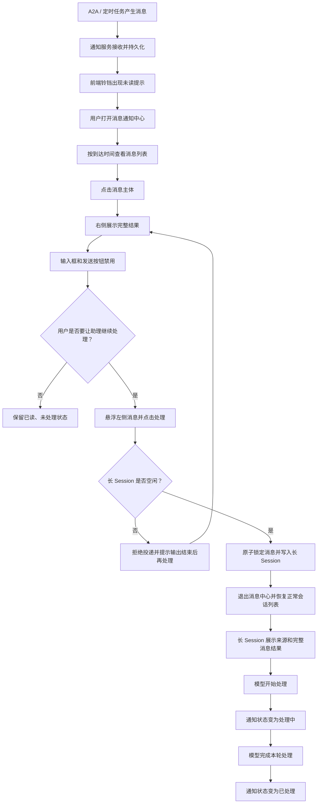
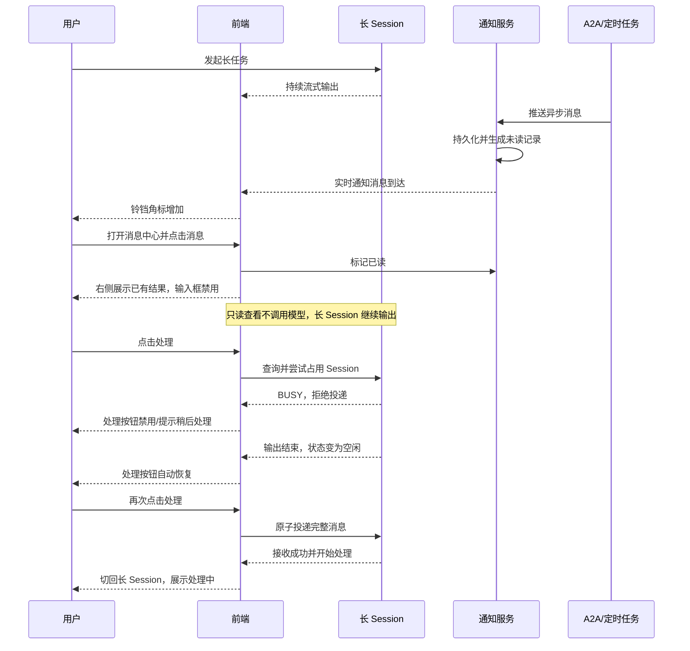
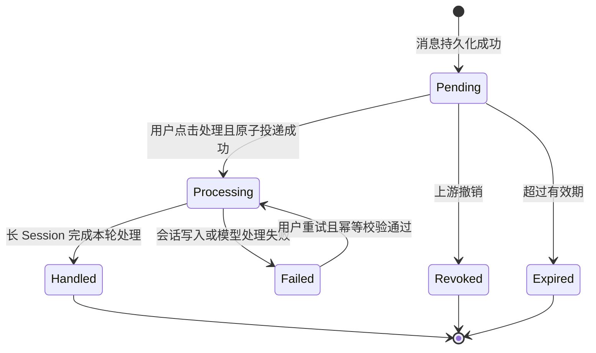
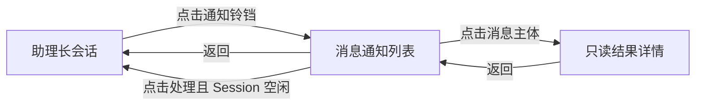

# 助理长 Session 消息通知中心 PRD

## 1. 文档信息

| 项目 | 内容 |
| --- | --- |
| 产品 | COMAC AI 数字分身桌面端 |
| 模块 | 助理模式 / 消息通知中心 |
| PRD 版本 | V1.0 |
| 文档日期 | 2026-08-19 |
| 目标读者 | 产品、交互、前端、后端、测试 |
| 当前交付形态 | 前端交互原型，正式开发需接入通知服务和长 Session 服务 |
| 核心目标 | 解决唯一长 Session 忙碌时，定时任务和 A2A 消息无法即时送达、查看和安全处理的问题 |

## 2. 需求摘要

助理模式只有一个持续存在的长 Session。用户对话、模型流式输出和工具执行都占用该 Session。在长 Session 忙碌期间，定时任务结果或 A2A 消息仍可能异步到达，但不能直接插入正在生成的上下文。

本需求新增一个独立于长 Session 的消息通知中心，承担三项职责：

1. **接住消息**：无论长 Session 是否忙碌，异步消息都必须立即接收并持久化；
2. **查看结果**：用户可以在独立的只读视图中查看消息的完整结果，该动作不调用模型、不占用长 Session；
3. **人工投递**：只有用户点击消息的“处理”按钮，并且长 Session 空闲时，系统才将消息投入长 Session 继续处理。

本期不做优先级判断，所有消息只按照到达时间排序；不打断正在进行的模型输出，也不在长 Session 忙碌时自动排队。

## 3. 背景与问题

### 3.1 当前模式

助理模式中的长 Session 是用户与个人数字分身持续交互的唯一会话，具有以下特点：

- 长期保留必要上下文；
- 同一时间只允许一个模型生成或工具执行流程；
- 用户输入、A2A 协作和自动化结果最终都需要在该 Session 中理解和处理；
- 模型流式输出期间，不适合强行插入新的消息上下文。

### 3.2 当前问题

当长 Session 正在输出时，外部异步消息面临以下问题：

1. 新消息无法安全进入当前上下文，只能等待 Session 空闲；
2. 用户不知道等待期间是否有消息到达；
3. 如果强制打断，可能导致回答不完整、工具状态不确定或上下文污染；
4. 多条消息同时到达后，缺少统一、可追踪的暂存位置；
5. 用户无法在不占用长 Session 的情况下先查看消息结果；
6. “查看消息”和“让助理继续处理消息”缺少明确的交互区分。

## 4. 产品目标与非目标

### 4.1 产品目标

- 异步消息的接收不依赖长 Session 状态；
- 用户能够及时感知新消息，并查看完整结果；
- 查看消息不调用模型、不占用或打断长 Session；
- 用户能够在长 Session 空闲时，将指定消息手动投入长 Session；
- 整个过程具备明确状态、幂等控制和可追踪性；
- 交互规则简单、确定，不引入重要程度判断和自动调度。

### 4.2 本期非目标

- 不做消息优先级和重要程度判断；
- 不做紧急消息自动打断模型输出；
- 不做长 Session 忙碌时的自动处理队列；
- 不自动将所有未处理消息附加到下一轮上下文；
- 不支持多条消息合并处理；
- 不支持多 Session 并行消费消息；
- 不提供用户主动删除、归档和批量操作；
- 不在本需求中定义自动过期策略，但需要兼容上游消息已经撤回或失效的只读状态；
- 不做复杂搜索、筛选和消息分类配置；
- 不改变 A2A 或定时任务自身的执行逻辑；
- 不在只读结果页提供直接聊天能力。

## 5. 核心产品原则

### 5.1 接收、查看、处理必须解耦

| 动作 | 用户含义 | 是否调用模型 | 是否占用长 Session | 是否改变处理状态 |
| --- | --- | --- | --- | --- |
| 接收 | 系统已收到外部消息 | 否 | 否 | 否 |
| 查看 | 用户阅读已有结果 | 否 | 否 | 只改变已读状态 |
| 处理 | 用户要求助理继续理解和执行 | 是 | 是 | 进入处理中 |

点击消息主体只能查看，不能隐式投入长 Session。点击“处理”才代表用户明确授权系统进行下一步模型处理。

### 5.2 长 Session 忙碌时可查看、不可处理

- 消息接收始终允许；
- 消息结果查看始终允许；
- 投递到长 Session 只在 Session 空闲时允许；
- 忙碌状态结束后，处理能力自动恢复，不要求用户刷新页面。

### 5.3 本期只按时间排序

- 列表以服务端 `receivedAt` 为准；
- 默认按照 `receivedAt DESC` 排序，最新消息在最上方；
- 不使用消息来源、消息类型、未读状态或业务紧急度改变排序；
- 相同时间戳时，以消息 ID 或服务端序列号作为稳定排序的第二关键字。

## 6. 名词定义

| 名词 | 定义 |
| --- | --- |
| 长 Session | 助理模式中唯一、持续承载用户上下文的会话 |
| Session 空闲 | 当前没有模型生成、工具执行或待提交的会话写入事务 |
| Session 忙碌 | 模型正在生成、工具正在执行，或已有消息正在投递处理中 |
| 通知消息 | 由 A2A 或定时任务产生，并送达通知中心的结构化记录 |
| 消息结果 | 消息到达前已经生成的完整内容，包括模型输出、任务结果和附件引用 |
| 查看 | 在只读结果视图中读取消息结果，不调用模型 |
| 处理 | 将消息和完整结果写入长 Session，并触发新一轮模型处理 |
| 未读 | 用户尚未打开该消息结果 |
| 已读 | 用户至少打开过一次该消息结果 |
| 处理中 | 消息已经成功投入长 Session，本轮模型处理尚未完成 |
| 已处理 | 长 Session 已完成该消息对应的一轮处理 |
| 处理失败 | 消息已经投入长 Session，但对应模型 turn 执行失败，可受控重试 |

## 7. 用户角色与使用场景

### 7.1 主要用户

使用个人数字分身助理的业务人员，其助理长 Session 可能持续进行复杂任务，同时接收来自其他数字分身和自动化任务的异步结果。

### 7.2 典型场景

#### 场景 A：长 Session 空闲时收到 A2A 消息

用户收到另一数字分身返回的任务结果。用户先打开结果查看，确认内容后点击“处理”，让助理结合长期上下文生成回复或安排后续动作。

#### 场景 B：长 Session 输出时收到催办

助理正在汇总项目进展，A2A 催办同时到达。系统立即保存消息并展示未读提示。用户可以打开查看，但“处理”按钮禁用。汇总结束后，按钮自动恢复，用户再决定是否带回长 Session。

#### 场景 C：定时任务返回结果

每日简报自动生成完成。用户点击消息查看完整简报，但不需要立即处理。消息保持已读、未处理状态。之后用户可以再次打开并投入长 Session。

## 8. 用户旅程

### 8.1 完整用户旅程



### 8.2 长 Session 忙碌期间的并行旅程



## 9. 信息架构与页面组成

### 9.1 全局结构

消息通知中心由三个区域组成：

1. **入口层**：侧边栏顶部铃铛、未读角标；
2. **列表层**：左侧消息列表、时间分组、Session 状态提示、处理按钮；
3. **结果层**：右侧只读完整结果、来源信息、禁用输入区。

### 9.2 页面模式

| 页面模式 | 左侧区域 | 右侧区域 | 是否可聊天 |
| --- | --- | --- | --- |
| 正常模式 | 导航、任务和会话列表 | 当前任务或助理长 Session | 是 |
| 消息中心空状态 | 消息列表 | “选择一条消息查看结果” | 否 |
| 消息结果查看 | 消息列表及选中态 | 当前消息的完整结果 | 否 |
| 消息投入长 Session 后 | 恢复正常列表 | 助理长 Session | 是，模型忙时发送仍禁用 |

### 9.3 关键实现要求

进入消息结果查看模式时，不得销毁、重建或暂停底层助理长 Session。建议使用覆盖层、独立路由容器或持久化会话实例实现，确保用户查看消息期间原有模型输出继续运行。

## 10. 功能需求

### FR-01 消息接收与持久化

#### 功能说明

系统必须独立于长 Session 接收 A2A 和定时任务消息，并生成通知记录。

#### 业务规则

- 长 Session 空闲、忙碌或页面未打开时均可接收；
- 先完成服务端持久化，再向前端发送实时通知；
- 接收成功不代表消息已经进入长 Session；
- 同一上游事件必须通过 `sourceEventId` 或 `dedupeKey` 去重；
- 重复事件不得生成两条可处理记录；
- 接收失败应由通知服务重试，不阻塞上游任务完成状态。

#### 结果

- 新通知初始为未读、未处理；
- 铃铛未读数增加；
- 消息按照服务端到达时间进入列表。

### FR-02 铃铛入口与未读提示

#### 功能说明

侧边栏顶部提供消息中心入口。

#### 状态

- 无未读消息：灰色铃铛，无数字；
- 有未读消息：显示蓝色数字角标；
- 消息中心打开：铃铛为选中状态；
- 再次点击：关闭消息中心，恢复打开前的业务页面。

#### 规则

- 未读数只统计 `readAt == null` 的消息；
- 点击铃铛本身不批量标记已读；
- 角标建议最大显示 `99+`；
- 新消息到达时，如果消息中心已打开，仍需更新列表和未读数；
- 本期不要求系统级桌面通知和声音提醒。

### FR-03 消息列表与时间排序

#### 展示字段

- 消息类型：A2A 消息、定时任务；
- 到达时间；
- 标题；
- 摘要，最多两行；
- 来源；
- 关联项目，可空；
- 未读标记；
- 处理状态。

#### 排序和分组

- 使用 `receivedAt DESC, id DESC`；
- 分组依次为今天、昨天、本周星期、更早日期；
- 分组只影响展示，不改变全局时间顺序；
- 本期不置顶未读消息，不单独设置优先级区域；
- 新消息到达后插入正确时间位置，不要求用户刷新。

#### 列表状态

- 未读：浅色背景和未读圆点；
- 已读：普通背景；
- 选中：边框或底色高亮；
- 处理中：展示“处理中”，不可重复点击；
- 已处理：降低视觉权重，展示“已处理”。
- 处理失败：展示“处理失败”；Session 空闲时允许用户重试。

### FR-04 点击消息查看完整结果

#### 触发方式

用户点击消息主体，不包括消息右下角的“处理”按钮。

#### 页面行为

1. 设置该消息为当前选中项；
2. 右侧打开只读结果加载状态；
3. 请求消息完整结果；
4. 加载成功后展示完整结果；
5. 如果消息未读，调用标记已读接口；
6. 不触发模型调用，不写入长 Session；
7. 不改变消息的处理状态。

#### 完整结果内容

- 页面标题；
- 消息类型；
- 来源名称；
- 关联项目或任务；
- 到达时间；
- 完整正文或模型输出；
- 结构化章节、列表和结论；
- 附件或输出物引用，如上游消息提供；
- 当前处理状态。

#### 边界

- 完整结果不存在时，展示“结果暂不可用”，不得临时调用长 Session 重新生成；
- 结果加载失败时提供“重新加载”，不得将其等同于处理失败；
- 已处理消息仍允许查看历史结果；
- Session 忙碌时仍允许查看和切换消息；
- 切换消息只替换右侧结果，不影响长 Session。

### FR-05 只读输入区

#### 功能说明

右侧结果页底部保留与助理输入框相似的视觉结构，帮助用户理解当前不能直接聊天。

#### 规则

- 文本框必须为禁用状态；
- 发送按钮必须为禁用状态；
- 不响应 Enter、快捷键发送和粘贴提交；
- 不保留草稿；
- 固定提示：“当前为消息查看模式，不能直接聊天”；
- 辅助提示：“如需继续交流，请悬浮左侧消息并点击‘处理’”；
- 右侧结果页不提供第二个“处理”按钮，处理入口只存在于左侧消息项。

### FR-06 Session 状态展示

#### 功能说明

消息列表顶部展示长 Session 当前是否可接收消息。

#### 状态文案

| Session 状态 | 标题 | 说明 |
| --- | --- | --- |
| 空闲 | 助理长会话空闲 | 悬浮消息并点击“处理”，即可带回长会话 |
| 忙碌 | 助理正在处理当前任务 | 新消息已安全暂存，输出结束后可处理 |
| 状态未知 | 暂时无法确认助理状态 | 当前不能处理消息，请稍后重试 |

#### 规则

- 状态必须来自长 Session 服务，不以输入框外观作为唯一判断；
- Session 状态变化需实时推送或短周期同步；
- 状态未知时按忙碌处理，禁止投递；
- 用户查看结果不改变 Session 状态。

### FR-07 悬浮“处理”按钮

#### 展示规则

- 桌面端悬浮消息项时展示；
- 键盘聚焦消息项时可访问；
- 触屏端后续可改为常驻或更多菜单，本期桌面端优先；
- 已处理显示“已处理”；
- 处理中显示“处理中”；
- 处理失败且 Session 空闲时显示“重试处理”；
- 可处理状态显示“处理”。

#### 启用条件

以下条件必须同时满足：

1. 消息处理状态为 `pending`，或为允许重试的 `failed`；
2. 长 Session 状态为明确空闲；
3. `resultStatus == ready`，消息完整结果可读取；
4. 当前用户具有使用助理长 Session 的权限；
5. `validityStatus == active`，消息未过期且未被上游撤销。

#### 禁用提示

| 原因 | 提示文案 |
| --- | --- |
| Session 忙碌 | 助理正在输出，结束后可处理 |
| 正在处理 | 消息正在处理中 |
| 已处理 | 消息已处理 |
| 处理失败且 Session 忙碌 | 助理正在输出，结束后可重试 |
| 状态未知 | 暂时无法确认助理状态 |
| 结果不可用 | 消息结果尚未准备完成 |
| 无权限 | 你没有处理该消息的权限 |

### FR-08 将消息投入长 Session

#### 前置条件

- 用户明确点击左侧“处理”；
- 前端展示的 Session 状态为空闲；
- 后端在提交瞬间再次完成原子校验。

#### 成功流程

1. 前端向通知服务发起处理请求；
2. 后端锁定通知，避免重复消费；
3. 后端原子校验长 Session 为空闲；
4. 将消息完整上下文写入长 Session；
5. 通知状态更新为处理中；
6. 前端关闭消息中心；
7. 左侧恢复正常会话列表；
8. 主区域打开助理长 Session；
9. 会话中展示消息类型、标题、来源、正文和关联信息；
10. 模型立即开始新一轮处理；
11. 模型完成后，通知更新为已处理。

#### 投入长 Session 的上下文

至少包括：

- `notificationId`；
- `sourceEventId`；
- 消息类型；
- 标题；
- 摘要；
- 完整结果；
- 来源；
- 关联项目、任务或对象 ID；
- 到达时间；
- 原始附件或输出物引用；
- 处理来源标识，例如 `from_notification_center`。

#### 交互规则

- “处理”点击即代表发送，不再把内容仅填入输入框等待二次确认；
- 对需要外部执行的正式动作，模型仍必须遵循原有行动卡确认机制；
- 投入会话后，输入框按正常长 Session 规则展示；模型输出期间仍不可发送新消息；
- 同一通知只能成功投入一次。

### FR-09 处理完成与状态回写

#### 成功

- 模型完成该通知触发的一轮处理后，记录 `handledAt`；
- 列表状态更新为已处理；
- 已处理消息不可再次投入，但仍可查看；
- 处理结果与长 Session turn ID 建立关联，便于追踪。

#### 失败

- 如果写入 Session 前失败，释放通知锁，恢复为已读或未读、未处理状态；
- 如果已经写入 Session 但模型处理失败，通知进入处理失败状态；
- 列表明确展示“处理失败”；长 Session 空闲时提供“重试处理”；
- 如果失败发生在写入 Session 之前，重新调用原处理接口并复用原幂等键；
- 如果失败发生在消息已经写入 Session 之后，重试必须引用原 `sessionTurnId` 创建重试 turn，不得再次插入原通知消息卡。

### FR-10 实时更新

- 新消息到达后，前端列表和未读角标实时更新；
- Session 从忙碌变为空闲后，处理按钮自动恢复；
- 消息在其他端被读取或处理后，当前端同步状态；
- 实时通道断开时，前端展示轻量状态并在重连后拉取增量消息；
- 实时事件只作为刷新信号，最终状态以服务端查询结果为准。

## 11. 状态模型

### 11.1 建议拆分状态

正式开发不建议继续使用单个枚举混合“已读”和“已处理”。建议拆成：

- 阅读状态：由 `readAt` 是否存在判断；
- 处理状态：`pending | processing | handled | failed`；
- 有效状态：`active | revoked | expired`。

### 11.2 处理状态机



阅读状态独立变化：首次成功打开右侧完整结果时写入 `readAt`，不影响上述处理状态机。

## 12. 数据模型

```ts
type NotificationKind = 'a2a' | 'automation'
type ProcessingStatus = 'pending' | 'processing' | 'handled' | 'failed'
type ValidityStatus = 'active' | 'revoked' | 'expired'
type ResultStatus = 'pending' | 'ready' | 'failed'

type AssistantNotification = {
  id: string
  userId: string
  assistantSessionId: string
  sourceEventId: string
  dedupeKey: string
  kind: NotificationKind
  title: string
  summary: string
  source: {
    id?: string
    name: string
    type: 'agent' | 'automation'
  }
  relatedObject?: {
    type: 'project' | 'task' | 'automation_run' | 'a2a_thread'
    id: string
    name?: string
  }
  result: {
    format: 'structured' | 'markdown' | 'plain_text'
    overview?: string
    content: unknown
    attachments?: Array<{
      id: string
      name: string
      mimeType: string
      url?: string
    }>
  }
  resultStatus: ResultStatus
  receivedAt: string
  readAt?: string
  processingStatus: ProcessingStatus
  validityStatus: ValidityStatus
  processingStartedAt?: string
  handledAt?: string
  failedAt?: string
  failureReason?: string
  sessionTurnId?: string
  version: number
}
```

## 13. 接口建议

接口命名可以按现有工程规范调整，但能力边界应保持一致。

### 13.1 查询通知列表

`GET /api/assistant/notifications`

请求参数：

| 参数 | 类型 | 必填 | 说明 |
| --- | --- | --- | --- |
| cursor | string | 否 | 游标分页 |
| limit | number | 否 | 默认 30，最大 100 |
| receivedBefore | string | 否 | 查询指定时间之前的消息 |

响应至少包含消息摘要、状态、时间和下一页游标。服务端必须返回已经排序的结果。

### 13.2 查询消息完整结果

`GET /api/assistant/notifications/{notificationId}`

- 返回完整 `result`、附件和关联对象；
- 查询行为不得触发模型；
- 没有权限返回 403；
- 消息不存在返回 404；
- 消息被撤销时返回有效状态和可展示原因。

### 13.3 标记已读

`POST /api/assistant/notifications/{notificationId}/read`

- 幂等接口；
- 重复调用不改变首次 `readAt`；
- 不改变处理状态。

### 13.4 投入长 Session

`POST /api/assistant/notifications/{notificationId}/process`

请求示例：

```json
{
  "assistantSessionId": "assistant-session-001",
  "expectedSessionState": "idle",
  "idempotencyKey": "notification-id:user-id"
}
```

成功响应：

```json
{
  "notificationId": "notification-001",
  "processingStatus": "processing",
  "sessionTurnId": "turn-001"
}
```

冲突响应建议使用 HTTP 409，并返回明确错误码：

| 错误码 | 含义 | 前端处理 |
| --- | --- | --- |
| `SESSION_BUSY` | Session 已被其他请求占用 | 保留通知，提示稍后处理 |
| `ALREADY_PROCESSING` | 通知正在处理 | 刷新通知状态 |
| `ALREADY_HANDLED` | 通知已经处理 | 更新为已处理 |
| `RESULT_NOT_READY` | 完整结果尚未准备好 | 禁用处理并提示 |
| `NOTIFICATION_REVOKED` | 消息已撤销 | 展示撤销状态 |
| `NO_PERMISSION` | 用户无权处理 | 禁用并提示无权限 |

### 13.5 重试已写入 Session 但执行失败的消息

`POST /api/assistant/notifications/{notificationId}/retry`

请求示例：

```json
{
  "failedSessionTurnId": "turn-001",
  "retryRequestId": "retry-request-001"
}
```

规则：

- 仅允许 `processingStatus == failed` 的消息调用；
- 后端必须确认原通知消息已经写入长 Session；
- 重试只能引用原消息和失败 turn，不得重新插入通知消息卡；
- `retryRequestId` 保证本次重试请求幂等；
- 长 Session 忙碌时返回 `SESSION_BUSY`；
- 成功后更新新的 `sessionTurnId`，状态回到 `processing`；
- 如果原失败发生在写入 Session 之前，不调用该接口，而是重新调用 13.4 的处理接口。

### 13.6 Session 状态

`GET /api/assistant/sessions/{sessionId}/state`

响应：

```json
{
  "state": "idle",
  "activeTurnId": null,
  "version": 18,
  "updatedAt": "2026-08-19T10:00:00+08:00"
}
```

实时事件建议：

- `notification.created`；
- `notification.updated`；
- `assistant_session.state_changed`；
- `assistant_turn.completed`；
- `assistant_turn.failed`。

## 14. 并发、幂等与一致性

### 14.1 必须由后端保证

前端按钮禁用不能作为并发控制。处理接口必须在服务端完成以下原子操作：

1. 校验通知属于当前用户；
2. 校验通知有效且尚未处理；
3. 锁定通知记录；
4. 校验长 Session 仍为空闲；
5. 占用长 Session；
6. 写入完整消息上下文；
7. 创建模型 turn；
8. 更新通知为处理中；
9. 提交事务并返回 `sessionTurnId`。

任一步骤失败都不能产生“通知显示处理中但 Session 中没有消息”的中间状态。

### 14.2 竞态场景

#### 场景 1：点击瞬间 Session 被其他请求占用

- 后端返回 `SESSION_BUSY`；
- 通知保持未处理；
- 前端不切换到长 Session；
- 展示“助理刚刚开始处理其他任务，请稍后重试”。

#### 场景 2：用户快速双击处理

- 使用通知 ID 和用户 ID 生成幂等键；
- 只能创建一个 Session turn；
- 第二个请求返回已有处理结果。

#### 场景 3：多个客户端同时处理同一消息

- 第一个成功请求获得锁；
- 其他请求返回 `ALREADY_PROCESSING` 或 `ALREADY_HANDLED`；
- 所有端通过实时事件同步最终状态。

#### 场景 4：实时事件先于列表接口返回

- 前端按消息 ID 合并，不重复插入；
- 以服务端版本号较大的记录覆盖较小版本。

## 15. 异常与边界处理

| 场景 | 产品行为 |
| --- | --- |
| 通知列表为空 | 左侧显示暂无消息，右侧显示选择消息空状态 |
| 通知详情加载中 | 右侧展示骨架屏，不启用输入和处理 |
| 通知详情加载失败 | 展示重新加载；列表记录仍保留 |
| 消息结果为空 | 展示结果暂不可用，不调用模型补生成 |
| Session 状态未知 | 允许查看，禁用处理 |
| Session 忙碌 | 允许查看，禁用处理，空闲后自动恢复 |
| 消息已处理 | 允许查看历史结果，不允许再次处理 |
| 消息处理中 | 允许查看，展示处理中，不允许再次处理 |
| 消息被撤销 | 展示撤销原因，不允许处理 |
| 消息过期 | 展示过期状态，不允许处理 |
| 用户无权限 | 不返回敏感完整结果，展示无权限提示 |
| 处理接口超时 | 不立即假定失败，先根据幂等键查询最终状态 |
| 模型处理失败 | 通知标记失败，并关联失败 turn，允许受控重试 |
| 用户关闭消息中心 | 恢复之前业务页面，不影响长 Session 和消息状态 |
| 用户查看期间新消息到达 | 列表插入新消息，不强制切换当前选中项 |
| 当前选中消息被更新 | 保持选中并刷新右侧内容，必要时提示结果已更新 |

## 16. 前后端职责划分

### 16.1 前端

- 铃铛、未读角标和消息中心视图；
- 消息按服务端顺序展示和时间分组；
- 消息选中态与右侧只读结果页；
- 禁用输入框和发送按钮；
- 根据 Session 状态展示处理按钮；
- 点击处理后的视图切换；
- 实时事件订阅、断线重连和状态合并；
- 对 409、403、404 等错误进行明确反馈；
- 不通过前端状态代替后端并发校验。

### 16.2 通知服务后端

- 接收、持久化、去重异步消息；
- 列表、详情、已读和处理接口；
- 未读数统计；
- 消息有效性和权限校验；
- 处理状态及失败状态维护；
- 实时事件发布；
- 与 Session 服务协同完成原子投递。

### 16.3 长 Session 服务

- 提供可信的空闲、忙碌和未知状态；
- 对 Session 写入进行互斥控制；
- 接收通知完整上下文并创建唯一 turn；
- 返回 turn 完成或失败事件；
- 保证消息不会插入正在生成的上下文中间。

## 17. 权限与安全

- 用户只能查看属于本人或本人被授权查看的通知；
- 完整结果接口必须单独进行权限校验，不能因为列表可见就默认结果可见；
- A2A 原始消息、附件和项目名称遵循原业务系统权限；
- 长 Session 投递前重新校验用户权限和消息有效性；
- 服务端日志记录查看、处理、处理失败和重试事件；
- 日志中避免记录不必要的完整业务正文；
- 附件下载地址应使用受控授权或短期签名。

## 18. 非功能要求

| 指标 | 要求 |
| --- | --- |
| 消息送达 | 服务端持久化成功后 2 秒内在在线客户端可见 |
| 列表加载 | 首屏 30 条消息 P95 小于 1 秒，不含弱网 |
| 详情加载 | 普通文本结果 P95 小于 1 秒 |
| Session 状态同步 | 状态变化后 1 秒内更新处理按钮 |
| 幂等性 | 同一消息无论重复点击多少次，最多创建一个成功处理 turn |
| 可恢复性 | 实时通道重连后可通过增量查询恢复准确状态 |
| 可访问性 | 列表可键盘聚焦，处理按钮可读出禁用原因，禁用输入框有明确标签 |
| 可观测性 | 可通过 notificationId、sourceEventId、sessionTurnId 串联链路 |

## 19. 埋点与效果衡量

### 19.1 建议埋点

| 事件 | 关键属性 |
| --- | --- |
| `notification_center_opened` | unreadCount、currentPage、sessionState |
| `notification_viewed` | notificationId、kind、ageSeconds、sessionState |
| `notification_process_clicked` | notificationId、kind、sessionState |
| `notification_process_rejected` | notificationId、reason |
| `notification_process_started` | notificationId、sessionTurnId |
| `notification_process_completed` | notificationId、durationMs |
| `notification_process_failed` | notificationId、errorCode |

### 19.2 关注指标

- 异步消息成功送达率；
- 新消息从到达到首次查看的时长；
- 查看后进入处理的比例；
- 因 Session 忙碌被拒绝的处理比例；
- 重复投递率，目标为 0；
- 消息处理失败率；
- 通知中心引起的当前模型输出中断次数，目标为 0。

## 20. 验收标准

### 20.1 核心验收用例

| 编号 | 前置条件 | 操作 | 预期结果 |
| --- | --- | --- | --- |
| AC-01 | Session 空闲 | A2A 消息到达 | 消息持久化、列表出现、未读数增加 |
| AC-02 | Session 正在输出 | 定时任务结果到达 | 当前输出不中断，消息正常进入列表 |
| AC-03 | 消息未读 | 点击消息主体 | 消息变为已读，右侧展示完整结果 |
| AC-04 | 右侧结果已打开 | 尝试输入或发送 | 输入框和发送按钮禁用，不产生模型请求 |
| AC-05 | Session 正在输出 | 查看不同消息 | 可正常切换结果，原 Session 继续输出 |
| AC-06 | Session 正在输出 | 悬浮消息 | 处理按钮禁用，并能获得明确原因 |
| AC-07 | Session 从忙碌变为空闲 | 不刷新页面 | 处理按钮自动恢复可用 |
| AC-08 | Session 空闲 | 点击处理 | 消息只投递一次，通知中心关闭，打开长 Session |
| AC-09 | 消息投递成功 | 查看长 Session | 展示消息来源、标题、正文和关联信息，模型开始处理 |
| AC-10 | 模型正在处理通知 | 再次点击处理 | 不创建第二个 turn，列表显示处理中 |
| AC-11 | 模型完成通知处理 | 打开消息中心 | 消息显示已处理，仍可查看但不可再次处理 |
| AC-12 | 两端同时处理同一通知 | 同时提交 | 仅一端成功创建 turn，另一端同步处理状态 |
| AC-13 | 点击处理瞬间 Session 变忙 | 提交处理 | 后端拒绝，前端不切换会话，消息保持未处理 |
| AC-14 | 消息详情接口失败 | 点击消息 | 展示加载失败和重试，不调用长 Session |
| AC-15 | 新消息与已有消息时间接近 | 消息到达 | 列表按照服务端时间稳定排序，无优先级插队 |

### 20.2 验收红线

出现以下任一情况则本需求不能验收：

- 查看消息时触发了模型调用；
- 查看消息导致正在输出的长 Session 被取消、重置或丢失；
- Session 忙碌时消息被直接插入会话；
- 点击消息主体等同于点击处理；
- 同一消息在长 Session 中重复插入；
- 已处理消息仍可再次处理；
- 消息未持久化就先向用户展示成功；
- 列表按未读或重要程度改变时间顺序。

## 21. Mock 原型说明

当前前端原型用于验证核心交互，不代表正式数据链路。

### 21.1 已模拟能力

- A2A 和定时任务消息；
- 未读、已读、处理中、已处理状态；
- 按到达时间倒序和日期分组；
- 左侧悬浮处理按钮；
- 右侧完整结果只读查看；
- 禁用输入框和发送按钮；
- 长任务输出期间收到新 A2A 消息；
- 忙碌期间可查看、不可处理；
- 输出结束后自动解锁处理；
- 处理后切回长 Session 并展示消息卡。

### 21.2 演示步骤

1. 进入“助理”；
2. 输入“模拟长任务”；
3. 助理进入约 8.5 秒的模拟输出；
4. 约 0.9 秒后收到一条 A2A 催办；
5. 打开铃铛，点击该消息；
6. 右侧展示完整结果，输入和发送均禁用；
7. 确认长 Session 仍在后台继续输出；
8. 输出期间左侧“处理”不可用；
9. 输出结束后“处理”自动恢复；
10. 点击“处理”，返回长 Session 并开始模型处理；
11. 模型完成后，通知变为已处理。

### 21.3 Mock 与正式开发的差异

- Mock 数据只保存在前端内存，刷新后重置；
- Mock 没有真实 WebSocket/SSE；
- Mock 的 Session 状态来自组件状态；
- Mock 没有服务端锁、事务和跨端幂等；
- Mock 的完整结果为预置结构化内容；
- 正式开发必须按照本 PRD 的服务端状态和原子投递规则实现。

## 22. 开发拆分建议

### 阶段 1：通知数据链路

- 通知表及索引；
- A2A、定时任务消息接入；
- 去重和持久化；
- 列表、详情、已读接口；
- 实时消息创建事件。

### 阶段 2：只读消息中心

- 铃铛和未读角标；
- 时间排序和分组；
- 列表状态；
- 右侧只读结果页；
- 禁用输入区；
- 加载、空白、失败和无权限状态。

### 阶段 3：长 Session 投递

- Session 状态接口和实时事件；
- 处理按钮状态；
- 原子锁和幂等投递；
- 会话消息卡；
- 处理中、已处理和失败回写。

### 阶段 4：联调与验收

- 长任务堵塞场景；
- 并发点击和多端处理；
- 实时通道断线恢复；
- 权限和撤销场景；
- 全量验收用例和链路监控。

## 23. 后续迭代候选

- 通知归档、删除和批量已读；
- 消息搜索和来源筛选；
- 移动端通知中心；
- 用户手动稍后处理；
- 消息过期策略和保留周期；
- 多消息合并处理；
- 经真实数据验证后，再讨论优先级、自动调度和中断策略。

## 24. 移动端适配要求

### 24.1 产品定位

移动端与桌面端共用同一套通知数据、阅读状态、处理状态和长 Session。移动端不是第二个 Session，也不单独消费通知。

移动端需要覆盖以下完整闭环：

1. 在助理会话中感知新消息；
2. 打开按时间排序的通知列表；
3. 点击消息主体进入只读结果页；
4. 长 Session 忙碌时可查看、不可处理；
5. 长 Session 空闲时点击“处理”，回到助理会话继续处理。

### 24.2 导航与页面结构

- 页面顶部标题统一使用“助理”，不再使用“分身”；
- 顶部右侧保留消息通知入口和菜单入口；
- 消息通知入口显示未读数字角标；
- 底部导航默认选中中间的“AI”；
- “任务中心、应用中心、官网、我的”在本期原型中均为禁用状态，不响应点击；
- 进入消息列表和消息详情后，底部仍保持“AI”选中，用于表达当前仍处于 AI 助理模块；
- 消息列表和详情页通过顶部返回按钮逐级返回，不改变底部导航状态。

### 24.3 移动端页面层级



### 24.4 消息列表适配

移动端不存在鼠标悬浮，因此桌面端的悬浮“处理”需要改为消息卡片上的常驻按钮。

每张消息卡展示：

- 消息类型和到达时间；
- 标题；
- 最多两行摘要；
- 来源和关联项目；
- 未读圆点；
- 常驻处理按钮或处理状态。

按钮状态：

| 消息/Session 状态 | 按钮文案 | 是否可点击 |
| --- | --- | --- |
| 待处理 + Session 空闲 | 处理 | 是 |
| 待处理 + Session 忙碌 | 处理 | 否 |
| 处理中 | 处理中 | 否 |
| 已处理 | 已处理 | 否 |
| 处理失败 + Session 空闲 | 重试处理 | 是 |

点击卡片主体和点击处理按钮必须是两个独立触控区域，不能因事件冒泡导致点击处理时先打开详情页。

### 24.5 只读结果详情页

- 顶部展示“消息通知 · 只读查看”和消息标题；
- 正文展示来源、时间、关联对象及完整结果；
- 底部保留输入器外观，但文本框和发送按钮禁用；
- 输入器提示“当前为消息查看模式，不能直接聊天”；
- 辅助提示用户返回列表点击“处理”；
- 详情页不提供第二个处理按钮；
- 查看详情不调用模型、不写入 Session，也不停止后台模型输出。

### 24.6 长 Session 忙碌状态

- 消息列表顶部展示长 Session 空闲或忙碌状态；
- 忙碌时处理按钮立即禁用；
- 消息主体仍然可点击，结果详情仍可查看；
- 用户停留在列表或详情页期间，底层长 Session 实例必须继续运行；
- Session 结束后处理按钮实时恢复，无需用户返回会话或刷新页面；
- 如果移动端进入后台，恢复前台后必须重新查询 Session 状态和消息增量。

### 24.7 点击处理后的移动端行为

处理接口成功后：

1. 关闭消息列表或结果详情；
2. 返回助理长会话；
3. 滚动到新插入的通知消息卡；
4. 展示消息类型、标题、摘要、来源和关联项目；
5. 创建模型 turn 并展示输出中状态；
6. 模型结束后更新通知为已处理。

如果处理接口返回 `SESSION_BUSY`：

- 不离开当前页面；
- 不向长 Session 插入任何内容；
- 保留消息待处理状态；
- 提示“助理刚刚开始处理其他任务，请稍后重试”。

### 24.8 移动端视觉与响应式要求

- 以 390 × 844 逻辑像素作为主设计尺寸；
- 适配宽度 320px 至 430px 的常见手机屏幕；
- 使用 `100dvh` 和安全区变量处理浏览器地址栏及底部 Home Indicator；
- 主要触控区域不小于 36 × 36px，正式产品建议达到 44 × 44px；
- 长标题和来源信息必须截断，不允许撑破卡片；
- 消息正文和列表分别独立滚动；
- 输入器和底部导航固定，不遮挡最后一条内容；
- 禁用按钮必须同时通过颜色、状态文案和原生 `disabled` 表达，不只依赖灰度。

### 24.9 移动端验收用例

| 编号 | 操作 | 预期结果 |
| --- | --- | --- |
| M-AC-01 | 打开页面 | 标题为“助理”，底部 AI 选中，其他导航不可点击 |
| M-AC-02 | 点击通知铃铛 | 进入按时间排序的消息列表 |
| M-AC-03 | 点击消息主体 | 进入只读结果详情，不调用模型 |
| M-AC-04 | 在详情页尝试输入和发送 | 输入框、发送按钮均不可用 |
| M-AC-05 | 长 Session 输出期间打开消息列表 | 消息可查看，处理按钮禁用 |
| M-AC-06 | 停留在详情页等待长任务结束 | 长 Session 正常完成，返回列表后处理按钮恢复 |
| M-AC-07 | Session 空闲时点击处理 | 返回助理会话，消息只插入一次并开始处理 |
| M-AC-08 | 点击已处理消息 | 可查看历史结果，但不能再次处理 |
| M-AC-09 | 连续点击非 AI 底部导航 | 页面无跳转、无状态变化 |
| M-AC-10 | 在 320px 和 430px 宽度下查看 | 无横向溢出，按钮和文字可正常使用 |

### 24.10 独立原型文件

移动端交互原型使用单文件 HTML，包含样式、Mock 数据和交互脚本，可脱离后端直接打开。原型只用于产品与开发确认交互，正式实现仍以本 PRD 的接口、状态和并发规则为准。
