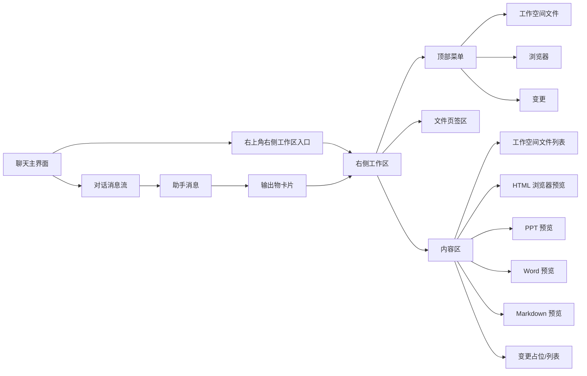
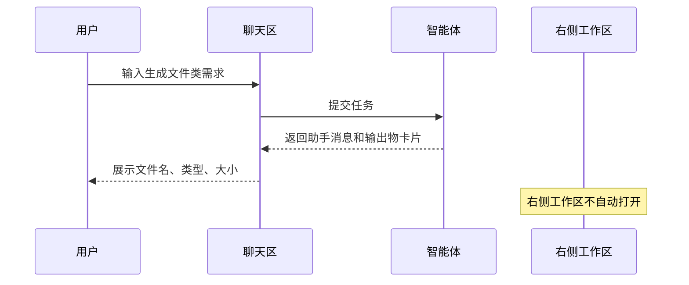
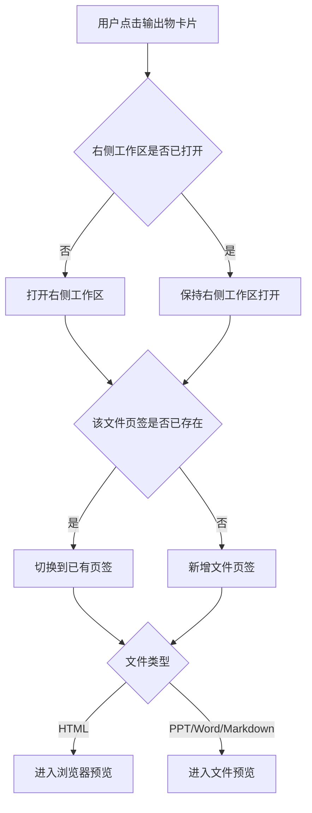
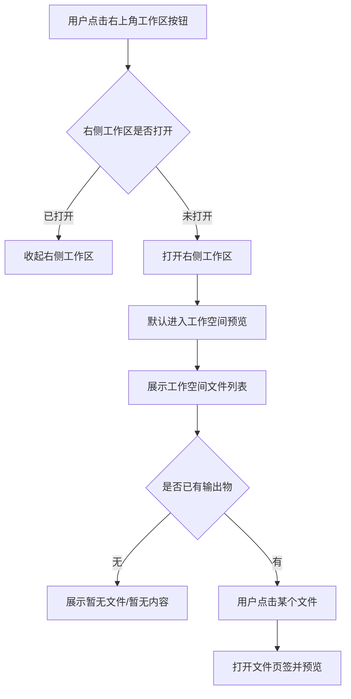
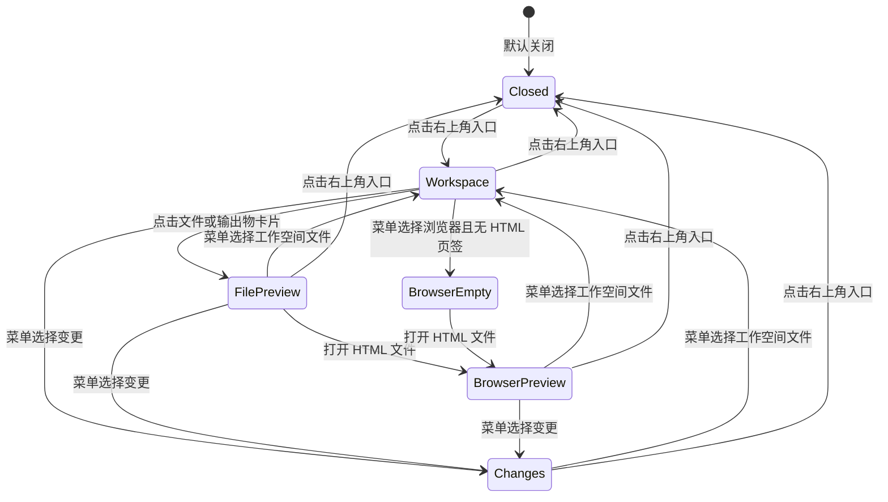
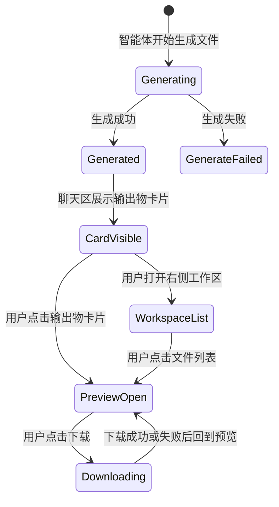

# PRD：右侧工作区与输出物预览

版本：V1.0  
状态：原型评审版  
适用端：桌面 Web / 桌面客户端内嵌 Web  
面向对象：产品、前端、后端、测试、设计  

## 1. 背景

智能体在对话中会生成文件类输出物，例如 HTML 页面、PPT、Word 文档和 Markdown 文档。用户需要在不离开当前对话的情况下快速查看、确认和下载这些输出物。

如果每次生成文件后都自动弹出预览，会打断用户继续对话；如果只提供下载，又会让用户频繁离开产品。因此本期设计一个“右侧工作区”：用户可以主动打开右侧区域，在其中查看工作空间文件、打开浏览器式 HTML 预览、查看文件预览页签，并按需下载文件。

本 PRD 描述真实产品应具备的产品行为和交互规则，不描述当前 Demo 的字符串匹配、Mock 数据、本地状态等实现细节。

## 2. 目标

### 2.1 产品目标

1. 用户在聊天中生成文件后，可以看到明确的输出物卡片。
2. 生成文件后不强制打开右侧工作区，避免打断对话。
3. 用户点击输出物卡片，或从右侧工作区的“工作空间文件”中选择文件后，才进入预览。
4. 右侧工作区支持多文件页签，用户可以在多个输出物之间快速切换。
5. 不同文件类型采用符合用户预期的预览形态：
   - HTML：浏览器式预览，自适应面板宽度；
   - PPT：固定幻灯片画布；
   - Word：固定纸张页面，连续分页，上下滚动；
   - Markdown：阅读型文档，上下滚动。
6. 下载入口只在具体文件可下载时出现，不在无文件状态展示无效操作。

### 2.2 非目标

本期不做：

- 在线编辑文件；
- 文件重命名、移动、删除；
- 分享、转发、复制链接；
- 上传文件到工作区；
- 文件版本对比；
- 多人协作批注；
- PDF、Excel、图片、音视频、压缩包预览；
- 自动化任务运行结果的输出物预览。

## 3. 术语定义

| 名称 | 定义 |
| --- | --- |
| 输出物 | 智能体在聊天过程中生成的文件类结果。 |
| 输出物卡片 | 聊天消息中展示文件名、类型、大小的卡片入口。 |
| 右侧工作区 | 位于聊天主界面右侧的可拖拽面板，用于承载工作空间文件、浏览器、变更和文件预览页签。 |
| 工作空间文件 | 当前会话或当前任务中可被用户查看的文件列表，本期主要包含智能体生成的输出物。 |
| 文件页签 | 右侧工作区顶部打开的文件标签，支持多个文件同时打开和切换。 |
| 浏览器预览 | HTML 输出物使用的预览模式，包含前进、后退、地址栏、刷新和下载入口。 |

## 4. 本期范围

### 4.1 文件类型范围

| 文件类型 | 扩展名示例 | 本期预览方式 |
| --- | --- | --- |
| HTML | `.html` / `.htm` | 浏览器式预览，自适应右侧面板宽度 |
| PPT | `.pptx` | 固定比例幻灯片画布，可显示缩略图区域 |
| Word | `.docx` | 固定纸张宽度，连续分页，上下滚动 |
| Markdown | `.md` / `.markdown` | 渲染为阅读文档，上下滚动 |

### 4.2 场景范围

本期只覆盖聊天输出物：

- 用户通过聊天向智能体提出生成文件需求；
- 智能体完成后，在助手消息中返回输出物卡片；
- 用户通过卡片或右侧工作区打开预览；
- 用户下载输出物。

不覆盖：

- 自动化任务输出物；
- 项目文件管理；
- 外部文件上传后的预览；
- 历史会话跨会话文件检索。

## 5. 用户故事

1. 作为用户，我希望智能体生成文件后先在对话里给我一个文件卡片，而不是立刻打断我弹出预览。
2. 作为用户，我希望点击文件卡片时，右侧出现预览，方便我一边看对话一边看结果。
3. 作为用户，我希望不点卡片也能主动打开右侧工作区，从工作空间文件里找到刚生成的文件。
4. 作为用户，我希望多个文件可以同时打开成页签，避免来回重新打开。
5. 作为用户，我希望 HTML 像网页一样预览，并能随右侧面板宽度变化自适应。
6. 作为用户，我希望 Word 像真实文档一样一页一页连续展示，而不是被压缩成奇怪比例。
7. 作为用户，我希望下载按钮只在我正在查看某个文件时出现，避免误点无效按钮。
8. 作为用户，我希望右侧工作区可以拖拽调整宽度，以便根据当前文件类型决定看多宽。

## 6. 信息架构

## 7. 总体用户流程

### 7.1 生成输出物但不自动打开预览

### 7.2 点击输出物卡片打开预览

### 7.3 从右上角主动打开右侧工作区

### 7.4 切换右侧工作区模块

## 8. 页面与组件说明

## 8.1 聊天输出物卡片

输出物卡片展示在助手消息内，位于文本回复下方。

### 展示字段

| 字段 | 是否必填 | 展示规则 |
| --- | --- | --- |
| 文件图标 | 是 | 按文件类型展示不同图标和颜色。 |
| 文件名 | 是 | 单行展示，超长省略；鼠标悬浮可展示完整文件名。 |
| 文件类型 | 是 | 展示为 HTML、PPT、Word、Markdown。 |
| 文件大小 | 是 | 小于 1KB 用 B；小于 1MB 用 KB；大于等于 1MB 用 MB。 |
| 打开提示图标 | 是 | 表示点击后可打开右侧预览。 |

### 行为规则

1. 输出物生成完成后，聊天区展示卡片。
2. 展示卡片不自动打开右侧工作区。
3. 用户点击卡片后：
   - 若右侧工作区未打开，则打开；
   - 若对应文件页签不存在，则新增页签；
   - 若对应文件页签已存在，则切换到该页签；
   - 根据文件类型进入相应预览模式。
4. 点击卡片不触发下载。
5. 输出物生成失败时，不展示成功卡片，应在助手消息中展示失败说明。

## 8.2 右上角右侧工作区入口

聊天主界面右上角提供右侧工作区入口按钮。

### 行为规则

| 当前状态 | 点击后行为 |
| --- | --- |
| 右侧工作区关闭 | 打开右侧工作区，默认进入工作空间预览。 |
| 右侧工作区打开 | 收起右侧工作区。 |
| 右侧工作区打开且正在预览文件 | 收起右侧工作区，但保留已打开页签状态。 |

### 重点规则

- 用户点击右上角入口时，不自动打开最近生成的输出物。
- 默认展示“工作空间文件”列表。
- 若当前没有任何文件，展示空状态。
- 入口按钮在右侧工作区打开时应有高亮态。

## 8.3 右侧工作区整体布局

右侧工作区由三部分组成：

1. 顶部栏；
2. 内容区；
3. 左侧拖拽分隔线。

### 顶部栏

顶部栏包含：

| 区域 | 内容 |
| --- | --- |
| 左侧 | 模块菜单按钮 |
| 中间 | 文件页签区 |
| 右侧 | 本期不放全局文件操作 |

### 模块菜单

点击左侧菜单按钮后，展示模块菜单。

本期菜单项：

1. 工作空间文件；
2. 浏览器；
3. 变更。

不展示“概览”。

### 模块切换规则

| 用户操作 | 结果 |
| --- | --- |
| 点击“工作空间文件” | 内容区展示工作空间文件列表；文件页签不高亮。 |
| 点击“浏览器” | 若当前不是 HTML 预览，展示浏览器空状态；文件页签不高亮。 |
| 点击“变更” | 内容区展示变更占位或变更列表；文件页签不高亮。 |
| 点击某个文件页签 | 内容区展示该文件预览；该页签高亮。 |

### 拖拽宽度

右侧工作区左边缘提供拖拽手柄。

规则：

- 鼠标悬浮时显示可拖拽反馈；
- 拖拽时改变右侧工作区宽度；
- 左侧聊天区随右侧宽度变化而变宽或变窄；
- 右侧工作区宽度应有最小值，避免内容不可用；
- 右侧工作区宽度应有最大值，避免完全挤压聊天区；
- 拖拽过程中不应选中文本；
- 拖拽结束后保持当前宽度，直到用户再次调整或刷新页面。

建议桌面端范围：

| 项 | 建议值 |
| --- | --- |
| 最小宽度 | 420px |
| 默认宽度 | 640px |
| 最大宽度 | 不超过工作区宽度减去聊天区最小可用宽度 |

## 8.4 工作空间文件

工作空间文件是右侧工作区默认打开的内容。

### 入口

- 点击右上角工作区入口后默认进入；
- 在右侧菜单中点击“工作空间文件”进入。

### 展示内容

文件列表展示当前聊天中已生成的输出物。

字段：

| 字段 | 说明 |
| --- | --- |
| 文件图标 | 按类型展示。 |
| 文件名 | 单行展示，超长省略。 |
| 类型与大小 | 示例：`PPT · 2.4 MB`。 |

### 排序

- 默认按生成时间倒序；
- 最新生成的文件在上方；
- 重新打开文件不改变排序。

### 空状态

当没有任何文件时：

- 标题区域显示“工作空间预览”或“工作空间文件”；
- 内容区显示“暂无文件”或“暂无内容”；
- 不展示下载按钮。

### 点击文件

用户点击文件后：

1. 若页签不存在，新增页签；
2. 若页签已存在，切换到该页签；
3. 文件列表切换为预览内容；
4. 文件页签高亮；
5. 根据文件类型展示对应预览。

## 8.5 文件页签

文件页签位于右侧工作区顶部中间。

### 创建规则

以下操作会创建或激活文件页签：

- 用户点击聊天输出物卡片；
- 用户在工作空间文件列表中点击文件。

以下操作不会创建页签：

- 文件刚生成完成；
- 用户只打开右侧工作区；
- 用户只打开浏览器空状态；
- 用户只打开变更模块。

### 展示规则

| 元素 | 规则 |
| --- | --- |
| 文件图标 | 按文件类型展示。 |
| 文件名 | 单行展示，超长省略。 |
| 关闭按钮 | 每个页签都有关闭按钮。 |
| 高亮态 | 仅当前内容区正在展示该文件时高亮。 |

### 高亮逻辑

| 当前内容区 | 页签高亮规则 |
| --- | --- |
| 正在预览某个文件 | 对应文件页签高亮。 |
| 工作空间文件列表 | 所有文件页签不高亮。 |
| 浏览器空状态 | 所有文件页签不高亮。 |
| 变更模块 | 所有文件页签不高亮。 |

### 关闭规则

1. 用户点击页签关闭按钮，只关闭页签，不删除文件。
2. 关闭非当前页签时，当前内容区不变。
3. 关闭当前页签时：
   - 若仍有其他文件页签，切换到相邻页签；
   - 若没有其他页签，回到工作空间文件列表。
4. 关闭页签后，用户仍可从工作空间文件列表再次打开该文件。

### 溢出规则

当页签数量较多时：

- 页签区横向滚动；
- 单个页签宽度有上限；
- 文件名超长省略；
- 不换行，不挤压右侧工作区整体布局。

## 8.6 下载

下载是本期唯一的文件操作。

### 出现位置

| 文件类型 | 下载按钮位置 |
| --- | --- |
| HTML | 浏览器工具栏中，刷新按钮右侧。 |
| PPT | 文件内容工具栏右侧。 |
| Word | 文件内容工具栏右侧。 |
| Markdown | 文件内容工具栏右侧。 |

### 不出现的位置

下载按钮不出现在：

- 右侧工作区全局顶部；
- 工作空间文件空状态；
- 浏览器空状态；
- 变更模块；
- 未选中任何文件时。

### 行为规则

1. 用户点击下载按钮后，下载当前正在预览的源文件。
2. 下载文件名应与页签文件名一致。
3. 下载过程中按钮可以进入短暂 loading 态。
4. 下载成功后可展示轻提示，例如“已开始下载”。
5. 下载失败时展示错误提示，例如“下载失败，请稍后重试”。
6. 若文件已失效或不存在，下载按钮不可用或点击后展示明确错误。

### 可用性规则

| 状态 | 下载按钮 |
| --- | --- |
| 当前正在预览可下载文件 | 可点击 |
| 没有选中文件 | 不展示 |
| 文件仍在生成 | 禁用或不展示 |
| 文件生成失败 | 不展示 |
| 文件已过期/被删除 | 禁用，并展示错误提示 |

## 9. 各文件类型预览规则

## 9.1 HTML 预览

HTML 使用浏览器式预览。

### 顶部浏览器栏

浏览器栏包含：

- 后退；
- 前进；
- 地址栏；
- 刷新；
- 下载。

### 地址栏

地址栏展示当前 HTML 文件的预览地址或虚拟地址。

规则：

- 地址过长时中间或末尾省略；
- 地址栏只用于展示，不要求本期支持手动输入；
- 鼠标悬浮可展示完整地址。

### 自适应规则

HTML 内容应随右侧工作区宽度自适应：

- 拖拽右侧工作区变宽时，HTML 内容区域变宽；
- 拖拽右侧工作区变窄时，HTML 内容区域变窄；
- HTML 内部布局按网页规则响应式调整；
- 不应固定成 Word 或 PPT 那样的页面宽度；
- 若 HTML 内容本身超出可视区域，允许内部滚动。

### 刷新规则

点击刷新按钮：

- 重新加载当前 HTML 预览；
- 刷新过程中可展示轻微 loading 态；
- 刷新失败时展示错误提示，不关闭页签。

## 9.2 PPT 预览

PPT 使用固定幻灯片画布。

### 结构

PPT 预览由两部分组成：

1. 上方文件工具栏：文件名 + 下载；
2. 下方预览区：缩略图区域 + 幻灯片画布。

### 固定画布规则

- 幻灯片保持固定比例，建议 16:9；
- 拖拽右侧工作区时，不改变幻灯片比例；
- 面板过窄时，允许横向滚动；
- 面板过高或过宽时，不强行拉伸幻灯片到失真。

### 缩略图规则

- 左侧可展示幻灯片缩略图；
- 当前页缩略图高亮；
- 点击缩略图切换幻灯片；
- 缩略图列表过长时独立纵向滚动。

### 加载与失败

- PPT 预览资源加载中时展示 loading；
- 单页加载失败时，展示该页失败状态，并允许切换其他页；
- 整个 PPT 转换失败时，展示失败说明，并保留下载按钮。

## 9.3 Word 预览

Word 使用固定纸张页面连续预览。

### 结构

Word 预览由两部分组成：

1. 上方文件工具栏：文件名 + 下载；
2. 下方文档预览区：连续纸张页面。

### 页面规则

- 每页保持固定纸张宽度；
- 页面不随右侧工作区宽度缩放；
- 页面之间有明显分割线、阴影或页间距；
- 用户通过上下滚动浏览多页；
- 面板宽度不足时，允许横向滚动；
- 页面内可展示页眉、页脚、裁切角、表格、标题、列表等文档元素。

### 滚动规则

- Word 预览区纵向滚动；
- 不使用“上一页 / 下一页”作为主浏览方式；
- 可以在后续版本补充分页定位，但不替代连续滚动。

### 显示原则

- 优先保证文档版式稳定；
- 不为了适应面板宽度而压缩文字；
- 不把纸张内容重排成普通网页流式布局。

## 9.4 Markdown 预览

Markdown 使用阅读型文档预览。

### 结构

Markdown 预览由两部分组成：

1. 上方文件工具栏：文件名 + 下载；
2. 下方 Markdown 阅读区。

### 渲染规则

支持展示：

- 标题；
- 段落；
- 列表；
- 引用；
- 代码块；
- 表格；
- 链接。

### 滚动与布局

- Markdown 内容区纵向滚动；
- 阅读区可以设置最大阅读宽度；
- 面板变宽时，正文不应无限拉长到难以阅读；
- 面板变窄时，正文可适当换行；
- 代码块和表格过宽时，允许局部横向滚动。

## 10. 右侧工作区状态规则

### 10.1 文件生成状态

### 10.2 右侧工作区打开规则

| 触发动作 | 右侧工作区行为 |
| --- | --- |
| 文件生成成功 | 不自动打开。 |
| 点击输出物卡片 | 打开并预览该文件。 |
| 点击右上角入口 | 打开工作空间文件列表。 |
| 点击工作空间文件 | 打开并预览该文件。 |
| 点击右上角入口且面板已打开 | 收起面板。 |

### 10.3 模块与页签关系

| 当前模块/内容 | 菜单状态 | 页签状态 |
| --- | --- | --- |
| 工作空间文件列表 | 工作空间文件选中 | 所有页签不高亮 |
| 浏览器空状态 | 浏览器选中 | 所有页签不高亮 |
| HTML 文件预览 | 浏览器可作为当前上下文 | HTML 页签高亮 |
| PPT/Word/Markdown 文件预览 | 文件预览上下文 | 当前文件页签高亮 |
| 变更 | 变更选中 | 所有页签不高亮 |

## 11. 异常与边界

## 11.1 无文件

场景：用户打开右侧工作区，但当前没有输出物。

表现：

- 默认进入工作空间文件；
- 显示“工作空间预览”；
- 内容区显示“暂无内容”或“暂无文件”；
- 不展示下载按钮；
- 不创建空页签。

## 11.2 文件生成失败

场景：智能体尝试生成文件失败。

表现：

- 聊天区展示失败说明；
- 不展示成功输出物卡片；
- 不进入工作空间文件列表；
- 不创建页签；
- 不展示下载按钮。

## 11.3 文件预览失败

场景：文件存在，但预览资源加载失败。

表现：

- 文件页签仍然保留；
- 内容区展示“预览加载失败”；
- 若源文件可下载，仍展示下载按钮；
- 用户可关闭页签或稍后重试。

## 11.4 文件已失效

场景：用户打开历史页签或文件列表，但文件已过期、被清理或不可访问。

表现：

- 内容区展示“文件不存在或已失效”；
- 下载按钮禁用或隐藏；
- 页签允许关闭；
- 工作空间文件列表应同步刷新状态。

## 11.5 重复打开同一文件

场景：用户多次点击同一输出物卡片或同一文件列表项。

表现：

- 不重复创建页签；
- 切换到已有页签；
- 保留该页签原有预览状态。

## 11.6 关闭当前页签

场景：用户关闭当前正在预览的页签。

表现：

- 若存在相邻页签，切换到相邻页签；
- 若不存在其他页签，回到工作空间文件列表；
- 关闭页签不删除文件。

## 11.7 面板过窄

场景：用户把右侧工作区拖得很窄。

表现：

- 不允许低于最小宽度；
- HTML 继续自适应；
- PPT、Word 保持固定内容尺寸，出现横向滚动；
- Markdown 正文换行，代码块和表格可横向滚动。

## 11.8 面板收起后再打开

场景：用户收起右侧工作区后再次打开。

表现：

- 点击右上角入口再次打开时，默认进入工作空间文件列表；
- 已打开的文件页签可以保留；
- 不自动切到最近预览页签，除非用户点击页签或文件。

## 12. 文案规范

| 场景 | 推荐文案 |
| --- | --- |
| 右侧工作区默认标题 | 工作空间预览 |
| 输出物空状态标题 | 输出物 |
| 输出物空状态说明 | 暂无内容。生成文件后会显示在这里。 |
| 工作空间文件空状态 | 暂无文件 |
| 浏览器空状态标题 | 浏览器 |
| 浏览器空状态说明 | 打开 HTML 输出物后，这里会以浏览器方式预览页面。 |
| 变更空状态标题 | 变更 |
| 下载成功提示 | 已开始下载 |
| 下载失败提示 | 下载失败，请稍后重试 |
| 预览失败提示 | 预览加载失败，请稍后重试或下载源文件 |

## 13. 响应式规则

### 桌面端

- 右侧工作区从右侧展开；
- 支持拖拽调整宽度；
- 左侧聊天区随右侧工作区宽度变化；
- 聊天输入框不应被右侧工作区覆盖；
- 顶部页签过多时横向滚动。

### 小屏或窄窗口

- 右侧工作区可切换为全屏覆盖；
- 拖拽宽度可禁用；
- 顶部页签仍需可横向滚动；
- 文件预览内容保持自身规则：
  - HTML 自适应；
  - Word/PPT 可横向滚动；
  - Markdown 纵向滚动。

## 14. 可用性与体验要求

1. 文件生成后不打断用户当前输入和阅读。
2. 右侧工作区打开、关闭、拖拽都应有即时反馈。
3. 页签关闭按钮需要避免误触，点击关闭时不触发页签切换。
4. 文件卡片、文件列表、页签三者应指向同一个文件对象。
5. 下载入口必须与当前预览文件强绑定，不能下载错误文件。
6. 切换“变更”或“工作空间文件”后，文件页签不应保持选中态。
7. 右侧工作区不应出现分享、上传等本期未支持操作。
8. 文件名过长时所有入口都应有省略策略。
9. 预览失败不应导致整个右侧工作区崩溃。
10. 用户关闭右侧工作区后，聊天主界面应恢复完整可用宽度。

## 15. 验收标准

### 15.1 输出物生成与卡片

| 编号 | 验收项 |
| --- | --- |
| A1 | 生成 HTML、PPT、Word、Markdown 后，聊天区展示输出物卡片。 |
| A2 | 输出物卡片展示文件名、类型、大小和打开提示。 |
| A3 | 文件生成后右侧工作区不会自动打开。 |
| A4 | 点击输出物卡片后，右侧工作区打开并预览对应文件。 |

### 15.2 右侧工作区

| 编号 | 验收项 |
| --- | --- |
| B1 | 点击右上角入口时，右侧工作区打开到工作空间文件列表。 |
| B2 | 再次点击右上角入口时，右侧工作区收起。 |
| B3 | 右侧工作区可拖拽调整宽度。 |
| B4 | 菜单中仅展示工作空间文件、浏览器、变更。 |
| B5 | 切换到工作空间文件或变更时，文件页签不保持高亮。 |

### 15.3 文件页签

| 编号 | 验收项 |
| --- | --- |
| C1 | 点击文件卡片或工作空间文件列表会创建或激活页签。 |
| C2 | 重复点击同一文件不会创建重复页签。 |
| C3 | 页签可以关闭，关闭页签不删除文件。 |
| C4 | 页签过多时横向滚动，不破坏顶部布局。 |

### 15.4 各类型预览

| 编号 | 验收项 |
| --- | --- |
| D1 | HTML 预览包含浏览器栏、地址栏、刷新和下载。 |
| D2 | HTML 内容随右侧工作区宽度自适应。 |
| D3 | PPT 保持固定幻灯片比例，面板过窄时可滚动查看。 |
| D4 | Word 保持固定纸张宽度，连续分页，上下滚动。 |
| D5 | Markdown 渲染为阅读文档，支持上下滚动。 |

### 15.5 下载

| 编号 | 验收项 |
| --- | --- |
| E1 | 下载按钮只在正在预览具体文件时出现。 |
| E2 | HTML 下载按钮位于浏览器栏刷新按钮右侧。 |
| E3 | PPT、Word、Markdown 下载按钮位于文件内容工具栏右侧。 |
| E4 | 无文件、工作空间空状态、浏览器空状态和变更模块不展示下载按钮。 |
| E5 | 点击下载时下载当前正在预览的文件。 |

## 16. 待确认问题

1. 右侧工作区宽度是否需要跨会话记忆。
2. 工作空间文件是否只显示当前会话输出物，还是显示当前任务下所有输出物。
3. HTML 浏览器地址栏是否允许用户手动输入 URL。
4. PPT 是否需要支持缩略图点击切页、键盘左右键切页。
5. Word 是否需要显示页码导航或缩放比例。
6. Markdown 是否需要目录、锚点、代码高亮。
7. 变更模块本期是占位，还是需要展示真实文件变更。

