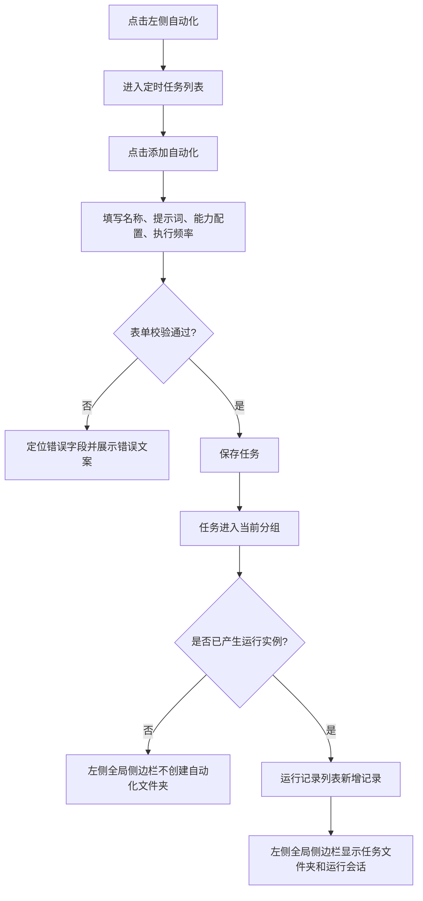
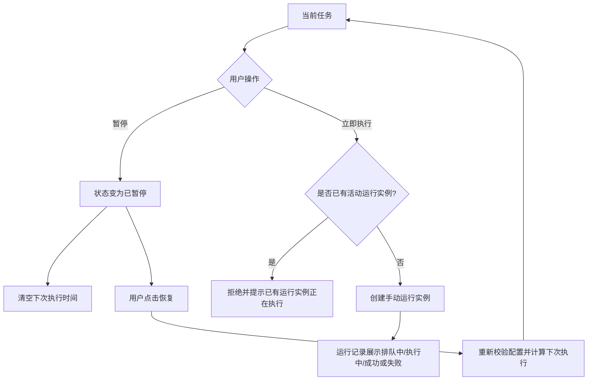
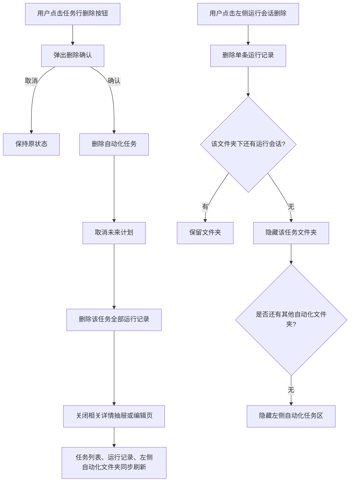

# COMAC AI 自动化定时任务 PRD

| 项目 | 内容 |
| --- | --- |
| 文档版本 | V1.0 |
| 文档状态 | 开发基线初稿 |
| 更新时间 | 2026-07-07 |
| 适用对象 | 产品、交互、前端、后端、测试、平台 |
| 产品口径 | 正式产品口径，不以纯前端 Demo 的限制为准 |

## 0. 文档使用规则

1. 本文中的“必须”“默认”“不得”均为 V1 开发规则，不是建议项。
2. 本文未写入的能力不进入 V1 验收范围；不得根据参考产品截图自行增加业务功能。
3. 页面文案、状态名称、按钮可用性、确认弹窗和异常反馈以本文为准。
4. 当前 Demo 的 Mock 方案记录在项目根目录 `PROJECT_CONTEXT.md`，不属于正式产品规则。
5. 若后续评审修改规则，应同步更新文档版本、接口契约和验收用例，不能只修改前端表现。

## 1. 产品概述

### 1.1 背景

用户需要周期性地调用智能体完成重复工作，例如每日适航动态汇总、AOG 供应商风险周报、型号例会材料准备。手工重复创建任务容易遗漏，也无法稳定追溯每次执行结果。

自动化功能负责保存任务定义和调度计划，在服务端按时创建执行实例，调用智能体完成任务，并记录每次运行的状态、输入快照、输出和异常。

### 1.2 产品目标

- 用户可以在 3 分钟内创建一项自动化任务；
- 客户端关闭后，任务仍由服务端按计划执行；
- 用户可以在定时任务列表判断任务是否启用、下一次何时执行，并在运行记录中查看每次执行是否成功；
- 用户可以暂停、恢复、编辑、立即执行和删除任务；
- 每次执行均可追溯，不因任务后续编辑而改变历史记录；
- 异常具有明确原因、恢复路径和可追溯记录。

### 1.3 成功指标

- 创建流程提交成功率不低于 99%；
- 95% 的计划任务在计划时间后 60 秒内进入排队状态；
- 非业务原因导致的调度重复执行率低于 0.01%；
- 用户可以在 3 次点击内从任务列表进入最近一次执行详情；
- 所有任务写操作均具备幂等保护和状态一致性校验。

### 1.4 用户故事

| 编号 | 角色 | 用户故事 | 验收要点 |
| --- | --- | --- | --- |
| US01 | 业务用户 | 我希望创建一个定时任务，让 COMAC AI 每天或每周自动处理重复工作 | 可以填写名称、提示词、能力配置和执行频率；保存后进入“当前”分组 |
| US02 | 业务用户 | 我希望在任务列表快速知道哪些任务还在运行计划、哪些已暂停 | 列表只展示“当前”和“已暂停”两组；右侧只展示下次执行或已暂停 |
| US03 | 业务用户 | 我希望执行结果不要挤在任务列表里，而是集中在运行记录里查看 | 定时任务列表不展示成功、失败、排队中、执行中等运行结果；运行状态只在运行记录列表和详情中展示 |
| US04 | 业务用户 | 我希望暂停任务时保留配置，之后可以恢复 | 暂停后不再产生计划触发；恢复后重新计算未来下次执行时间 |
| US05 | 业务用户 | 我希望可以手动立即执行一次任务，不影响原计划 | 立即执行创建手动运行实例；不改变任务状态、计划和下次执行时间 |
| US06 | 业务用户 | 我希望删除不再需要的自动化任务，同时清理它产生的运行会话 | 删除任务后任务列表移除，该任务关联运行记录和左侧会话同步删除 |
| US07 | 业务用户 | 我希望左侧全局侧边栏自动整理已经跑过的自动化会话 | 只有产生过运行记录的任务才显示为文件夹；新建但未运行的任务不显示文件夹 |
| US08 | 业务用户 | 我希望可以删除左侧某条自动化运行会话，但不误删自动化任务本身 | 左侧文件夹不可删除；文件夹内运行会话可删除；删空后文件夹自动隐藏 |
| US09 | 业务用户 | 我希望从运行记录查看每次执行的输入、输出和异常 | 运行详情展示输入快照、结果、失败原因和可执行操作 |

### 1.5 用户流程图

#### 创建并产生运行记录



#### 暂停、恢复、立即执行



#### 删除任务和左侧会话



## 2. V1 范围

### 2.1 包含

- 定时任务列表；
- 运行记录列表与详情；
- 新建和编辑任务；
- 周期、固定间隔、单次执行；
- 任务搜索、运行记录搜索；
- 暂停、恢复、立即执行、删除；
- 运行失败自动重试；
- 手动重新执行失败记录；
- 终止排队中或运行中的实例；
- 操作记录和产品内异常通知。

### 2.2 不包含

- 外部连接器；
- 推送到微信小程序；
- 生效日期区间；
- 从模板添加；
- 批量管理；
- 任务复制；
- 多人协同编辑；
- 跨组织共享；
- 用户自定义失败重试次数；
- 用户自定义超时时长。

页面不得显示上述未纳入功能的可操作入口。“从模板添加”和“批量管理”只有在进入对应版本后才能展示。

### 2.3 功能描述

#### 定时任务管理

- 定时任务管理页用于维护长期自动化配置；
- 任务保存后默认进入 `ACTIVE`；
- 任务列表只表达“计划是否继续”和“下一次何时执行”，不表达最近一次运行成功或失败；
- 任务可以暂停、恢复、编辑、立即执行和删除；
- 暂停只停止未来计划，不删除任务配置，不删除历史运行记录；
- 恢复只允许从 `PAUSED` 恢复到 `ACTIVE`；
- 立即执行只创建一次手动运行实例，不改变原计划；
- 删除任务会删除任务配置，并同步删除该任务下全部运行记录。

#### 运行记录

- 运行记录用于查看每次实际执行；
- 运行状态、成功失败、输出结果、失败原因都只在运行记录列表和运行详情中展示；
- 运行记录列表不提供状态筛选、触发方式筛选和时间范围筛选；
- 用户可以搜索运行记录；
- 用户可以从运行记录详情终止活动实例或重新执行失败类记录；
- 用户可以删除单条运行记录；删除运行记录不影响自动化任务配置。

#### 左侧全局侧边栏

- 左侧全局侧边栏不是任务配置管理入口，而是运行会话入口；
- 自动化任务只有在产生运行记录后，才会在左侧显示为文件夹；
- 新建但尚未运行的自动化任务不显示文件夹；
- 文件夹本身不能删除；
- 文件夹内运行会话可以删除；
- 文件夹内运行会话删空后，文件夹自动隐藏；
- 所有自动化文件夹都隐藏后，“自动化任务”区域整体不展示。

## 3. 名词与状态边界

| 名词 | 定义 |
| --- | --- |
| 自动化任务 | 用户维护的长期配置，包含名称、提示词、能力配置和执行计划 |
| 运行实例 | 自动化任务在某个触发点产生的一次实际执行 |
| 计划触发 | 调度系统根据任务计划自动创建运行实例 |
| 手动触发 | 用户点击“立即执行”创建运行实例 |
| 重新执行 | 用户从历史运行记录基于原输入快照创建新的运行实例 |
| 任务状态 | 任务是否继续产生新的计划执行 |
| 运行状态 | 某一次运行实例当前所处阶段 |
| 配置快照 | 运行实例创建时固化的任务名称、提示词、能力和计划信息 |
| 下次执行时间 | 当前时间之后，调度器预计创建下一次计划实例的时刻 |

“任务运行中”和“运行实例正在执行”不是同一概念：任务“运行中”代表计划已启用；实例“运行中”代表智能体正在处理某一次任务。

## 4. 数据范围

### 4.1 数据归属

- V1 自动化任务按创建用户归属；
- 任务列表仅展示当前登录用户创建的任务；
- 运行记录仅展示当前登录用户任务产生的记录；
- 不展示其他用户任务数量、名称、提示词或结果；
- 跨用户共享、组织级查看、代管理和协同编辑不纳入 V1 范围。

### 4.2 资源不存在

查询不存在、已删除或不属于当前用户数据范围的任务时，统一返回 HTTP `404`，业务码 `AUTOMATION_NOT_FOUND`，页面文案：

> 任务不存在或已删除

## 5. 页面、路由与导航

### 5.1 路由

| 页面 | 路由 | 说明 |
| --- | --- | --- |
| 定时任务列表 | `/automation/tasks` | 点击左侧“自动化”默认进入 |
| 运行记录列表 | `/automation/runs` | 保留搜索关键词 |
| 新建任务 | `/automation/tasks/new` | 独立页面 |
| 编辑任务 | `/automation/tasks/:taskId/edit` | 复用创建表单 |
| 运行详情 | `/automation/runs/:runId` | 右侧抽屉；路由可复制和刷新恢复 |

访问 `/automation` 时重定向至 `/automation/tasks`。

### 5.2 左侧导航

- 点击“自动化”后，该导航项进入选中状态；
- 主工作区切换到自动化模块；
- 左侧全局侧边栏中的“任务”列表保持原样；
- 左侧全局侧边栏中的“自动化任务”区按第 5.4 节规则由运行记录动态生成；
- 再次点击已选中的“自动化”时，如果当前位于创建、编辑或运行详情页面，则返回定时任务列表；
- 表单存在未保存修改时，返回前必须触发离开确认。

### 5.3 页签

- 页签固定为“定时任务”“运行记录”；
- 点击页签切换路由，不整页刷新；
- 页签切换后保留各自最近一次搜索关键词，直到退出登录或用户主动清除；
- 创建和编辑页面不显示页签，只显示面包屑和保存操作。

### 5.4 左侧全局侧边栏自动化任务区

左侧全局侧边栏的“自动化任务”区用于承载已经产生运行会话的自动化任务，不等同于自动化配置管理列表。

#### 展示条件

- 当前用户没有任何可展示自动化文件夹时，不显示“自动化任务”整个区域；
- 自动化任务创建成功但尚未产生任何运行记录时，不创建左侧文件夹；
- 自动化任务产生第一条运行记录后，才在左侧“自动化任务”区创建对应文件夹；
- 一个自动化任务对应一个二级文件夹，文件夹名称使用当前任务名称；
- 文件夹下只展示该任务产生的运行会话；
- 文件夹下全部运行会话被删除后，该文件夹自动隐藏；
- 全部自动化文件夹都隐藏后，“自动化任务”区域整体隐藏。

#### 文件夹规则

- 文件夹可以展开和收起；
- 文件夹默认展开；
- 文件夹本身不提供删除按钮；
- 用户不能直接删除文件夹；
- 文件夹是否存在由其下是否存在运行会话决定；
- 任务重命名后，文件夹名称在下一次数据刷新时同步更新；
- 任务删除后，文件夹和其下全部运行会话同步消失。

#### 运行会话规则

- 文件夹内每一行代表一条运行记录；
- 点击运行会话打开对应运行详情；
- 运行会话右侧展示运行时间，时间规则与运行记录列表一致；
- 运行会话行提供删除按钮；
- 删除运行会话只删除该条运行记录，不删除自动化任务配置；
- 删除最后一条运行会话后，对应文件夹自动隐藏；
- 如果用户正在查看被删除的运行详情，删除成功后关闭详情并回到默认工作区或运行记录列表。

## 6. 全局交互规范

### 6.1 时间

- 服务端统一存储 UTC ISO 8601 时间；
- V1 调度时区固定为 `Asia/Shanghai`，创建页不提供时区选择；
- 页面首次出现绝对时间时显示 `YYYY-MM-DD HH:mm`；
- 任务列表下次执行时间在 24 小时内显示相对时间，同时通过提示框展示绝对时间；
- 超过 24 小时直接显示绝对时间；
- 所有时间精确到分钟，运行耗时精确到秒；
- 前端展示文案中统一使用“北京时间”。

### 6.2 成功反馈

| 操作 | 成功提示 |
| --- | --- |
| 创建 | 自动化任务已创建 |
| 编辑 | 自动化任务已更新 |
| 暂停 | 任务已暂停 |
| 恢复 | 任务已恢复 |
| 立即执行 | 任务已加入执行队列 |
| 删除 | 自动化任务已删除 |
| 终止运行 | 已提交终止请求 |
| 重新执行 | 已创建新的运行任务 |

成功提示显示 3 秒，可提前关闭。列表数据必须以服务端返回值为准，不能只显示提示而不刷新状态。

### 6.3 请求中的按钮状态

- 写操作请求发出后，对应按钮显示加载状态并禁用；
- 同一操作未返回前不得重复提交；
- 仅锁定当前任务或当前表单，不阻塞其他任务的操作；
- 请求超过 10 秒，继续等待但提示“处理时间较长，请稍候”；
- 请求失败后恢复按钮可用状态，不清空用户输入。

### 6.4 键盘与可访问性

- 所有按钮、页签、菜单、输入框和弹窗均可通过键盘操作；
- 焦点顺序与视觉顺序一致；
- 弹窗打开时焦点锁定在弹窗内，关闭后回到触发按钮；
- 表单错误同时提供文字，不只依赖红色；
- 图标按钮必须提供可读名称或提示框。

## 7. 定时任务列表页

### 7.1 页面结构

从上至下依次为：

1. 页签：定时任务、运行记录；
2. 搜索框；
3. 主操作按钮“添加自动化”；
4. 列表加载区；
5. 按状态分组的任务列表；
6. 加载更多或列表结束提示。

V1 不展示“批量管理”和“从模板添加”。

### 7.2 搜索

- 占位文案：`搜索自动化任务`；
- 仅搜索任务名称，不搜索提示词和输出；
- 去除关键词首尾空格；
- 输入 300 毫秒后自动发起查询；
- 按 Enter 立即查询，并取消尚未触发的防抖请求；
- 关键词最长 50 个字符，超出部分前端不再录入；
- 有内容时显示清除按钮；点击后立即恢复全部结果；
- 新请求发出时取消旧请求或忽略旧响应，禁止旧响应覆盖新结果；
- 搜索词同步到 URL 参数 `q`，刷新页面后恢复；
- 搜索失败不清空上一次成功结果，在列表上方显示可重试提示。

### 7.3 分组与排序

列表分为两个分组，空分组不展示标题：

1. **当前**：任务状态为 `ACTIVE`；
2. **已暂停**：任务状态为 `PAUSED`。

分组内排序规则：

- `ACTIVE`：按 `nextRunAt` 升序；
- `PAUSED`：按 `updatedAt` 倒序；
- 相同时间使用任务 `id` 倒序保证顺序稳定。

### 7.4 任务行字段

每行从左至右显示：

| 字段 | 规则 |
| --- | --- |
| 名称 | 单行显示，超出省略；悬停展示完整名称 |
| 计划摘要 | 由后端返回 `scheduleSummary`，前端不自行拼接业务语义 |
| 下次执行 | `ACTIVE` 展示；其他状态展示对应状态说明 |
| 删除 | 显示删除按钮，点击后弹出删除确认 |
| 更多操作 | 根据任务状态显示可用操作 |

任务名称和计划摘要之间用弱分隔视觉处理，不使用表格竖线。

任务行不展示描述摘要、提示词摘要、输出摘要、最近运行状态、成功/失败结果、排队中或执行中文案。运行结果只在运行记录列表和运行详情中展示；提示词只在创建/编辑页和运行详情输入快照中展示。

### 7.5 任务行点击

- 点击任务名称或计划摘要进入编辑页；
- 点击更多菜单不触发行点击；
- 任务被其他端删除时，进入编辑页返回统一不存在页面，并从本地列表移除。

### 7.6 行内状态文案

| 条件 | 右侧文案 |
| --- | --- |
| ACTIVE | `X分钟后执行` 或绝对时间 |
| PAUSED | 已暂停 |

### 7.7 更多菜单

| 任务状态 | 菜单项顺序 |
| --- | --- |
| ACTIVE | 立即执行、编辑、暂停 |
| PAUSED | 恢复、编辑、立即执行 |

规则：

- “立即执行”对暂停任务可用，但不恢复原计划；
- 正在执行时“立即执行”禁用，提示“该任务已有运行实例正在执行”；
- 危险操作“删除”不放在更多菜单中，使用任务行显性删除按钮承载。

### 7.8 分页

- 每次请求 20 条；
- 使用游标分页，不使用页码；
- 滚动接近列表底部 300 像素时自动加载下一页；
- 加载下一页失败时保留已有数据，并显示“加载失败，点击重试”；
- 搜索、状态变化或删除后重新从第一页查询；
- 后端排序必须稳定，避免翻页时重复或遗漏。

### 7.9 列表状态

#### 首次加载

展示 6 行骨架屏，搜索框和“添加自动化”保持可用。

#### 无任务

标题：`还没有自动化任务`

说明：`创建自动化任务，让 COMAC AI 按计划替你完成重复工作。`

按钮：`添加自动化`

#### 搜索无结果

标题：`未找到相关自动化任务`

说明：`请尝试更换关键词。`

按钮：`清除搜索`

#### 首次加载失败

标题：`自动化任务加载失败`

说明：优先展示后端可公开的错误描述；无可用描述时显示 `网络异常，请稍后重试。`

按钮：`重新加载`

## 8. 创建与编辑页面

### 8.1 页面结构

顶部：

- 创建页标题：`自动化 / 添加自动化任务`；
- 编辑页标题：`自动化 / 编辑自动化任务`；
- 次按钮：`取消`；
- 主按钮：创建页显示 `保存`，编辑页显示 `保存修改`。

表单从上到下固定为：

1. 名称；
2. 提示词及执行能力配置；
3. 执行频率。

V1 不显示工作空间、连接器、生效日期区间、小程序推送、专家选择和执行计划预览。

### 8.2 初始化

#### 创建页

- 名称为空；
- 提示词为空；
- 模型默认选择组织默认模型；
- 技能为空；
- 执行频率默认“周期 / 每天 / 09:00”；
- 时区固定 `Asia/Shanghai`；
- 表单初始化不视为已修改。

#### 编辑页

- 首次加载显示表单骨架；
- 全部字段必须来自同一个任务详情响应；
- 加载失败显示整页异常，不展示空表单；
- 任务已被删除时显示“任务不存在或已删除”；
- 加载完成后才开始判断表单是否被修改。

### 8.3 名称

| 项目 | 规则 |
| --- | --- |
| 是否必填 | 是 |
| 字符限制 | 1～50 个 Unicode 字符 |
| 空格 | 保存时去除首尾空格，保留中间空格 |
| 换行 | 不允许录入 |
| 重名 | 允许，不提示，不影响保存 |
| 占位文案 | 例如：每日适航动态推送 |

校验时机：失焦或点击保存。

错误文案：

- 空值：`请输入任务名称`；
- 超长：`任务名称不能超过 50 个字符`。

### 8.4 提示词

| 项目 | 规则 |
| --- | --- |
| 是否必填 | 是 |
| 字符限制 | 1～10,000 个 Unicode 字符 |
| 格式 | 支持多行纯文本 |
| 空格 | 校验时去除首尾空白，保存原始段落格式 |
| 占位文案 | 描述需要 COMAC AI 定时完成的任务、输入范围和输出要求 |
| 字数提示 | 输入达到 8,000 字符后展示计数 `已输入 X / 10,000` |

快捷键：在提示词输入框中，Enter 换行；`Ctrl/Command + Enter` 提交整个表单。

错误文案：

- 空值：`请输入任务提示词`；
- 超长：`提示词不能超过 10,000 个字符`。

### 8.5 模型配置

- 模型必填；
- 下拉列表只返回当前用户可用且支持自动化执行的模型；
- 默认模型不可用时，不自动选择其他模型，显示错误并要求用户选择；
- 选项展示模型名称和组织定义的简短说明；
- 已选模型在编辑时下线，保留原名称并标记“已不可用”；
- 模型不可用时不能保存或恢复任务；
- 无可用模型时显示：`暂无可用于自动化任务的模型，请稍后重试。`

### 8.6 技能配置

- 技能可选，支持多选；
- 选项只展示已启用且支持后台自动执行的技能；
- 同一任务最多选择 10 个技能；
- 技能按照用户选择顺序保存和展示；
- 已选技能失效时标记“已不可用”，必须移除或重新授权后才能保存；
- 超过上限提示：`最多选择 10 个技能`。

### 8.7 执行频率总规则

- 必填；
- 类型固定为“周期”“按间隔”“单次”；
- 切换类型时保留每个类型最近一次合法输入，仅提交当前类型；
- 切换后保留当前表单输入，不展示执行计划预览；
- 时间选择精确到分钟，秒固定为 `00`；
- 用户设备时间只用于展示，最终合法性和 `nextRunAt` 由服务端计算；
- 客户端与服务端时间相差超过 5 分钟时，保存失败并提示刷新设备时间。

### 8.8 周期执行

#### 每天

- 用户选择一个执行时刻 `HH:mm`；
- 每个自然日执行一次；
- 如果保存时当天时刻已过，下次执行为次日该时刻；
- 如果保存时距离当天执行时刻不足 2 分钟，下次执行为次日，防止保存和触发竞争。

摘要格式：`每天 HH:mm`

#### 每周

- 至少选择一个星期；
- 支持多选周一至周日；
- 星期按周一到周日固定顺序展示，不按点击顺序；
- 选择一个统一执行时刻；
- 下次执行取未来最近的“星期 + 时刻”组合；
- 距离本周候选时刻不足 2 分钟时跳到下一个候选日。

错误文案：`请至少选择一个执行日`

摘要示例：

- 一个日期：`每周一 09:00`；
- 两个日期：`每周一、周四 09:00`；
- 三个及以上：`每周一、周三等 3 天 09:00`。

#### 每月

- 支持选择 1～31 日或“每月最后一天”；
- V1 每个任务只允许选择一个日期；
- 选择 29、30、31 日时，如果某月不存在该日期，则在该月最后一个自然日执行；
- “每月最后一天”按当月实际最后一天执行；
- 距离当月候选时刻不足 2 分钟时计算下个月。

摘要示例：`每月 31 日 09:00`、`每月最后一天 18:00`

### 8.9 按间隔执行

- 支持分钟、小时、天；
- 最小间隔 15 分钟；
- 最大间隔 30 天；
- 数值必须为正整数；
- 分钟范围：15～1440；
- 小时范围：1～720；
- 天范围：1～30；
- 保存成功时记录 `anchorAt`；
- 第一次计划执行时间为 `anchorAt + interval`，不会保存后立即执行；
- 后续执行以理论计划时间连续递推，不以实际上一次完成时间递推；
- 暂停后恢复时，以恢复时间作为新的 `anchorAt`，不补跑暂停期间实例；
- 时钟调整和夏令时不影响固定间隔的实际持续时长。

错误文案：

- 空值：`请输入执行间隔`；
- 非整数：`执行间隔必须为整数`；
- 小于最小值：`执行间隔不能少于 15 分钟`；
- 超过最大值：`执行间隔不能超过 30 天`。

摘要示例：`每 30 分钟`、`每 2 小时`、`每 3 天`

### 8.10 单次执行

- 用户选择一个日期和时刻；
- 选择值必须晚于服务端当前时间至少 5 分钟；
- 最远可以选择当前时间之后 365 天；
- 保存后状态为 `ACTIVE`；
- 产生一次计划实例后，不再生成新的计划实例；
- 计划实例进入成功、失败、跳过或取消任一终态后，任务状态进入 `COMPLETED`；
- 从计划实例创建到进入终态期间，任务保持 `ACTIVE`、`nextRunAt` 为空，调度器不得再次创建计划实例；
- 用户需要再次执行时，从运行记录使用“重新执行”，或编辑任务并选择新的单次时间；
- 重新执行不会把原任务从 `COMPLETED` 恢复为 `ACTIVE`。

错误文案：

- 时间过近或已过：`执行时间至少需要晚于当前时间 5 分钟`；
- 超出范围：`单次任务最多可设置在 365 天内`。

摘要格式：`YYYY-MM-DD HH:mm 单次执行`

### 8.11 表单保存条件

保存按钮仅在以下条件全部满足时可用：

- 名称、提示词和执行计划通过前端校验；
- 模型有效；
- 技能数量未超限且全部有效；
- 当前没有保存请求；
- 编辑页至少有一个字段发生变化。

按钮禁用时，点击无响应；悬停可显示第一个未满足条件。

### 8.12 保存流程

1. 用户点击保存或使用 `Ctrl/Command + Enter`；
2. 前端执行完整校验；
3. 第一个错误字段滚动进入可视区域并获得焦点；
4. 前端生成本次提交的幂等键；
5. 创建页调用创建接口，编辑页携带当前 `version` 调用更新接口；
6. 服务端再次校验模型、技能和计划；
7. 成功后提示，并返回定时任务列表；
8. 列表定位到该任务并使用服务端返回数据刷新；
9. 失败时停留当前页面并保留输入。

### 8.13 取消与未保存离开

以下情况触发未保存确认：

- 点击取消；
- 点击左侧其他导航；
- 浏览器后退；
- 关闭或刷新页面；
- 直接修改地址离开当前路由。

只有表单相对初始化值发生有效变化时才触发。

弹窗：

- 标题：`放弃未保存的修改？`
- 说明：`离开后，本次修改将不会保存。`
- 次按钮：`继续编辑`
- 危险按钮：`放弃修改`

保存成功后清除离开拦截。

### 8.14 编辑冲突

- 更新任务必须携带 `version`；
- 如果任务已被其他端修改，服务端返回 HTTP `409`、业务码 `AUTOMATION_VERSION_CONFLICT`；
- 页面不得覆盖服务端新版本；
- 弹窗标题：`任务已在其他位置更新`；
- 说明：`请重新加载最新内容后再修改。当前页面中未保存的内容将被保留为临时副本。`；
- 按钮：`重新加载`、`取消`；
- 点击重新加载前，将当前表单保存在内存中；加载新版本后允许用户手动复制，不自动合并。

## 9. 任务操作

### 9.1 暂停

入口：任务行更多菜单。

确认弹窗：

- 标题：`暂停“{任务名称}”？`
- 说明：`暂停后不会再产生新的计划执行，正在执行的任务不会被终止。`
- 次按钮：`取消`
- 主按钮：`暂停任务`

服务端规则：

- 只有 `ACTIVE` 可以暂停；
- 暂停成功后状态为 `PAUSED`，`nextRunAt` 置空；
- 已创建的 `QUEUED` 实例不自动取消，继续执行；
- 正在执行实例继续执行；
- 重复暂停返回当前最新任务，不报业务错误；
- 暂停期间不产生计划实例，也不记录每个错过时间点。

前端规则：暂停成功后将任务移动至“已暂停”分组，不等待整页刷新。

### 9.2 恢复

入口：已暂停任务更多菜单。

无需二次确认，点击后直接请求。

服务端规则：

- 只有 `PAUSED` 可以恢复；
- 恢复前重新校验模型和技能；
- 周期任务从恢复时刻向后计算最近合法时间；
- 间隔任务以恢复时刻作为新 `anchorAt`；
- 单次任务原计划时间仍在未来 5 分钟以上时恢复；否则返回 `AUTOMATION_SCHEDULE_EXPIRED`，要求编辑时间；
- 暂停期间错过的计划不补跑；
- 恢复成功后状态为 `ACTIVE` 并返回新 `nextRunAt`。

前端：恢复失败时不移动分组；能力失效错误提供“去编辑”按钮。

### 9.3 立即执行

入口：`ACTIVE` 或 `PAUSED` 任务更多菜单。

点击后直接请求，不二次确认。

规则：

- 不改变任务状态、执行计划和 `nextRunAt`；
- 触发类型为 `MANUAL`；
- 使用点击时的最新任务配置创建快照；
- 同一任务存在 `QUEUED` 或 `RUNNING` 实例时拒绝，返回 `AUTOMATION_RUN_CONFLICT`；
- 任务能力失效时拒绝；
- 单次 `COMPLETED` 任务不显示此入口；
- 立即执行请求成功后，运行记录列表新增一条“排队中”记录，用户可进入运行详情查看状态变化。

### 9.4 删除

入口：任务行右侧删除按钮。

确认弹窗：

- 标题：`删除“{任务名称}”？`
- 说明：`删除后不会再产生新的计划执行，该任务的运行记录也会一起删除。`
- 次按钮：`取消`
- 危险按钮：`删除任务`

规则：

- 采用逻辑删除；
- 删除后立即取消尚未生成的未来计划；
- 删除时同步删除该任务下全部运行记录；
- 已存在的 `QUEUED` 实例直接删除，不再出现在运行记录列表；
- 已存在的 `RUNNING` 实例提交终止信号后删除记录，不再出现在运行记录列表；
- 如果用户正在查看该任务的运行详情，删除成功后关闭详情抽屉并返回列表；
- 删除后的任务不出现在列表和普通详情查询中；
- 重复删除视为成功；
- 删除成功后关闭与该任务有关的编辑页或抽屉，返回列表。

### 9.5 系统禁用

满足任一条件时任务进入 `DISABLED`：

- 所选模型或技能被系统标记为不可用；
- 连续 5 个独立运行实例最终失败；
- 安全系统判定任务存在风险。

规则：

- 进入 `DISABLED` 后 `nextRunAt` 置空；
- 自动重试属于同一实例，不单独增加连续失败计数；
- `SUCCESS` 将连续失败计数清零；
- `SKIPPED` 和 `CANCELLED` 不增加也不清零；
- 页面必须展示禁用原因；
- 用户不能直接恢复，必须先编辑并通过校验；
- 系统禁用时向任务所有者发送产品内通知。

## 10. 运行记录列表

### 10.1 页面结构

从上到下为：

1. 页签；
2. 搜索框 `搜索任务或运行记录`；
3. 运行记录列表。

V1 运行记录页面不展示状态筛选、触发方式筛选和时间范围筛选。

### 10.2 搜索

- 搜索范围：任务名称、运行实例 ID；
- 搜索防抖 300 毫秒；
- 搜索词同步到 URL；
- 搜索变化时回到第一页；
- 有搜索词时展示清除按钮，点击后恢复全部运行记录。

### 10.3 记录行字段

| 字段 | 规则 |
| --- | --- |
| 任务名称 | 使用运行快照名称；原任务删除不影响展示 |
| 副标题 | 只显示触发方式，位于任务名称下方 |
| 状态 | 图标 + 状态文字 |
| 运行时间 | 位于行最右侧，使用第 10.4 节展示规则 |
| 操作 | 查看详情；符合条件时显示终止或重新执行 |

默认按 `createdAt` 倒序，使用游标分页，每次 20 条。

### 10.4 触发方式与时间展示规则

运行记录列表最右侧展示该运行实例的创建时间 `createdAt`；任务名称下方只展示触发方式，不展示时间。

- `SCHEDULED` 展示为 `自动触发`；
- `MANUAL` 展示为 `手动触发`；
- `RERUN` 展示为 `重新执行`；
- 今天内：右侧时间显示 `HH:mm`，例如 `17:28`；
- 昨天：右侧时间显示 `昨天 HH:mm`，例如 `昨天 17:28`；
- 本年度更早日期：右侧时间显示 `MM-DD HH:mm`，例如 `07-06 17:28`；
- 非本年度：右侧时间显示 `YYYY-MM-DD HH:mm`；
- 列表示例：任务名下方 `手动触发`，行最右侧 `07-06 17:28`。

详情页仍展示完整绝对时间。

### 10.5 自动刷新

- 当前结果中存在 `QUEUED` 或 `RUNNING` 时，每 5 秒刷新这些记录状态；
- 浏览器标签不可见时停止轮询；恢复可见时立即刷新一次；
- 页面不存在活动实例时停止轮询；
- 用户正在查看运行详情时，同时刷新详情；
- 轮询失败不弹全局错误，只显示弱提示并在下一周期重试；
- 连续 3 次失败后停止轮询，显示“状态更新失败，点击重试”。

### 10.6 空状态

无记录：

- 标题：`暂无运行记录`
- 说明：`自动化任务执行后，运行结果会显示在这里。`

搜索无结果：

- 标题：`未找到相关运行记录`
- 按钮：`清除搜索`

## 11. 运行详情

### 11.1 展现方式

- 桌面端使用右侧抽屉，宽度为主工作区的 48%，最小 560 像素，最大 760 像素；
- 窄屏使用全屏页面；
- 打开详情时更新路由；
- 关闭抽屉返回打开前的列表搜索关键词和滚动位置；
- 直接访问详情 URL 时，关闭后返回运行记录默认列表。

### 11.2 内容顺序

1. 任务名称与运行状态；
2. 运行实例 ID，支持复制；
3. 触发方式；
4. 计划时间、开始时间、完成时间、耗时；
5. 执行进度；
6. 输入快照；
7. 输出结果；
8. 失败信息；
9. 重试明细；
10. 操作区。

### 11.3 输入快照

- 展示执行当时的任务名称、提示词、模型和技能；
- 默认折叠提示词，用户点击后展开；
- 超过 5,000 字符时先展示前 5,000 字符，并提供“展开全部”；
- 输入快照只读，不能从详情直接修改历史内容。

### 11.4 输出结果

- `SUCCESS` 展示完整结果；
- 支持纯文本和安全白名单 Markdown；
- 禁止执行输出中的 HTML、脚本、内联事件和不受信任 iframe；
- 外部链接在新窗口打开，并进行安全域名检查；
- 输出为空但执行返回成功时，将运行标记为失败，错误码 `EMPTY_RESULT`；
- 输出内容过大时展示摘要，通过受控接口分页或下载完整结果；
- 结果仍在生成时展示进度和最近更新时间。

### 11.5 失败信息

失败时展示：

- 用户可理解的失败标题；
- 建议处理方式；
- 错误码；
- 最后一次失败时间；
- 重试次数；
- 可公开的技术详情折叠区。

不得向普通用户展示服务密钥、内部网络地址、堆栈、原始数据库错误或其他用户数据。

### 11.6 终止运行

`QUEUED` 或 `RUNNING` 显示“终止运行”。

确认弹窗：

- 标题：`终止本次运行？`
- 说明：`终止后，本次运行将停止，已产生的中间结果可能不会保留。`
- 次按钮：`继续运行`
- 危险按钮：`终止运行`

规则：

- `QUEUED` 可以立即取消；
- `RUNNING` 提交取消信号，状态在执行器确认前仍显示“正在终止”；
- 30 秒未确认时提示“终止请求已提交，系统仍在处理中”；
- 终止不暂停自动化任务，也不改变下次计划；
- 已结束实例重复终止返回最新状态，不报错。

### 11.7 重新执行

`FAILED`、`CANCELLED` 或 `SKIPPED` 显示“重新执行”。

规则：

- 基于原运行实例的完整输入快照创建新实例；
- 触发类型为 `RERUN`；
- 不依赖原任务当前是否已编辑；
- 任务不存在时不允许重新执行；
- 原能力失效时不允许重新执行；
- 同一任务有活动实例时拒绝；
- 新实例保存 `sourceRunId` 指向原实例；
- 不改变原任务计划和状态。

### 11.8 删除运行记录

入口：

- 左侧全局侧边栏自动化文件夹内的运行会话行；
- 运行详情操作区；
- 后续如运行记录列表需要批量清理，必须另行评审，不纳入 V1。

确认弹窗：

- 标题：`删除这条运行记录？`
- 说明：`删除后，该运行记录将从运行记录列表和左侧自动化会话中移除，不会删除自动化任务配置。`
- 次按钮：`取消`
- 危险按钮：`删除记录`

规则：

- 删除成功后，从运行记录列表移除该记录；
- 删除成功后，从左侧全局侧边栏对应文件夹移除该运行会话；
- 如果该文件夹下已无运行会话，隐藏该文件夹；
- 如果所有自动化文件夹都隐藏，隐藏左侧“自动化任务”区域；
- 如果当前打开的是该运行详情，删除成功后关闭详情；
- 删除 `QUEUED` 记录时取消队列实例；
- 删除 `RUNNING` 记录时提交终止信号并从可见列表移除；
- 删除运行记录不改变自动化任务的 `status`、`schedule`、`nextRunAt`。

## 12. 状态机

### 12.1 任务状态

| 当前状态 | 事件 | 目标状态 | 说明 |
| --- | --- | --- | --- |
| 新建 | 保存成功 | ACTIVE | 新任务默认启用 |
| ACTIVE | 用户暂停 | PAUSED | 清空下次执行时间 |
| PAUSED | 用户恢复且校验通过 | ACTIVE | 重新计算下次时间 |
| ACTIVE | 单次计划实例进入任一终态 | COMPLETED | 实例存在期间 nextRunAt 为空且不重复调度 |
| ACTIVE/PAUSED | 系统禁用 | DISABLED | 记录禁用原因 |
| DISABLED | 编辑并通过校验 | ACTIVE | 解除后重新计算下次执行时间 |
| 任意非删除状态 | 删除 | DELETED | 逻辑删除，不在普通列表展示 |

不允许的转换由后端返回 `AUTOMATION_INVALID_STATE`。重复暂停、删除、终止等幂等操作返回最新资源状态。

### 12.2 运行状态

| 当前状态 | 事件 | 目标状态 |
| --- | --- | --- |
| 新建 | 进入队列 | QUEUED |
| QUEUED | 执行器领取 | RUNNING |
| QUEUED | 用户取消/任务删除 | CANCELLED |
| QUEUED | 同任务实例冲突 | SKIPPED |
| RUNNING | 正常完成且结果有效 | SUCCESS |
| RUNNING | 可重试错误且未到上限 | RUNNING |
| RUNNING | 不可重试错误/重试耗尽/超时 | FAILED |
| RUNNING | 取消确认 | CANCELLED |

`SUCCESS`、`FAILED`、`SKIPPED`、`CANCELLED` 为终态，不得再次改变。重新执行会创建新实例，不修改原实例状态。

## 13. 服务端调度规则

### 13.1 计划计算

- 创建、编辑执行计划、恢复任务后必须重新计算 `nextRunAt`；
- 暂停、完成、禁用或删除后 `nextRunAt = null`；
- 单次任务创建计划实例后立即将 `nextRunAt = null`，实例终止前任务保持 `ACTIVE`；
- 计划摘要和 `nextRunAt` 由服务端返回；
- 服务端拒绝客户端直接提交 `nextRunAt`；
- 每次成功创建计划实例后，事务内计算并写入下一次时间；
- 计划计算失败时不部分保存任务。

### 13.2 幂等

- 计划实例唯一键：`taskId + scheduledAt + taskVersion + triggerType`；
- 调度器可以至少一次投递，但执行实例只能创建一次；
- 创建、更新和所有动作接口必须支持 `Idempotency-Key`；
- 相同幂等键和相同请求体返回首次响应；
- 相同幂等键但请求体不同返回 `IDEMPOTENCY_KEY_REUSED`。

### 13.3 单任务并发

- 同一任务最多一个 `QUEUED` 或 `RUNNING` 实例；
- 计划触发遇到活动实例时创建 `SKIPPED` 记录，原因 `PREVIOUS_RUN_ACTIVE`；
- 手动触发和重新执行遇到活动实例时不创建新记录，直接返回冲突；
- 不同任务可以并发，受组织和平台额度限制。

### 13.4 超时

- 单次运行最大执行时间固定 30 分钟；
- 从进入 `RUNNING` 开始计时；
- 超时后执行器发出取消信号；
- 最终状态为 `FAILED`，错误码 `EXECUTION_TIMEOUT`；
- 超时属于可重试错误。

### 13.5 自动重试

- 每个实例最多自动重试 2 次，即最多执行 3 个 attempt；
- 第一次失败后等待 1 分钟；
- 第二次失败后等待 5 分钟；
- 重试期间实例仍为 `RUNNING`，详情显示“等待第 N 次重试”；
- 网络超时、模型服务 5xx、执行器临时不可用、执行超时可重试；
- 参数错误、内容安全拒绝、能力已下线、用户取消不可重试；
- 用户在重试等待期间终止运行，取消后续 attempt；
- 每个 attempt 单独记录开始、结束、错误码和错误摘要。

### 13.6 调度服务中断后的恢复

- 服务恢复后扫描错过的计划时间；
- 距离理论计划时间不超过 10 分钟时补执行一次；
- 超过 10 分钟时不补执行，创建一条 `SKIPPED` 记录，原因 `SCHEDULER_DELAY_EXCEEDED`；
- 同一任务错过多个时间点时最多补执行最近一次，其余时间点不逐条创建记录；
- 恢复后 `nextRunAt` 从当前时间向后计算，避免集中补跑；
- 暂停期间的时间点永不补跑。

### 13.7 平台限流

- 达到组织并发额度时实例保持 `QUEUED`；
- 排队超过 30 分钟仍未获得资源，实例失败，错误码 `QUEUE_TIMEOUT`；
- 队列等待不计入 30 分钟执行超时；
- 前端展示排队原因，但不展示其他组织或用户信息。

## 14. 数据模型

### 14.1 AutomationTask

| 字段 | 类型 | 必填 | 规则 |
| --- | --- | --- | --- |
| id | string | 是 | 全局唯一，不可变 |
| organizationId | string | 是 | 数据隔离键 |
| ownerId | string | 是 | 创建用户 |
| name | string | 是 | 1～50 字符 |
| prompt | string | 是 | 1～10,000 字符 |
| modelId | string | 是 | 可用于后台执行 |
| skillIds | string[] | 是 | 最多 10 个，可为空数组 |
| schedule | object | 是 | 使用第 14.3 节联合类型 |
| timezone | string | 是 | V1 固定 Asia/Shanghai |
| status | enum | 是 | ACTIVE/PAUSED/COMPLETED/DISABLED/DELETED |
| disabledReason | object/null | 否 | 禁用码和用户可见说明 |
| version | integer | 是 | 每次有效修改递增 1 |
| anchorAt | datetime/null | 否 | 间隔任务锚点 |
| nextRunAt | datetime/null | 否 | UTC |
| consecutiveFailureCount | integer | 是 | 默认 0 |
| createdAt | datetime | 是 | 记录字段，V1 页面不展示 |
| updatedAt | datetime | 是 | UTC |
| deletedAt | datetime/null | 否 | 逻辑删除时间 |

### 14.2 AutomationRun

| 字段 | 类型 | 必填 | 规则 |
| --- | --- | --- | --- |
| id | string | 是 | 全局唯一 |
| organizationId | string | 是 | 数据隔离键 |
| taskId | string | 是 | 原任务 ID |
| taskVersion | integer | 是 | 快照版本 |
| sourceRunId | string/null | 否 | 重新执行来源 |
| triggerType | enum | 是 | SCHEDULED/MANUAL/RERUN |
| scheduledAt | datetime/null | 否 | 计划触发才有值 |
| status | enum | 是 | QUEUED/RUNNING/SUCCESS/FAILED/SKIPPED/CANCELLED |
| queuedAt | datetime | 是 | UTC |
| startedAt | datetime/null | 否 | UTC |
| finishedAt | datetime/null | 否 | UTC |
| retryCount | integer | 是 | 自动重试次数 |
| snapshot | object | 是 | 完整执行配置快照 |
| outputSummary | string/null | 否 | 可用于列表展示 |
| outputReference | string/null | 否 | 完整结果受控引用 |
| errorCode | string/null | 否 | 终态失败码 |
| errorMessage | string/null | 否 | 可公开说明 |
| skipReason | string/null | 否 | 跳过原因 |
| cancelRequestedAt | datetime/null | 否 | 终止请求时间 |
| createdBy | string/system | 是 | 触发主体 |

### 14.3 Schedule 联合类型

#### 每天

```json
{
  "type": "PERIODIC",
  "period": "DAILY",
  "time": "09:00"
}
```

#### 每周

```json
{
  "type": "PERIODIC",
  "period": "WEEKLY",
  "weekdays": [1, 4],
  "time": "09:00"
}
```

`weekdays` 使用 ISO 星期：1 为周一，7 为周日；必须升序且不重复。

#### 每月

```json
{
  "type": "PERIODIC",
  "period": "MONTHLY",
  "dayOfMonth": 31,
  "useLastDay": false,
  "time": "09:00"
}
```

`useLastDay=true` 时 `dayOfMonth` 必须为 `null`。

#### 按间隔

```json
{
  "type": "INTERVAL",
  "intervalValue": 2,
  "intervalUnit": "HOUR"
}
```

#### 单次

```json
{
  "type": "ONCE",
  "runAt": "2026-07-10T06:00:00.000Z"
}
```

## 15. API 契约

### 15.1 通用规则

- 基础路径：`/api/v1/automations`；
- 请求和响应使用 JSON；
- 时间使用 UTC ISO 8601；
- 写操作请求头包含 `Idempotency-Key`；
- 更新请求包含 `version`；
- 响应统一包含 `requestId`；
- 列表使用游标分页；
- 错误响应不得返回内部堆栈。
- `cursor` 为服务端生成的不透明字符串，客户端不得解析；
- `limit` 默认 20、最小 1、最大 50，超出范围返回参数错误；
- 所有字符串使用 UTF-8；未声明可为空的字段不得提交 `null`。

成功响应：

```json
{
  "data": {},
  "requestId": "req_xxx"
}
```

错误响应：

```json
{
  "error": {
    "code": "AUTOMATION_INVALID_SCHEDULE",
    "message": "执行时间至少需要晚于当前时间 5 分钟",
    "field": "schedule.runAt",
    "retryable": false
  },
  "requestId": "req_xxx"
}
```

### 15.2 计划预览接口

V1 不提供独立的计划预览接口，创建/编辑页面也不展示执行计划预览。`scheduleSummary` 和 `nextRunAt` 由创建、更新、恢复等任务接口在成功响应中返回。

### 15.3 创建任务

`POST /api/v1/automations/tasks`

请求包含名称、提示词、能力配置、计划和时区；不得包含状态、`nextRunAt`、所有者和记录字段。

完整请求示例：

```json
{
  "name": "每日适航动态推送",
  "prompt": "汇总过去 24 小时适航动态，并按照事件、影响和建议行动输出。",
  "modelId": "model_comac_l1_s1",
  "skillIds": ["skill_airworthiness_search"],
  "schedule": {
    "type": "PERIODIC",
    "period": "DAILY",
    "time": "09:00"
  },
  "timezone": "Asia/Shanghai"
}
```

成功返回 HTTP `201` 和完整任务对象。

完整任务响应示例：

```json
{
  "data": {
    "id": "auto_01JZABC123",
    "name": "每日适航动态推送",
    "prompt": "汇总过去 24 小时适航动态，并按照事件、影响和建议行动输出。",
    "modelId": "model_comac_l1_s1",
    "skillIds": ["skill_airworthiness_search"],
    "schedule": {
      "type": "PERIODIC",
      "period": "DAILY",
      "time": "09:00"
    },
    "timezone": "Asia/Shanghai",
    "scheduleSummary": "每天 09:00",
    "status": "ACTIVE",
    "version": 1,
    "nextRunAt": "2026-07-07T01:00:00.000Z",
    "allowedActions": ["EDIT", "PAUSE", "RUN_NOW", "DELETE"],
    "createdAt": "2026-07-06T06:00:00.000Z",
    "updatedAt": "2026-07-06T06:00:00.000Z"
  },
  "requestId": "req_xxx"
}
```

### 15.4 查询任务列表

`GET /api/v1/automations/tasks?q=&cursor=&limit=20`

响应：

```json
{
  "data": {
    "items": [],
    "nextCursor": null,
    "hasMore": false
  },
  "requestId": "req_xxx"
}
```

列表项必须包含 `scheduleSummary`、`nextRunAt` 和允许操作列表 `allowedActions`。定时任务列表接口不得要求前端展示最近一次运行状态；成功、失败、排队中、执行中只在运行记录相关接口返回和展示。

### 15.5 查询任务详情

`GET /api/v1/automations/tasks/:taskId`

返回完整可编辑配置和当前版本号。

### 15.6 更新任务

`PUT /api/v1/automations/tasks/:taskId`

请求包含完整可编辑字段和 `version`，采用完整替换语义。成功返回新版本完整对象。

任务保持原状态：编辑暂停任务后仍为 `PAUSED`；编辑 `DISABLED` 任务并修复失效配置后可以返回 `ACTIVE`，安全系统禁用除外。

### 15.7 任务动作

| 动作 | 接口 |
| --- | --- |
| 暂停 | `POST /tasks/:taskId/actions/pause` |
| 恢复 | `POST /tasks/:taskId/actions/resume` |
| 立即执行 | `POST /tasks/:taskId/actions/run-now` |
| 删除 | `DELETE /tasks/:taskId` |

动作接口成功后返回最新任务；立即执行额外返回新运行实例。

暂停、恢复无请求体。

### 15.8 查询运行记录

`GET /api/v1/automations/runs?q=&cursor=&limit=20`

V1 不支持状态、触发方式和时间范围筛选；客户端不得提交 `statuses`、`triggerTypes`、`from`、`to` 等筛选参数。服务端收到未支持筛选参数时返回 `AUTOMATION_VALIDATION_FAILED`，避免前端和接口口径不一致。

### 15.9 查询运行详情

`GET /api/v1/automations/runs/:runId`

返回详情、输入快照、输出访问方式、attempt 明细和允许操作列表。

### 15.10 运行动作

| 动作 | 接口 |
| --- | --- |
| 终止 | `POST /runs/:runId/actions/cancel` |
| 重新执行 | `POST /runs/:runId/actions/rerun` |
| 删除运行记录 | `DELETE /runs/:runId` |

删除运行记录规则：

- 删除单条运行记录不删除自动化任务；
- `QUEUED` 记录删除时同时取消队列实例；
- `RUNNING` 记录删除时先提交终止信号，再将记录从当前用户可见列表移除；
- 删除成功后运行记录列表、运行详情和左侧全局侧边栏同步刷新；
- 重复删除返回成功或 `AUTOMATION_NOT_FOUND` 均可，前端统一按已删除处理。

### 15.11 可用能力

`GET /api/v1/automations/capabilities`

返回可用于后台自动执行的模型、技能及兼容关系。创建页初始化时并行请求能力和默认配置；编辑页能力接口失败时仍展示任务原值，但禁止保存和恢复。

### 15.12 错误码与前端处理

| 业务码 | HTTP | 前端处理 |
| --- | --- | --- |
| AUTOMATION_NOT_FOUND | 404 | 不存在页面，列表移除资源 |
| AUTOMATION_VALIDATION_FAILED | 400 | 定位 `field` 对应表单项 |
| AUTOMATION_INVALID_SCHEDULE | 400 | 定位计划字段，展示服务端文案 |
| AUTOMATION_SCHEDULE_EXPIRED | 409 | 提示编辑执行时间 |
| AUTOMATION_CAPABILITY_UNAVAILABLE | 409 | 标记失效模型/技能，提供去编辑 |
| AUTOMATION_INVALID_STATE | 409 | 刷新当前任务状态并提示 |
| AUTOMATION_VERSION_CONFLICT | 409 | 打开版本冲突弹窗 |
| AUTOMATION_RUN_CONFLICT | 409 | 提示已有实例运行，提供查看详情 |
| AUTOMATION_RATE_LIMITED | 429 | 展示稍后重试，使用 `Retry-After` |
| CLIENT_TIME_SKEW | 400 | 提示校准设备时间并重新加载 |
| IDEMPOTENCY_KEY_REUSED | 409 | 阻止重试并记录前端错误 |
| SERVICE_UNAVAILABLE | 503 | 保留页面状态，提供重试 |
| INTERNAL_ERROR | 500 | 通用错误 + requestId |

未知错误统一显示：

> 操作失败，请稍后重试。问题编号：{requestId}

## 16. 前后端一致性与竞态

### 16.1 服务端为事实来源

- 所有任务状态、允许运行操作和下次执行时间以服务端为准；
- 前端可以做即时视觉更新，但请求失败必须回滚；
- 后端返回 `allowedActions`，前端不得仅靠本地状态推导可用操作；
- 页面重新获得焦点时刷新当前列表或详情。

### 16.2 多端操作

- 一个端暂停、删除或编辑后，另一个端下一次刷新必须得到最新状态；
- 旧版本编辑通过 `version` 冲突阻止覆盖；
- 行菜单打开后资源状态发生变化，动作接口返回最新状态，前端关闭菜单并刷新；
- 详情抽屉中的运行状态进入终态后停止轮询。

### 16.3 网络断开

- 创建或编辑请求因网络中断结果未知时，使用相同幂等键重试；
- 页面不得直接生成第二个幂等键重复创建；
- 用户刷新页面后，可以通过任务列表确认结果；
- V1 不提供离线创建和离线编辑。

## 17. 安全、操作记录与数据保留

### 17.1 安全

- 提示词和结果按照组织数据分级规则存储；
- 传输必须使用受控安全通道；
- 日志不得记录完整提示词、完整输出、访问令牌和密钥；
- 输出 Markdown 必须清洗；
- 下载完整结果必须使用短期受控地址；
- 删除用户账号后的任务处理遵循组织数据治理策略，不直接转移所有者。

### 17.2 操作记录事件

以下事件必须记录：创建、编辑、暂停、恢复、立即执行、删除、系统禁用、终止运行、重新执行。

记录字段至少包括：组织、资源 ID、操作者、操作类型、时间、来源 IP/客户端、操作前后版本、成功失败、失败原因。

### 17.3 数据保留

- 已删除任务配置保留 180 天后物理清理；
- 运行元数据和操作记录保留 180 天；
- 完整输入快照和完整输出默认保留 90 天；
- 超过 90 天的运行详情仍展示元数据，但内容区显示“详细内容已按保留策略清理”；
- 法规或组织策略要求更长时，以更严格策略覆盖默认值；
- 清理任务必须可追溯且不可恢复。

## 18. 产品内通知

V1 仅包含产品内通知，不包含微信小程序推送。

触发条件：

- 任务连续 3 次运行失败：通知一次；
- 任务连续 5 次失败并自动禁用：通知一次；
- 模型或技能失效导致任务禁用：通知一次；

同一事件不得重复发送。任务后续成功后，连续失败计数清零；再次达到阈值可以重新通知。

## 19. 性能与可观察性

### 19.1 前台性能

- 正常网络下列表首屏接口 P95 小于 2 秒；
- 创建、编辑、暂停、恢复接口 P95 小于 1 秒；
- 列表首屏最多加载 20 条；
- 页面操作不得因后台轮询产生明显闪烁或滚动跳动。

### 19.2 调度指标

至少监控：

- 启用任务数量；
- 每分钟到期任务数量；
- 调度延迟 P50/P95/P99；
- 排队时长 P50/P95/P99；
- 成功率、失败率、跳过率、取消率；
- 错误码分布；
- 重试率；
- 自动禁用数量；
- 幂等冲突和重复投递数量。

### 19.3 告警

- 调度延迟 P95 连续 5 分钟超过 60 秒；
- 运行失败率连续 10 分钟超过基线阈值；
- 队列积压持续增长；
- 同一计划唯一键出现重复执行；
- 操作记录写入失败。

操作记录写入失败时，写操作应失败关闭，不允许“操作成功但没有记录”。

## 20. 验收用例

### 20.1 创建和校验

| 编号 | 场景 | 预期 |
| --- | --- | --- |
| C01 | 名称为空保存 | 定位名称，显示“请输入任务名称” |
| C02 | 名称超过 50 字符 | 阻止保存，显示超长错误 |
| C03 | 提示词仅包含空格 | 阻止保存，显示“请输入任务提示词” |
| C04 | 提示词超过 10,000 字符 | 阻止保存，内容不丢失 |
| C05 | 默认模型已下线 | 阻止保存，要求重新选择 |
| C06 | 选择第 11 个技能 | 不允许选择，提示最多 10 个 |
| C07 | 每周未选星期 | 阻止保存，定位星期选择区 |
| C08 | 间隔小于 15 分钟 | 阻止保存，显示最小间隔 |
| C09 | 单次时间不足 5 分钟 | 服务端拒绝，前端更新错误 |
| C10 | 合法创建 | 创建 ACTIVE 任务并返回列表，显示下次时间 |
| C11 | 双击保存 | 只创建一个任务 |
| C12 | 网络中断后用同幂等键重试 | 返回首次创建结果，不重复创建 |

### 20.2 编辑和离开

| 编号 | 场景 | 预期 |
| --- | --- | --- |
| E01 | 未修改直接取消 | 直接返回，无确认弹窗 |
| E02 | 修改后点击取消 | 出现放弃修改确认 |
| E03 | 编辑暂停任务 | 保存后仍暂停，不产生下次时间 |
| E04 | 编辑执行中任务 | 当前实例继续使用旧快照，后续使用新配置 |
| E05 | 两端同时编辑 | 后提交端收到版本冲突，不覆盖新版本 |
| E06 | 编辑失效能力 | 必须修复后才能保存 |
| E07 | 刷新有未保存修改页面 | 浏览器触发离开确认 |

### 20.3 调度计算

| 编号 | 场景 | 预期 |
| --- | --- | --- |
| S01 | 08:00 创建每天 09:00 | 下次为当天 09:00 |
| S02 | 08:59 创建每天 09:00 | 因不足 2 分钟，下次为次日 09:00 |
| S03 | 每周一、周四 | 取未来最近合法组合 |
| S04 | 每月 31 日遇到 2 月 | 在 2 月最后一天执行 |
| S05 | 每 2 小时 | 首次为保存锚点后 2 小时 |
| S06 | 间隔任务恢复 | 以恢复时间作为新锚点 |
| S07 | 单次实例产生 | 任务进入 COMPLETED，不再生成计划 |
| S08 | 服务中断 8 分钟 | 恢复后补执行最近一次 |
| S09 | 服务中断 20 分钟 | 不补执行，生成跳过记录并计算未来时间 |

### 20.4 暂停、恢复和删除

| 编号 | 场景 | 预期 |
| --- | --- | --- |
| A01 | 暂停 ACTIVE 任务 | 进入 PAUSED，清空下次时间 |
| A02 | 暂停时已有 RUNNING 实例 | 实例继续，后续计划停止 |
| A03 | 恢复普通周期任务 | 进入 ACTIVE，从当前向后计算 |
| A04 | 恢复已过期单次任务 | 阻止恢复并引导编辑时间 |
| A05 | 暂停任务立即执行 | 创建手动实例，任务仍暂停 |
| A06 | 删除任务有 QUEUED 实例 | 队列实例和关联运行记录一起删除 |
| A07 | 删除任务有 RUNNING 实例 | 提交终止信号后删除关联运行记录 |
| A08 | 重复暂停或删除 | 幂等返回最新状态 |

### 20.5 运行与重试

| 编号 | 场景 | 预期 |
| --- | --- | --- |
| R01 | 手动执行且无活动实例 | 创建 MANUAL 运行并排队 |
| R02 | 同任务已有活动实例 | 手动执行被拒绝，提供查看运行入口 |
| R03 | 可重试错误 | 1 分钟、5 分钟后最多重试 2 次 |
| R04 | 内容安全拒绝 | 不自动重试，直接失败 |
| R05 | 运行超过 30 分钟 | 取消执行并标记超时失败 |
| R06 | 连续 3 个实例失败 | 发送一次产品内通知 |
| R07 | 连续 5 个实例失败 | 任务自动禁用并通知 |
| R08 | 失败后成功 | 连续失败计数清零 |
| R09 | 计划触发遇到活动实例 | 创建 SKIPPED 记录，不并发 |
| R10 | 用户终止 RUNNING | 请求取消，最终进入 CANCELLED |

### 20.6 列表与详情

| 编号 | 场景 | 预期 |
| --- | --- | --- |
| L01 | 快速输入多个搜索词 | 旧响应不得覆盖新结果 |
| L02 | 加载下一页失败 | 保留已有列表，可单独重试 |
| L03 | 活动运行存在 | 每 5 秒更新状态 |
| L04 | 标签页进入后台 | 停止轮询，恢复后立即刷新 |
| L05 | 删除任务后查看运行记录 | 该任务关联运行记录已被删除，不再出现在运行记录列表 |
| L06 | 输出包含脚本 | 清洗后展示，不执行脚本 |
| L07 | 内容超过保留期 | 展示元数据和内容已清理提示 |
| L08 | 访问已删除运行详情 | 返回不存在页面或关闭详情抽屉 |
| L09 | 定时任务列表展示已成功任务 | 任务行右侧不显示“成功/失败/排队中/执行中”，只显示下次执行或已暂停 |
| L10 | 新建任务但未执行 | 左侧全局侧边栏不创建该任务文件夹 |
| L11 | 任务产生第一条运行记录 | 左侧全局侧边栏出现该任务文件夹和一条运行会话 |
| L12 | 删除左侧某条运行会话 | 只删除该运行记录，不删除自动化任务配置 |
| L13 | 删除左侧文件夹内最后一条运行会话 | 对应文件夹自动隐藏 |
| L14 | 删除全部左侧自动化运行会话 | “自动化任务”区域整体隐藏 |
| L15 | 尝试删除左侧文件夹 | 文件夹不提供删除入口，无法直接删除 |
| L16 | 删除自动化任务 | 任务、运行记录、左侧文件夹和运行会话同步消失 |
| L17 | 运行记录列表打开 | 不展示状态筛选、触发方式筛选和时间范围筛选 |

## 21. 开发完成定义

只有同时满足以下条件才视为功能完成：

- 前端实现本文全部 V1 页面、状态、校验、交互和异常反馈；
- 后端实现接口契约、状态机、调度、重试、幂等和操作记录；
- 前后端联调覆盖全部错误码；
- 测试用例 C01～L17 全部通过；
- 调度延迟、重复执行和操作记录告警已经接入监控；
- 安全评审确认输入输出存储与展示方式；
- 产品验收确认页面文案和关键交互；
- Demo Mock 逻辑没有进入正式生产执行链路。
