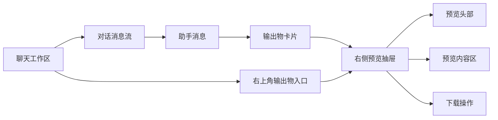
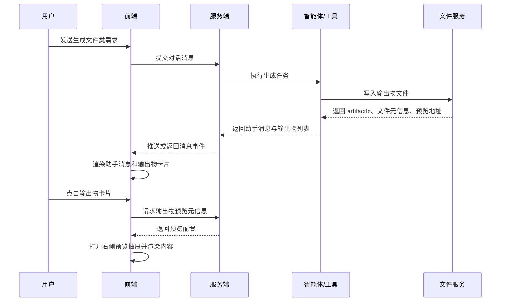
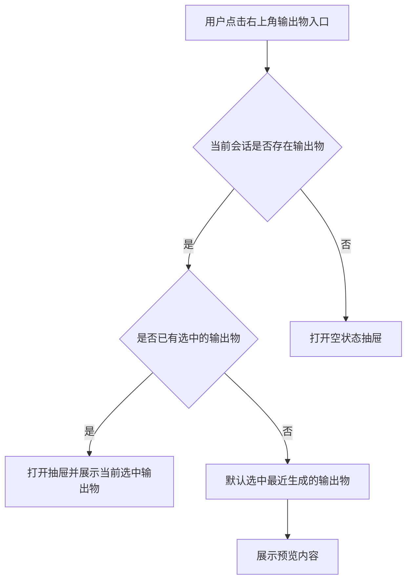
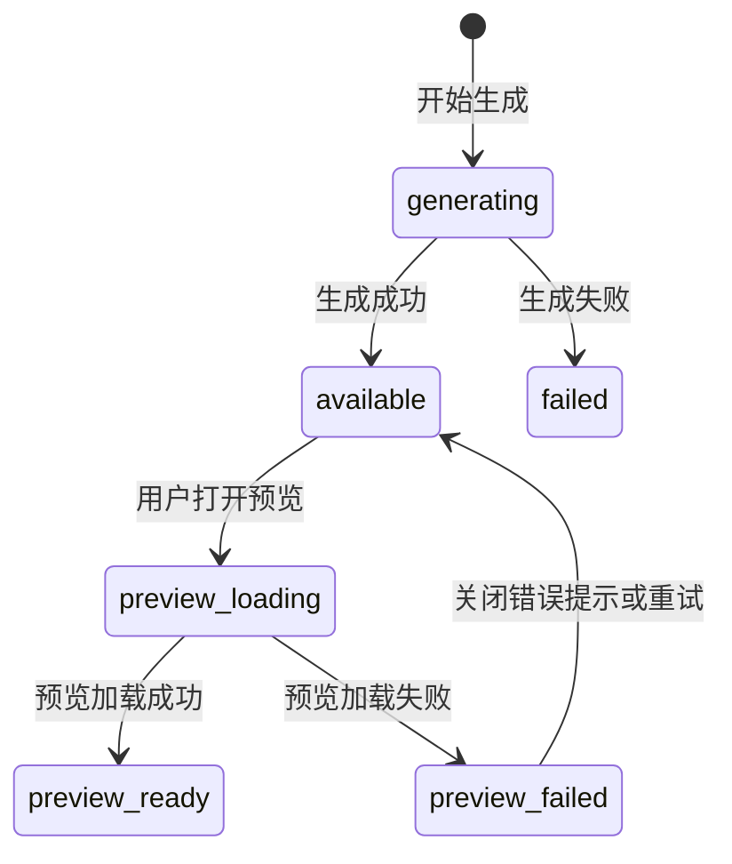

# PRD：输出物预览

版本：V0.1  
状态：草案  
面向对象：产品、前端、后端、测试  
关联原型：COMAC AI 前端 Demo

## 1. 背景与目标

在智能体对话中，模型或工具经常会生成结构化输出物，例如 HTML 页面、PPT、Word 文档和 Markdown 文档。若用户只能下载后再打开文件，会打断当前对话流，也不利于快速判断输出是否符合预期。

本需求提供“输出物预览”能力：当智能体生成可预览文件后，对话区展示输出物卡片；用户点击卡片或通过右上角入口打开右侧预览抽屉，在当前应用内查看内容，并可发起下载。

## 2. 本期范围

### 2.1 支持的输出物类型

本期仅支持以下四类：

| 类型 | 常见扩展名 | 预览目标 |
| --- | --- | --- |
| HTML | `.html` / `.htm` | 在安全沙箱中渲染页面效果 |
| PPT | `.pptx` | 预览幻灯片页面，可查看页码与当前页 |
| Word | `.docx` | 预览文档版式与正文内容 |
| Markdown | `.md` / `.markdown` | 按 Markdown 渲染为可阅读文档 |

### 2.2 入口范围

- 仅支持聊天对话中由智能体生成的输出物；
- 自动化运行结果、文件管理器、项目空间内文件预览不纳入本期；
- 本期仅做预览与下载，不支持在线编辑、评论、版本对比、协同批注。

### 2.3 不在本期范围

- Excel、PDF、图片、音视频、压缩包、代码工程目录；
- 多文件打包预览；
- 输出物编辑；
- 分享链接；
- 预览中的搜索、目录跳转、批注；
- 与外部 Office 客户端联动打开。

## 3. 用户故事

1. 作为用户，我希望在智能体生成文件后，能在对话里直接看到文件卡片，知道文件名、类型和大小。
2. 作为用户，我希望点击文件卡片后，右侧出现预览区域，不离开当前对话就能检查结果。
3. 作为用户，我希望右上角有一个明确入口，可以主动打开或恢复输出物预览抽屉。
4. 作为用户，我希望在预览区能下载文件，以便后续转发、存档或继续加工。
5. 作为用户，我希望当文件无法预览时，系统给出清晰提示，并仍保留下载入口。

## 4. 信息架构



## 5. 用户流程

### 5.1 生成并预览输出物



### 5.2 主动打开预览抽屉



## 6. 页面与交互说明

### 6.1 对话区输出物卡片

输出物卡片展示在对应助手消息内，位于文本回复下方。

字段规则：

| 字段 | 必填 | 规则 |
| --- | --- | --- |
| 文件图标 | 是 | 按类型区分颜色和图标；未知类型不进入本期预览 |
| 文件名 | 是 | 显示完整文件名；超长时单行省略，鼠标悬浮展示完整名称 |
| 类型 | 是 | 展示为 HTML、PPT、Word、Markdown |
| 大小 | 是 | 小于 1 MB 使用 KB/B，大于等于 1 MB 使用 MB，保留 1 位小数 |
| 打开图标 | 是 | 表示点击后在右侧抽屉预览 |

交互规则：

- 点击卡片任意位置，打开右侧预览抽屉；
- 若抽屉已打开，点击另一张卡片时切换预览内容；
- 同一条助手消息若有多个输出物，按生成顺序纵向排列；
- 卡片不承担下载操作，下载统一放在预览抽屉头部，避免误触；
- 输出物正在生成时不展示最终卡片，可展示生成中占位；生成完成后替换为正式卡片。

### 6.2 右上角输出物入口

聊天工作区右上角提供“输出物预览”入口。

状态规则：

- 当前会话没有输出物：点击后打开抽屉空状态；
- 当前会话有输出物但未选中：点击后默认展示最近生成的输出物；
- 当前会话有已选中输出物：点击后展示该输出物；
- 抽屉已打开时，点击入口不重复打开，可保持当前状态。

### 6.3 右侧预览抽屉

抽屉从工作区右侧打开，覆盖或压缩主工作区由前端布局策略决定，但不得遮挡抽屉自身操作。

抽屉结构：

1. 头部：
   - 输出物标题；
   - 文件名；
   - 下载按钮；
   - 关闭按钮。
2. 内容区：
   - 根据文件类型展示预览；
   - 加载中、失败、不可预览、空状态都在该区域展示。

交互规则：

- 点击关闭按钮关闭抽屉，不清空当前选中输出物；
- 再次打开时恢复上次选中输出物；
- 切换会话后，选中输出物应重置为当前会话最近输出物或空状态；
- 下载按钮始终下载当前选中的源文件；
- 若预览失败但源文件存在，仍允许下载；
- 抽屉宽度应适配桌面大屏，建议默认 520–640px；小屏可全屏展示。

## 7. 各类型预览规则

### 7.1 HTML 预览

- 使用受限沙箱渲染 HTML，禁止直接继承主应用上下文；
- 禁止执行高风险脚本能力；
- 外链资源加载失败时，页面主体仍应展示，并在必要时提示“部分资源加载失败”；
- 若 HTML 内容不完整，应展示渲染失败状态，并保留下载入口。

### 7.2 PPT 预览

- 服务端应将 PPT 转换为可浏览的预览资源，例如图片、PDF 或结构化幻灯片数据；
- 前端至少支持展示第一页；
- 若提供多页资源，前端应支持页码切换；
- 页码从 1 开始显示；
- 单页加载失败时，应提示当前页失败，并允许切换其他页。

### 7.3 Word 预览

- 服务端应将 Word 转换为可浏览的预览资源，例如 HTML、PDF 或分页图片；
- 前端展示文档主体内容和基本版式；
- 若转换保真度有限，应以“可读性优先”为原则；
- 文档过大时允许分页或懒加载。

### 7.4 Markdown 预览

- 前端可基于服务端返回的 Markdown 原文渲染；
- 支持标题、段落、列表、引用、代码块、表格、链接；
- 链接点击默认新窗口打开；
- Markdown 中的 HTML 标签按安全策略过滤后展示；
- 渲染失败时展示原文兜底。

## 8. 状态与异常

### 8.1 输出物状态



### 8.2 状态文案

| 场景 | 文案 |
| --- | --- |
| 无输出物 | 暂无可预览的输出物 |
| 预览加载中 | 正在加载预览… |
| 文件不存在 | 输出物不存在或已被删除 |
| 不支持类型 | 当前文件类型暂不支持预览，可下载后查看 |
| 转换失败 | 预览生成失败，请稍后重试或下载原文件 |
| 下载失败 | 下载失败，请稍后重试 |

### 8.3 异常处理

- 输出物元信息缺失文件名：展示“未命名输出物”，但错误应上报；
- 文件大小缺失：展示“大小未知”；
- 预览接口超时：展示加载失败，并提供重试；
- 下载接口超时：按钮恢复可点击，并展示失败提示；
- 会话切换期间预览请求返回：前端应校验会话 ID，不得把旧会话输出物渲染到新会话；
- 输出物被删除或过期：卡片保留，但点击后展示文件不可用状态。

## 9. 数据结构

### 9.1 输出物元信息

```ts
type Artifact = {
  artifactId: string
  conversationId: string
  messageId: string
  fileName: string
  fileType: 'html' | 'pptx' | 'docx' | 'markdown'
  mimeType: string
  sizeBytes: number | null
  status: 'generating' | 'available' | 'failed'
  createdAt: string
  previewAvailable: boolean
}
```

### 9.2 预览配置

```ts
type ArtifactPreview = {
  artifactId: string
  previewType: 'sandbox_html' | 'slides' | 'document' | 'markdown'
  title: string
  sourceUrl?: string
  pages?: Array<{
    pageNo: number
    imageUrl?: string
    htmlUrl?: string
  }>
  markdown?: string
  expiresAt: string
}
```

## 10. 接口建议

### 10.1 获取输出物预览

`GET /api/conversations/{conversationId}/artifacts/{artifactId}/preview`

返回：

```json
{
  "artifactId": "art_001",
  "previewType": "markdown",
  "title": "sample.md",
  "markdown": "# Markdown 示例",
  "expiresAt": "2026-07-08T12:00:00+08:00"
}
```

错误码：

| HTTP | code | 含义 |
| --- | --- | --- |
| 404 | ARTIFACT_NOT_FOUND | 输出物不存在 |
| 409 | ARTIFACT_NOT_READY | 输出物仍在生成 |
| 415 | PREVIEW_UNSUPPORTED | 类型不支持预览 |
| 500 | PREVIEW_RENDER_FAILED | 服务端转换预览失败 |

### 10.2 下载输出物

`GET /api/conversations/{conversationId}/artifacts/{artifactId}/download`

规则：

- 返回源文件二进制流；
- 文件名使用 `Content-Disposition`；
- 若文件不存在，返回 404；
- 若输出物仍在生成，返回 409。

## 11. 验收标准

1. HTML、PPT、Word、Markdown 四类输出物均能在助手消息中展示卡片。
2. 卡片包含文件名、类型、大小和打开图标。
3. 点击卡片可打开右侧预览抽屉。
4. 点击右上角入口，在有输出物时可打开最近或当前选中的输出物。
5. 当前会话无输出物时，右上角入口打开空状态。
6. 抽屉内可关闭、可下载当前输出物。
7. 切换不同输出物卡片时，抽屉内容同步切换。
8. 预览失败时展示明确错误，不影响下载入口。
9. 会话切换后不展示上一会话的输出物内容。
10. 小屏下抽屉不应导致核心操作不可见。

## 12. Demo 说明

当前前端 Demo 为纯前端演示：通过输入固定关键词触发 HTML、PPT、Word、Markdown 四种模拟输出物，并使用静态内容展示预览。该实现只用于演示交互路径，不代表正式产品的生成、存储、转换和下载实现方式。
