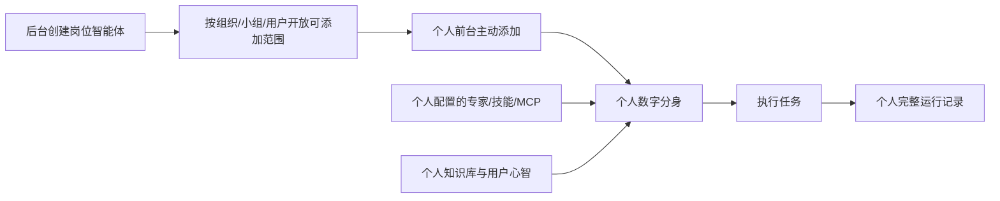

# COMAC CLAW 岗位智能体前后台总体方案

> 2026-09-08 后台配置更新：创建两步流程、独立本体能力地图、移除输出模板/评测用例配置，以 [后台配置改版-能力地图](后台配置改版-能力地图.md) 为当前增量基线。下文冲突条款由该修订覆盖。
> 2026-09-09：配置页“可添加范围”模块已删除；列表筛选与底层范围规则不变。
| 项目 | 内容 |
| --- | --- |
| 文档版本 | V1.0 |
| 文档状态 | 当前方案基线 |
| 更新时间 | 2026-09-07 |
| 适用对象 | 产品、设计、前端、后端、测试、评审人员及后续开发模型 |
| 本文优先级 | 本文定义跨前后台共同规则；页面细节分别以前台、后台 PRD 为准 |

## 1. 方案结论

系统保留两个核心对象：

- **个人数字分身**：一人一个，承载用户身份、用户心智、个人知识和本人配置的能力；
- **岗位智能体**：组织维护的岗位工作模板，承载岗位说明、工作方法、能力配置、工作边界和质量标准。

一名用户可以从组织允许的岗位智能体中主动添加多个，并分别启用或停用。岗位智能体不会替代个人数字分身，而是为个人数字分身增加岗位上下文和可用能力。



## 2. 最终对象边界

| 内容 | 后台岗位智能体 | 个人数字分身前台 |
| --- | --- | --- |
| 岗位说明、职责、交付物、边界 | 后台维护 | 可查看；个人原有工作画像仍可维护 |
| 技能、MCP、模型 | 岗位智能体可以配置 | 个人也可以添加和管理已有资源 |
| SOP、输出模板 | 后台维护 | 可查看和使用 |
| 知识库 | 岗位智能体不配置知识库 | 在个人前台维护，仅影响本人；可连接本人有权访问的企业或个人知识资源 |
| 用户心智、记忆、偏好 | 后台不管理 | 个人维护 |
| 可添加范围 | 后台按组织、小组、指定用户配置 | 命中范围后进入“可添加岗位智能体”列表 |
| 添加、启停、移除 | 后台不替用户操作 | 用户主动添加，可同时启用多个，也可停用或移除 |
| 版本 | 后台管理 | 只查看当前可用内容，不显示后台草稿与内部操作信息 |
| 运行记录 | 本期不在后台展示 | 查看本人完整对话与任务记录 |

## 3. 能力合并规则

### 3.1 前台展示

个人自行添加的能力与已启用岗位智能体带来的能力，统一进入现有“专家、技能、MCP”模块：

```text
数字分身当前可用能力
= 个人已启用能力
+ 所有已启用岗位智能体的能力
```

V1 前台不展示“个人添加”“岗位带来”等来源标签，不设计能力覆盖、优先级和冲突处理界面。同一个资源按资源 ID 去重，只展示一条。

### 3.2 数据与权限

界面不标记来源，不代表数据层丢失来源。系统必须保留每项能力的关联关系，以支持：

- 停用或移除某个岗位智能体时，只撤销该岗位贡献的关联；
- 若同一能力仍被个人或其他岗位智能体引用，则继续保留；
- 日志追溯实际使用的岗位智能体、能力和版本；
- 岗位智能体版本更新或能力失效时计算影响。

最终可用能力始终受用户原有系统权限、资源授权和连接状态约束。添加岗位智能体不能扩大用户在业务系统中的权限。

## 4. 前台方案

### 4.1 页面总体结构

沿用当前数字分身页面，不重做信息架构：

```text
张三的数字分身
├─ 用户心智
│  ├─ 岗位说明
│  ├─ 能力地图
│  ├─ 工作画像
│  ├─ 知识地图
│  ├─ 目标
│  └─ 工作规则
├─ 岗位智能体
├─ 能力
│  ├─ 专家
│  ├─ 技能
│  ├─ MCP
│  └─ 知识库
├─ 分身评测
├─ 成长曲线
├─ A2A 任务
└─ 对话日志
```

### 4.2 岗位智能体一级模块

“岗位智能体”与“用户心智”“能力”平级，位于能力上方。

```text
岗位智能体                                      [+ 添加岗位智能体]

┌──────────────────────┐  ┌──────────────────────┐
│ V1.2                 ×│  │ V1.0                 ×│
│ 功能型产品经理智能体   │  │ 交互型产品经理智能体   │
│ 拆解需求并形成产品方案 │  │ 梳理流程和交互方案     │
│ [● 已启用]      [查看] │  │ [● 已启用]      [查看] │
└──────────────────────┘  └──────────────────────┘
```

- “添加岗位智能体”打开弹窗，只列出当前用户命中范围、已发布且尚未添加的岗位智能体；
- 点击“添加”后卡片进入主页面，并合并其能力；
- 开关控制该岗位智能体当前是否参与数字分身运行；停用不删除配置；
- 移除按钮位于卡片右上角，执行前二次确认；移除后可再次从可添加列表添加；
- 点击卡片或“查看”进入只读详情。

### 4.3 个人查看的岗位智能体详情

复用后台详情的信息表达，但只显示：名称、当前发布版本、岗位目标、岗位说明书、SOP、输出模板及可用能力摘要。

个人前台不显示：维护人、人员范围、后台草稿、评测报告、审批记录、进化建议、内部变更操作。个人不能在岗位详情中编辑岗位配置。

### 4.4 现有前台模块处理

- 用户心智下六张卡片全部保留；
- 专家、技能、MCP、知识库的添加、启停、连接等现有个人配置继续保留；
- 岗位智能体带来的能力直接合并到上述列表，不增加来源标识；
- 分身评测继续评价个人数字分身的准备度和任务表现；
- 成长曲线继续记录个人画像、知识、记忆和能力变化；添加、启停、移除岗位智能体也形成个人成长事件；
- 个人对话日志保留完整内容，并记录本次运行实际参与的岗位智能体及版本。

## 5. 后台方案

### 5.1 导航与复用边界

后台新增“岗位智能体管理”。模型管理、技能管理、MCP 管理、专家智能体管理、组织权限和审批中心复用既有后台能力，不重复开发资源管理页面。

岗位智能体详情只负责选择这些资源，不负责创建和编辑资源本身。

### 5.2 卡片列表

岗位智能体直接以具体名称平铺展示，不建立岗位大类或二级岗位方向。卡片显示：岗位图标、名称、状态、版本、一句话目标、更新时间及必要待处理事项。

卡片不展示人员范围、命中人数、技能/MCP 数量、调用量和泛化分数。搜索支持名称、目标；筛选支持状态以及组织/小组/指定用户范围。

### 5.3 详情单页

详情页不做多个页签，采用纵向平铺：

```text
基本信息与状态
↓
岗位摘要
↓
岗位说明书
↓
岗位能力包与工作资产
↓
版本与变更记录
```

岗位说明书是岗位定义的唯一正文，采用与前台一致的 Markdown 编辑器，支持上传 Word、PDF、Markdown、在线编辑和模板创建。岗位目标、核心职责、关键交付物和工作边界从固定 Markdown 标题解析为顶部摘要，不要求重复填表。

### 5.4 能力包

后台可为岗位智能体选择已发布的技能、MCP 和模型，以及配置 SOP、输出模板。被引用资源停用、删除或失去授权时显示异常。

后台岗位智能体不配置知识库，也不能查看个人知识库。

新建岗位智能体时不设置维护人；平台按当前管理员完成创建与后续配置，不在卡片或创建表单中展示该字段。

### 5.6 新建配置工作台

点击“新建岗位智能体”后，不再先进入“命名 + 可添加范围”的短表单，再跳转详情页；应直接进入与详情配置一致的新建工作台。后台全局导航保留，工作区内部采用左右分栏：

```text
后台全局导航 ｜ 适用组织（左栏）       ｜ 岗位智能体配置（右栏）
             ｜ 组织架构树             ｜ 原详情顶部与原锚点导航
             ｜ 组织人数与已选摘要       ｜ 岗位画像、能力与资产、版本记录
             ｜ 已选范围摘要             ｜ 保存草稿 / 取消
```

- 左栏是纯“适用组织”的组织架构树选择器，不是新的后台导航：组织节点可继续展开到岗位层，展示“组织 → 下级组织 → 岗位”的层级、展开/收起状态、组织人数和已选摘要；不展示人员头像、人员姓名、职级、个人卡片，也不提供小组或指定人员入口。岗位层仅说明组织职责，不单独影响范围；选中上级组织时覆盖其下级组织成员。
- 右栏不新增配置顺序，也不重组既有详情内容：完整复用原详情页从上至下的内容与锚点顺序——顶部基本信息与状态 → 岗位画像（其中包含名称、岗位职责、能力地图、知识地图、行为规则）→ 岗位能力包与工作资产 → 版本与变更记录。左栏只是为新建流程补充的常驻范围选择，不插入右栏内容序列。
- 右栏内容可独立滚动，左栏范围选择保持可见；用户在右栏任一原有区块配置时，均可随时调整适用人员。
- 新建页不要求用户先完成范围选择才能开始配置。点击“保存草稿”时再校验名称和至少一项适用人员范围；通过后创建 `V0.1` 草稿，并停留在当前工作台继续编辑。
- “取消”直接返回列表且不落库，避免用户仅打开页面就产生空白草稿。复制创建时预填岗位定义和能力资产，适用人员范围仍由用户在左栏重新选择。

## 6. 暂缓模块

后台“岗位评测与发布”“运行记录与受控进化”暂不纳入本期方案和原型。个人侧的分身评测、成长曲线与对话日志继续保留，分别服务于个人准备度、成长事件和个人任务追溯。

## 7. V1 不做

- 岗位智能体大类、二级方向、继承或覆盖；
- 个人能力与岗位能力的来源标签、优先级和冲突解决界面；
- 多岗位智能体的复杂编排或每次任务强制手工选择；
- 岗位智能体知识库；
- 后台岗位评测与发布、运行记录与受控进化；
- 后台默认查看个人对话原文、附件、记忆和知识；
- 重做已有模型、技能、MCP、专家、权限和审批管理页面。

## 8. 实施顺序

1. **前台闭环**：岗位智能体一级模块、可添加弹窗、添加/启停/移除、只读详情、能力去重合并；
2. **后台对象闭环**：卡片列表、新建、Markdown 岗位说明书、能力包、范围与版本记录；
3. **真实接入**：组织、权限和资源数据接入，替换 Mock。

## 9. 核心验收场景

1. 后台发布“功能型产品经理智能体 V1.0”，将某组织加入可添加范围；
2. 命中范围的张三能在前台弹窗看到并添加，未命中的李四看不到；
3. 张三同时启用功能型和交互型产品经理智能体，首页显示两张卡片；
4. 两个岗位智能体和个人添加的技能/MCP在现有能力列表中按资源 ID 去重，不展示来源；
5. 停用一个岗位智能体后，仅该岗位独占的能力退出当前可用集合，共享或个人已添加能力仍保留；
6. 个人知识库、用户心智和现有画像配置不因岗位智能体添加或移除而丢失；
7. 个人只能查看岗位详情，不能看到后台草稿和内部操作信息；
8. 后台岗位能力包仅配置技能、MCP 和模型，不配置专家智能体；
9. 岗位说明书不再包含“上下游协作”字段；

## 10. 一句话产品口径

> 后台把岗位工作方法与组织能力沉淀为可配置、可复用的岗位智能体；个人数字分身主动添加一个或多个岗位智能体，并与个人画像、知识和能力共同完成工作。
