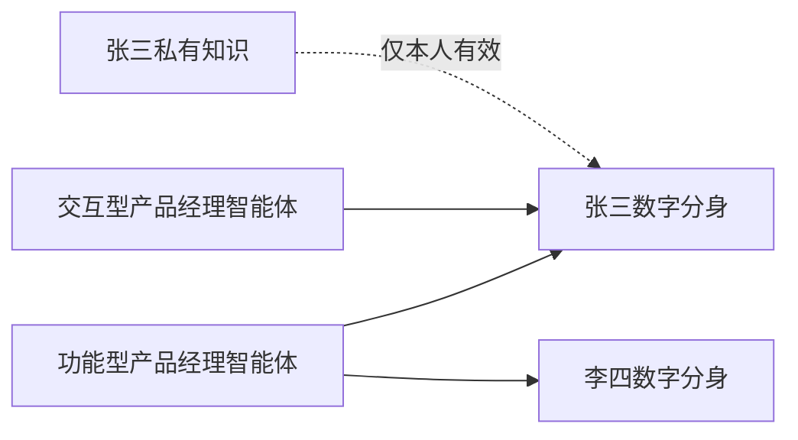
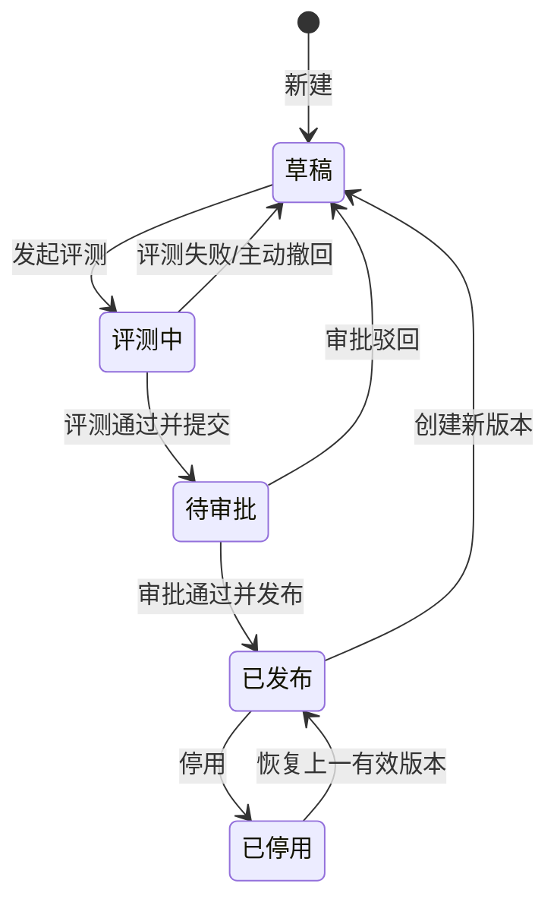

# COMAC CLAW 后台岗位智能体管理 PRD

> 2026-09-08 后台配置更新：创建两步流程、独立本体能力地图、移除输出模板/评测用例配置，以 [后台配置改版-能力地图](后台配置改版-能力地图.md) 为当前增量基线。下文冲突条款由该修订覆盖。
> 2026-09-09：配置页“可添加范围”模块已删除；列表筛选与底层范围规则不变。
| 项目 | 内容 |
| --- | --- |
| 文档版本 | V1.0 |
| 文档状态 | 功能开发基线初稿 |
| 更新时间 | 2026-09-06 |
| 适用对象 | 产品、交互、前端、后端、测试、平台管理员、维护人 |
| 上位方案 | `00-岗位智能体前后台总体方案.md` |
| 本期核心 | 岗位智能体的创建、岗位定义、能力包配置、人员范围与版本记录 |

## 0. 文档使用规则

1. 本文是“岗位智能体管理”功能的开发和验收基线；上位方案用于解释产品理念，不替代本文中的页面与状态规则。
2. 文中的“必须”“仅允许”“不得”均为 V1 规则。未写入本文的能力不进入 V1 开发范围。
3. 原型只负责验证本文，不反向决定产品规则。评审修改功能时，必须先修改本文，再调整原型和代码。
4. 模型管理、技能管理、MCP 管理和权限管理直接复用参考 Demo 的现有页面、数据与权限规则；本 PRD 不重新设计或开发它们。
5. 岗位智能体在详情页中配置“能力包”，只引用已发布的技能、MCP 和模型版本；其创建、编辑、测试与发布仍跳转/复用既有管理页面，不在此处重复建设。
6. 岗位智能体详情采用单页纵向布局，不使用页签。页面从上到下完成岗位定义、能力包、范围与版本记录配置。
7. 本期不引入“岗位智能体实例”概念。后台维护和个人绑定的对象统一称为“岗位智能体”。

---

## 1. 产品定义

### 1.1 岗位智能体

岗位智能体是由组织创建和维护，并可在命中范围内由员工主动添加到个人数字分身的岗位工作模板。

它回答五个问题：

1. 这个岗位负责什么；
2. 按什么岗位说明、SOP 和模板工作；
3. 可以使用哪些组织能力；
4. 什么情况下智能体只能准备建议、必须由人确认，或应升级给负责人处理；
5. 如何按岗位交付物、SOP 与工作边界完成工作。

其中，“人工确认”指智能体可以完成分析和草稿，但不得替代人的最终决策或外部动作，例如立项、资源承诺、对外承诺；“升级处理”指任务超出岗位边界时，应提示交由负责人处理。两类边界均在岗位说明书中维护，并在执行时提示用户。

### 1.2 岗位智能体的命名方式

列表直接展示具体岗位智能体，不设计“岗位大类 → 岗位方向”的二级对象，也不要求管理员先做分类选择。

```text
功能型产品经理智能体
交互型产品经理智能体
数据型产品经理智能体
项目经理智能体
财务报销智能体
```

岗位智能体名称本身应说明主要职责。若同名岗位在不同组织范围的工作方法确实不同，可直接用组织名称区分：

- 民机事业群功能型产品经理智能体；
- 数字化事业群功能型产品经理智能体。

V1 不维护“上级岗位”“岗位大类”“岗位方向”字段，不支持继承、覆盖和自动同步。复制后形成两个独立对象。

### 1.3 与个人数字分身的关系

- 一名员工拥有一个个人数字分身；
- 一个个人数字分身可以绑定多个岗位智能体；
- 一个岗位智能体可以绑定多名员工；
- 个人数字分身负责身份、责任、个人偏好、个人授权和个人私有知识；
- 岗位智能体负责组织统一的岗位职责、方法、能力包、工作边界和质量标准；
- 知识库由个人数字分身维护，仅影响本人；岗位智能体不得建立或读取个人知识库。



### 1.4 与专家智能体的关系

| 对象 | 产品定位 | 示例 |
| --- | --- | --- |
| 岗位智能体 | 覆盖一个岗位的端到端工作，可被命中范围内人员主动添加 | 功能型产品经理智能体、项目经理智能体 |
| 专家智能体 | 提供窄领域专业判断，由岗位智能体或用户调用 | 适航法规专家、质量专家 |

V1 必须在界面名称和数据类型上区分两者，不允许将专家智能体作为岗位智能体直接绑定给员工。

---

## 2. V1 目标与范围

### 2.1 产品目标

- 管理员能够明确知道组织内有哪些岗位智能体、当前处于什么状态、由谁负责；
- 维护人能够从草稿开始完成岗位定义和岗位能力包配置；
- 本期仅维护岗位定义、能力包、人员范围和版本记录；
- 岗位评测与发布、运行治理与受控进化已在当前前端 Demo 实现；真实服务端接入边界以《实现与验收》为准。

### 2.2 V1 包含

1. 岗位智能体列表、搜索与筛选；
2. 新建岗位智能体；
3. 岗位基本信息和岗位说明书；
4. 岗位能力包（技能、MCP、模型）及 SOP、输出模板的引用摘要；
5. 版本记录；
7. 操作与变更记录；
8. 个人前台对岗位智能体的只读引用关系。

### 2.3 V1 不包含

- 自动化任务管理；
- 技能、MCP、模型的创建、编辑、测试、发布、鉴权和连接管理；
- 权限管理页面与组织/小组/人员基础数据维护；
- 可视化多智能体编排画布；
- 个人能力与岗位能力的来源标识、优先级和冲突处理；
- 岗位智能体继承、覆盖、组织间自动同步；
- 智能体自动修改并发布自身配置；
- 基于真实生产数据的自动进化算法实现；
- 个人知识库后台查看、管理或作为岗位公共资产发布。

上述功能不得以可操作入口或配置摘要出现在 V1 的岗位智能体页面。

---

## 3. 权限与可使用范围

V1 直接复用参考 Demo 的“组织、用户组、人员”范围模型，不新建复杂的事业群管理员、岗位负责人、审计员等业务权限体系。

### 3.1 操作角色

| 系统角色 | 岗位智能体操作 |
| --- | --- |
| `sys_admin` | 查看和管理全部岗位智能体；可发布、停用和删除符合条件的草稿 |
| `resource_admin` | 在本人可管理范围内创建、编辑草稿、发起评测、提交审批、配置可添加人员范围、处理进化建议 |
| `approver` | 查看待审批内容并审批；不能审批自己提交的内容 |
| `user` | 在前台添加、启停、移除本人范围内的已发布岗位智能体，并继续管理个人专家、技能、MCP 和知识库 |

### 3.2 可使用范围

每个岗位智能体保存一个范围对象：

```json
{
  "orgs": ["组织 ID"],
  "groups": ["用户组 ID"],
  "users": ["人员 ID"]
}
```

范围用于判断“谁可以看到、谁属于该岗位智能体的可添加范围”。命中以下任意一项即生效：

1. 人员所属组织属于范围中的组织；若选择上级组织，则下级组织也命中；
2. 人员属于范围中的任一用户组；
3. 人员被直接加入范围。

这与参考 Demo 的资源可见范围逻辑一致：组织、用户组和人员是并列的“或”关系，不叠加复杂的部门层级规则。

V1 不提供“全员可见”开关，必须按组织、按小组或指定用户至少选择一项。

绑定岗位智能体不得自动扩大员工在业务系统中的原有权限。

## 4. 信息架构与路由

### 4.1 后台导航

```text
概览统计

资源管理
├─ 岗位智能体管理        ← 本期建设
├─ 模型管理               ← 复用参考 Demo，不在本文设计
├─ 技能管理               ← 复用参考 Demo，不在本文设计
└─ MCP 管理               ← 复用参考 Demo，不在本文设计

审批管理
├─ 由我审批               ← 复用现有审批入口
└─ 由我发起

运行管理
└─ 对话日志               ← 复用个人前台记录并补充岗位智能体归因

权限管理
├─ 组织架构              ← 复用参考 Demo
└─ 角色管理              ← 复用参考 Demo
```

### 4.2 页面与路由建议

| 页面 | 路由 | 说明 |
| --- | --- | --- |
| 岗位智能体列表 | `/admin/role-intelligences` | 默认入口 |
| 新建岗位智能体 | `/admin/role-intelligences/new` | 创建草稿 |
| 岗位智能体详情 | `/admin/role-intelligences/:roleId` | 默认进入基本信息 |
| 岗位智能体详情锚点 | `/admin/role-intelligences/:roleId#binding` | 单页内定位到对应区块 |

详情页为单页纵向布局，不设置页签。页面固定顺序如下：

```text
岗位智能体基本信息与状态
↓
岗位说明书
↓
岗位能力包与工作资产
↓
版本与变更记录
```

页面顶部提供锚点导航，点击后滚动到对应区块；URL 使用 `#definition`、`#binding` 等锚点，而不是详情页页签路由。这样浏览路径与个人前台保持一致，减少页面跳转和上下文丢失。

---

## 5. 核心数据对象

### 5.1 岗位智能体

| 字段 | 必填 | 规则 |
| --- | --- | --- |
| 岗位智能体名称 | 是 | 同一可使用范围内不可重名；2—40 个字符 |
| 可使用范围 | 是 | 选择组织、用户组或人员；至少选择一项，三者为“或”关系 |
| 岗位说明书 | 是 | Markdown 正文为唯一内容源；必须包含岗位目标、核心职责、关键交付物、工作边界与人工确认/升级规则 |
| 当前状态 | 系统 | 草稿、已启用、已停用 |
| 当前版本 | 系统 | 按保存顺序递增 |

岗位目标、核心职责、关键交付物和工作边界不再维护为与岗位说明书并行的重复表单字段。系统从 Markdown 固定标题中解析并在详情顶部展示摘要；标题缺失时提示维护人补齐。

### 5.2 岗位能力包与工作资产

| 类型 | V1 操作 | 必要信息 |
| --- | --- | --- |
| 技能 | 从复用的技能管理中选择已发布技能 | 名称、版本、适用说明、状态 |
| MCP | 从复用的 MCP 管理中选择已启用 MCP | 名称、权限范围、状态 |
| 模型 | 选择允许使用的已发布模型版本 | 名称、版本、适用限制、状态 |
| SOP | 选择已有 SOP 或填写结构化步骤 | 名称、适用场景、步骤、异常分支 |
| 输出模板 | 选择或上传模板 | 名称、交付物类型、示例 |

### 5.3 可添加范围

人员绑定不建立复杂的逐人配置记录，而是复用 Demo 的范围对象。

| 字段 | 规则 |
| --- | --- |
| 组织 | 可多选；选择上级组织时下级组织成员命中 |
| 用户组 / 小组 | 可多选；成员命中任意已选小组即生效 |
| 指定用户 | 可多选；仅所选用户命中 |
| 生效版本 | 仅当前已发布版本的范围对个人前台生效 |
| 生效判断 | 组织、小组、用户三类为“或”关系 |

### 5.4 进化建议

| 字段 | 说明 |
| --- | --- |
| 建议标题 | 明确指出建议修改什么 |
| 建议类型 | 岗位定义、能力包、SOP、模板、规则、评测用例 |
| 证据摘要 | 问题次数、时间范围、代表性现象 |
| 证据样本 | 必须脱敏；无权限时只显示统计摘要 |
| 预计影响 | 影响的绑定人员和任务类型 |
| 风险等级 | 高、中、低 |
| 状态 | 待处理、已采纳、已拒绝、已转为草稿 |
| 处理记录 | 处理人、时间、意见、新草稿版本 |

---

## 6. 生命周期与版本规则

### 6.1 状态机



### 6.2 各状态能力

| 状态 | 编辑 | 试运行 | 提交审批 | 正式执行 |
| --- | --- | --- | --- | --- |
| 草稿 | 可以 | 可以 | 不可以 | 不可以 |
| 评测中 | 只读；需撤回后修改 | 可以 | 评测通过后可以 | 不可以 |
| 待审批 | 不可以 | 只读查看证据 | 已提交 | 不可以 |
| 已发布 | 不可原地编辑 | 可以 | 不适用 | 可以 |
| 已停用 | 不可以 | 不可以 | 不适用 | 不允许新任务 |

### 6.3 版本规则

1. 新建对象先产生内部草稿版本 `V0.1`；首次正式发布统一为 `V1.0`。
2. 已发布版本禁止原地编辑；点击“创建新版本”产生下一草稿，例如 `V1.1 草稿`。
3. 新版本发布后，命中新版本可添加范围的人员在生效时间获得或失去该岗位智能体的使用资格。
4. 已开始执行的任务保留创建时的版本快照，不中途切换。
5. 历史版本、评测报告、审批记录和操作记录永久保留，不随新版本覆盖。
6. 回滚不是删除新版本，而是将上一已发布版本重新设为当前版本并产生一条回滚记录。

---

## 7. 页面功能规格

## 7.1 岗位智能体管理（卡片列表）

### 页面目标

用户在一个页面内回答：有哪些岗位智能体、状态如何、谁负责、多少人使用、有什么待处理事项。

### 页面结构

```text
岗位智能体管理                                              [+ 新建岗位智能体]
组织内统一维护、审核发布，并由个人前台直接使用的岗位工作模板

[岗位总数] [草稿/评测中] [待审批] [已发布] [待处理进化建议]

[搜索岗位名称 / 目标] [状态▼] [人员范围筛选] 

┌──────────────────────────────────────────────────────┐
│ ■  功能型产品经理智能体                    已发布 V1.3 │
│    分析业务需求、规划产品功能并输出 PRD 与验收标准。     │
│    更新于 09-06 10:20                                    │
│    待处理：2 项优化建议                                  │
│                         [创建新版本] [查看详情] [•••]    │
└──────────────────────────────────────────────────────┘
```

### 卡片展示字段

| 位置 | 字段 | 规则 |
| --- | --- | --- |
| 顶部 | 岗位图标、岗位智能体名称 | 使用统一的岗位图标或首字，不使用真人头像和在线状态 |
| 顶部右侧 | 状态、当前发布版本 | 草稿、评测中、待审批、已发布、已停用；存在新草稿时增加“V1.4 草稿” |
| 主体 | 一句话岗位目标 | 最多两行，超出省略；用于快速判断该智能体负责什么 |
| 底部 | 最近变更时间 | 用于判断配置的最近变更 |
| 底部 | 待处理事项 | 仅有待审批、能力异常或待处理优化建议时显示；“2 项优化建议”指已由重复问题聚合、等待维护人采纳或拒绝的两条建议，不等同于两次差评；点击进入对应锚点 |
| 底部右侧 | 操作按钮 | 按当前状态显示可用操作，见下表 |

卡片不展示技能、MCP、模型数量、调用次数和泛化评分；这些信息当前不能帮助管理员完成岗位配置或治理决策。

### 搜索、筛选与排序

- 搜索范围：岗位智能体名称、岗位目标；
- 状态筛选：全部、草稿、评测中、待审批、已发布、已停用；
- 人员范围筛选：点击后复用 Demo 的“按组织 / 按小组 / 指定用户”选择器；选中某对象后，仅显示人员范围中包含该对象的卡片；
- 搜索、状态、人员范围三个条件取交集；不再提供岗位大类、岗位方向等二级筛选；
- 默认排序：待审批 → 有待处理事项 → 草稿/评测中 → 已发布 → 已停用；同一状态内按最近变更时间倒序；
- 搜索和筛选条件写入 URL 查询参数，刷新和返回列表后保持；
- 无结果时显示“未找到符合条件的岗位智能体”，并提供“清空筛选”。

### 卡片操作

| 状态 | 主操作 | 更多操作 |
| --- | --- | --- |
| 草稿 | 编辑 | 复制、删除 |
| 评测中 | 查看评测 | 撤回为草稿 |
| 待审批 | 查看审批 | 撤回审批 |
| 已发布 | 创建新版本 | 查看详情、停用、复制 |
| 已停用 | 查看详情 | 恢复上一有效版本、复制 |

点击卡片非操作区进入详情单页；“编辑”只在草稿或新版本草稿上显示。已发布智能体不允许直接编辑，必须先创建新版本。

---

## 7.2 新建岗位智能体

V1 采用独立的“新建配置工作台”，不使用“先命名和选择范围、再进入详情页”的两段式流程，也不使用六步强制向导。用户点击“新建岗位智能体”后，直接进入与详情配置连续的工作区，在同一页面完成适用人员与岗位配置。

### 页面结构

后台全局导航之外，新建工作区固定为左右结构：

```text
┌──────────────────────┬──────────────────────────────────────────┐
│ 适用组织              │ 岗位智能体配置                            │
│                      │                                          │
│ [组织架构树]          │ 原详情顶部：基本信息与状态                │
│ □ 上海飞机设计研究院  │ 原锚点：岗位画像｜能力与资产｜版本记录     │
│   □ 产品平台主管      │ 岗位画像（含名称、职责、地图、行为规则）  │
│   □ 项目管理部        │ 岗位能力包与工作资产                      │
│                      │ 版本与变更记录                            │
│                      │                                          │
│ 已选组织与覆盖人数     │                         [取消] [保存草稿] │
│ 不展示个人信息         │                                          │
└──────────────────────┴──────────────────────────────────────────┘
```

| 区域 | 内容与规则 |
| --- | --- |
| 左栏：适用组织 | 仅展示“组织 → 下级组织 → 岗位”三层架构，以组织节点作为唯一选择单位；提供展开/收起、组织人数、勾选状态和已选组织摘要。岗位层仅展示组织职责，不单独影响范围。不展示人员头像、姓名、职级或个人卡片，也不提供小组、指定人员入口。它只负责决定谁能在个人前台添加该智能体，不是后台导航，也不负责编辑岗位内容。 |
| 右栏：岗位智能体配置 | 完整复用现有详情页，绝不调整其内容顺序或锚点顺序：顶部基本信息与状态 → 岗位画像（名称、岗位职责、能力地图、知识地图、行为规则）→ 岗位能力包与工作资产 → 版本与变更记录。右栏内容可纵向滚动，左栏保持可见，用户可在配置过程中随时调整适用人员。 |
| 页底操作 | “取消”返回列表且不保存；“保存草稿”创建或更新草稿。 |

### 新建与保存规则

- 点击“新建岗位智能体”只打开一个未持久化的新建工作台，不立即创建空白记录；用户可以先配置右栏或先选择左栏范围。
- 点击“保存草稿”时校验岗位智能体名称和至少一个已选组织；校验通过后创建 `V0.1` 草稿，并留在该工作台继续配置，不发生“进入详情页”的页面跳转。
- 草稿保存后，左栏范围与右栏配置均在同一工作台中继续编辑；离开存在未保存改动时必须二次确认。
- 复制创建时预填岗位定义、能力包/SOP/模板引用；不复制组织适用范围、运行数据、审批记录和进化建议。用户必须在左栏重新选择组织。
- 复制后的对象独立维护，页面显示一次性来源记录，不形成长期继承关系。

---

## 7.3 基本信息

### 页面内容

详情顶部平铺展示基本信息和从岗位说明书解析出的摘要，不做与 Markdown 正文重复的字段表单：

```text
功能型产品经理智能体  ·  V1.2 已发布                    [创建新版本]
可添加范围：上海飞机设计研究院等  ｜ 更新于 09-07

岗位目标
将业务需求转化为可执行、可验收的产品方案。

核心职责                     关键交付物
• 需求澄清与范围拆解           PRD / 验收标准 / 版本计划
• 方案设计与评审协作

上下游协作
上游：业务方、市场、客户 ｜ 下游：交互、研发、测试、项目管理

工作边界与人工确认/升级规则
不做立项、预算和对外承诺；涉及法规判断协作适航专家智能体，资源冲突升级负责人。
```

这五项存在的目的分别是：目标防止任务跑偏；职责界定应做事项；交付物定义验收结果；上下游决定澄清和交接对象；边界避免越权或在不确定时硬答。它们均从岗位说明书固定标题解析，点击摘要定位到正文对应章节。

新建页不设置维护人。创建与后续配置由具备后台编辑权限的当前管理员完成，卡片和详情摘要均不展示该字段。

### 交互规则

- 草稿状态显示编辑控件和“保存草稿”；
- 评测中、待审批、已发布、已停用状态只读；
- 已发布状态点击“创建新版本”后编辑新草稿，不修改当前正式版本；
- 页面离开前存在未保存内容时必须二次确认；
- 保存成功提示“草稿已保存”，并更新最近变更和操作记录；
- AI 辅助整理内容可以作为后续能力，但结果必须先进入草稿，V1 不做。

---

## 7.4 岗位能力包与工作资产

页面分为两个区域。

### A. 岗位说明书

岗位说明书是岗位定义的唯一正文，使用与个人前台一致的 Markdown 编辑器。草稿状态提供 `[上传文件] [在线编辑] [从模板创建]`；已发布版本只读并可下载历史文件。

- 上传支持 Word、PDF、Markdown；保留原文件，并将可编辑内容转换/导入为 Markdown；
- 在线编辑支持标题、列表、表格、链接、附件和预览；
- 模板至少包含：岗位目标、核心职责、关键交付物、上下游协作、工作边界与人工确认/升级规则；
- 保存后刷新详情顶部摘要；固定标题缺失时显示缺失提示，发起评测前必须补齐；
- 已发布版本不得直接编辑，必须创建新版本后修改 Markdown 正文。

### B. 岗位能力包与工作资产

- 能力包：技能、MCP、专家智能体、模型；
- 岗位 SOP；
- 输出模板；
- 评测用例。

草稿状态允许添加、移除和调整引用；其他状态只读。移除引用不删除源资源。能力包只可选择已发布且当前有权限使用的资源；若引用资源被停用或权限收回，显示“能力异常”并阻止提交发布。

本区不出现知识库选择、公共知识库或个人知识内容。个人知识由前台独立维护，后台仅能收到脱敏后的“知识不足”问题信号。

## 7.6 评测与发布

评测不是由某一种角色“拍脑袋打分”。V1 采用“自动规则校验 + AI 辅助评测 + 人工复核 + 审批发布”的四层方式：自动校验负责明确规则，AI 负责语义判断和归因建议，人工负责质量结论和发布责任。

### 评测用例

每个岗位智能体至少维护一组评测用例。每条用例包含：任务输入、必要上下文、期望交付物、必须引用的依据、禁止动作、是否红线用例。

| 维度 | 自动规则校验 | AI 辅助评测 | 人工复核 | 发布门槛 |
| --- | --- | --- | --- | --- |
| 岗位职责与交付物 | 必填交付物是否出现 | 是否真正回应岗位目标、是否跑题 | 抽检典型任务 | 必须通过 |
| 能力与依据 | 已绑定能力是否可用、SOP/模板引用是否有效 | 是否选择了正确能力并遵循可用依据 | 对关键制度与高风险输出抽检 | 关键能力与依据不得失效 |
| SOP 执行 | 必经步骤、异常分支是否覆盖 | 步骤顺序和条件判断是否合理 | 抽检高风险流程 | 红线用例全部通过 |
| 输出质量 | 模板、字段、格式是否完整 | 表达是否清楚、可执行、无矛盾 | 对外或关键输出必审 | 需达到“通过” |
| 工作边界 | 禁止动作、必须确认项是否触发 | 不确定时是否正确澄清或升级 | 审看风险场景 | 红线用例全部通过 |

### 四层执行规则

1. **自动规则校验**：系统按结构化用例执行格式、引用、步骤和红线断言。其结果是可重复的“通过/失败 + 证据”，不能被 AI 覆盖。
2. **AI 辅助评测**：评测模型按固定评分量表输出每项判断、引用的证据和置信度，只生成“建议通过/需人工复核”，不直接发布智能体。
3. **人工复核**：维护人先处理失败项；另一名具备 `resource_admin` 或 `approver` 的人员复核红线用例全量结果及普通用例抽样结果，给出“通过/不通过”和备注。
4. **审批发布**：审批人查看变更、自动结果、AI 结论和人工复核证据后决定发布或驳回；审批不是重新做全部评测。

没有统一的“80 分就上线”分数。不同岗位的质量标准不同；V1 的发布条件统一写为：全部红线用例通过、关键资料有效、人工复核通过、审批通过。

### 发起评测与审批

- 仅草稿可发起评测；必填字段、关键资料或评测用例不完整时阻止发起，并列出缺失项；
- 发起后状态变为“评测中”，配置锁定；失败可查看对应证据，撤回后回到草稿修改；
- 达到发布条件后，维护人提交审批，状态变为“待审批”；
- 审批详情必须展示：当前与拟发布版本、变更前后对比、自动校验结果、AI 评测结论、人工复核意见、影响人数、计划生效时间和可回滚版本；
- 审批通过后按生效时间发布；审批驳回必须填写原因并回到草稿；维护人、提交人与审批人不得为同一人。

---

## 7.7 运行记录与受控进化

### 产品原则

对话日志、进化日历和进化建议是同一条治理链路：


日历只表达运行、反馈和治理信号，不表示智能体自动学习或已经自动修改线上版本。

### 对话日志

复用个人前台已有对话/任务记录，并为每条记录增加“岗位智能体 ID、版本、反馈、问题归因、进化建议 ID”等治理字段；不复制一套对话数据。

详情单页的“运行记录与受控进化”区块展示最近 5 条记录和“查看全部对话日志”入口。全部日志页支持按岗位智能体、版本、日期、反馈状态、问题归因、组织/小组/用户范围筛选。

日志列表字段：任务摘要、匿名使用人员/人员范围、岗位智能体版本、来源、反馈（好评/差评/未评价）、问题归因、最近时间。默认只展示脱敏任务摘要和人员范围；查看原始对话正文必须满足个人数据权限，普通维护人默认不可见。

点击一条记录打开“治理详情”抽屉：任务摘要、使用版本、反馈、问题归因、脱敏证据、是否关联进化建议。该抽屉不展示用户原始消息、附件、个人记忆和个人知识内容。

### 进化日历

默认展示近 90 天，每个格子代表一天：

| 日历状态 | 含义 |
| --- | --- |
| 无色 | 没有相关运行记录 |
| 灰色 | 有运行记录，但没有反馈或异常信号 |
| 黄色 | 出现差评、人工修改、知识缺失或 SOP 问题，待观察 |
| 橙色 | 已聚合为待处理进化建议 |
| 蓝色 | 建议已采纳并进入草稿评测 |
| 绿色 | 对应新版本已发布 |

点击某一天后，同时筛选下方日志和对应进化建议；悬浮提示展示当日对话数、好评/差评、问题类型和建议处理状态。日历不展示“进化分数”，避免把不同岗位的运行质量错误压成单一分数。

### 进化建议与处理规则

- 详情页在日历下方以卡片展示待处理建议，例如：`[中风险] 需求优先级判断缺少业务价值维度｜关联 6 条问题反馈｜建议更新优先级 SOP 与评测用例`；
- 卡片操作为“查看证据”“采纳到新草稿”“拒绝”。查看证据打开脱敏日志抽屉；拒绝必须填写原因；采纳选择落点（岗位说明、能力包、SOP、模板、规则、评测用例）后创建或合并到草稿；
- 建议必须展示：类型、风险等级、问题描述、脱敏证据摘要、影响的人员范围、建议修改项和关联日志数量；
- 单次差评只能形成“待观察信号”，不能直接修改岗位智能体配置；同一岗位、版本、任务类型和问题归因在时间窗口内达到重复阈值，或由维护人基于日志手工发起后，才能形成待处理建议；
- 查看证据受个人数据权限控制；拒绝必须填写原因；
- 采纳后创建新草稿，不改变当前已发布版本；同一岗位智能体已有草稿时，采纳内容合并到现有草稿；
- 每项建议记录处理人、时间、意见、关联日志和关联草稿版本；个人私有对话与私有知识不得直接进入岗位智能体配置。

---

## 7.8 变更记录

版本与变更记录放在详情页最底部，使用纵向时间线，不单独建设复杂版本管理页：

```text
版本与变更记录                                      [创建新版本]

V1.2  已发布  2026-09-07  发布人：李明
变更：更新需求评审 SOP；新增“竞品分析”技能
关联：评测通过 / 审批单 #20260907
[查看变更] [回滚至此版本]

V1.1  已停用  2026-08-20
变更：首次增加交付模板
[查看详情]
```

“查看变更”展示与上一版本的 Markdown、能力包、SOP、模板、范围差异；“创建新版本”复制当前已发布内容为草稿；“回滚至此版本”重新启用该历史版本并生成一条回滚记录，不删除任何历史版本。

### 记录范围

- 新建、复制、删除草稿；
- 岗位定义和资产变更；
- 发起评测、撤回、评测结果；
- 提交、撤回、通过和驳回审批；
- 发布、回滚、停用和恢复；
- 可添加范围变更；
- 进化建议采纳和拒绝。

### 字段

操作类型、对象、版本、操作人、操作时间、变更摘要、关联审批单、人员范围摘要、结果。

变更记录只允许查询和导出，不允许修改或删除。

---

## 8. 前台引用规则

后台范围命中只决定用户在前台“可添加岗位智能体”列表中看到什么，不等于已经绑定。用户点击“添加到我的数字分身”后才形成个人绑定；个人前台只展示已添加的“我的岗位智能体”，不重复暴露后台全部技术配置。

个人可以：

- 在可添加列表中查看本人命中的岗位智能体，并主动添加多个岗位智能体；
- 查看已添加岗位智能体的名称、职责范围、当前版本、岗位说明、能力包、SOP 和模板；
- 分别启用或停用多个已添加岗位智能体；
- 从“我的岗位智能体”中移除某个已添加对象；移除仅取消个人绑定，不影响后台范围和其他用户；
- 继续在现有个人能力模块中添加和管理专家、技能及 MCP；个人能力与岗位智能体带来的能力在前台统一汇总，不显示来源；
- 补充只对本人有效的私有知识、偏好和常用模板；
- 对执行结果反馈“有帮助 / 有问题”；
- 在权限不足时发起权限申请。

个人不能：

- 修改公共岗位说明、能力包、SOP 和模板；
- 在岗位智能体详情中修改其技能、专家智能体、MCP 或模型配置；
- 扩大本人已有系统权限；
- 修改岗位智能体的红线规则和评测标准；
- 将私有资料直接发布给其他绑定人员。

个人知识冲突规则：

```text
组织强制规则 > 岗位智能体规则与 SOP > 个人知识库 > 临时对话信息
```

发生冲突时必须提示，不能静默用个人内容覆盖组织制度。

---

## 9. 关键异常与提示文案

| 场景 | 页面处理 | 推荐文案 |
| --- | --- | --- |
| 对象不存在或无权限 | 返回列表或 404 页面 | 岗位智能体不存在或你无权查看 |
| 未发布时编辑人员范围 | 允许保存草稿，但不对个人生效 | 当前版本尚未发布，人员范围将在发布后生效 |
| 未选择人员范围 | 阻止提交审批 | 请按组织、按小组或指定用户选择至少一个人员范围 |
| 关键资料失效 | 顶部警告并阻止提交 | 存在失效的关键资料，请处理后再提交审批 |
| 评测未通过 | 保持评测中，展示失败项 | 当前版本未达到发布门槛 |
| 审批驳回 | 回到草稿并展示原因 | 审批已驳回，请根据意见修改后重新提交 |
| 已发布内容直接编辑 | 阻止并引导 | 已发布版本不可直接修改，请先创建新版本 |
| 采纳进化建议 | 生成或合并草稿 | 建议已加入草稿，完成评测和审批后才会生效 |
| 保存失败 | 保留用户输入，可重试 | 保存失败，请检查网络后重试 |

---

## 10. 页面间联动

| 用户动作 | 当前页面变化 | 其他页面变化 |
| --- | --- | --- |
| 新建岗位智能体 | 进入 V0.1 草稿详情 | 列表草稿数 +1，变更记录新增 |
| 发起评测 | 状态变为评测中 | 列表状态同步，配置页转只读 |
| 提交审批 | 状态变为待审批 | 审批中心新增待办，列表待审批数 +1 |
| 审批通过 | 状态变为已发布 | 命中人员范围的个人前台出现岗位智能体 |
| 采纳进化建议 | 建议变为已采纳 | 生成/合并新草稿，列表显示双版本 |
| 新版本发布 | 新版本变为当前版本 | 个人前台按新范围重新计算可用岗位智能体 |
| 停用岗位智能体 | 状态变为已停用 | 停止新任务路由，个人侧显示已停用 |

原型和正式系统都必须体现这些联动。不能只在当前弹窗显示“操作成功”，但列表、详情和记录保持不变。

---

## 11. 数据边界与审计要求

1. 后台管理员可以查看人员范围摘要、命中人数和治理指标，但默认不能查看个人私有知识、对话正文和个人记忆；
2. 用于进化的任务样本必须脱敏，并保留来源、授权范围和处理记录；
3. 所有发布、人员范围变化、停用和回滚操作必须记录操作人；
4. 列表统计、详情状态、审批状态和当前可添加人数必须来自同一数据源；
5. 历史任务保存岗位智能体版本快照，避免新版本覆盖历史事实；
6. 后台停用或删除被引用的能力资源时，岗位智能体中保留失效引用和审计记录，不静默消失。

---

## 12. V1 验收场景

### 场景 A：从新建到发布

1. 管理员新建“民机事业群·功能型产品经理智能体”；
2. 系统生成 V0.1 草稿；
3. 填写岗位定义并配置能力包、SOP、模板；
4. 发起评测，页面配置锁定；
5. 评测通过后提交审批；
6. 审批人查看变更、评测和影响范围；
7. 审批通过后发布为 V1.0；
8. 列表、详情、审批记录和变更记录状态一致。

### 场景 B：一个人员命中多个岗位智能体

1. “功能型产品经理智能体”的人员范围包含张三所属小组；
2. “交互型产品经理智能体”的人员范围指定了张三；
3. 两个岗位智能体均已发布，张三命中各自人员范围；
4. 张三个人前台展示两个岗位智能体；
5. 张三可以同时启用两个岗位智能体，也可以分别停用；
6. 张三的私有知识只影响本人，不会写入后台岗位智能体配置。

### 场景 C：审批驳回

1. 维护人提交新版本；
2. 审批人填写原因并驳回；
3. 岗位智能体回到草稿；
4. 当前已发布版本继续服务已有人员；
5. 驳回原因在详情和变更记录中可追溯。

### 场景 D：受控自进化

1. 系统展示一条带脱敏证据的高影响建议；
2. 维护人点击采纳；
3. 当前发布版本保持不变；
4. 系统生成下一版本草稿或合并到已有草稿；
5. 变更记录关联建议与草稿；
6. 新草稿必须重新完成评测和审批后才能生效。

### 场景 E：未发布对象不对人员生效

1. 打开草稿、评测中或待审批岗位智能体；
2. 配置页不展示可添加范围模块；
3. 页面明确提示范围将在发布后生效；
4. 张三即使命中范围，也不会在个人前台看到该岗位智能体；
5. 列表“当前可添加人数”可以显示预估值，但“已开放人数”为 0。

---

## 13. 原型开发顺序

文档确认后，按以下顺序开发，上一阶段通过后再进入下一阶段。

### 第一阶段：对象与状态闭环

- 岗位智能体卡片列表；
- 新建和基本信息；
- 状态机；
- 评测、审批和发布；
- 变更记录；
- 本地持久化或轻量 Mock API。

验收重点：任何按钮操作后，列表、详情、统计和记录同时变化，刷新不丢失。

### 第二阶段：人员范围闭环

- 复用 Demo 的按组织 / 按小组 / 指定用户选择器；
- 组织、用户组、人员范围计算；
- 前台“我的岗位智能体”联动。

### 第三阶段：自进化闭环

- 对话日志与岗位智能体版本归因；
- 近 90 天进化日历；
- 进化建议列表；
- 证据摘要；
- 采纳、拒绝；
- 生成或合并草稿；
- 回归评测和版本发布。

### 第四阶段：真实服务化

- SQLite 或正式数据库；
- 后端 API 和权限校验；
- 审批中心接入；
- 组织与人员数据接入；
- 操作审计。

自动化管理、技能管理、MCP 管理不在以上四个阶段内，后续分别立项并建立独立 PRD。

---

## 14. 本文已锁定的产品决策

1. 只保留“岗位智能体”一个可绑定产品概念，不设置实例层；
2. 功能型产品经理、交互型产品经理等直接作为独立岗位智能体展示，不维护岗位大类和二级岗位方向；
3. 岗位智能体的可使用范围直接复用“组织、用户组、人员”的并列范围模型；
4. 一人可以绑定多个岗位智能体，一个岗位智能体可以绑定多人；
5. 个人可以补充私有知识，但只影响本人；
6. 只有已发布岗位智能体才进入命中人员的可添加列表，并可在用户主动添加后正式执行；
7. 已发布版本不可原地修改；
8. 自进化建议不能自动生效，必须形成草稿并重新评测、审批、发布；
9. 自动化、技能、MCP、专家智能体和模型的资源管理本期不展开；岗位智能体仅配置它们的引用关系。

## 15. 仍需业务评审确认的三个问题

以下问题不影响第一阶段原型，但进入真实开发前需要确认：

1. 一名员工是否设置岗位智能体数量上限；本文暂按“不限制数量，可同时启用多个”设计；
2. 人员范围变更是否必须单独审批；本文暂按“作为岗位智能体新版本的一部分，随发布审批一并审批”设计；
3. 已停用岗位智能体的进行中任务默认继续、终止还是转交；本文要求操作时明确选择，暂不设置统一默认值。

---

## 16. 一句话产品口径

> 后台把组织岗位经验沉淀为可配置、可评测、可发布、可绑定、可追溯且受控进化的岗位智能体；个人数字分身引用一个或多个岗位智能体，并在本人权限范围内完成工作。
