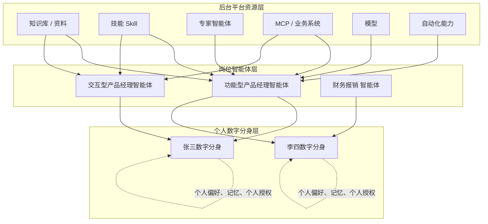
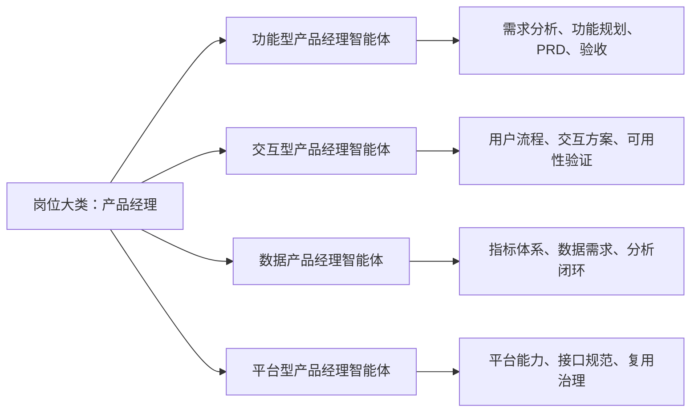
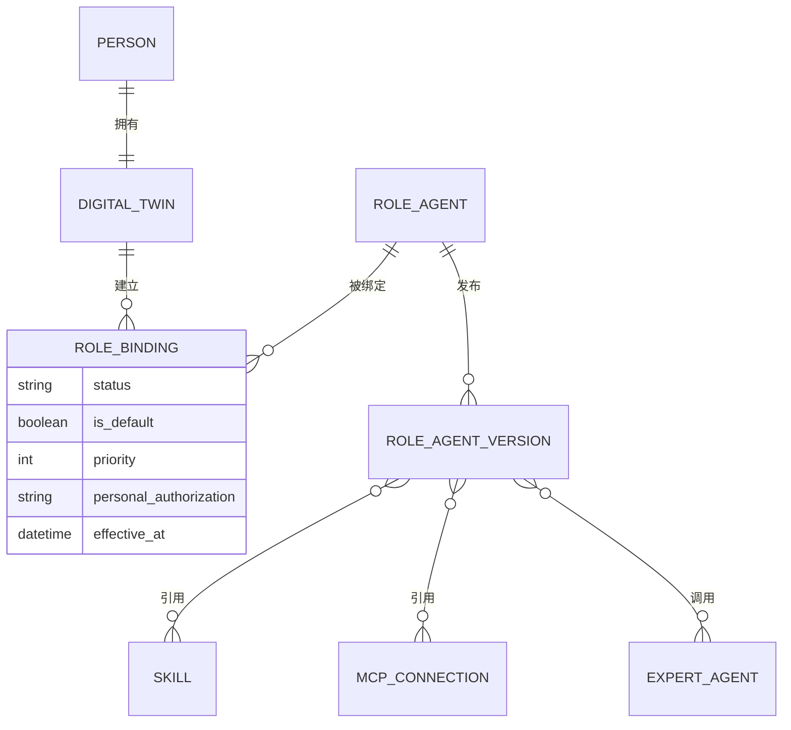
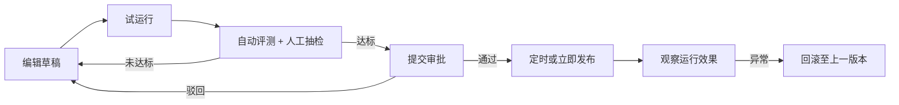
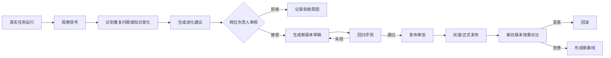
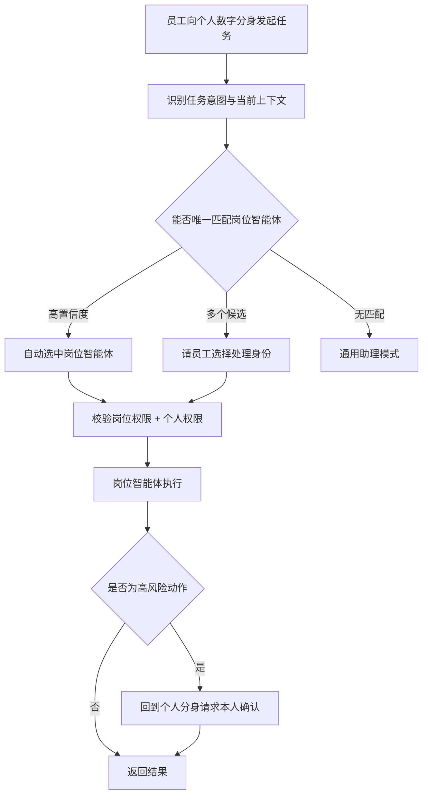

# COMAC CLAW 后台管理：岗位智能体中心方案 V2

> 状态：方案细化稿 V2.1（已合入 2026-09-05 确认结论）  
> 目标：在现有后台能力上增加“岗位智能体管理”，明确岗位智能体、个人数字分身、技能、MCP、专家智能体、知识与自进化之间的关系，并给出可用于原型设计的页面结构和交互闭环。  
> 设计输入：现有 COMAC CLAW 后台截图、岗位智能体卡片竞品截图、当前个人侧岗位说明书与数字分身方案。
> 开发说明：本文保留为历史概念与设计依据；具体页面、状态、交互和验收以 `PRD-后台岗位智能体管理.md` 为准，产品名称统一使用“岗位智能体”。

---

## 1. 先说结论

### 1.1 产品定位

建议把系统分成三个层次：

1. **平台资源层**：现有后台中的模型、技能、MCP、专家智能体、知识库和自动化能力；
2. **岗位智能体层**：把岗位说明、知识、SOP、技能、MCP、模型策略和安全规则组装成一个可发布、可绑定、可评测的“岗位工作包”；
3. **个人数字分身层**：代表具体员工，绑定一个或多个岗位智能体，并叠加个人偏好、个人资料、个人记忆与个人授权。

岗位智能体是后台主要训练和治理的对象；个人数字分身是前台的统一使用入口和责任主体。



### 1.2 岗位智能体只保留一个产品概念

本期后台和前台统一只使用 **岗位智能体** 这一个产品对象，不再设置第二层可绑定对象。

岗位智能体的正式定义是：

> 由组织创建和维护、经过评测与发布、能够被一个或多个员工数字分身直接绑定的岗位工作模板。

它既是管理员维护的模板，也是员工实际绑定的对象。人员绑定时只建立引用关系，岗位智能体本身不被复制。

岗位差异通过三个字段表达：

1. **岗位大类**：产品、项目、研发、采购、财务、行政等；
2. **岗位方向**：同一大类下更具体的职责方向；
3. **适用组织**：该岗位智能体可被哪些事业群、部门或人员范围使用。

以产品经理为例：



每个细分方向都是独立的一张岗位智能体卡片，可以拥有不同的岗位说明、知识、SOP、技能和评测标准。适用组织可以是一个或多个组织范围；如果同一方向在两个事业群的工作方法差异很大，则分别创建两个岗位智能体，并在名称或组织标签中区分，例如：

- 民机事业群·功能型产品经理智能体；
- 数字化事业群·功能型产品经理智能体。

这只是两个独立岗位智能体，暂不设计继承、同步或覆盖关系。

### 1.3 关于技能、MCP 绑定在哪里

本期采用“**岗位统一配置，个人只做使用授权和个人知识补充**”的原则。

| 能力 | 后台岗位智能体| 个人数字分身 | 首期建议 |
| --- | --- | --- | --- |
| 岗位说明、职责、SOP | 配置并统一发布 | 只读引用 | 必须在岗位侧 |
| 岗位知识库 | 配置知识范围 | 可增加个人私有资料 | 两侧都可以，但范围隔离 |
| 技能 | 选择并配置岗位技能 | 不能新增或自行绑定 | 本期只允许岗位侧绑定 |
| 专家智能体 | 配置可调用专家及场景 | 用户通常无感，必要时可手动选择 | 岗位侧绑定 |
| MCP / 业务系统 | 配置可用连接和动作范围 | 不能新增；只完成本人已有权限校验和高风险动作确认 | 岗位侧绑定、个人侧校验 |
| 模型 | 配置默认模型与路由策略 | 不建议普通用户修改 | 后台统一配置 |
| 个人偏好 | 不配置 | 本人维护 | 个人侧 |
| 个人记忆 | 不进入公共岗位资产 | 本人持有 | 个人侧 |

系统最终可用能力不是各层权限的简单相加，而是取最严格的交集：

```text
实际可执行能力
= 平台允许范围
∩ 组织允许范围
∩ 岗位智能体配置范围
∩ 员工本人已有权限
∩ 当前任务场景允许范围
```

例如岗位智能体配置了“项目系统写入”，但张三只有只读权限，则张三调用该岗位智能体时仍然只能读取。个人绑定岗位智能体不等于自动获得业务系统权限。

#### 为什么本期不允许个人添加技能和 MCP

这不是单纯为了少做功能，而是为了保证岗位智能体能够被组织管理和解释：

1. **岗位行为一致**：同一个岗位智能体绑定给 30 个人时，应具备一致的基础能力，否则无法判断它究竟是否合格；
2. **评测结果有效**：后台评测的是已发布能力组合。如果员工可以临时增加技能或 MCP，线上运行配置会偏离被评测版本；
3. **权限风险可控**：MCP 可能连接业务系统并产生写入、发送、导出等动作，不能把安装入口等同于授权入口；
4. **问题可以归因**：出现错误时需要判断是岗位定义、技能、模型、MCP、个人资料还是权限导致；自由组合会让故障很难定位；
5. **组织资产可复用**：员工确实需要的新能力，应先形成需求，再由岗位负责人评估是否加入公共岗位智能体，而不是只沉淀在个人环境；
6. **降低使用负担**：普通员工应该关注任务，而不是理解技能参数、连接协议和模型路由。

如果领导认为“不给个人装能力会限制创新”，可以采用阶段性方案回应：

- 本期允许个人补充知识、偏好、常用模板和反馈，已经能够覆盖主要个性化需求；
- 个人可以提交“新增能力申请”，说明使用场景，由岗位负责人决定加入岗位智能体还是仅给个人试用；
- 后期再开放经过白名单、审批、沙箱评测的个人技能；
- MCP 即使后期开放，也应只允许申请使用后台已有连接，不能由普通员工自行创建生产连接；
- 任何个人能力都不得扩大员工原有的数据权限。

---

## 2. 岗位智能体到底包含什么

一个可发布的岗位智能体建议由六个部分组成。

### 2.1 岗位定义：它是谁、负责什么

- 岗位智能体名称；
- 所属事业群、部门和适用范围；
- 岗位目标；
- 核心职责；
- 主要交付物；
- 上下游协作对象；
- 工作边界和明确不负责的事项；
- 负责人和维护人。

当前个人前台里的“岗位说明书”应该迁移到这里，由后台管理员或岗位负责人维护。个人前台只展示当前生效版本，不允许直接覆盖公共岗位说明。

### 2.2 岗位资产：它知道什么、按什么方法工作

- 能力地图；
- 知识地图和资料目录；
- SOP / 工作流程；
- 历史任务案例；
- 标准输出模板；
- 业务术语与组织规则；
- 评测用例。

岗位智能体引用知识时只保存“引用关系和适用范围”，原始知识仍由知识库或 C 大脑统一管理，避免每个岗位重复上传一份文件。

### 2.3 能力工具：它能调用什么

- 技能：如经营指标分析、会议纪要、风险识别、方案生成；
- 专家智能体：如适航法规专家、质量专家、数据分析专家；
- MCP：项目系统、知识库、经营数据平台等；
- 模型策略：默认模型、文档理解模型、分析推理模型；
- 自动化：允许创建或调用哪些定时任务模板。

这里不需要首期把工具编排做得过于复杂。页面先支持“选择能力 + 配置用途 + 配置权限边界”即可。

### 2.4 工作规则：它怎么判断和执行

- 典型任务和触发场景；
- 任务路由关键词或意图；
- 工作步骤；
- 必须引用的制度或数据源；
- 输出格式；
- 需要向谁澄清；
- 什么条件下必须人工确认；
- 什么条件下升级给负责人；
- 禁止执行的动作。

### 2.5 发布状态：它是否能够“上岗”

建议状态统一为：

```text
草稿 → 评测中 → 待审批 → 已发布 → 已停用
```

已发布版本不得原地修改。任何调整都生成新草稿，经评测和审批后再替换当前版本。

### 2.6 自进化状态：它正在学什么

- 最近发现的问题；
- 系统生成的改进建议；
- 建议依据和代表性任务；
- 待管理员确认的候选变更；
- 新旧版本效果对比；
- 已接受、已拒绝和待观察的建议。

---

## 3. 后台导航如何接入现有系统

现有后台已经有概览统计、专家管理、技能管理、MCP 管理、模型管理、自动化、审批、组织架构、角色和分类，不建议推倒重做。

建议在“资源管理”下增加一个最核心的入口：**岗位智能体管理**。

```text
概览统计

资源管理
├─ 岗位智能体管理       ← 新增，业务组装与训练入口
├─ 专家智能体 管理       ← 原“专家管理”，强调它是可复用的专项专家
├─ 技能管理
├─ MCP 管理
└─ 模型管理

运行管理
├─ 智能体 运行记录        ← 建议新增
├─ 自进化建议            ← 建议新增，首期也可只放在岗位详情中
└─ 自动化

审批管理
├─ 由我审批
└─ 由我发起

权限管理
├─ 组织架构
└─ 角色管理

系统管理
└─ 分类管理
```

### 岗位智能体与专家智能体 的区别

| 对象 | 定位 | 示例 | 谁调用它 |
| --- | --- | --- | --- |
| 岗位智能体| 覆盖一个岗位的端到端工作，对人员负责 | 项目经理、采购协同专员 | 人员数字分身 |
| 专家智能体 | 提供一个窄领域的专业判断或能力 | 适航法规专家、质量专家 | 岗位智能体或用户 |
| 技能 | 可重复调用的一段能力 | 生成周报、分析指标、抽取风险 | 岗位智能体/ 专家智能体 |
| MCP | 连接外部系统并提供动作 | 查询项目、写入任务、读取知识库 | 技能或 智能体 |

如果现有“专家管理”里的对象实际已经承担完整岗位工作，则应逐步迁移为岗位智能体；如果它们是跨岗位共享的专项专家，则保留为专家智能体。界面命名必须区分，否则管理员会无法判断两者该配置在哪里。

---

## 4. 岗位智能体卡片页

这是后台最重要的首页。竞品的卡片形式可以参考，但不必使用复杂人物头像，也不应照搬“在线”状态。

### 4.1 页面目标

管理员进入页面后需要立即回答四个问题：

1. 目前有哪些岗位智能体；
2. 哪些已经发布、哪些还在建设；
3. 每个 智能体 被多少人使用、由谁负责；
4. 哪些 智能体 出现了待处理的进化建议或质量问题。

### 4.2 页面结构

```text
岗位智能体管理
管理公司岗位智能体的定义、能力、人员绑定、发布与持续进化

[搜索岗位智能体] [岗位大类▼] [岗位方向▼] [适用组织▼] [状态▼]  [+ 新建岗位智能体]

[全部 18] [已发布 12] [建设中 4] [待审批 2] [有进化建议 5]

┌────────────────────────────────────────────┐
│ 功能型产品经理智能体       已发布 · V1.3  ⋯ │
│ 产品经理 / 功能型 / 民机事业群              │
│ 分析需求、规划功能、编写 PRD 并协助验收      │
│                                            │
│ 岗位资料 12  技能 4  SOP 8  MCP 2           │
│ 已绑定 32 人 · 近30日调用 426 次              │
│ ⚠ 待处理进化建议 3                          │
│                         [试运行] [进入管理]  │
└────────────────────────────────────────────┘

┌────────────────────────────────────────────┐
│ 交互型产品经理智能体       评测中 · V0.9  ⋯ │
│ 产品经理 / 交互型 / 民机事业群              │
│ ...                                        │
└────────────────────────────────────────────┘
```

### 4.3 卡片字段

建议保留：

- 简单岗位图标或岗位首字，不做人设化头像；
- 岗位智能体名称；
- 岗位大类和岗位方向；
- 所属事业群/部门；
- 一句话岗位定位；
- 发布状态和当前版本；
- 岗位资料、技能、SOP、MCP 数量；
- 已绑定人数；
- 最近 30 日调用量；
- 待处理进化建议数量；
- 负责人；
- “试运行”和“进入管理”两个主要操作。

不建议保留：

- “在线/离线”：岗位智能体不是即时通讯联系人，在线状态没有稳定含义；
- 复杂真人或卡通头像：容易让用户误认为岗位智能体是某个具体人；
- 一个泛化的“评分”：不同岗位的质量指标不同，单一分数会误导。

### 4.4 卡片操作

- 点击卡片主体：进入岗位智能体详情；
- 试运行：打开测试抽屉，输入任务但不产生正式业务写操作；
- 更多：复制为新岗位智能体、暂停使用、导出配置摘要；
- 有新版本或进化建议时，在卡片上显示可点击提示；
- 删除只允许用于从未发布、无人绑定的草稿；已发布对象只能停用和归档。

---

## 5. 岗位智能体详情页

建议采用“固定头部 + 页签”的结构。管理员始终能看到状态、负责人、版本和影响人数。

```text
← 返回岗位智能体功能型产品经理智能体      已发布 · V1.3
产品经理 / 功能型｜民机事业群｜负责人：赵敏｜已绑定 32 人

[试运行] [创建新版本] [更多▼]

概览｜岗位定义｜岗位资产｜能力与工具｜人员绑定｜评测发布｜自进化｜版本记录
```

### 5.1 概览

概览不堆统计图，只呈现当前管理重点：

- 当前岗位简介与适用范围；
- 当前生效版本；
- 已绑定人数和主要使用部门；
- 最近运行情况：成功、失败、待确认超时；
- 待处理事项：资料失效、评测失败、进化建议、发布审批；
- 当前能力资产摘要；
- 最近变更记录。

### 5.2 岗位定义

将个人侧现有“岗位说明书”拆到后台维护，建议按结构化字段而非一个超长 Markdown 编辑器：

```text
岗位目标
核心职责
├─ 职责一：业务需求分析与价值判断
├─ 职责二：功能规划、PRD 和验收标准
└─ 职责三：推动设计、研发和测试协同

关键交付物
├─ 需求分析结论
├─ 产品需求文档 PRD
└─ 版本验收清单

上下游关系
工作边界
适用组织
```

交互规则：

- 已发布内容只读；点击“创建新版本”后才能编辑；
- 每个字段标记来源、修改人、修改时间；
- 支持从组织岗位说明书导入；
- 允许 AI 辅助结构化，但生成内容只进入草稿；
- 发布后个人侧自动引用新版本，进行中任务仍保留原版本上下文。

### 5.3 岗位资产

岗位资产页建议分为五块：

| 模块 | 内容 | 维护方式 |
| --- | --- | --- |
| 能力地图 | 岗位涉及的价值流、过程节点、输入输出 | 优先从 C 大脑抽取，人工确认 |
| 知识资料 | 制度、规范、产品资料、业务知识 | 引用知识库；设置适用范围和有效期 |
| SOP | 标准步骤、条件、异常和升级机制 | 结构化维护或从文档抽取 |
| 历史案例 | 任务背景、过程、判断、产物、复盘 | 从脱敏任务或上传材料形成候选 |
| 输出模板 | 周报、方案、清单、分析报告 | 统一模板库引用或岗位自建 |

知识资料应显示“有效、即将过期、已失效、待审核”，因为资料时效性会直接驱动后续自进化。

### 5.4 能力与工具

页面先保持粗粒度，避免首期做成复杂编排器。

```text
已绑定技能
  经营指标分析    用途：指标口径核验       强制启用
  项目风险识别    用途：风险提取与分级     默认启用

可调用专家智能体
  适航法规专家    场景：涉及适航条款时

MCP / 业务系统
  C 项目管理平台  读取：允许｜写入：需本人确认
  C 大脑知识库    读取：允许｜导出：禁止

模型策略
  默认模型：平台推荐
  长文档解析：文档理解模型
```

绑定一个能力时只需要配置：

1. 用在什么场景；
2. 是否强制启用；
3. 可访问的数据范围；
4. 读取、生成草稿、写入、发送、下发、导出分别需要何种确认。

### 5.5 人员绑定

岗位智能体可以绑定多个人；一个人也可以绑定多个岗位智能体。



人员绑定列表展示：姓名、部门、绑定状态、默认岗位、授权摘要、生效时间、最近使用、异常。

绑定流程：

1. 选择人员或按组织批量选择；
2. 校验岗位智能体是否已发布；
3. 校验人员是否属于适用组织；
4. 展示该岗位所需系统权限与人员现有权限差异；
5. 权限不足时允许“仅以受限模式绑定”或发起权限申请；
6. 确认默认岗位、优先级和生效时间；
7. 保存绑定并通知员工。

解除绑定不会删除个人数字分身和个人记忆；尚未完成的岗位任务必须先转交、结束或保留只读记录。

### 5.6 评测与发布

发布不是“保存成功”，而是 智能体 获得组织内正式使用资格。

最低评测维度：

- 岗位职责理解；
- 知识回答与依据引用；
- SOP 执行正确性；
- 输出物质量；
- 工具选择与参数正确性；
- 权限和人工确认边界；
- 不知道时能否诚实说明并升级。

发布流程：



发布审批页必须显示：变更前后对比、影响人数、权限变化、评测证据、生效时间和回滚版本。

### 5.7 自进化

这是方案里需要重点体现、但必须受控的能力。

自进化不等于 智能体 在生产环境里自动改自己的提示词和知识，而是：**系统自动发现问题、生成带证据的改进候选，管理员确认后形成新版本，再经过评测和审批发布。**

#### 自进化的信号来源

- 用户点踩或明确反馈“结果不对”；
- 用户连续修改同一类输出；
- 智能体 多次请求人工接管；
- 智能体 找不到依据或引用了过期资料；
- 同类任务耗时、失败率或确认次数异常；
- 新制度、新知识和新模板进入知识库；
- MCP 接口或业务流程发生变化；
- 岗位负责人主动发起复盘。

#### 系统可生成的改进候选

- 建议补充或替换某份知识；
- 建议新增 SOP 步骤或异常分支；
- 建议调整工具选择或确认规则；
- 建议增加一条评测用例；
- 建议加入脱敏后的正向案例；
- 建议修改任务路由条件；
- 建议调整输出模板。

#### 自进化闭环



#### 自进化页面线框

```text
自进化                                          [发起人工复盘]

信号概览
待处理建议 3｜观察中 2｜本月已采纳 4｜已拒绝 1

筛选：[全部类型▼] [影响程度▼] [状态▼]

┌─────────────────────────────────────────────────┐
│ 高影响｜建议更新“风险升级 SOP”                  │
│ 过去 14 天有 9 次任务在相同步骤请求人工纠正       │
│ 当前行为：风险等级达到二级时直接建议下发          │
│ 建议行为：先核对责任人和影响范围，再请求确认       │
│ 证据：9 条脱敏任务｜预计影响：32 名绑定人员        │
│                         [拒绝] [查看证据] [采纳]   │
└─────────────────────────────────────────────────┘
```

点击“采纳”后不是立即生效，而是打开变更确认页：管理员选择要修改的 SOP、规则或评测集，系统生成新草稿版本。

#### 数据边界

- 个人原始对话和私有资料默认不进入公共岗位资产；
- 用于进化的任务样本必须脱敏，并保留来源和授权状态；
- 单次用户反馈不能直接触发公共修改，要识别重复问题或由负责人确认；
- 进化建议必须能回答“依据是什么、影响谁、怎样验证、如何回滚”。

---

## 6. 个人前台如何引用多个岗位智能体个人前台不需要重复展示后台全部配置，只保留“我的岗位智能体”。

### 6.1 我的岗位智能体```text
我的数字分身

当前默认岗位：功能型产品经理智能体

我的岗位智能体┌──────────────────────────────┐
│ 功能型产品经理智能体   默认     │
│ 民机事业群 · 已发布 V1.3      │
│ 可处理：需求、功能、PRD、验收  │
│              [查看] [暂停使用] │
└──────────────────────────────┘

┌──────────────────────────────┐
│ 交互型产品经理智能体           │
│ 民机事业群 · 已发布 V1.1       │
│ 可处理：用户流程、交互、可用性  │
│              [设为默认] [查看] │
└──────────────────────────────┘
```

个人可以：

- 查看岗位智能体的职责、能力和当前版本；
- 设置默认岗位和使用优先级；
- 暂停本人对某个岗位智能体的使用；
- 添加只对本人有效的个人知识、个人资料、工作偏好和常用模板；
- 对运行结果反馈“有帮助 / 有问题”；
- 在权限不足时发起申请。

个人不能：

- 修改公共岗位说明、SOP 或公共知识；
- 自行增加技能、专家智能体 或 MCP；
- 自行扩大已有 MCP 的数据与操作权限；
- 修改岗位智能体的强制技能、红线规则或模型策略；
- 把个人私有材料直接发布给其他绑定人员。

个人补充知识的生效规则为：

```text
岗位智能体公共知识与强制规则
        +
本人私有知识与工作经验
        =
该员工调用该岗位智能体时的有效知识上下文
```

个人补充仅对本人有效，不增加岗位智能体卡片中的公共资料数量，也不会被其他绑定人员检索。个人知识与组织强制规则冲突时，组织规则优先；系统应提示冲突，不能静默使用个人内容覆盖制度。

### 6.2 多岗位任务路由



前台对用户显示“当前由功能型产品经理智能体 处理”即可，不需要暴露模型、MCP 和版本等技术信息。如果同一任务同时符合功能型和交互型产品经理，系统先根据交付物判断；仍无法唯一判断时，再请用户选择。用户切换岗位后，系统保留清晰的身份提示，防止同一对话里职责和权限混乱。

---

## 7. 新建岗位智能体的完整流程

建议使用六步向导，但允许保存草稿后跳着配置。

### 第一步：基本信息

- 名称；
- 岗位大类，例如产品经理；
- 岗位方向，例如功能型、交互型；
- 适用组织，可选择一个或多个事业群、部门；
- 负责人；
- 从空白创建或复制一个已有岗位智能体；复制后两者独立维护，不建立继承关系。

### 第二步：岗位定义

- 导入或填写岗位说明书；
- 确认职责、交付物、上下游和边界；
- AI 辅助拆解为结构化字段。

### 第三步：岗位资产

- 选择知识库范围；
- 导入 SOP；
- 添加案例和输出模板；
- 配置有效期与负责人。

### 第四步：能力与工具

- 选择技能、专家智能体、MCP 和模型策略；
- 设置使用场景；
- 设置数据范围和人工确认规则。

### 第五步：试运行与评测

- 使用预置测试任务；
- 运行权限红线用例；
- 岗位负责人抽检结果；
- 失败项回到相应配置修改。

### 第六步：审批发布与绑定

- 确认变更摘要和影响范围；
- 提交审批；
- 选择生效时间；
- 发布后选择人员或组织批量绑定。

---

## 8. 关键状态和异常处理

### 8.1 岗位智能体状态

| 状态 | 能否编辑 | 能否绑定 | 能否执行 |
| --- | --- | --- | --- |
| 草稿 | 可以 | 不可以 | 仅试运行 |
| 评测中 | 限制编辑 | 不可以 | 仅评测环境 |
| 待审批 | 不可以 | 不可以 | 仅查看证据 |
| 已发布 | 不可原地编辑 | 可以 | 可以 |
| 已停用 | 不可以 | 不新增绑定 | 已有任务按停用策略处理 |

### 8.2 资料失效

知识资料到期或来源被删除时：

1. 卡片显示“资料异常”；
2. 相关能力进入受限运行；
3. 触发自进化建议或维护任务；
4. 如命中关键资料，阻止新版本发布；
5. 不自动用未知来源替换。

### 8.3 MCP 不可用

- 只读任务可在有可靠缓存或替代数据源时降级；
- 写入类任务不可静默降级为“已完成”；
- 用户侧明确提示“已生成草稿，但未写入业务系统”；
- 后台记录连接异常和受影响的岗位智能体。

### 8.4 岗位智能体被停用

- 停止新增绑定和新任务路由；
- 已开始任务由管理员选择继续、停止或转交；
- 个人前台保留历史记录，但显示已停用；
- 不删除历史版本和审计链路。

---

## 9. 角色与权限

| 后台角色 | 主要权限 |
| --- | --- |
| 平台管理员 | 管理模型、MCP、技能、专家智能体、全局安全规则 |
| 事业群管理员 | 创建本组织岗位智能体、配置绑定、查看本组织运行状态 |
| 岗位负责人 | 维护岗位定义、资产、评测用例和进化建议 |
| 审批人 | 审批发布、权限变化、敏感知识和批量绑定 |
| 审计人员 | 查看版本、调用、确认、权限和异常记录 |
| 普通员工 | 在前台使用已绑定岗位智能体和维护个人分身内容 |

后台管理员默认只能查看个人分身的建设状态、绑定状态和运行治理信息，不能直接查看个人私有记忆和对话正文。

---

## 10. 与现有产品的迁移关系

### 10.1 个人前台岗位说明书

- 公共部分迁移到岗位智能体的“岗位定义”；
- 个人只能只读引用；
- 个人工作经验、个人偏好和私有模板继续保留为个人补充；
- 公共内容和个人补充冲突时，强制组织规则优先。

### 10.2 现有专家管理

先盘点现有专家对象：

- 能端到端承担一个组织岗位的，迁移为岗位智能体；
- 只提供专项判断的，保留为专家智能体；
- 只是一个固定提示词或简单动作的，降级为技能；
- 只是系统连接的，归入 MCP 管理。

### 10.3 现有技能、MCP、模型管理

继续作为独立资源管理页面，不复制进岗位智能体。岗位智能体详情中只管理它们的引用、使用场景和权限范围。

### 10.4 现有审批管理

扩展审批类型即可，无需另建审批系统：

- 岗位智能体发布；
- 高风险 MCP 权限；
- 敏感知识引用；
- 批量人员绑定；
- 高影响自进化建议发布。

---

## 11. 建议的首期原型范围

为了让后续 Demo 讲清主线，首期围绕“岗位智能体创建、发布、绑定和进化”做完整闭环，而不是先把所有资源页面做深。

### 必须演示

1. 岗位智能体卡片列表；
2. 在“产品经理”大类下分别展示功能型、交互型产品经理智能体；
3. 新建“民机事业群·功能型产品经理智能体”；
4. 维护岗位定义和岗位说明书；
5. 引用知识、SOP、技能和 MCP；
6. 配置读写与人工确认边界；
7. 试运行和查看评测结果；
8. 提交审批并发布；
9. 给张三绑定功能型和交互型两个产品经理智能体；
10. 张三在个人侧补充一份只对本人有效的产品知识；
11. 前台根据任务在两个岗位智能体中路由；
12. 后台从一次失败任务生成进化建议，采纳后形成新版本草稿。

### 可以简化

- 技能、MCP、模型只做选择和权限摘要，不做复杂参数编排；
- 不实现真实组织系统、知识库和模型调用；
- 评测结果使用固定用例和模拟数据；
- 自进化只演示“发现 → 建议 → 采纳 → 生成草稿”，不自动发布；
- 岗位大类和岗位方向使用预置分类，不做复杂字典维护。

### 暂不做

- 个人任意安装技能和 MCP；
- 智能体 自动修改线上配置；
- 跨事业群自动共享私有知识；
- 复杂的多 智能体 工作流编排画布；
- 项目级、临时任务级岗位智能体的完整生命周期；
- 岗位智能体之间的继承、覆盖和自动同步关系。

---

## 12. 本轮已经确认的产品决策

1. 岗位智能体是组织范围内可直接绑定的岗位工作模板，不再设置第二层对象；
2. 岗位智能体可以按岗位大类和岗位方向细分，例如功能型、交互型产品经理；
3. 岗位智能体与专家智能体 明确区分；
4. 本期个人不能添加技能、专家智能体 和 MCP；
5. 个人可以补充知识，但只影响本人；
6. 自进化建议不能自动生效，必须经人工审核、评测和审批；
7. 当前先细化岗位智能体整体方案，具体首期开发范围后续再确认。

### 后续仍需确认

- 岗位智能体的适用组织允许选择到事业群、部门还是更细层级；
- 一个员工本期最多可以绑定多少个岗位智能体；
- 岗位智能体更新后，员工是否自动切换新版本以及生效时机；
- “复制岗位智能体”是否需要保留来源提示；
- 哪些运行数据可以脱敏后作为自进化证据。

---

## 13. 一句话汇报口径

> 后台不是训练“某一个人的替身”，而是把公司岗位经验沉淀成可治理、可发布、可持续进化的岗位智能体；员工的个人数字分身可以引用多个岗位智能体，并在个人权限和组织规则范围内代表员工完成工作。
